# 목차

 

- [목차](#목차)
- [VPC 이해하기 시리즈의 첫번째 - 일반적인 네트워크 통신 방식](#vpc-이해하기-시리즈의-첫번째---일반적인-네트워크-통신-방식)
- [네트워크와 라우팅](#네트워크와-라우팅)
- [네트워크 주소와 서브넷](#네트워크-주소와-서브넷)
- [라우터를 통한 내부 통신과 외부 통신](#라우터를-통한-내부-통신과-외부-통신)
- [NAT](#nat)
- [패킷 방향에 따른 NAT 종류](#패킷-방향에-따른-nat-종류)
- [마치며](#마치며)

 

# VPC 이해하기 시리즈의 첫번째 - 일반적인 네트워크 통신 방식
서버 인프라를 구축할 때 빼먹을 수 없는 개념중 하나가 네트워크이다. 네트워크를 어떻게 구축하느냐에따라 서버를 구축 및 관리하는 방식이 달라지기 때문이다.

AWS를 이용한 서버 인프라 구축에도 빼먹을 수 없는 개념이 있다. 바로 VPC (Virtual Private Cloud)이다.

VPC란 AWS에서 제공하는 계정 전용 가상 네트워크이다.

이 서비스는 네트워크와 서브넷 범위, 라우팅 테이블, 네트워크 게이트웨이등 가상 네트워킹 환경을 설정하고 제공해준다.

> 어떻게보면 계정별 가상 LAN 환경을 구축할 수 있다고 볼 수 있다.

문제는 VPC가 AWS에서 인프라를 다루는게 기본이 되는 개념이지만... 생각보다 이해하기가 쉽지 않다는 것이다.

> 아마 벌써 서브넷이 뭔지.. 라우팅 테이블이 뭔지.. 게이트웨이가 뭔지.. 생소한 사람들이 있을 것이다.

그래서 이번 VPC 이해하기 시리즈의 첫번째로 VPC를 이해하는데 도움이 되는 기반 지식을 먼저 다루고, 그 이후에 VPC에 대한 개념을 알아볼려고한다.

우선 가정용과 회사용 네트워크 예시를 통해 일반 개인용 PC(호스트)가 어떻게 다른 네트워크에 존재하는 서버 (호스트)와 통신을 주고받는지 살펴본다.

그리고 그 과정에서 다양한 기본 네트워크 개념에 대해서 살펴본다.

 

# 네트워크와 라우팅
네트워크란 여러 대의 디바이스 (PC, 핸드폰 등등)가 서로 통신할 수 있도록 연결되어 있는 상태를 말한다.

 

💁‍♂️ **디바이스가 많이 보급되기 전**

여러 디바이스 (PC, 핸드폰 등등)이 널리 보급되기전에는 디바이스간의 일대일 (1 : 1)로 연결하기도했었다.

 

디바이스 수가 기하급수적으로 많아진 현재는 일대일 방식으로는 사무실내의 컴퓨터끼리 통신하는 것도 버겁다.

선이 굉장히 많아질 것이며, 현실적으로 구축할 수도 없다.

 

💁‍♂️ **라우터 사용**

이렇게 일대일 통신 방식의 한계는 라우터의 사용으로 해결할 수 있다.

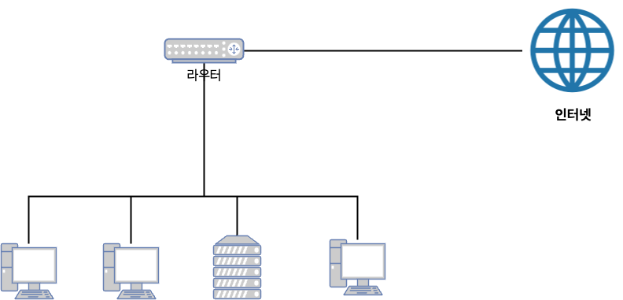 

라우터를 이용하는 방식은 모든 데이터를 라우터로 보내고, 라우터가 목적지로 보내는 방식이다.

이렇게하면 여러 디바이스를 라우터에만 연결하여 서로 통신을 쉽게 할 수 있다.

 

💁‍♂️ **작은 네트워크 구성**

라우터를 사용하면 아래와 같이 작은 네트워크를 구성할 수 있다.

 

위와 같이 여러 PC를 하나의 라우터 (혹은 스위치)에 연결하면 연결된 PC들은 서로 통신을 주고받을 수 있다.

보통 이더넷 프로토콜 (자주 볼 수 있는 인터넷 선)을 이용하여 PC와 라우터를 연결한다.

이렇게하여 작은 네트워크를 구성할 수 있다. 그리고 **이를 보통 작은 의미의 LAN (Local Area Network)이라고도 부른다.**

> 사실 위와 같이 하나의 장치로 여러 대의 디바이스간의 로컬 통신을 할 경우 스위치를 많이 사용한다.
> * 스위치 - 여러 장치를 연결하여 로컬용 네트워크 구축 및 연결 (근거리 통신망)
> * 라우터 - 스위치 기능 + 서로 다른 네트워크 연결 (독립적인 LAN과 WAN을 연결)

 

💁‍♂️ **WAN과 LAN**

가정내에서 PC들을 라우터에 연결함으로써 라우터에 연결된 PC끼리는 통신을 할 수 있게되었다.

그렇다면 가정내의 PC가 외부와 통신을 하고 싶다면 어떻게 해야할까?

바로 외부망(인터넷)과 연결된 라우터와 가정내에 설치된 라우터를 연결해야한다.

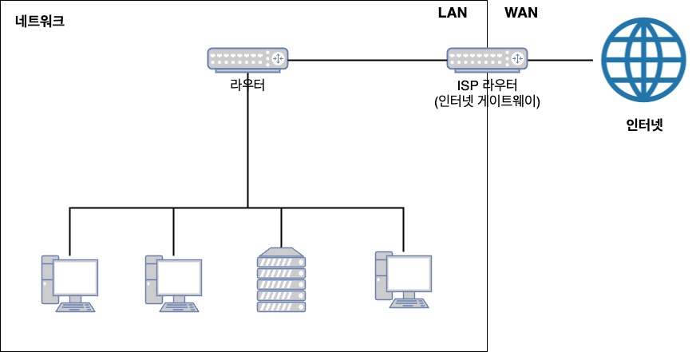 

앞서 말했듯이, 이렇게 가정내에 설치된 라우터를 이용하여 로컬에서 통신하는 방식을 LAN (Local Area Network)이라 부른다.

그리고 **가정내의 LAN과 다른 지역의 LAN과 연결되는 네트워크를 WAN (Wide Area Network)라 부른다.**

 

# 네트워크 주소와 서브넷
택배 기사가 택배를 배송해주는 것처럼 라우터가 각 PC에 데이터를 전달하려면 대상을 식별할 수 있는 주소가 필요하다.

네트워크상에서 주소 역할을 하는 것이 바로 IP 주소이다.

모든 디바이스와 라우터는 모두 IP 주소를 가진다.

 

💁‍♂️ **IP주소 구조**

 출처: https://en.wikipedia.org/wiki/IP_address 

* **IP주소는 4개의 8비트, 즉 32비트로 구성되어 있다.** (IPv4)
  * 0.0.0.0부터 255.255.255.255까지이다. (42.9억개)
* 현재는 IPv4의 개수가 부족하여, IPv6까지 존재한다.

 

💁‍♂️ **IP주소 구성**

* **IP주소는 네트워크 ID + 호스트 ID로 구성된다.**
  * 네트워크 ID는 전세계 모든 호스트를 관리하기 힘드니 각 국가마다 네트워크 ID를 부여하여 관리한다.
    * 이로인해 네트워크 ID가 같으면 어떤 국가의 IP인지 파악할 수 있다.
  * 호스트 ID는 호스트들을 개별적으로 관리하기 위해 사용하게 된다. 즉, 국가의 지역별 혹은 사용자별로 부여된다.
* 인터넷에서 사용되는 모든 IP는 이렇게 Network ID와 HostID가 합쳐진 것이다.
* IP에서 어떤 부분까지 네트워크 ID이고, 어떤 부분까지 호스트 ID인지에 따라 IP 클래스가 달라진다. (보통은 A, B, C만 사용된다.)
  * 네트워크 관련된 더 자세한 내용은 [여기](https://ko.wikipedia.org/wiki/%EB%84%A4%ED%8A%B8%EC%9B%8C%ED%81%AC_%ED%81%B4%EB%9E%98%EC%8A%A4)를 참고하면 된다. 
  * **현재는 네트워크 클래스가 아닌 [CIDR](https://ko.wikipedia.org/wiki/%EC%82%AC%EC%9D%B4%EB%8D%94_(%EB%84%A4%ED%8A%B8%EC%9B%8C%ED%82%B9))를 사용한다.** (AWS도 CIDR를 활용한다.)

 

💁‍♂️ **Public IP와 Private IP**

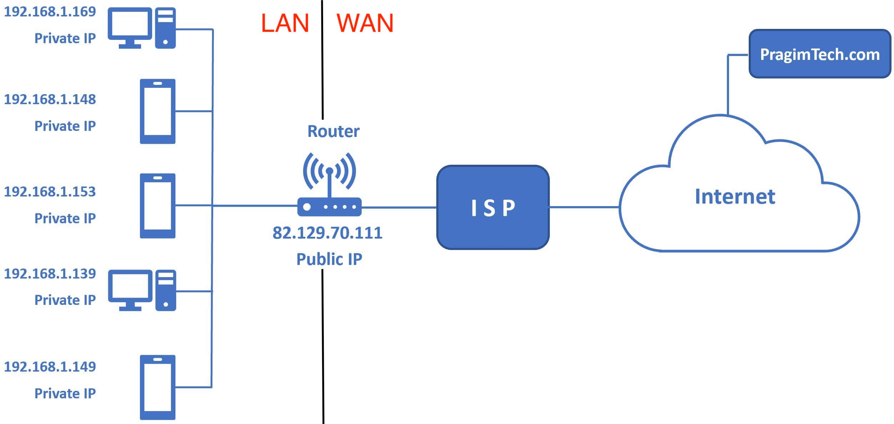 출처: https://www.pragimtech.com/blog/azure/public-ip-address-vs-private-ip-address/ 

* 공인 IP와 사설 IP가 따로 존재하는 이유
  * 공인 IPv4주소를 컴퓨터 한 대당 부여하기엔 존재하는 컴퓨터가 너무 많아 IP주소가 부족하다.
  * 이로 인해 인터넷에 직접 연결되는 컴퓨터나 라우터에는 공인 IP를 할당하고, 회사나 가정의 랜에 있는 컴퓨터는 사설 IP를 할당하는 정책을 사용한다.
* 공인 IP와 사설 IP의 이점
  * 공인 IP 한 개로 랜 안에 있는 컴퓨터 여러 대가 모두 인터넷에 연결할 수 있다.
* 공인 IP는 라우터에 할당. 사설 IP는 랜 안에 있는 장치에 할당
  * 랜의 관리자가 사설 IP주소를 할당할수도 있고, DHCP을 통해 자동으로 할당할 수도 있다.

> 공인 IP는 보통 ISP에서 제공해준다.

 

💁‍♂️ **서브넷**

하나의 네트워크내에서도 여러 단위로 네트워크를 나눠 관리하는 경우가 많다. 이럴 때 사용되는 것이 바로 서브넷이다.

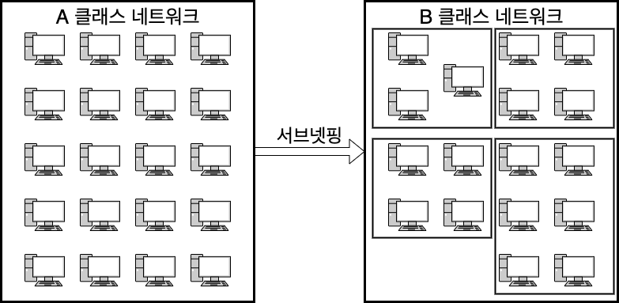 

* **서브넷이란**
  * 대규모 네트워크를 작은 단위로 분할된 네트워크를 서브넷이라 부른다.
  * 하나의 랜 네트워크안에서 여러 개의 작은 네트워크를 만들 수 있다.
* **서브넷 목적**
  * **보안 - 네트워크를 분할해 직접 통신할 수 있는 범위를 좁히고, 방화벽을 설정해 보안을 강화할 수 있다.**
    * **비교적 큰 네트워크를 서브넷으로 나누어 서브넷 A는 공개하고, 서브넷 B는 비공개로하여 서브넷별 역할을 부여할 수 있다.**
  * 성능 - broadcast에 사용될 수 있다.
  * 관리 편함 - 서브넷별로 연결된 PC들을 관리할 수 있기때문에 관리하기 더욱 용이하다.
* 서브넷팅
  * 네트워크를 분할하는 행위.

그리고 **기존엔 네트워크 ID + 호스트 ID로 구성되던 IP 구조에 서브넷 ID도 추가된다.**

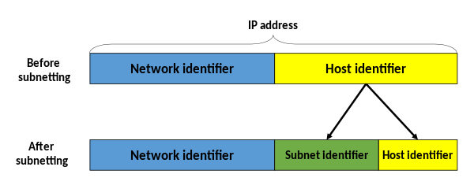 출처: https://en.wikipedia.org/wiki/Subnetwork

당연히 IP주소가 어떤 서브넷에 속하는지 판단할 수 있어야하기에 서브넷 ID도 추가되는 것이다.

 

💁‍♂️ **서브넷 마스크**

서브넷이 추가됨에 따라 네트워크 ID와 호스트 ID 그리고 서브넷 ID를 판단하는 **서브넷 마스크**란 개념이 생긴다.

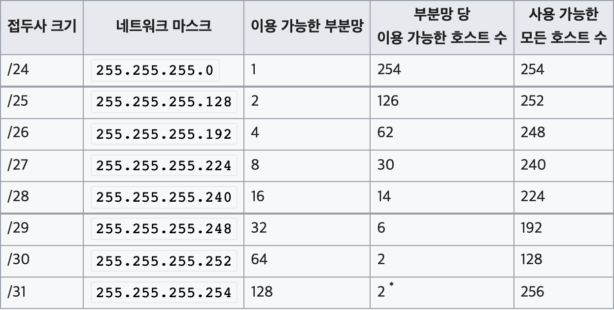 출처: https://ko.wikipedia.org/wiki/부분망 

* **서브넷 마스크란**
  * **IP주소를 서브넷팅하면 어디까지가 네트워크ID고, 어디부터가 호스트ID인지 판단하기 어려워진다. 이럴때 사용되는 것이 서브넷 마스크다.**
  * 즉, **서브넷 마스크는 네트워크 ID와 호스트 ID를 식별하기 위한 값이다.**
  * AND (&)연산을 통해 구분한다.
* **프리픽스 표기법을 사용한다. -> 이게 바로 CIDR이다!!!**
  * `255.255.255.0` -> `/24`
  * 2진수에서 1의 개수를 통해 표기한다.
    * 슬래시 뒤에 적힌 숫자는 몇 개까지의 비트가 네트워크 id로서 유효한지를 의미하게 된다.
    * `/24`는 32비트 중 앞에서부터 차례대로 1의 개수가 24개란 의미이다. -> 앞의 24개로 네트워크 ID를 판단하고, 나머지로 Host를 판단한다.
    * `/24` -> `11111111.11111111.11111111.00000000`
  * 즉, 숫자 하나당 2배로 커지면서 서브넷을 만든다.

 

예시를 들어보자면.

* IPv4 : `172.16.1.17`과 서브넷 마스크가 `255.255.0.0`이라면
  * `172.16.1.17 & 255.255.0.0` = `172.16.0.0`
  * **`172.16`로 시작하는 IP주소는 나와 동일한 랜(서브넷)에 있는 주소를 의미한다**.(ARP를 통해 MAC주소 기반의 스위치 통신이 가능하다.)
  * 만약 다른 IP주소라면 다른 랜에 존재하며, 라우터를 통해서 통신해야한다.

 

💁‍♂️ **IP 주소 할당**

일반적으로 같은 네트워크안에 존재하는 Private IP를 할당할 때 자동 방식과 수동 방식이 있다.

보통은 **DHCP (Dynimic Host Configuration Protocol)을 활용하여 각 호스트의 IP 주소를 자동으로 할당한다.**

 

# 라우터를 통한 내부 통신과 외부 통신
라우터는 데이터의 목적지가 정해지면 해당 목적지까지 어떤 경로로 가는 것이 좋을지를 알려주는 기능을 하는 장치다.

그리고 이 기기를 사용하면 내부 통신과 외부 통신을 쉽게 수행할 수 있다.

> 현재는 스위치가 잘 사용되지 않는 것으로 알고있다. 그러므로 여기에선 라우터가 스위치의 기능까지 가지고있다고 볼려고한다.

 

💁‍♂️ **라우터를 통한 내부 통신**

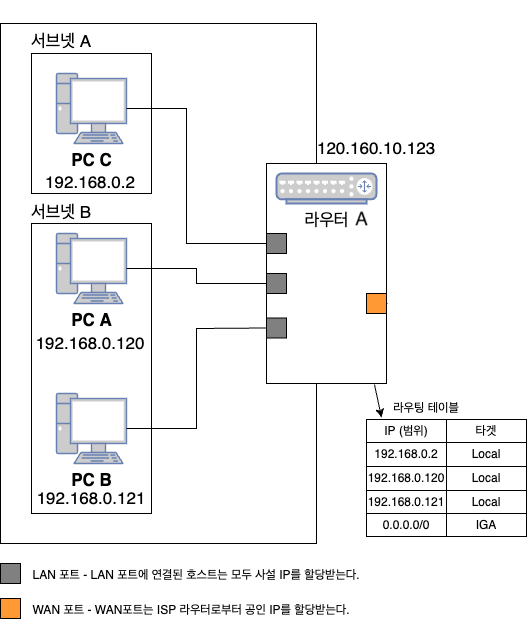 

**`PC C`가 `PC A`에 데이터를 전송한다고 가정해본다.**

1. `PC C`는 데이터를 `목적지 IP` (PC A의 IP)에 전송하기 위해 자신의 라우팅 테이블을 확인한다. 그리고 `라우터 A`에 데이터 (패킷)를 전송한다.
   * 그림에선 빠져있지만, 각 호스트마다 라우팅 테이블이 존재한다.
2. `라우터 A`는 `PC C`의 데이터를 수신하여 목적지를 확인하고 자신의 라우팅 테이블을 확인한다.
3. `라우터 A`의 라우팅 테이블엔 `목적지의 IP` (PC A의 IP - `192.168.0.120`)가 `Local`에 존재한다는 것을 확인하고 해당 IP에 데이터를 전달한다.
   * 보통 라우팅 테이블엔 서브넷 범위 단위로 저장된다. (물론 IP별로 저장할 수도 있다.)
4. `PC A`는 `PC C`의 데이터를 수신한다.
5. `PC A`의 응답도 동일하게 `라우터 A`를 통해 `PC C`에 전달된다.
   * `목적지의 IP` (PC C의 IP - `192.168.0.2`)도 로컬에 있으므로, 라우터 하나만으로 로컬 통신을 수행한다.

위와 같이 **라우터 A를 이용하면 로컬에서 연결된 호스트들과 데이터를 송수신할 수 있다.**

하지만, **그 이외 외부로 통하는 트래픽은 처리할 수 없다.**

이럴 땐 또다른 라우터인 **인터넷 게이트웨이**를 활용해야한다.

 

💁‍♂️ **라우터를 통한 외부 통신**

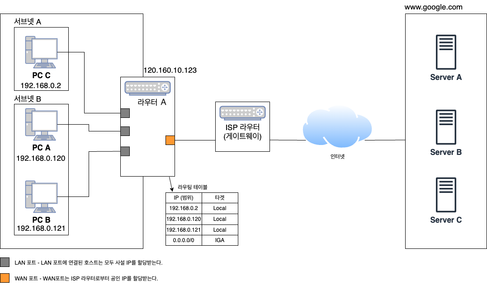 

**`PC C`가 구글 서버에 데이터를 전송한다고 가정해본다.**

1. `PC C`는 요청 데이터를 라우터에 전송한다.
2. `라우터 A`는 라우팅 테이블을 확인하고 `목적지 IP (구글 서버의 공인 IP)`가 로컬에 없다는 것을 판단하고, 데이터를 인터넷 게이트웨이(ISP 라우터)에게 전달한다.
   * 이때 출발지 IP의 내용을 Private IP에서 Public IP로 변환한다. (NAT)
   * `192.168.0.2` -> `120.160.10.123`
3. 인터넷 게이트웨이는 데이터를 수신하고 인터넷 (다양한 라우터)을 통해 `구글 서버`에 데이터를 전달한다.
   * 이때 출발지와 목적지 모두 공인 IP이다.
4. `구글 서버`에서 데이터를 수신하고 처리 결과를 다시 `PC C`에 전송한다.
   * 이때 구글 서버에서의 패킷 목적지는 `120.160.10.123`의 IP를 가진 `라우터 A`가 된다.
5. `라우터 A`는 `구글 서버`로부터 수신한 데이터의 `목적지 IP` (라우터 A의 IP인 공인 IP - `120.160.10.123`)를 NAT 테이블에 따라 Private IP를 찾아낸 후, 해당 IP를 가진 호스트에 데이터를 전달한다.
   * `120.160.10.123` -> `192.168.0.2`로 변환하여 `192.168.0.2` (PC C)에 데이터 전달
6. `PC C`는 구글 서버로부터 데이터를 수신한다.

 

# NAT
**라우터를 통한 외부 통신 과정을 보면 의문점이 하나 생긴다.**

 

🤔 **어떻게 Private IP와 Public IP를 변환하여 내부 네트워크의 호스트와 외부 네트워크의 호스트끼리 통신을 할 수 있는 것일까?**

바로 라우터의 NAT (Network Address Translation)이 존재하기 때문이다.

 

💁‍♂️ **NAT란**

* Network Address Translation. **말그래도 네트워크의 주소인 IP 변환이다.**
* 내부 네트워크에서 외부로 나가는 패킷들의 주소를 외부 네트워크 주소로 변환하고, 그 패킷에 대한 응답 패킷의 목적 주소를 다시 패킷이 발송된 내부 네트워크 주소로 변환해주는 역할을 한다.
* 쉽게 **말해 Public IP와 Private IP를 연결해준다고 보면 된다.**
  * 즉, **Private Network가 외부의 Public Network와 통신하기 위해 사용한다.**

 

💁‍♂️ **NAT 사용이유 - 장점**

* **공인 IP의 부족을 해결할 수 있다.**
  * 공인 IP 주소 절약
* **외부로부터 내부망을 보호할 수 있다.**
  * 보안

 

💁‍♂️ **NAT 예시**

간단히 Private IP를 가진 호스트에서 구글 서버와 요청 응답을 주고 받는 예시를 살펴본다.

우선 **요청부터 살펴보면 아래와 같다.**

 

1. `PC C`에서 `www.google.com` (1.2.3.4)으로 패킷을 전송한다.
   * DNS 과정은 생략한다.
2. 패킷의 `출발지 IP`는 `PC C`에 할당된 Private IP가 지정된다.
3. 패킷이 `라우터 A` (인터넷 게이트웨이)를 지나면서 `출발지 IP`를 Private IP에서 외부 통신을 위한 Public IP로 대치한다. (NAT)
4. `라우터 A`는 계속해서 목적지 IP로 패킷을 전달한다.

중요한 점은 NAT 테이블에 의해 Private IP가 Public IP로 전환되어 구글 서버에 패킷이 전달되었다는 점이다.

> 위 방식은 **PAT (Port Address Translation)이란 NAT 방식중 하나이다. - [PAT 참고](https://www.cisco.com/assets/sol/sb/RV320_Emulators/RV320_Emulator_v1-1-0-09/help/Setup13.html)**
> 
> 그러므로 **같은 Public IP를 사용하는 호스트들 (PC C, PC A)은 라우터의 Port를 통해 구분된다.**
> 
> 이와 관련된 내용은 아래에서 더 자세히 다룬다.

 

**응답을 살펴보면 아래와 같다.**

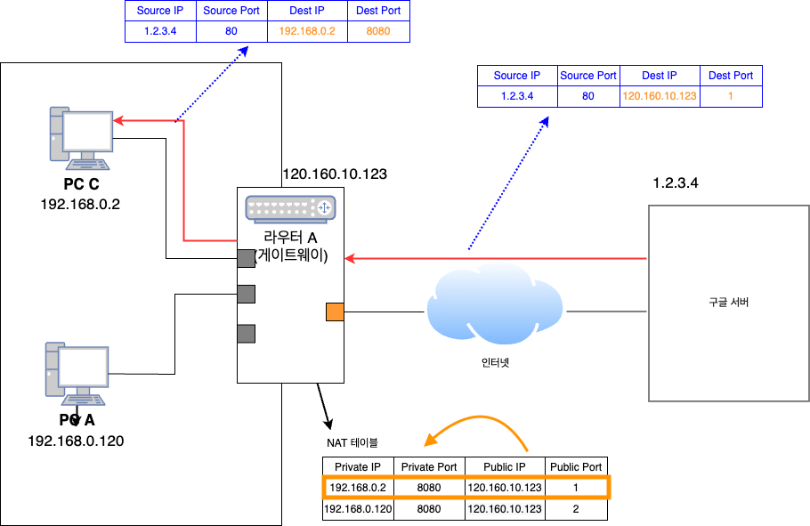 

1. 구글 서버에서 요청에 대한 응답 (패킷)을 전송한다.
2. `라우터 A`을 지나면서 `도착지 IP`를 Public IP에서 내부 통신을 위한 Private IP로 대치한다. (NAT)
   * 라우터에선 도착한 패킷의 목적지 Port를 통해 어떤 Private 호스트로부터 온 요청인지 구분한다. (PAT)
3. `PC C`는 구글 서버로부터 응답을 수신한다.

 

# 패킷 방향에 따른 NAT 종류
위에서 설명한 NAT 예시는 흔히 가정에서 많이 사용되는 NAT중 한 종류이다. (PAT 방식)

**이는 내부에서 외부로 나가는 것은 가능하지만, 응답을 제외하고는 외부에서 내부로 들어오는 것은 불가능하다.**

**서버를 직접 구축한다면 당연히 외부에서 내부의 서버로 접속이 가능해야하기때문에 다른 종류의 NAT을 사용해야한다.**

아래는 NAT의 4가지 종류에 대해서 정리하였다.

 

1️⃣ **Full Cone NAT** (one-to-one NAT)

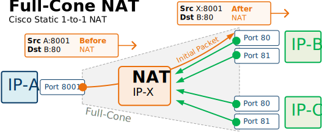 출처: https://www.networkacademy.io/ccie-enterprise/sdwan/tlocs-and-nat 

* **Private IP와 Private Port를 Public IP와 Public Port로 `1 대 1`로 매핑시키는 방식.**
  * 흔히 NAT `1 대 1` 주소 변환 방식이라고 부른다.
* 외부 호스트에서 매핑된 NAT IP주소로 패킷을 보내 내부 호스트로 패킷을 보낼 수 있다. (외부에서 내부로 통신 가능)
* **보통 서버나 로드밸런싱 인스턴스가 이에 속한다. 서버이므로 외부에서 요청받을 일이 많기 때문이다.**

> AWS에서 EC2에 Public IP를 부여하면 해당 인스턴스만의 IP를 준다. 이는 AWS의 NAT에서 1 : 1로 IP를 부여하는 것이라고 볼 수 있다.

 

2️⃣ **Restricted-Cone NAT**

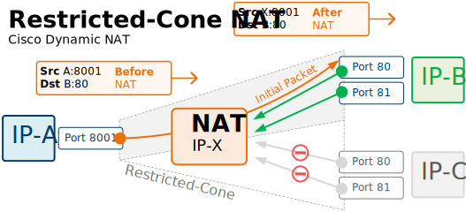 출처: https://www.networkacademy.io/ccie-enterprise/sdwan/tlocs-and-nat 

* Restricted : 제한된
* 동일한 Private IP로부터 전송되는 모든 패킷은 동일한 NAT IP 주소로 매핑되는 방식.
* `Full-Cone NAT`과 다른점
  * **내부 호스트가 이전에 외부 대상의 IP 주소로 패킷을 보낸 경우에만 해당 외부 호스트가 내부 호스트로 패킷을 보낼 수 있다. - 중요**
* **중요한 점은 NAT 매핑 상태가 생성되면 외부 대상이 모든 포트의 내부 호스트와 다시 통신할 수 있다는 점이다. - 보안 문제가 발생할 수 있다.**

 

3️⃣ **Port-Restricted-Cone NAT**

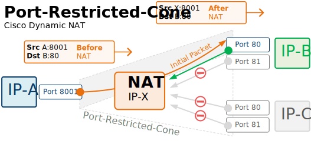 출처: https://www.networkacademy.io/ccie-enterprise/sdwan/tlocs-and-nat 

* Restricted-Cone NAT과 유사하지만 제한 사항에 Port 번호도 포함한다.
  * 즉, 내부 호스트와 이전에 정확한 IP와 Port로 통신한 외부 호스트만 내부 호스트로 패킷을 다시 보낼 수 있다.
* PAT (Port Address Transalation)의 기능과 유사하다.
  * 외부에선 내부에 접근할 수 없지만, 내부에선 외부로 접근이 가능하다.
  * 단, 한번 통신을 했던 외부에선 내부로 접근할 수 있다.

 

4️⃣ **Symmetric** (PAT)

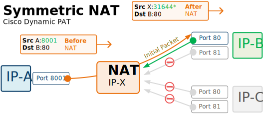 출처: https://www.networkacademy.io/ccie-enterprise/sdwan/tlocs-and-nat 

* Symmetric : 대칭
* Symmetric NAT은 PAT (Port Address Translation)라고 하며, 다른 모든 유형중에서 가장 제한적이다.
  * **이전 3개와 다르게 내부 호스트의 매 요청마다 고유한 NAT IP주소 및 Port에 매핑한다.**
  * 이때 패킷을 수신한 외부 대상만 내부 호스트로 패킷을 다시 보낼 수 있다. (응답)
* 매번 새로운 NAT IP 주소 및 Port에 매핑하기에 외부에선 전혀 내부에 접근할 수 없다. (진정한 PAT..)

 

💁‍♂️  **간단히 이해하고싶다면 사실 아래 내용만 알아도 무방하다.**

* **`1 : 1 NAT`의 경우엔 외부에서 공인 IP를 찾을 수 있다.**
  * 즉, 외부에서 먼저 통신을 시도할 수 있다.
  * **Full Cone NAT가 이에 속한다.**
  * **보통 서버나 로드밸런싱 인스턴스가 이에 속한다. 서버이므로 외부에서 요청받을 일이 많기 때문이다.**
* **`N : 1 PAT`의 경우엔 외부에서 공인 IP를 찾을 수 없다.**
  * 즉, 외부에서 먼저 통신을 시도할 수 없다.
  * **Restricted-Cone, Port-Restricted-Cone, Symmetric가 이에 속한다.**
  * **보통 가정 네트워크가 PAT에 속한다. 서버가 아닌이상 내부의 요청이 있기전엔 외부에서 요청받을 일이 없기 때문이다.**

 

# 마치며
AWS VPC를 이해하기전에 알고있으면 좋을만한 내용을 정리해보았다.

사실 조금은 함축적으로 정리한 감이있긴하다. (네트워크의 세계는 굉장히 넓고 복잡하기에...)

그래도 VPC를 이해하는데 필요한 내용은 모두 정리하였다고 생각든다. 누군가에겐 도움이 되기를~

다음 글은 본격적으로 VPC에 대한 이야기를 해볼려고한다.
