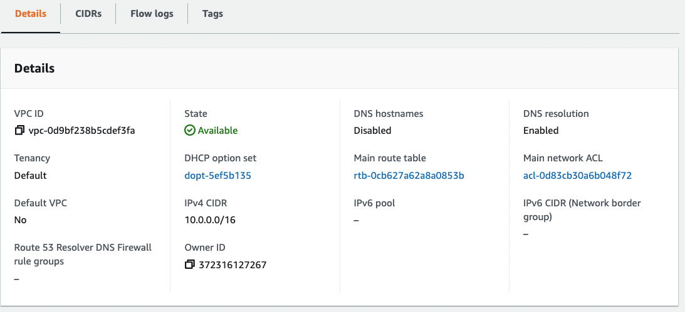
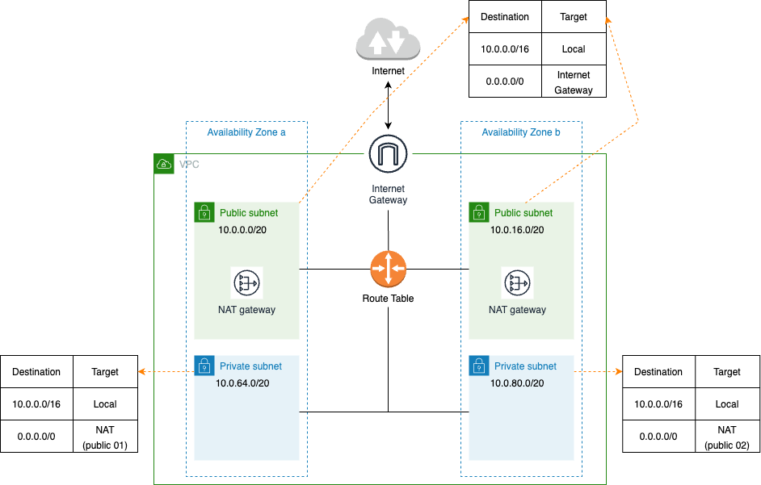

# 목차

 

- [목차](#목차)
- [VPC 이해하기 시리즈의 두번째 - 실습을 통한 VPC 개념 이해하기](#vpc-이해하기-시리즈의-두번째---실습을-통한-vpc-개념-이해하기)
- [1 VPC와 네트워크](#1-vpc와-네트워크)
  - [1-1 네트워크](#1-1-네트워크)
  - [1-2 VPC](#1-2-vpc)
  - [1-3 VPC 생성 및 설정](#1-3-vpc-생성-및-설정)
- [2 서브넷](#2-서브넷)
  - [2-1 서브넷과 가용영역](#2-1-서브넷과-가용영역)
  - [2-2 서브넷 IPv4 CIDR](#2-2-서브넷-ipv4-cidr)
  - [2-3 서브넷 생성](#2-3-서브넷-생성)
- [3 인터넷 게이트웨이와 NAT 게이트웨이](#3-인터넷-게이트웨이와-nat-게이트웨이)
  - [3-1 인터넷 게이트웨이](#3-1-인터넷-게이트웨이)
  - [3-2 NAT 게이트웨이](#3-2-nat-게이트웨이)
- [3 라우팅 테이블](#3-라우팅-테이블)
  - [3-1 라우팅 테이블이란](#3-1-라우팅-테이블이란)
  - [3-2 라우팅 테이블 설정](#3-2-라우팅-테이블-설정)
  - [3-3 라우팅 테이블 설계](#3-3-라우팅-테이블-설계)
- [4 보안 그룹](#4-보안-그룹)
  - [4-1 보안 그룹이란](#4-1-보안-그룹이란)
  - [4-2 보안 그룹 설정](#4-2-보안-그룹-설정)
- [참고](#참고)

 

# VPC 이해하기 시리즈의 두번째 - 실습을 통한 VPC 개념 이해하기
[이전 글 - VPC 이해하기 시리즈의 첫번째](./VPC_1.md)에서 일반 네트워크에선 어떻게 통신하는지 살펴보았다.

VPC에 대해서 정리하기에 앞서 일반 네트워크가 어떻게 통신하는지 정리한 이유는 일반 네트워크를 이해하면 VPC를 쉽게 이해할 수 있기때문이다.

그 이유는 일반 회사나 가정에서 사용되는 라우터가 사실상 작은 네트워크 환경을 구성하는 것인데, VPC도 이와 별반 다를 것없이 AWS에서 제공하는 계정 전용 가상 네트워크를 구축하고 설정하는 것 뿐이다.

이번 글은 이전글의 내용을 바탕으로 VPC를 구축하고 설정하는 과정을 통해 VPC의 개념을 살펴본다.

> 이번 글에서의 VPC 환경은 예시일 뿐, 각 상황에 맞춰 VPC를 설계하여 사용하면 된다.

 

# 1 VPC와 네트워크

 

## 1-1 네트워크
`네트워크`는 다양한 의미로 활용되는 유비쿼터스 언어인데, 여기선 `여러 대의 디바이스 (PC, 핸드폰 등등)가 서로 통신할 수 있도록 연결되어 있는 상태`라 정의한다.

 

💁‍♂️ **디바이스가 많이 보급되기 전**

여러 디바이스 (PC, 핸드폰 등등)가 널리 보급되기전에는 디바이스간의 일대일 (1 : 1)로 연결하여 네트워크를 구성했다. 

**모든 디바이스가 단일 네트워크를 구축하여 서로 통신했다는 의미이다.**

 

위 구조는 디바이스 수가 기하급수적으로 많아진 현재는 작은 사무실내의 디바이스간의 연결조차도 버겁다.

선이 굉장히 많아질 것이며, 현실적으로 구축할 수도 없다.

 

💁‍♂️ **라우터를 이용하면서 작은 네트워크를 구성하기 시작한다.**

라우터를 이용하는 방식은 디바이스간의 통신에서 모든 데이터를 라우터로 보내고, 라우터가 목적지로 전달하는 방식이다.

 

이렇게하면 여러 디바이스간 일대일로 연결하지 않아도, 라우터를 이용하여 서로 통신을 쉽게 주고받을 수 있게된다.

즉, 라우터를 이용함으로써 작은 네트워크를 구성할 수 있게되었다. **이를 보통 LAN (Local Area Network)이라 부른다.**

> 어릴 때, 스타크래프트로 배틀넷 (인터넷)과 연결하지않아도 같은 LAN에 속한 친구와는 LAN모드로 게임할 수 있었다.. (추억)
> 
> 그 이유도 해당 PC들이 모두 같은 LAN안에 속해있기때문이다. (같은 공유기에 선을 꼽았을 것이다.)

 

## 1-2 VPC
VPC (Virtual Private Cloud)도 사실 **AWS에서 제공하는 계정 전용 가상 네트워크**이다.

**가정에서의 네트워크(LAN)는 공유기로 직접 연결했다면, AWS에서의 VPC는 논리적으로 격리된 공간으로 가상 네트워크를 제공한다고 보면된다.**

 

💁‍♂️ **AWS도 VPC 이전엔 모든 인스턴스가 단일 네트워크를 구축했다고한다.**

자료를 찾아보니 AWS도 VPC를 릴리즈하기전인 2011년 8월까진 모든 인스턴스가 단일 네트워크를 구축하는 EC2 - 클래식을 사용했다고한다.

즉, 각 인스턴스들이 일대일 (1 : 1)로 연결하여 네트워크를 구성하는 것이다.

**당연히 EC2 인스턴스들이 서로 거미줄처럼 연결되며, 새로운 EC2가 생성되면 기존의 모든 EC2를 수정해야하는 번거로움도 존재했다.**

현재 EC2-Classic은 사용이 중단되고, VPC 사용이 의무화되었다. [참고](https://docs.aws.amazon.com/ko_kr/AWSEC2/latest/UserGuide/vpc-migrate.html)

 

💁‍♂️ **VPC가 등장하고나서는 아래와 같이 계정별 작은 네트워크를 구성할 수 있게되었다.**

 EC2 Classic과 VPC 

VPC를 적용하고나면 위와 같이 계정별 **VPC별로 작은 네트워크를 구성할 수 있게된다.**

즉, **VPC별로 네트워크 설정을 다르게 줄 수 있으며, 이를 통해 보안을 강화하고 공인IP가 아닌 내부IP를 사용함으로써 공인 IP 낭비를 줄일 수 있다.**

 

💁‍♂️ **VPC 개념과 특징**

VPC는 말 그대로 Virtual Private Cloud를 의미하며, **가상의 네트워크를 구축하는 것**을 말한다.

VPC들끼리는 **서로 독립적이므로 서로 영향을 끼치지않는다**.

 

## 1-3 VPC 생성 및 설정
VPC가 무엇인지 이제 조금은 감이 잡혔을 것이다. 그렇다면 이제 직접 AWS에서 VPC를 생성해보는 과정을 통해 VPC를 알아보자.

 

💁‍♂️ **VPC 생성 내용**

VPC를 생성할 때 설정해주어하는 정보들이 몇가지있다.

* 이름 태그 - VPC를 식별하기 쉽게 설정하는 이름.
* IPv4 CIDR 블록 - VPC에서 이용하는 Private 네트워크의 IPv4 주소 범위
* IPv6 CIDR 블록 - VPC에서 이용하는 Private 네트워크의 IPv6 주소 범위
  * VPC에서 IPv6 사용 여부를 지정한다. 특별한 사항아니면 보통은 `없음`한다.
* Tenancy - VPC 리소스의 전용 하드웨어에서의 실행 여부
  * 기본은 다른 AWS 계정과 하드웨어 리소스를 공유한다. 신뢰성이 매우 중요한 시스템이라면 '전용'으로 설정하는 것이 좋다. (물론 추가 비용이 부가된다)

 

💁‍♂️ **IPv4 CIDR 블록**

VPC를 생성할 때 다양한 설정중 가장 중요한 부분은 IPv4 CIDR 블록 부분이다.

VPC는 IP주소로 크게 세 가지로 제공된다.

* 24비트 블록 (/24) : `10.0.0.0` ~ `10.255.255.255`
  * 서브넷 마스크 `255.255.255.0` -> 총 2^8 (256)개의 IP 할당 가능.
* 20비트 블록 (/20) : `172.16.0.0` ~ `172.31.255.255`
* 16비트 블록 (/16) : `192.168.0.0` ~ `192.168.255.255`
  * 서브넷 마스크 `255.255.0.0` -> 총 2^16 (65,535)개의 IP 할당 가능.

> VPC에서 지정할 수 있는 서브넷 마스크는 최대 16비트까지이다. (어떤 범위를 이용해도 달라지는 건 없다고 한다.) [관련 자료](https://docs.aws.amazon.com/vpc/latest/userguide/configure-your-vpc.html)
> 
> 그저 관리 편의상 VPC의 IP 주소 범위를 선택하면 된다.

 

  
💁‍♂️ VPC 생성

  
  ---
  
  
이제 VPC를 직접 생성해본다. AWS -> VPC 들어가면 쉽게 VPC 생성하기 버튼을 찾을 수 있다.

누르면 아래와 같이 VPC를 생성할 때 필요한 설정 값들을 설정하고 생성할 수 있다.

 

 

생성하고나면 아래와 같이 나온다.

 

  
  ---

 

**이제 VPC 생성함으로써 아래와 같이 AWS 계정만의 가상 네트워크가 구축된 것이다.**

 

> region은 AWS의 데이터 센터를 의미하며, 이 글에선 서울 데이터 센터를 사용한다. 
> 
> 참고로 VPC는 리전별로 존재한다.

 

# 2 서브넷
일반적인 네트워크를 구성할 때도 하나의 네트워크안에서 여러 개의 네트워크 단위로 관리한다. 그리고 이것을 서브넷이라 부른다.

AWS VPC도 서브넷 기능을 제공한다.

 

## 2-1 서브넷과 가용영역

 

🤔 **VPC에서의 서브넷**

**서브넷은 VPC의 IP 주소 범위를 나누는 단위라고 볼 수 있다.**

그리고 VPC는 적어도 하나 이상의 서브넷을 가지고있어야한다.

 

🤔 **서브넷의 목적**

서브넷의 목적은 하나의 네트워크망에서 더 다양한 네트워크망을 만드는 것이다.

이를 통해 얻을 수 있는 장점은 아래와 같다.

* 역할 분리
  * 외부에 공개하는 리소스 여부를 구별한다. (서브넷을 이용하면 쉽게 다양한 리소스에 역할을 부여하여 관리할 수 있다.)
  * ex. 로드 밸런서는 외부 공개, DB는 내부에만 공개.
* 보안 강화
  * 역할 분리를 통해 Public IP와 Private IP를 분리시킴으로써 보안을 강화할 수 있다.
* 기기 분리
  * 가용영역과 함께 사용하면 리소스들의 고가용성(내결함성)을 높일 수 있다.

 

💁‍♂️ **가용영역**

각각의 서브넷은 가용영역안에 존재한다.

가용영역이란 각 리전안에 물리 서버를 묶어서 말하는 하나의 단위이다.

실제로 가용영역별로 서브넷을 제공하면 여러 서브넷을 동시에 이용하지 못하는 가능성을 낮출 수 있으며, 고가용성의 구조를 만들 수 있다.

 

위 그림은 각 가용영역의 각각 Public과 Private 서브넷을 만든 예시이다.

만약 **가용영역 a가 물리적인 이슈로인해 장애가 발생해도 가용영역 b로 전환하여 고가용성을 만족시킬 수 있다.**

 

## 2-2 서브넷 IPv4 CIDR
서브넷을 생성할 때 중요한 것중 하나는 IPv4 CIDR을 어떻게 설정하느냐이다.

설계 기준은 다음 두 가지를 고려한다.

* 생성할 서브넷의 수
* 서브넷 안에 생성할 리소스 수

만약 VPC생성할 때 `/16`으로 만들었다면 서브넷은 아래와 같이 3가지중 하나를 선택할 수 있다.

> 32비트중 16비트가 VPC의 주소를 가리키고, 나머지 16비트로 서브넷과 리소스를 나누면된다.

* VPC 범위 `/16`, 서브넷 범위 8비트, 리소스 8비트 => 서브넷 수 256개, 리소스 수 251개
  * 서브넷 생성시 `/24`로 생성한다.
* VPC 범위 `/16`, 서브넷 범위 4비트, 리소스 12비트 => 서브넷 수 16개, 리소스 수 4091개
  * 서브넷 생성시 `/20`로 생성한다.
* VPC 범위 `/16`, 서브넷 범위 2비트, 리소스 14비트 => 서브넷 수 4개, 리소스 수 16379개
  * 서브넷 생성시 `/18`로 생성한다.

 

## 2-3 서브넷 생성
이제 서브넷과 가용영역의 개념을 바탕으로 서브넷을 생성해본다.

 

AWS / VPC 콘솔로 들어가면 쉽게 Subnets 메뉴를 찾을 수 있다. 해당 메뉴를 클릭하고 서브넷 생성 버튼을 누르면 아래 화면이 표시된다.

 

생성할 때 설정해줘야하는 사항은 크게 4가지다.

* VPC ID
  * 서브넷을 생성 할 VPC
* Subnet Name
  * 서브넷 이름
* Avaiability Zone
  * 가용영역
  * 이 글에선 2개의 가용영역에, 각각 Public과 Private 서브넷을 하나씩 생성한다.
* IPv4 CIDR 블록
  * 서브넷의 IPv4 CIDR.
  * 주의할 점은 VPC의 영역까지 포함해서 작성해줘야한다.
  * 이 글에선 4개의 서브넷을 생성할 것이며, `VPC 16비트, 서브넷 4비트, 리소스 12비트`를 사용할 것이다.
    * `10.0.0.0/20`, `10.0.16.0/20`, `10.0.64.0/20`, `10.0.80.0/20`

 

생성이 완료되면 아래와 같은 구조가 완성된다.

 

 

# 3 인터넷 게이트웨이와 NAT 게이트웨이
일반 네트워크 관점에서 봤을때, 하나의 작은 LAN안의 호스트들이 외부 인터넷과 통신을 하려면 ISP의 라우터가 필요했다.

**VPC도 이와 동일하게 VPC 내부에서 생성된 리소스가 외부와 연결하고싶다면 인터넷 게이트웨이나 NAT 게이트웨이를 설치해주어야한다.**

 

## 3-1 인터넷 게이트웨이

 

💁‍♂️ **인터넷 게이트웨이를 통해 아래와 같이 VPC의 리소스가 외부와 통신을 할 수 있게된다.**

 

인터넷 게이트웨이는 간단히 VPC 메뉴에서 생성후 특정 VPC와 연결시켜주면 된다.

그리고 **VPC와 인터넷 게이트웨이는 1 : 1의 관계를 갖게된다.**

 

💁‍♂️ **인터넷 게이트웨이는 아래와 같이 생성후, VPC와 Attach함으로써 1 : 1로 매핑된다.**

 

 

## 3-2 NAT 게이트웨이

 

💁‍♂️ **인터넷 게이트웨이만 사용하면 발생하는 문제점.**

인터넷 게이트웨이의 역할은 '**VPC에서 생성된 네트워크와 인터넷 사이의 통신을 수행하는 것**'이다.

그리고 VPC내의 리소스가 인터넷 게이트웨이를 통해 외부와 통신하려면 해당 리소스는 공개 IP를 가져야한다.

이렇게 공개 IP를 가지면 인터넷에 공개됨으로써 서브넷을 Public과 Private으로 나눈 이유가 없어진다.

> 인터넷 게이트웨이는 Full-Cone NAT 기반와 유사하게 동작한다고보면 된다. 

 

💁‍♂️ **NAT게이트웨이를 통해 외부에선 요청을 차단하지만, 내부에선 외부로 요청할 수 있게된다.**

**만약 외부에 공개 IP를 두지않고 VPC내 리소스가 외부에 요청만 시도하려고할 때 사용되는 것이 바로 NAT 게이트웨이다.**

> NAT 게이트웨이는 PAT 방식의 NAT과 유사하게 동작한다고보면 된다.

NAT 게이트웨이를 사용하면 VPC내의 리소스가 외부에 통신을 요청할 순 있지만, 외부에서 내부 리소스에 접근할 방법은 없다.

보통 리소스가 주기적으로 업데이트를 해야하거나, 외부의 컨텐츠가 필요할 때 사용될 수 있다.

> NAT 관련 내용은 [이전 글](./VPC_1.md)을 참고하면 더욱 쉽게 이해된다.

 

NAT 게이트웨이를 아래와 같이 구성함으로써 Private Subnet들을 외부로부터 완전히 차단할 수 있다.

 

 

💁‍♂️ **NAT 게이트웨이 생성**

 

위 그림은 NAT 게이트웨이를 생성하는 화면이다. 크게 2가지를 설정해줘야한다.

* Subnet - 어떤 서브넷에 NAT 게이트웨이를 설정할지 결정해줘야한다.
* ConnectType & ElasticIP - 외부와 통신해야하기때문에 NAT 게이트웨이당 하나의 공인 IP를 할당해줘야한다.

 

# 3 라우팅 테이블

 

## 3-1 라우팅 테이블이란

**일반 네트워크 관점에서 봤을때, 하나의 작은 LAN안에서 서브넷끼리 통신을하려면 라우터나 스위치에 연결이되어있어야한다.**

그리고 **LAN안의 디바이스들끼리는 라우터의 라우팅 테이블을 이용하여 경로를 결정하게된다.**

 

**VPC도 이것과 유사하다. 서브넷을 설정해봤자 서브넷안에있는 인스턴스는 다른 서브넷의 인스턴스와 통신을 주고받을 수 없다.**

즉, 인스턴스들끼리 통신을 주고받을 수 있도록, 경로를 설정해주어야한다. **이럴 때 사용되는 것이 바로 VPC의 라우팅 테이블이다.**

 

## 3-2 라우팅 테이블 설정

라우팅 테이블은 아래와 같이 설정할 수 있다.

 

* **Destination : 접속 대상 위치에 대한 정보이다.** 즉, 통신 목적지 IP 주소를 지정한다. IP주소는 특정 값을 지정하거나 CIDR 형식을 범위로 지정할 수 있다.
  * 현재 위 그림에선 VPC의 CIDR를 범위로 설정한 상태이다. 이럴경우, VPC내의 모든 인스턴스끼리 통신이 가능해진다. (보안그룹에 따라 통신이 안될 수도 있다.)
* **Target : 경유지에 대한 정보이다.**
  * Target은 대표적인 4가지 타깃이 존재한다.
    * Local - 동일 VPC안 리소스 접근.
    * Internet Gateway - Public Subnet에 생성된 리소스가 인터넷 서버와 통신
    * NAT Gateway - Private Subnet에 생성된 리소스가 인터넷 서버와 통신
    * VPN Gateway - VPN을 통해 접속된 독자 네트워크상의 서버와 통신.
    * VPC Peering - 접속을 허가한 다른 VPC상의 리소스와 통신.

 

## 3-3 라우팅 테이블 설계

지금까지 만든 VPC 환경내에서 라우팅 테이블을 아래와 같이 설계할 수 있다.

 주황색 선이 가리키는 Route Table이다 

정리하면 아래와 같다.

 

**퍼블릿 서브넷용 - 공용**

* 라우팅
  * 로컬 대상
    * Destination (목적지): 10.0.0.0/16
    * Target: Local
  * 외부 대상
    * Destination (목적자): 0.0.0.0/0 (모두)
    * Target: Internet Gateway
* 서브넷 (적용 서브넷)
  * sample-subnet-public-01
  * sample-subnet-public-02

 

**프라이빗 서브넷 - 1용**

* 라우팅
  * 로컬 대상
    * Destination (목적지): 10.0.0.0/16
    * Target: Local
  * 외부 대상
    * Destination (목적지): 0.0.0.0/0 (모두)
    * Target: NAT Gateway
* 서브넷
  * sample-subnet-private-01	

 

**프라이빗 서브넷 - 2용**

* 라우팅
  * 로컬 대상
    * Destination (목적지): 10.0.0.0/16
    * Target: Local
  * 외부 대상
    * Destination (목적지): 0.0.0.0/0 (모두)
    * Target: NAT Gateway
* 서브넷
  * sample-subnet-private-02

 

각 서브넷의 리소스들은 네트워크 통신을 할때 가장 먼저 자신에 연결된 Route Table로부터 어딜로 데이터를 전송해야하는지 알아낸다.

예를 들어, `Private Subnet - 1`에서 `10.0.0.1/16`으로 전송하면 Local로, `123.0.0.1/24`로 전송하면 `Public Subnet - 1`의 NAT 게이트웨이로 전송하게된다.

 

# 4 보안 그룹

 

## 4-1 보안 그룹이란

 

💁‍♂️ **가상 방화벽**

VPC안의 리소스를 외부 접근으로부터 보호하려면 제한을 걸어야한다.

AWS는 이러한 제한을 보안 그룹 (Security Group, SG)라는 기능으로 제공한다.

간단히 생각하면 VPC내 리소스의 가상 방화벽이라고 보면 된다.

이 방화벽은 인바운드 규칙과 아웃바운드 규칙을 설정하여 여러 가지 트래픽을 제어할 수 있다.

 

💁‍♂️ **IP주소와 포트 번호로 제어한다.**

* IP주소를 통한 제어
  * 소속된 회사나 학교 등 조직 내 네트워크에서만 리소스에 접근할 수 있도록 제한을 걸어둘 때 사용할 수 있다.
* 포트 번호를 통한 제어
  * 포트를 통해 제공하는 서비스의 종류를 지정할 수 있다. 예를 들어 웹 서비스는 80번과 443번, 서버를 관리하기위해선 22번 포트를 특정 IP에 열어서 접근을 제어할 수 있다.

 

💁‍♂️ **네트워크 ACL과 보안그룹**

접근 제한을 수행하기 위한 시스템으로 보안 그룹 외에도 네트워크 ACL(Access Control List)라는 기술이있다.

두 가지 기술의 차이는 아래와 같다.

* 보안 그룹 : 리소스 (EC2, LB, RDS 등)에 대한 접근 설정.
* 네트워크 ACL : 네트워크에 대한 설정. 즉, 해당 서브넷에 포함되는 리소스 모두에 접근 설정.

네트워크 ACL과 보안그룹을 같이 사용하게되면, 보안 그룹 설정 누락을 네트워크 ACL로 막을 수 있다. 

다만 접근 권한을 두 군데에서 제어하는 것이기때문에 관리측면에선 좋지 않다.

 

## 4-2 보안 그룹 설정
보안 그룹 설정은 VPC내에서 쉽게 할 수 있다.

예를 들어, 하나 만들어보면 아래와 같다.

 

* 인바운드
  * HTTP - 80포트, 모든 IP
  * HTTPS - 443포트, 모든 IP
  * SSH - 20포트, 모든 IP
* 아웃바운드
  * 모든 포트와 IP

이제 위 보안 그룹을 리소스에 적용하면, 해당 외부에선 리소스에 80, 443, 20 포트로만 접근할 수 있다.

만약 특정 IP에서만 접근을 허용하려면, `0.0.0.0/0`이 아닌 특정 IP를 설정하면 된다.

아웃바운드는 리소스내에서 외부로 향하는 것이니 모든 트래픽을 열어둔다. (이것도 물론 제한을 걸 수 있다.)

> 실제 서비스에선 위와 같이 하나의 보안그룹에 HTTP와 SSH 권한을 다 열어두지 않는다.
> 
> 보통은 베스천 서버를 만들고 해당 서버엔 SSH 권한만있는 보안그룹을 부여하고, 일반 웹 서버 애플리케이션엔 따로 HTTP, HTTPS용 보안그룹을 부여한다.

 

# 참고
* [AWS 공식 문서](https://docs.aws.amazon.com/vpc/index.html)
* [AWS로 시작하는 인프라 구축의 정석](https://www.yes24.com/Product/Goods/109747932)
