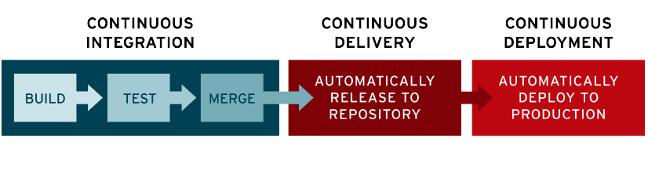
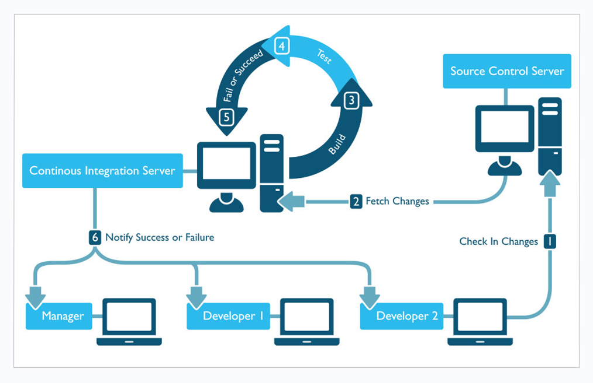

# 목차

 

- [목차](#목차)
- [사전 지식](#사전-지식)
- [CI/CD란](#cicd란)
  - [CI (Continuous Integration)](#ci-continuous-integration)
  - [CD](#cd)
- [참고](#참고)

 

개발자라면 한 번쯤 들어볼 만한 이야기가 있다.

바로!! `CI/CD`다. 

이번 협업 프로젝트를 하며 `CI/CD`를 적용시킬 일이 생겨서 이참에 이 내용을 정리해보고자 한다.

 

# 사전 지식
> 컴파일, 빌드, 배포

 

* 컴파일
  * 특정 코드를 컴퓨터가 이해할 수 있도록 번역해주는 것을 말한다.
  * 소스 코드를 바이너리 코드로 변환하는 과정
    * 자바의 경우 바이트 코드로 변환.
* 빌드
  * 컴파일된 코드를 실제 실행할 수 있는 상태로 만드는 일을 말한다.
  * 소스 코드를 실행 가능한 소프트웨어 산출물로 만드는 일련의 과정 (jar, war)
  * 컴파일을 포함해 jar, war등 실행 가능한 파일을 뽑아내기까지의 과정을 빌드라고도 한다.
* 배포
  * 실행 가능한 파일을 사용자가 접근할 수 있는 환경에 배치하는 것.

 

# CI/CD란

 출처: https://www.redhat.com/ko/topics/devops/what-is-continuous-delivery

CI/CD는 애플리케이션 개발 단계를 **자동화**하여 애플리케이션을 보다 짧은 주기로 고객에게 제공하는 방법이다.
* 지속적인 통합 (Continuous Integration, CI)
* 지속적인 서비스 제공 (Continuous Delivery, CD)
* 지속적인 배포 (Continuous Deployment, CD)

 

> 🤔 CI/CD 파이프라인?
> * 애플리케이션의 통합 및 테스트 단계에서부터 제공 및 배포에 이르는 애플리케이션 라이프사이클 전체에 걸쳐 지속적인 자동화와 지속적인 모니터하는 것을 의미한다.

 

## CI (Continuous Integration)

 출처: https://pepgotesting.com/continuous-integration/

* **CI가 필요한 이유 (목적)**
  * 여러 개발자가 개발한 모든 기능을 개발이 끝난 이후에 한 번에 통합해야 한다면 많은 비용이 소모된다.
  * ex. 건물을 쌓을 때 한층 한층 올바르게 쌓였는지 확인하는 것이 좋지, 다 쌓고나서 보수 공사하는 것은 비효율적이다.
* **CI란?**
  * **여러 개발자가 개발한 기능(코드)을 지속적으로 통합하고 테스트하는 개발 주기의 한 단계.**
  * **정기적인 빌드 및 테스트를 거쳐 공유 저장소(repository)에 병합하는 과정을 의미한다.**
  * **코드 병합(머지), 빌드, 테스트**하는 것을 의미한다.

 

## CD
* CD (Continuous Delivery)란?
  * CI의 빌드 자동화, 테스트 수행후, 이어지는 단계로, 빌드된 코드를 공유 repo에서 자동 릴리즈하는 단계다.
  * 운영팀은 언제든 실시간으로 이 repo에서 프로덕션 환경으로 배포할 수 있다.
  * 목표는 최소한의 노력으로 새로운 코드를 배포하는 것.
* 예시
  * ex. 개발자들이 애플리케이션에 적용한 변경 사항이 버그 테스트를 거쳐 repo (Github 또는 컨테이너 레지스트리)에 자동으로 업로드 되는 것.
  * 운영팀은 repo에 애플리케이션을 실시간 프로덕션 환경으로 배포할 수 있다.

 

* CD (Continuous Deployment)란?
  * 개발자가 애플리케이션에 변경 사항을 작성한 후 몇 분 이내에 애플리케이션을 자동으로 실행할 수 있는 것을 의미한다.
* 예시
  * ex. 개발자의 변경 사항(CI된 후)이 repo를 넘어, 고객의 프로덕션환경까지 릴리즈 되는 것.

 

* 둘의 차이점은?
  * 두 용어는 상호 교환적으로 사용된다.
  * 즉, **모두 파이프라인의 추가 단계에 대한 자동화를 뜻하지만 때로는 얼마나 많은 자동화가 이루어지고 있는지를 설명**하기 위해 별도로 사용되기도 한다.
* 즉, CI/CD는 두 가지의 사례로 구축될 수 있다.
  * 지속적 통합 + 지속적 제공 (Delivery)
  * 지속적 통합 + 지속적 제공 (Delivery) + 지속적 배포 (Deployment)

 

# 참고
* https://www.redhat.com/ko/topics/devops/what-is-ci-cd
* https://developers.redhat.com/blog/2017/09/06/continuous-integration-a-typical-process
