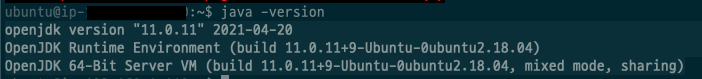
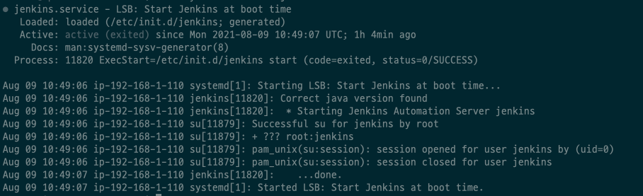
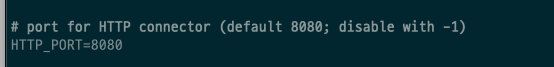

# 목차

<br>

- [목차](#목차)
- [Jenkins란?](#jenkins란)
- [Jenkins 설치하기](#jenkins-설치하기)
  - [Ubuntu에 설치](#ubuntu에-설치)
  - [Docker에 설치](#docker에-설치)
- [참고](#참고)

<br>

# Jenkins란?
* 젠킨스는 소프트웨어 개발 시 구축, 테스트, 전달 또는 배포와 관련된 모든 종류의 작업을 자동화하는 데 사용할 수 있는 독립형 오픈 소스 자동화 서버이다.
* CI/CD 서비스를 제공하는 툴이다.

<br>

# Jenkins 설치하기
* Jenkins는 일반적으로 내장된 Java 서블릿 컨테이너/애플리케이션 서버(Jetty)를 사용하여 자체 프로세스에서 독립 실행형 응용 프로그램으로 살행된다.
  * 물론 Tomcat에서도 동작한다.

<br>

## Ubuntu에 설치
> 환경: Ubuntu(18.04)

<br>

**1. Jenkins 설치를 위한 Repository Key 추가**
   
```shell
wget -q -O - https://pkg.jenkins.io/debian-stable/jenkins.io.key | sudo apt-key add -
```
키가 잘 추가되었다면 `OK`라는 문구를 볼 수 있다.

<br>

**2. source.list에 Jenkins 패키지 저장소를 추가**

```shell
sudo sh -c 'echo deb https://pkg.jenkins.io/debian-stable binary/ > \
    /etc/apt/sources.list.d/jenkins.list'
```

<br>

**3. 패키지 인덱스 정보 업데이트**

```shell
sudo apt-get update
```

<br>

**4. Jenkins 패키지 설치**

```shell
sudo apt-get install jenkins
```
여기까지가 Jenkins 설치 과정이다.

> 이때 Jenkins를 실행해서 에러가 발생할 수 있다. 무시하고 JDK를 설치하고 다시 실행하면 된다.

<br>

**5. JDK 11 설치**

Jenkins는 JAVA 환경에서 실행되기 때문에 실행을 위해선 JRE 환경이 필요하다.

```shell
sudo apt install openjdk-11-jdk
```

Java JDK가 잘 설치되었다면 `java -version`을 통해 잘 설치되었는지 확인하자.

<p align="center"></p>

<br>

**6. Jenkins 실행**
```shell
sudo systemctl start jenkins
```

정상적으로 Jenkins가 실행되었다면 status 명령어를 통해 jenkins service가 제대로 동작하는지 확인가능하다.

```shell
sudo systemctl status jenkins
```

<p align="center"></p>

<br>

**7. Jenkins 설정**

Jenkins와 자바 설치가 완성되었다면 이제 해당 서버의 Jenkins를 접속하여 설정을 해주면 된다.

<br>

**opt 1. 포트 변경하기**

Jenkins는 기본적으로 8080 포트에서 동작한다. 

하지만 다른 프로세스와 충돌할 수 있기 때문에 포트를 변경해줘야 할 때도 있다.

```shell
sudo vi /etc/default/jenkins
```
`/etc/default/jenkins`파일의 `HTTP_PORT`값을 원하는 포트 번호로 설정해주면 된다.

<p align="center"> </p>

변경하고나서 Jenkins를 다시 시작해주면 된다.

```shell
sudo systemctl restart jenkins
```

<br>

**opt 2. 방화벽 설정**

OS는 보안을 위해 방화벽으로 주요 포트 이외의 포트에 대한 다른 호스트들의 접근을 막아놓을 수 있다.

우분투의 경우 `ufw`라는 명령어를 통해 제어한다.

> `ufw`에 대한 자세한 내용은 [여기](https://webdir.tistory.com/206)를 참고하자.

우선 방화벽을 사용중이지 않다면 `sudo ufw enable`을 통해 방화벽을 설정해주자.

```shell
sudo ufw allow {젠킨스 포트}
```

잘 설정되었는지 확인하는 방법은 아래와 같다.

```shell
sudo ufw status
```

<br>

## Docker에 설치


<br>

# 참고
- https://www.jenkins.io/doc/book/installing/linux/
- https://imbf.github.io/devops/2020/11/26/Install-Jenkins-in-Ubuntu(18.04).html

