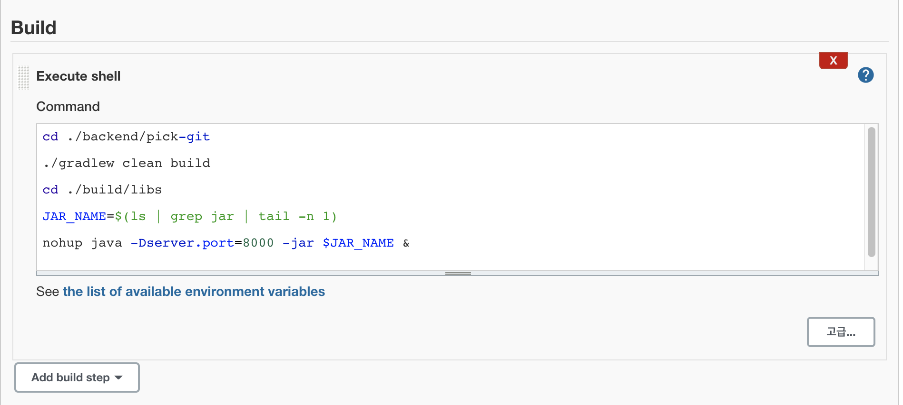

# 목차

<br>

- [목차](#목차)
- [개요](#개요)
- [Github 토큰 발급](#github-토큰-발급)
- [젠킨스 Credentials 설정](#젠킨스-credentials-설정)
- [젠킨스 시스템 Github Server 설정](#젠킨스-시스템-github-server-설정)
- [신규 프로젝트 생성 (freestyle)](#신규-프로젝트-생성-freestyle)
- [Build now](#build-now)
- [배포 작업](#배포-작업)
- [sub-module를 사용하는 경우](#sub-module를-사용하는-경우)

<br>

# 개요
> 깃헙과 Gradle 프로젝트 기반으로 작성된 글입니다.

젠킨스를 사용해서 CI/CD 환경을 구축하기 전에 젠킨스와 Github을 연동하는 것을 먼저 해보고자 한다.

이는 다음 단계인 깃헙에서 Push가 발생하면 이벤트를 캐치해서 CI/CD를 하기 위한 사전 작업이기도하다.

깃헙과 연동하여 젠킨스에서 `build now`를 누르면, 특정 레포에서 코드를 가져와 빌드하는 것까지 해보려고한다.

<br>

# Github 토큰 발급
[깃헙](https://github.com)에서 로그인을 하고 아래와 같이 이동하면 된다.

> Settings -> Developer settings -> Personal access tokens

그럼 아래와 같은 화면이 나오고, 생성 버튼을 누르면 된다.

<p align="center"></p>

<br>

토큰의 이름을 입력하고, 아래와 같은 권한을 설정해주고 create token해준다.

<p align="center"></p>

<br>

# 젠킨스 Credentials 설정
Github에서 발급한 토큰 정보를 젠킨스에 설정해준다.

> 추후에 Github 관련된 요청을 할 때 사용되는 토큰.

아래 경로로 이동한다.

> Jenkins 관리 -> Manage Credentials

<br>

**Secret text**

<p align="center"></p>

위와 같이 `Add Credentials`를 누르고 Github Token을 추가해준다.

* Domain: Global credentials (unrestricted) 선택
* Kind: 인증 종류
* Secret: 토큰 (Github에서 발급한 토큰)
* ID: 젠킨스 인증 정보에 대한 식별자

**중요한 점은 `Secret text`로 설정해줘야 하는 것.**

<br>

**Username with password**

<p align="center"></p>

`Username with password`형식의 인증 정보도 추가해준다.

중요한 점은 보안의 관점에서 보면 password에 비밀번호보단 토큰을 주는 것이 더 좋다.

<br>

# 젠킨스 시스템 Github Server 설정
이제 설정한 인증정보를 바탕으로 젠킨스 설정에 Github Server를 설정해준다.

> Jenkins 설정 -> 시스템 설정

아래로 조금 내리면 Github Server 설정하는 부분이 있다.

<br>

<p align="center"></p>

* Name: 이 Github 연결 설정을 구별한 식별자.
* Credentials: Github 연결할 때 사용되는 토큰.

위에서 설정한 인증 정보를 Credentials에 넣고 `Test Connection`해주고 성공하면 저장한다.

<br>

# 신규 프로젝트 생성 (freestyle)
이제 신규 프로젝트 (아이템)을 생성해준다.

> 새로운 Item -> Freestyle선택 -> 생성

<p align="center"></p>

<br>

**Github Project URL설정**

> 프로젝트 화면에서 구성을 누르면 아래와 같이 설정창으로 이동한다.

<p align="center"> </p>

<br>

**Source Code Management**

<p align="center"></p>

* Repository URL: 해당 프로젝트에서 사용할 레포 URL을 입력.
* Credentials: 위에서 정의한 인증 정보. (Username with password)
* Branch: 프로젝트에서 사용될 브랜치 정보.

<br>

여기까지 다 설정되었다면 저장!

<br>

# Build now
젠킨스 프로젝트에서 아래와 같이 `Build Now`를 누른다.

<p align="center"></p>

성공적으로 설정되었다면 아래와 같이 콘솔이 출력되는 것을 볼 수 있다.

<p align="center"></p>

콘솔 내용을 보면 젠킨스내에서 작업 공간(workspace)를 만들고, Github 레포를 Cloning해서 가져온다음 브랜치 체크아웃까지 해주는 것을 볼 수 있다.

<br>

작업 공간을 클릭하여 보면 다음과 같이 잘 가져온 것도 확인가능하다 :)

<p align="center"> </p>

이제 기본적인 젠킨스와 Github의 연동은 끝났다.

<br>

# 배포 작업
이제 간단히 gradle로 빌드하고, 배포하는 것까지 해보자. 

<br>

프로젝트 설정창의 Build부분에 아래와 같이 작성해주면 된다.

```shell
cd {gradlew가 있는 폴더}

./gradlew clean build

cd ./build/libs

JAR_NAME=$(ls | grep jar | tail -n 1)

nohup java -Dserver.port=8000 -jar $JAR_NAME &
```

<p align="center"></p>

이제 빌드가 완료되고 젠킨스 서버에 해당 자바 프로그램이 실행된다.

> 스프링 프로젝트를 예시로 들었기 때문에 포트 설정(`-Dserver.port`)을 추가해주었다.

<br>

# sub-module를 사용하는 경우
sub-module을 사용하는 경우 아래와 같이 설정해주면 된다.

<p align="center"></p>

<br>

<p align="center"></p>

