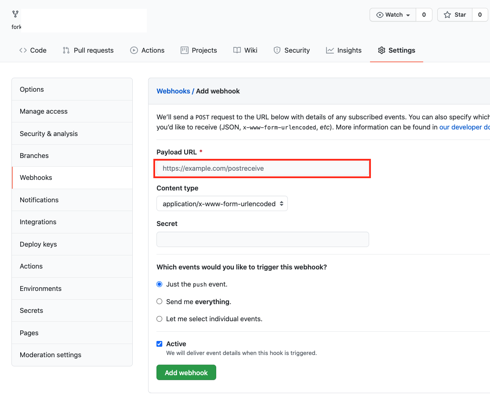
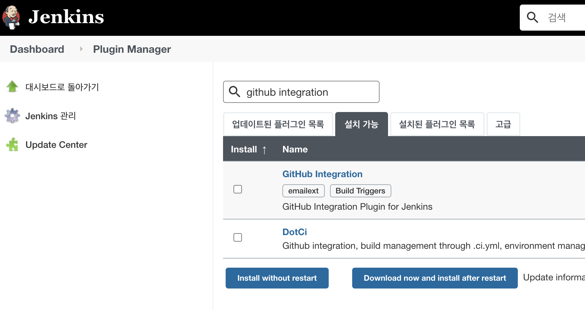
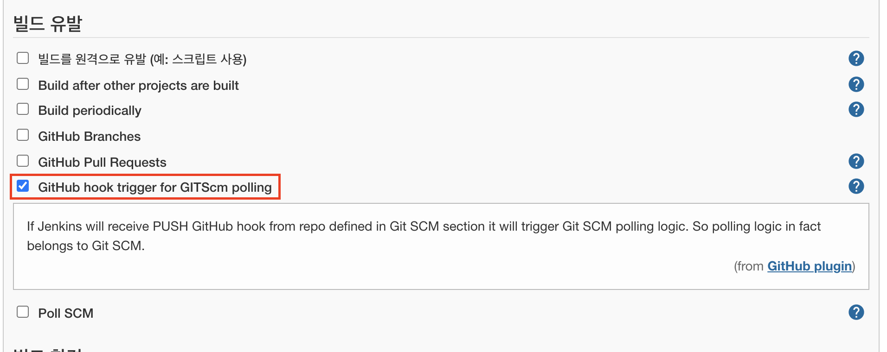
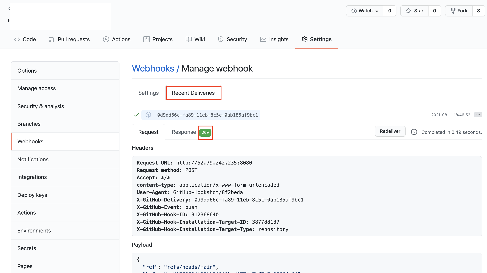
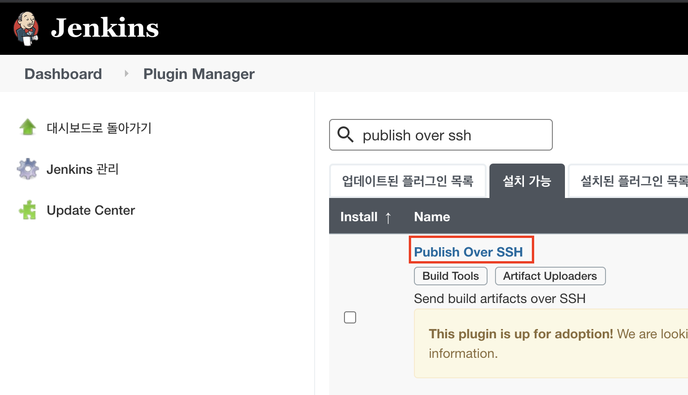
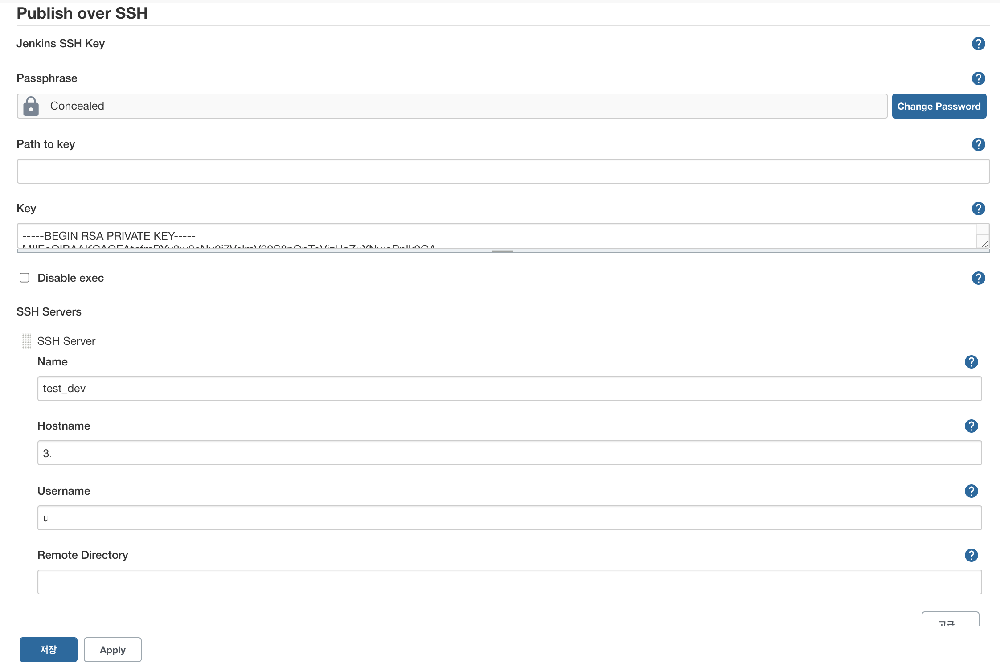
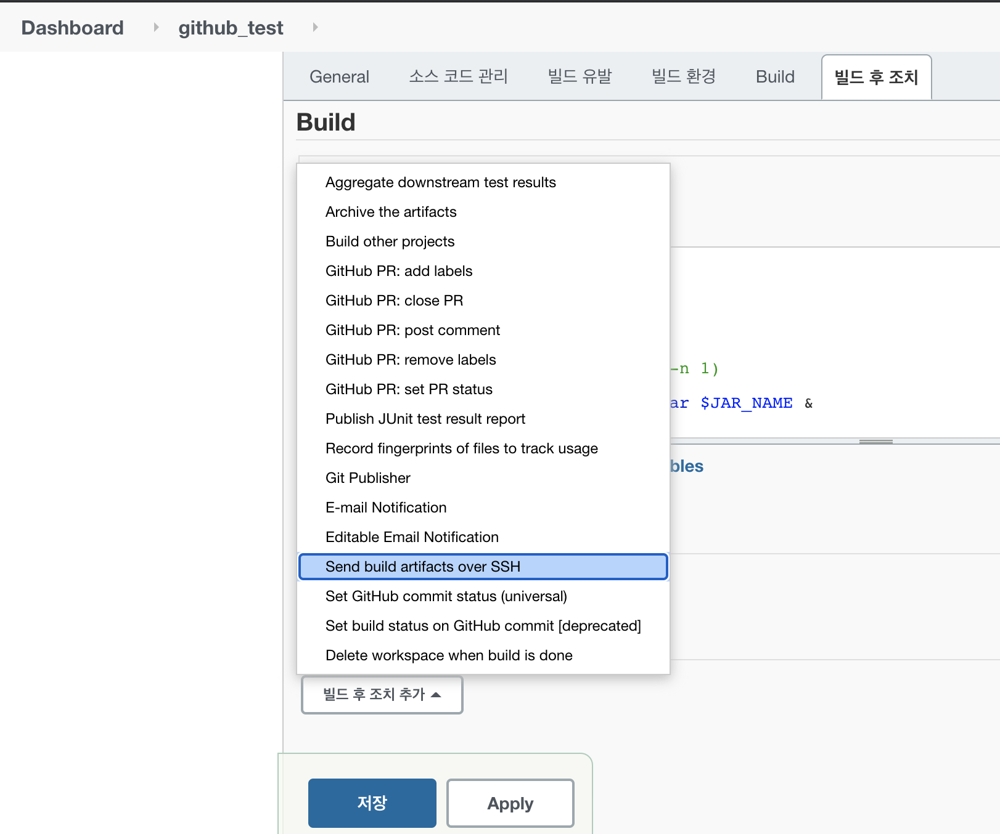
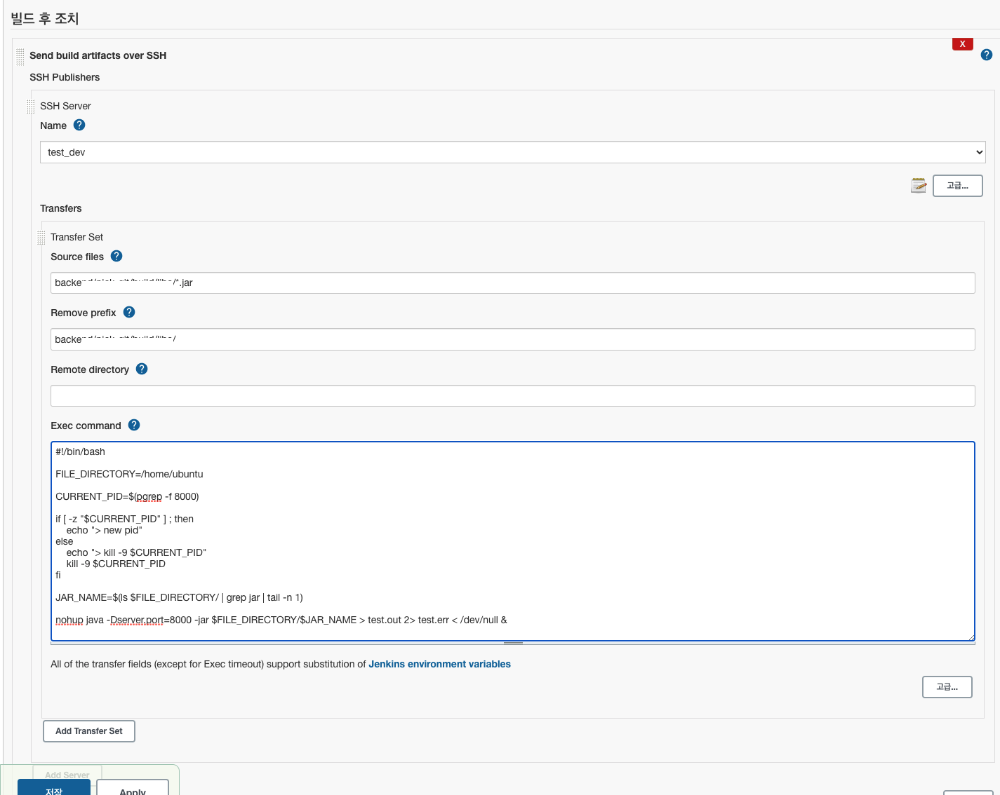

# 목차

<br>

- [목차](#목차)
- [개요](#개요)
- [빌드 유발 (Github Webhook, Github 플러그인)](#빌드-유발-github-webhook-github-플러그인)
  - [Webhook이란?](#webhook이란)
  - [Github Webhooks 추가 및 설정](#github-webhooks-추가-및-설정)
  - [Github Integration Plugin 설치](#github-integration-plugin-설치)
  - [프로젝트 트리거 설정](#프로젝트-트리거-설정)
- [SSH을 이용해 배포 서버로 전송](#ssh을-이용해-배포-서버로-전송)
  - [Publish Over SSH 플러그인 설치](#publish-over-ssh-플러그인-설치)
  - [Public Over SSH 설정](#public-over-ssh-설정)
  - [SSH를 사용할 프로젝트 설정](#ssh를-사용할-프로젝트-설정)

<br>

# 개요
> 본 내용은 [이전 글](./Jenkins와%20Github%20연동하기.md)을 읽어야 진행이 가능하다.

<br>

이제 젠킨스 (free style)와 Github Webhook을 이용하여 CI/CD 환경을 구축해보고자한다.

> CI/CD개념은 [여기]()서 확인하자.

이번에 해볼 과정은 다음과 같다.
1. Github에서 특정 브랜치에 Push하면 빌드 유발 (Webhook)
2. 젠킨스에서 자동 빌드하고, 빌드된 내용을 SSH을 이용해 배포 서버로 전송 및 실행.

<br>

# 빌드 유발 (Github Webhook, Github 플러그인)
Github에서 Push해서 젠킨스 빌드를 유발하려면, Push가 되었을 때 Github에서 무엇인가 트리거를 걸어줘야한다.

Github은 이를 Webhook이란 이름으로 제공해준다.

Github의 특정 브랜치에 Push되면, 이를 Webhook으로 젠킨스에게 알려주어 빌드를 유발하도록 설정하는 것.

<br>

## Webhook이란?
* 특정 이벤트가 발생하였을 때 타 서비스나 응용프로그램으로 알림을 보내는 기능.
* 역방향 API
  * 일반적인 API는 클라이언트가 서버를 호출. 반면 Webhook은 Webhook을 호출하는 서버 측에 등록하면 서버에서 특정 이벤트가 발생했을 때 클라이언트를 호출함.

<br>

## Github Webhooks 추가 및 설정
> Github Repo -> Settings -> Webhooks -> Add webhook

<p align="center"> </p>

* Payload URL: 설정한 이벤트가 발생했을 때 내용을 보낼 URL
  * Jenkins에 보낼 경우: `http://Jenkins주소/github-webhook/`
* 이외에도 어떤 이벤트가 발생할 때 트리거를 걸지 설정할 수 있다.

<br>

> 젠킨스 서버에서 방화벽 설정등이 걸려있을 수 있다.
> 
> 이럴 경우 Github에서 어떤 IP로 요청을 날리는지 알아야하는데
> 
> [여기](https://api.github.com/meta)를 참고하여 `hooks`에 기재된  IP들을 열어주면 된다.

```
"192.30.252.0/22",
"185.199.108.0/22",
"140.82.112.0/20",
"143.55.64.0/20"
```

<br>

## Github Integration Plugin 설치
프로젝트에 빌드 유발 관련 설정을 하기 전에 플러그 인 하나를 설치해야한다.

<p align="center"></p>

그냥 플러그 인 설치에서 `Github Integration`을 설치해주면 끝난다.

<br>

## 프로젝트 트리거 설정
이제 프로젝트의 Github Hook 트리거 설정을 해주면 된다.

> Dashboard -> 원하는 프로젝트 -> 구성

<p align="center"> </p>

이제 지정한 레포에 Push를 하면 다음과 같이 Github webhook이 보내진다.

<p align="center"> </p>

그리고 Jenkins에서 이를 받아 자동으로 빌드하면 성공한 것이다.

<br>

여기까지가 CI를 적용시켰다고 볼 수 있다.

<br>

# SSH을 이용해 배포 서버로 전송
지금까진 하나의 서버로 젠킨스와 애플리케이션의 배포를 함께 했다.

하지만 배포할 서버가 여러대로 늘어나거나, 서버의 용량측면에서 분리시키는 것이 좋다.

그렇다면 이제 Github Push를 통해 빌드 유발이되면, 젠킨스가 빌드를 하고 배포 서버에 SSH를 통해 파일을 전송하는 것을 실습해본다.

<br>

## Publish Over SSH 플러그인 설치
<p align="center"> </p>

기존의 젠킨스 플러그 인 설치하는 것처럼 동일하게 검색하여 설치하면 된다.

<br>

## Public Over SSH 설정
> 젠킨스 관리 -> 시스템 설정 -> Publish Over SSH 탭으로 이동

<p align="center"></p>

* Passphase
* Key: SSH접속의 private key(RSA키) 입력.
  * EC2 기준 ssh 접속하기 위한 pem 파일 내용을 복붙하면 된다.
* SSH Servers (SSH로 파일을 보낼 서버 목록)
  * Name: 젠킨스에서 사용할 임의의 서버 Name
  * Hostname: 실제로 접속할 원격 서버 ip 혹은 접속 경로.
    * ex. ec2-3-35-9-3.ap-northeast-2.compute.amazonaws.com
    * 만약 젠킨스 서버와 배포 서버가 private ip를 통해 접속할 수 있다면 private ip를 적어주는 것이 좋다.
  * Username: 접속할 원격 서버의 유저 이름.
    * ex. ubuntu, ec2user
  * Remote Directory: 원격서버에 접속하여 작업을 하고 싶은 디렉토리.

> SSH 관련 내용은 [여기](https://github.com/binghe819/TIL/blob/master/Network/SSH/ssh.md)서 확인가능하다.

<br>

## SSH를 사용할 프로젝트 설정
> 설정하고 싶은 젠킨스 아이템 -> 구성

<p align="center"> </p>

<br>

<p align="center"></p>

* Name: Publish Over SSH 설정에서 설정한 Name (젠킨스에서 사용할 임의의 Name)
* Verbose output in console: 빌드할 때 콘솔에 상세 내역을 표시할지 여부
* Source files: 전송할 파일을 지정.
* Remove prefix: Source files에서 지정한 경로의 하위 폴더를 지우는 기능.
  * 전송하고자하는 파일의 하위 폴더를 지정하면 해당 파일만 전송하게 된다.
* Remote directory: SSH로 보내고자하는 서버의 원격지 폴더. (SSH Server의 폴더)
* Exec command: 파일 전송이 완료된 후, 원격 서버에서 실행될 스크립트.
  * 이 script는 jenkins user로 실행되기 때문에 권한 문제가 발생할 수 있다고 한다.

<br>

> 쉘 스크립트
```shell
#!/bin/bash

FILE_DIRECTORY=/home/ubuntu

CURRENT_PID=$(pgrep -f 8000)

if [ -z "$CURRENT_PID" ] ; then
    echo "> new pid"
else
    echo "> kill -9 $CURRENT_PID"
    kill -9 $CURRENT_PID
fi

JAR_NAME=$(ls $FILE_DIRECTORY/ | grep jar | tail -n 1)

nohup java -Dspring.profiles.active=prod -Dserver.port=8000 -jar $FILE_DIRECTORY/$JAR_NAME > test.out 2> test.err < /dev/null &
```
> 위 스크립트는 예시일 뿐, 실제 사용시 상황에 맞게 변경해주어야 한다.

<br>

이제 Github Repo에서 Push를 하면 빌드가 유발되며, 젠킨스 서버에서 테스트 및 빌드 완료후 파일을 배포 서버로 옮긴다.

그리고 배포 서버에서 위 스크립트를 실행하게 된다. (완성!!)

