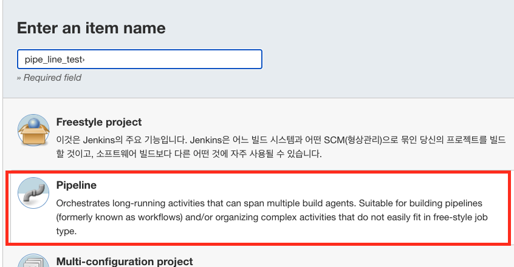
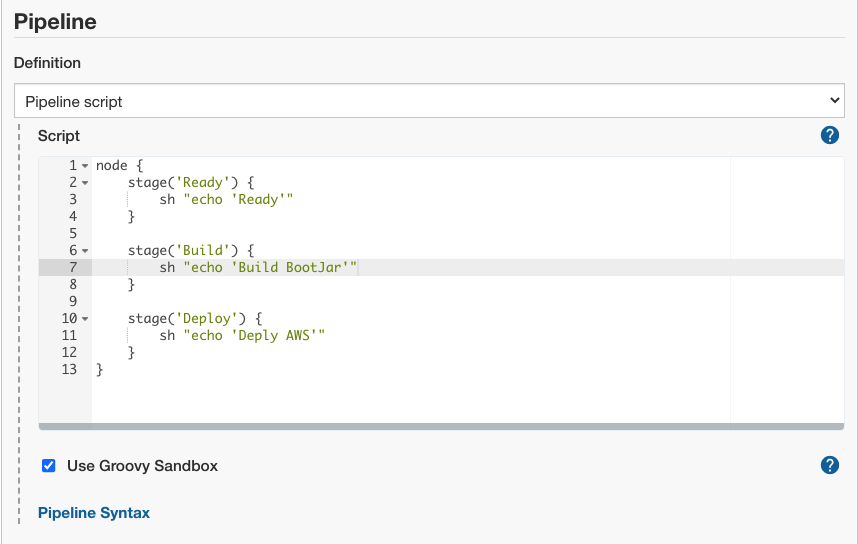
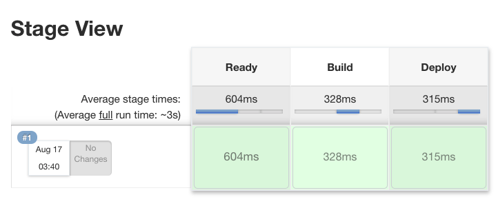

# 목차

 

 

# 젠킨스 파이프라인 Hello World
🤔 파이프라인이란?
* 한 데이터 처리 단계의 출력이 다음 단계의 입력으로 이어지는 형태로 연결된 구조를 가리킨다.
* 젠킨스의 파이프라인은 연속적인 이벤트 혹은 Job의 그룹을 의미한다.
  * 본인이 만든 젠킨스 Job들을 순차적 혹은 병렬적으로 실행시키거나 특별하게 작성한 스크립트로 이벤트들을 연속적으로 실행시키는 등의 일을 지원하는 기능을 의미한다.
* 젠킨스 파이프라인은 파이프 라인 DSL (Domain-Specific Language)를 통해 간단하거나 복잡한 전달 파이프 라인을 "코드"로 생성할 수 있는 확장 가능한 자동화 서버를 갖추고 있다.

 

👨‍💻 간단히 젠킨스 파이프라인 Hello World를 실행해보자

> Jenkins 관리 -> 플러그인 관리

우선 플러그인 관리에서 `Pipeline`이 설치되어 있는지 확인한다.

이제 새로운 Item을 Pipeline으로 만들어준다.

> 파이프라인 -> 구성

아래와 같이 간단히 파이프라인을 작성해준다.

 

저장해주고 마지막으론 `Build Now`를 눌러주면 아래와 같이 파이프라인일 돌아가는 것을 볼 수 있다.

 

각 단계(stage)를 선택하면 로그를 따로 볼 수도 있다.

 

# 파이프라인 문법
젠킨스 파이프라인을 구성할 때 가장 먼저 고민하는 것은 파이프라인 문법이다.

젠킨스는 두 종류의 파이프라인을 지원한다.

1. Scripted
2. Declarative

 

## Scripted

 

## Declarative

 

 

# 참고
- https://jojoldu.tistory.com/355
- 