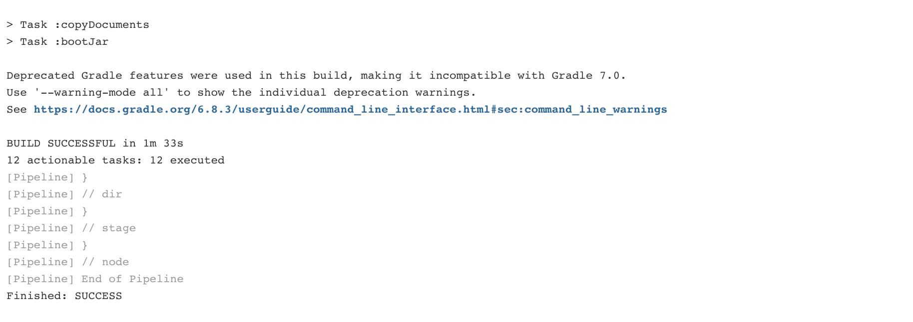

# 목차

<br>

- [목차](#목차)
- [젠킨스 파이프라인 Hello World](#젠킨스-파이프라인-hello-world)
- [파이프라인으로 CI/CD 구성하기](#파이프라인으로-cicd-구성하기)
  - [1 Jenkins와 Github 연동 설정](#1-jenkins와-github-연동-설정)
  - [2 파이프라인 프로젝트 생성 및 기본 설정](#2-파이프라인-프로젝트-생성-및-기본-설정)
  - [3 파이프라인 스크립트 - Git Clone](#3-파이프라인-스크립트---git-clone)
    - [서브 모듈을 사용하지 않는 경우](#서브-모듈을-사용하지-않는-경우)
    - [서브 모듈을 사용하는 경우](#서브-모듈을-사용하는-경우)
  - [4 파이프라인 스크립트 - 빌드 및 테스트](#4-파이프라인-스크립트---빌드-및-테스트)
  - [5 파이프라인 스크립트 - Publish over SSH를 통한 Jar 보내기](#5-파이프라인-스크립트---publish-over-ssh를-통한-jar-보내기)
    - [Publish Over SSH 설치 및 설정](#publish-over-ssh-설치-및-설정)
    - [파이프라인 스니펫 (sshPublisher)](#파이프라인-스니펫-sshpublisher)
  - [6 Github Webhook을 통한 빌드 유발](#6-github-webhook을-통한-빌드-유발)
- [참고](#참고)

<br>

# 젠킨스 파이프라인 Hello World
> 젠킨스 파이프라인으로 CI/CD를 알아보기 전에 간단힌 파이프라인을 알아본다.

🤔 파이프라인이란?
* 한 데이터 처리 단계의 출력이 다음 단계의 입력으로 이어지는 형태로 연결된 구조를 가리킨다.
* 젠킨스의 파이프라인은 연속적인 이벤트 혹은 Job의 그룹을 의미한다.
  * 본인이 만든 젠킨스 Job들을 순차적 혹은 병렬적으로 실행시키거나 특별하게 작성한 스크립트로 이벤트들을 연속적으로 실행시키는 등의 일을 지원하는 기능을 의미한다.
* 젠킨스 파이프라인은 파이프 라인 DSL (Domain-Specific Language)를 통해 간단하거나 복잡한 전달 파이프 라인을 "코드"로 생성할 수 있는 확장 가능한 자동화 서버를 갖추고 있다.

<br>

👨‍💻 **간단히 젠킨스 파이프라인 Hello World를 실행해보자**

> Jenkins 관리 -> 플러그인 관리

우선 플러그인 관리에서 `Pipeline`이 설치되어 있는지 확인한다.

이제 새로운 Item을 Pipeline으로 만들어준다.

<p align="center"></p>

> 파이프라인 -> 구성

아래와 같이 간단히 파이프라인을 작성해준다.

<p align="center"><br>Scripted 방식</p>

<p align="center"><br>Declarative 방식</p> 

저장해주고 마지막으론 `Build Now`를 눌러주면 아래와 같이 파이프라인일 돌아가는 것을 볼 수 있다.

<p align="center"> </p>

각 단계(stage)를 선택하면 로그를 따로 볼 수도 있다.

<br>

# 파이프라인으로 CI/CD 구성하기
이제 젠킨스 파이프라인을 통해 간단히 CI/CD를 해보자.

전체적인 Flow는 다음과 같다.
1. Github Repository에서 특정 브랜치에 Merge
2. Github에서 젠킨스로 Webhooks 전송
3. 젠킨스에서 빌드/테스트 후 Jar파일을 배포 서버로 전송 (SSH)
4. 배포 서버에서 Jar 실행하여 서버 배포.

<br>

## 1 Jenkins와 Github 연동 설정
본격적으로 파이프라인을 작성하기전에 Jenkins와 Github을 연동해야한다.

[이전 글](../freestyle/Jenkins와%20Github%20연동하기.md)에서 이와 관련된 글을 정리해두었다.

자세한 내용은 다음과 같다.

* [Github 토큰 발급](../freestyle/Jenkins와%20Github%20연동하기.md#github-토큰-발급)
* [젠킨스 Credentials 설정](../freestyle/Jenkins와%20Github%20연동하기.md#젠킨스-credentials-설정)
* [젠킨스 시스템 Github Server 설정](../freestyle/Jenkins와%20Github%20연동하기.md#젠킨스-시스템-github-server-설정)

<br>

## 2 파이프라인 프로젝트 생성 및 기본 설정
가장 먼저 해야할 것은 파이프라인 프로젝트 생성이다.

> 새로운 Item -> 파이프라인 프로젝트 생성

파이프라인 프로젝트가 생성되었다면, 해당 프로젝트의 구성(setting)으로 들어가서 Github Project 설정을 해준다.

<p align="center"> </p>

<br>

## 3 파이프라인 스크립트 - Git Clone
이제 본격적으로 파이프라인 스크립트를 통해 파이프라인을 구성해보자.

> 젠킨스 파이프라인 스크립트는 Scripted와 Declarative를 지원한다.
> 
> 이번 글에선 Declarative를 통해 스크립트를 작성했다.
> 
> 추후에 스크립트 언어와 관련된 내용을 정리할 예정.

<br>

### 서브 모듈을 사용하지 않는 경우

Git Clone을 하는 스크립트를 직접 작성해도 좋지만, 아래와 같이 젠킨스는 스크립트를 자동으로 생성해주는 기능을 지원한다.

<p align="center"> </p>

들어가서 `Git` 부분을 찾아서 아래와 같이 설정해주고, 아래 `Generate Pipeline Script` 버튼을 눌러주면 자동으로 스크립트를 생성해준다.

<p align="center"> </p>

<br>

### 서브 모듈을 사용하는 경우
깃을 통해 프로젝트를 진행하다보면 민감한 정보를 서브 모듈에 숨길 수 있다. (물론 다른 방법도 많다.)

이때 서브 모듈을 가져오지 못하면 해당 설정파일들을 가져오지 못하므로, 테스트가 실패하게 된다.

그러므로, Git clone을 받으면서 서브모듈도 init과 update를 같이 해주어야 한다.

이땐 pipeline syntax에서 `Git`이 아닌 `checkout` 설정을 통해 가능하다.

<p align="center"> </p>

위와 같이 작성해주고 아래로 내리면 `Addtional Behaviours` 버튼이 있다. 그리고 `Advanced sub-modules behaviours`를 눌러준다. 

<p align="center"> </p>

그리고 아래와 같이 서브 모듈의 주소를 적어주면 된다.

<br>

<p align="center"></p>

<br>

이제 스크립트를 생성하여 아래와 같이 파이프라인 스크립트에 붙여넣기하고 수동 `Build Now`를 하면 서브 모듈과 함께 git clone을 잘 하는 것을 볼 수 있다.

<p align="center"> </p>

<p align="center"></p>

<br>

## 4 파이프라인 스크립트 - 빌드 및 테스트

이제 Clone 받은 프로젝트를 빌드 및 테스트해보자.

방법은 간단하다. `dir` 스니펫을 이용하여 `gradlew`가 위치한 디렉토리로 이동후, `sh '''${shell script}'''`를 통해 빌드하면 된다.

<p align="center"> </p>

그리고 다시 수동 `Build now`를 하면 아래와 같이 테스트가 돌고나서 빌드가 성공하는 것을 볼 수 있다.

<p align="center"><br> </p>

## 5 파이프라인 스크립트 - Publish over SSH를 통한 Jar 보내기
이제 젠킨스 서버에 빌드된 Jar파일을 배포 서버로 옮겨서 실행만 시켜주면 된다.

<br>

### Publish Over SSH 설치 및 설정

그전에 `Publish Over SSH`라는 플러그인을 설치해주어야 한다.

기존의 젠킨스 플러그 인 설치처럼 동일하게 검색하여 설치하면 된다.

그리고 아래와 같이 설정해주면 된다.

> 젠킨스 관리 -> 시스템 설정 -> Publish Over SSH 탭으로 이동

<p align="center"> </p>

* Passphase
* Key: SSH접속의 private key(RSA키) 입력.
  * EC2 기준 ssh 접속하기 위한 pem 파일 내용을 복붙하면 된다.
* SSH Servers (SSH로 파일을 보낼 서버 목록)
  * Name: 젠킨스에서 사용할 임의의 서버 Name
  * Hostname: 실제로 접속할 원격 서버 ip 혹은 접속 경로.
    * ex. ec2-3-35-9-3.ap-northeast-2.compute.amazonaws.com
    * 만약 젠킨스 서버와 배포 서버가 private ip를 통해 접속할 수 있다면 private ip를 적어주는 것이 좋다.
  * Username: 접속할 원격 서버의 유저 이름.
    * ex. ubuntu, ec2user
  * Remote Directory: 원격서버에 접속하여 작업을 하고 싶은 디렉토리.

<br>

### 파이프라인 스니펫 (sshPublisher)
이제 pipeline syntax에서 `sshPublisher`를 통해 스크립트를 생성해준다.

<p align="center"> </p>

* Name: Publish Over SSH 설정에서 설정한 Name (젠킨스에서 사용할 임의의 Name)
* Verbose output in console: 빌드할 때 콘솔에 상세 내역을 표시할지 여부
* Source files: 전송할 파일을 지정.
* Remove prefix: Source files에서 지정한 경로의 하위 폴더를 지우는 기능.
  * 전송하고자하는 파일의 하위 폴더를 지정하면 해당 파일만 전송하게 된다.
* Remote directory: SSH로 보내고자하는 서버의 원격지 폴더. (SSH Server의 폴더)
* Exec command: 파일 전송이 완료된 후, 원격 서버에서 실행될 스크립트.
  * 이 script는 jenkins user로 실행되기 때문에 권한 문제가 발생할 수 있다고 한다.

<br>

실제 배포할 때는 다음과 같이 스크립트를 작성했다.

```sh
FILE_DIRECTORY=/home/ubuntu

cd $FILE_DIRECTORY

CURRENT_PID=$(ps -ef | grep java | grep pick-git | grep -v nohup | awk '{print $2}')

echo "> CURRENT_PID : $CURRENT_PID"

if [ -z ${CURRENT_PID} ] ; then
 echo "> new pid";
else
 echo "> kill -9 $CURRENT_PID"
 kill -9 $CURRENT_PID
 sleep 10
fi

JAR_NAME=$(ls $FILE_DIRECTORY/ | grep jar | tail -n 1)

nohup java -Dserver.port=8000 -jar $FILE_DIRECTORY/$JAR_NAME > test.out 2> test.err < /dev/null &

echo "> finished!"
```

> 위 스크립트는 예시일 뿐, 상황에 맞춰 사용하면 된다.

<br>

지금까지 구성한 전체적인 파이프라인 스크립트는 다음과 같다.

```sh
pipeline {
    agent any
    
    stages {
        stage('Github clone with submodule') {
            steps {
                checkout([
                    $class: 'GitSCM',
                    branches: [[name: 'develop']],
                    extensions: [[
                        $class: 'SubmoduleOption',
                        disableSubmodules: false,
                        parentCredentials: true,
                        recursiveSubmodules: true,
                        reference: 'https://github.com/2021-pick-git/security',
                        trackingSubmodules: true
                        ]],
                    userRemoteConfigs: [[
                        credentialsId: 'binghe819_username_with_password',
                        url: 'https://github.com/binghe819/2021-pick-git.git'
                        ]]
                    ])
            }
        }
        
        stage('Build & Test') {
            steps {
                dir('./backend/pick-git') {
                    sh'''
                      ./gradlew clean bootJar
                    '''
                }
            }
        }
        
        stage('Delivery to Server by SSH') {
            steps {
                sshPublisher(publishers: [sshPublisherDesc(configName: 'test_dev', transfers: [sshTransfer(cleanRemote: false, excludes: '', execCommand: '''
                    FILE_DIRECTORY=/home/ubuntu
                    cd $FILE_DIRECTORY
                    
                    CURRENT_PID=$(ps -ef | grep java | grep pick-git | grep -v nohup | awk \'{print $2}\')
                    
                    echo "> CURRENT_PID : $CURRENT_PID"
                    
                    if [ -z ${CURRENT_PID} ] ; then
                        echo "> new pid";
                    else
                        echo "> kill -9 $CURRENT_PID"
                        kill -9 $CURRENT_PID
                        sleep 10
                    fi
                    
                    JAR_NAME=$(ls $FILE_DIRECTORY/ | grep jar | tail -n 1)
                    
                    nohup java -Dserver.port=8000 -jar $FILE_DIRECTORY/$JAR_NAME > test.out 2> test.err < /dev/null &
                    
                    echo "> finished!"''',
                execTimeout: 120000, flatten: false, makeEmptyDirs: false, noDefaultExcludes: false, patternSeparator: '[, ]+', remoteDirectory: '/home/ubuntu', remoteDirectorySDF: false, removePrefix: 'backend/pick-git/build/libs/', sourceFiles: 'backend/pick-git/build/libs/*.jar')], usePromotionTimestamp: false, useWorkspaceInPromotion: false, verbose: true)])
            }
        }
    }
}
```

이제 수동으로 `Build Now`를 누르면 Github에서 Clone하여 빌드 및 테스트하고 배포 서버로 보내서 실행하는 것까지 된다.

<br>

## 6 Github Webhook을 통한 빌드 유발
Github Webhook이란 Github에서 특정 이벤트 (ex. 특정 브랜치에 push)가 발생했을 때, 해당 이벤트 내용을 등록해놓은 api로 보내주는 기능이다.

이제 Github 웹훅에 이용하여 빌드가 유발되도록 해보자.

기본적인 세팅으로 `Github hook trigger for GITScm polling` 옵션이 있지만, 디테일 세팅은 불가능하다.

예를 들어, 특정 라벨이 붙은 PR을 merge 했을 때만 빌드 유발을 해야할 경우, 위 기본 세팅으론 설정이 불가능하다.

이번 챕터에선 빌드 유발을 커스텀할 수 있는 `Generic Webhook Trigger`를 사용하여 빌드 유발하는 방법에 대해서 다뤘다!

<br>

**1. Generic Webhook Trigger 설치**

<p align="center"></p>

우선 Generic Webhook Trigger 플러그인을 설치해준다.

그럼 아래와 같이 파이프라인 설정 Build Trigger쪽에 해당 플러그인 설정이 생겨난 것을 볼 수 있다.

<p align="center"> </p>

해당 체크박스를 체크해준다.

<br>

**2. Post content parameters 설정**

Post content parameters를 사용하면 Github으로부터 Webhook이 도착했을 때 해당 내용을 변수화할 수 있다.

아래는 Github Webhook 설정가면 볼 수 있는 보내진 JSON 형식이다.

<p align="center"> </p>

Jenkins로 보내진 위 JSON에서 필요한 정보만 빼보자. 이때 [http://jsonpath.com/](http://jsonpath.com/)를 사용하면 쉽게 찾아낼 수 있다.

<p align="center"><br>PR 라벨 이름<br><br>PR 브랜치 이름<br><br>PR 머지 여부</p>

위 내용을 바탕으로 아래와 같이 Post content parameters 설정을 해준다.

<p align="center"> </p>

> jsonpath에서 찾아낸 3가지 모두 추가해준다. (동일한 작업이므로 생략함.)

<br>

**3. Optional Filter 설정**

이제 JSON으로부터 빼내온 변수(라벨 이름, 브랜치 이름, 머지 여부)가 어떠한 값이 되었을 떄 빌드가 유발되어야하는지 설정해주어야 한다.

해당 설정은 Optional Filter 부분에서 설정해줄 수 있다.

Text에 설정해주는 변수 정규식 Expression이 true인 경우에만 빌드가 유발된다.

필자는 `$IF_MERGED = true`, `$BRANCH = develop), `$LABEL = backend...`로 하고자했고 아래와 같이 설정해주었다.

<p align="center"></p>

<br>

> 표현식 관련해서는 [https://regexr.com/](https://regexr.com/)가서 확인할 수 있다.

이제 Github에서 Webhook을 던지고 위와 같이 3개의 조건을 모두 만족하면 빌드가 유발된다!

<br>

**4. 토큰 추가 (옵션)**

Optional Filter까지하면 문제없이 빌드 유발이된다.

하지만 Github Webhook URL에 토큰을 붙여주고, 설정한 토큰이 맞은 경우에만 빌드가 유발될 수 있도록 할 수도 있다.

이는 Jenkins 서버가 Webhook을 받아 해당 토큰을 통해 어떤 파이프라인에게 작업을 요청했는지 판단하는 근거로 사용될 수 있다.

<p align="center"><br>파이프라인 토큰 설정<br><br>Github Webhook 설정</p>

<br>

# 참고
* https://jojoldu.tistory.com/355
* 손너잘의 젠킨스 강의 (캬~)

