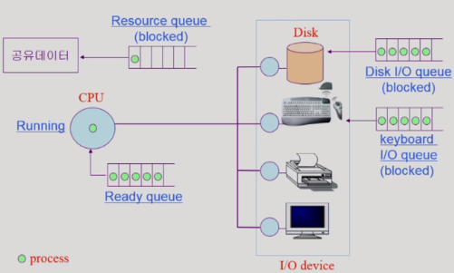

# 목차

<br>

- [목차](#목차)
- [들어가며](#들어가며)
- [CS 관점에서 결과 가정해보기](#cs-관점에서-결과-가정해보기)
  - [메모리 계층구조 관점](#메모리-계층구조-관점)
  - [프로세스 관점](#프로세스-관점)
  - [결과 가정](#결과-가정)
- [테스트 환경](#테스트-환경)
  - [WAS 환경](#was-환경)
  - [DB 환경](#db-환경)
  - [EC2 사양](#ec2-사양)
  - [nGrinder 환경](#ngrinder-환경)
- [테스트 결과](#테스트-결과)
  - [쓰기](#쓰기)
    - [nGrinder 결과](#ngrinder-결과)
    - [DB vmstat 결과](#db-vmstat-결과)
    - [결론](#결론)
  - [읽기](#읽기)
    - [nGrinder](#ngrinder)
    - [DB vmstat](#db-vmstat)
    - [결론](#결론-1)
- [마치며](#마치며)

<br>

# 들어가며
> 이 자료는 추후에 DB 선택을 하거나, 작은 데이터의 DB 성능 비교가 필요할 때 사용되면 좋을 듯 하다.

<br>

DB는 다양한 관점에서 분류할 수 있다.

예를 들어, 다음과 같이 분류할 수 있다.
* 데이터를 Memory에 데이터를 저장하는 DB
* 데이터를 Disk I/O를 통해 디스크에 저장하는 DB

보통 영속화가 필요한 데이터는 Disk I/O를 통해 디스크에 저장하고, 영속화 할 필요가 없거나 큰 데이터량을 배치처리하기 위해서 In-Memory DB를 사용한다.

필자도 최근 진행중인 프로젝트의 초기 요구사항을 모두 구현하였고, 이제 안정적인 운영을 위해 성능 테스트를 진행하며 튜닝을 진행중이다.

특히 마스터 DB의 CPU 부하를 줄이기 위해 캐싱을 적용했고, 10배의 성능 향상을 경험하게 되었다.

그렇다면 In-Memory DB의 쓰기/읽기 성능은 왜 Disk I/O DB보다 빠를까?

어떻게 보면 당연한 소리지만.. 간단한 부하 테스트를 통해 더 자세히 알아보고자 한다. 

> 의미 없는 실험은 없다고 생각함. 이 또한 배울게 있으리~~

이번 글에선 간단한 데이터를 쓰기/읽기를 통해 분석하고, 다음 글에서 비교적 복잡한 데이터를 테스트할 예정이다.

<br>

# CS 관점에서 결과 가정해보기
우선 본격적으로 테스트하기 전에, CS 관점에서 두 DB가 어떤 부분에서 성능 차이가 발생하는지 가정(추측)해본다.

다양한 관점에서 가정해볼 수 있지만, 필자는 가장 중요하다고 판단되는 메모리 계층구조와 프로세스 관점에서 가정해 볼 예정이다.

<br>

## 메모리 계층구조 관점
다들 알다시피, 컴퓨터의 메모리 계층 구조는 아래와 같다.

<p align="center"><br>출처: https://link.springer.com/article/10.1007/s00778-019-00546-z</p>

위로 갈수록 속도는 빠르지만, 용량이 작다. 

반대로, 아래로 갈수록 속도는 느리지만, 용량은 크다.

* **CPU Register와 CPU Caches** (L1, L2, L3)는 CPU 내부에 존재한다. 당연히 CPU가 아주 빠르게 접근할 수 있다. 
* **메인 메모리는 CPU 외부에 존재한다.** 레지스터와 캐시보다 더 느리게 접근할 수 밖에 없다. 
  * 메인 메모리를 읽어오기 위해선 인터럽트를 통해 커널모드에서 가져올 수 있다.
* **하드 디스크는 심지어 CPU가 직접 접근할 방법조차 없다.**
  *  CPU가 하드 디스크에 접근하기 위해서는 하드 디스크의 데이터를 메모리로 이동시키고, 메모리에서 접근해야한다. 아주 느린 접근 밖에 불가능하다.

<br>

이렇게 보면 메인 메모리에 데이터를 저장하는 In-Memory DB와 하드 디스크에 데이터를 저장하는 Disk I/O DB의 성능 차이는 어쩌면 당연하다.

<br>

## 프로세스 관점
메모리 계층구조 관점에서 차이는 분명하다. 하지만 프로세스 관점에서도 큰 차이가 발생한다.

<br>

**Disk I/O**

운영체제 입장에선 데이터 베이스도 그저 프로세스 일 뿐이기 때문이다.

운영체제는 CPU가 한정적이라 시분할 방식으로 동작하며, Disk I/O와 같이 외부 장치를 이용하는 시스템 콜을 사용할 땐 프로세스가 한동안 CPU를 양도하고 해당 프로세스를 Disk I/O 큐에 넣는다, 그리고 Disk I/O 작업이 끝날 때까지 Blocked 상태가 된다. 

<p align="center"><br>출처: 운영체제와 정보기술의 원리</p>

<p align="center"><br>Disk I/O가 걸릴 때의 프로세스 상태 변화<br>출처: 운영체제와 정보기술의 원리 </p>

위와 같이 프로세스의 정보를 담은 PCB들을 요청에 따라 CPU Ready Queue 혹은 장치들의 큐에 넣어 요청을 처리한다.

그리고 이때 장치들의 큐에 들어간 프로세스의 상태는 Blocked 상태가 된다.

Blocked 상태의 프로세스는 해당 I/O 요청이 완료되고, 처리 결과(데이터)를 메모리로 옮기고 나서야 Ready 상태가 된다.

<br>

**Memory**

반면에 메인 메모리에 데이터를 저장하는 경우, 다른 장치들의 I/O가 걸리지않는다.

메인 메모리에 쓰기/읽기 작업을 위해 인터럽트를 통해 사용자모드를 커널모드로 바꿀 뿐, 프로세스의 상태는 Blocked이 되지않고, Ready와 Running 상태를 반복한다.

즉, Disk I/O보다 빠를 수 밖에 없다.

<br>

## 결과 가정
위와 같이 메모리 계층 구조와 프로세스 관점에서 In-Memory가 쓰기/읽기 모두 빠를 수밖에 없다.

게다가 필자가 생각하기엔 그 격차가 굉장히 클 것이라고 예상했다.

> 결과는 마지막에 ㅎ

<br>

# 테스트 환경
이제 본격적으로 테스트해보기위한 환경을 구축해본다.

<br>

## WAS 환경

의존성 환경은 다음과 같다.
* Spring Boot 2.5.3
* Spring Redis 2.5.4 (Lettuce)

간단한 테스트를 위해 `Post`라는 도메인 객체 하나만을 사용하여 DB 쓰기/읽기 테스트를 하고자한다.

> Post

```java
@AllArgsConstructor
@NoArgsConstructor
@Getter
// Redis의 경우 @RedisHash("post")
public class Post {

    // Redis의 경우 @Id @Indexed
    private Long id; // Redis의 경우 String
    private String title;
    private String content;
}
```

<br>

> PostController

```java
@RestController
public class PostController {

    private final PostRepository postRepository;

    public PostController(PostRepository postRepository) {
        this.postRepository = postRepository;
    }

    @GetMapping("/api/post/{id}")
    public ResponseEntity<Post> findPost(@PathVariable String id) {
        Post findPost = postRepository.findById(id)
            .orElseThrow();
        return ResponseEntity.ok().body(findPost);
    }

    @PostMapping("/api/post")
    public ResponseEntity<Void> savePost() {
        String randomString = generateRandomString();
        Post post = postRepository.save(new Post(null, randomString, randomString));
        return ResponseEntity
            .created(URI.create("/api/post/" + post.getId()))
            .build();
    }

    private String generateRandomString() {
        int leftLimit = 97; // letter 'a'
        int rightLimit = 122; // letter 'z'
        int targetStringLength = 10;
        Random random = new Random();

        return random.ints(leftLimit, rightLimit + 1)
            .limit(targetStringLength)
            .collect(StringBuilder::new, StringBuilder::appendCodePoint, StringBuilder::append)
            .toString();
    }
}
```

<br>

API는 간단히 두 개 만들었다.
* Post 생성 API: `POST /api/post`
  * Post의 title과 content는 무작위 문자열을 만들도록 하였다. ID는 AI이다.
* Post 조회 API: `GET /api/post/{id}`

<br>

## DB 환경
DB는 Redis와 MySQL을 사용했다.

각 DB의 설정은 다음과 같다.

* Redis
  * `maxclients`: 50000
  * RDB/AOF 설정 off
* MySQL
  * 캐싱 기능 0MB를 통해 off

둘 다 외부 서버로 따로 분리하여 구성하였다.

<br>

## EC2 사양
WAS와 DB들의 EC2 사양은 모두 medium이다.
* 듀얼 코어 최대 3.3GHz
* 메모리 4GB
* 용량 50GB

<br>

## nGrinder 환경
<p align="center"></p>

* VUser: 198
* 테스트 시간: 3분

스크립트는 설계한 API에 맞춰 GET과 POST로 나누었다.

조회의 경우 아래와 같이 범위내의 랜덤한 숫자를 뽑아서 요청하도록 구성하였다.

`long randomId = Math.abs(random.nextInt() % 390012) + 1`

<br>

# 테스트 결과
이제 본격적으로 테스트 결과를 살펴본다.

각 테스트는 결과는 두 가지로 구성하였다.
* nGrinder 결과 -> TPS, Peak TPS, Mean Test Time
* DB vmstat 결과 -> CPU, Memory, Disk I/O, Interrupt, ContextSwitching

<br>

## 쓰기
쓰기 테스트는 각각 DB에 3분동안 요청을 보내도록했다.

<br>

### nGrinder 결과

<p align="center"><br>MySQL 결과</p>

<br>

<p align="center"><br>Redis 결과 </p>

* TPS
  * Redis가 MySQL보다 평균 TPS의 경우 **30.94% 증가하였다**.
* Peak TPS
  * Redis가 MySQL보다 Peak TPS의 경우 **37.89% 증가하였다**.
* MTT
  * Redis가 MySQL보다 MTT의 경우 **24.04% 감소하였다**.
* 저장된 데이터 개수
  * 3분동안 MySQL의 경우 **390,012개 저장됨**.
  * 3분동안 Redis의 경우 **1,531,000개 저장됨**.
  * Redis가 MySQL보다 저장된 데이터(raw)의 개수가 **292.55% 증가하였다**.

<br>

nGriner 결과만 봐도 Redis와 MySQL의 쓰기 차이를 볼 수 있다.

하지만 필자가 처음 생각한 것보단 격차가 크기 않다.

아마 쓰기 작업을 하는 데이터가 너무 간단해서 그렇지 않나 추측한다.

> 다음 글에선 더 복잡한 글을 통해 쓰기 작업을 할 예정이다.

<br>

### DB vmstat 결과

<p align="center"><br>MySQL 결과 </p>

<p align="center"><br>Redis 결과 </p>

> 모든 수치는 3분 동안의 모니터링 과정에서의 최대 값입니다. 
> 
> 평균적으로도 모두 높은 수치를 보이므로 최대 값을 사용했다.

<br>

|DB|r|b|free|buff|cache|bo|in|cs|wa|
|---|---|---|---|---|---|---|---|---|---|
|MySQL|10|2|2553|113|1004|7904|14056|13965|31|
|Redis|2|0|3186|0|280|0|24653|8470|0|

* 프로세스
  * r: cpu 접근 대기 중인 실행 가능한 프로세스 수
    * DiskI/O가 발생하는 MySQL의 경우 Block 상태의 프로세스가 발생하며, **Disk I/O로 프로세스를 보내고, 완료되어 데이터를 가져올 때마다 CPU를 점유해야하므로, Ready인 프로세스가 많은 것으로 추측된다.**
  * b: I/O 자원을 할당 받지 못해 블록 된 프로세스의 수
    * **MySQL의 경우 쓰기 작업시 Disk I/O가 발생하므로, Blocked되는 프로세스가 발생하는 것을 볼 수 있다.**
    * 반면에 **Redis는 Ready 상태로만 상태를 변환하므로 Blocked되는 프로세스가 존재하지 않는다.**
* 메모리
  * free: 사용가능한 여유 메모리의 용량
    * MySQL의 경우 `2661 -> 2553`으로 변경되었고, 
    * Redis의 경우 `3664 -> 3186`으로 변경됐다. **메모리에 모든 데이터를 저장하므로, 어떻게 보면 당연한 결과이다.**
  * buff : 버퍼에 사용된 메모리의 총량
  * cache : 페이지 캐시에 사용된 메모리의 용량
* I/O
  * bo: I/O 블록 디바이스로 전송한 블록 개수
    * MySQL의 경우 최대 7904만큼 발생한다. 반대로, Redis는 0번 발생한다. 이를 통해 **Redis는 Disk I/O가 전혀 발생하지 않는 것을 알 수 있다.**
* in: Interrupt
  * Redis의 경우 24653, MySQL의 경우 14056번 발생한다. 이는 **Redis가 메모리에 접근하고 처리하는 속도가 빠르므로, 인터럽트를 거는 횟수도 훨씬 많은 거으로 예상된다.** 이 지표도 DB에 저장되는 데이터 개수의 차이에 큰 영향을 끼치지 않을까싶다.
* cs: Context Switching
  * Redis의 경우 8470, MySQL의 경우 13965번 발생한다.
* WA: IO wait 시간
  * MySQL의 경우 31, Redis의 경우 0번 발생한다.
  * **이 지표 또한 MySQL는 Disk I/O가 발생한다는 것을 알 수 있다.**

<br>

### 결론

아직 필자도 운영체제의 지식이 깊지 않으므로, 정확한 분석은 못한다.

그래도 프로세스 상태와 I/O 지표를 통해 하나는 확실히 알 수 있다. 

**MySQL의 쓰기 속도가 느린 이유는 운영체제 관점에서 Disk I/O가 발생하기 때문이다.**

<br>

## 읽기
읽기 테스트는 각각 DB에 3분동안 범위내의 무작위의 ID를 생성하여 요청을 보내도록했다.

데이터의 양은 다음과 같다.
* MySQL: 390,012
* Redis: 1,531,000

<br>

### nGrinder

<p align="center"><br>MySQL 결과 </p>
<p align="center"><br>Redis 결과 (Hash형식 저장)</p>
<p align="center"><br>Redis 결과 (String형식 json 저장)</p>

* TPS
  * Redis(Hash형식)가 MySQL보다 평균 TPS의 경우 **6.52% 증가하였다**.
  * Redis(String형식)가 MySQL보다 평균 TPS의 경우 **17.53% 증가하였다.**
* Peak TPS
  * Redis(Hash형식)가 MySQL보다 Peak TPS의 경우 **7.55% 증가하였다**.
  * Redis(String형식)가 MySQL보다 Peak TPS의 경우 **20.55% 증가하였다**.
* MTT
  * Redis(Hash형식)가 MySQL보다 MTT의 경우 **6.12% 감소하였다**.
  * Redis(String형식)가 MySQL보다 MTT의 경우 **14.65% 감소하였다**.

<br>

nGrinder 결과를 보면 생각보다 큰 차이가 발생하지 않는다.

**그래도 Redis가 전체적으로 우세한 수치를 보여준다.**

또한, **Redis의 저장 형식에 따른 속도 차이도 생각보다 크다.**

**캐싱할 땐 Json을 이용하여 String형식으로 Redis에 넣는 것이 더 효율적이다.**

> jackson 라이브러리를 이용하여 직렬화/역직렬화하였습니다.

<br>

### DB vmstat

<p align="center"><br>MySQL 결과 </p>

<p align="center"><br>Redis 결과 </p>

|DB|r|b|bo|in|cs|wa|
|---|---|---|---|---|---|---|
|MySQL|2|0|0|14110|7409|0|
|Redis|2|0|0|9016|3333|0|

nGrinder에서 지표상 차이가 없듯이, vmstat 관점에서 봤을 때의 차이가 그렇게 크지 않았다.

이는 두가지 이유를 추측할 수 있다.

1. MySQL도 Disk I/O가 발생하지 않았다.
   * vmstat 결과를 보면 I/O bi가 전혀 오르지 않는다.
   * 필자가 추측하기론 조회하는 데이터가 비교적 단순하고 용량이 작으므로, CPU 캐시에 저장된 데이터를 계속 가져오는 것이 아닌가 싶다.
   * 그렇다고 어떻게 한번도 I/O가 발생하지 않는지는 필자도 모르겠다.. 더 공부가 필요해보인다.
2. 단순한 쿼리이므로 성능 차이가 없다.
   * 필자가 비교적 복잡한 쿼리를 날리는 프로젝트에선 CPU 비용이 굉장히 컸다.
   * 이번 실험에선 단순한 쿼리이므로, 성능 차이가 없지않나 싶다.

> 아직 정확히 왜 Disk I/O가 발생하는지 모른다. 아시는 분은 메일 부탁드립니다!

<br>

### 결론

**단순한 쿼리를 대상으로 한 MySQL의 읽기 속도는 Redis보다 비교적 조금 느리다.**

중요한 점은 단순한 쿼리일 때만이다!

결론적으론 그래도 MySQL의 읽기 속도는 Redis보다 느리다.

이외에도, **Redis의 저장 형식에 따른 속도 차이도 생각보다 크다.**

**캐싱할 땐 Json을 이용하여 String형식으로 Redis에 넣는 것이 더 효율적이다.**

**MySQL와 Redis (json 형식)의 격차는 생각보다 크다.**

**이점으로 보았을 때 캐싱이나 토큰 저장소로 In-Memory더 효율적으로 보인다.**

개인적으론 운영체제에 대한 지식이 부족하다는 것을 깨닫는 실험이었다..

<br>

# 마치며
이번 **성능 테스트에선 간단한 데이터 (`Post`)를 대상으로 실험을 진행하였다.**

그래서인지 **비교적 격차가 크다면 크고 작다면 작다고 볼 수 있다.**

그래도 **vmstat을 통해 두 DB가 운영체제 관점에서 어떤 방식으로 동작하는지 조금은 알게되어 뜻깊었다.**

> 필자도 아직 운영체제에 대한 지식이 많이 부족하므로, 여러 실험을 통해 알게 된 사실을 추가할 예정


