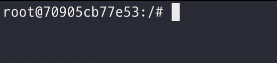
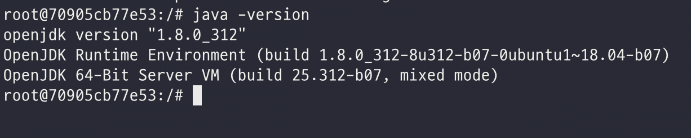
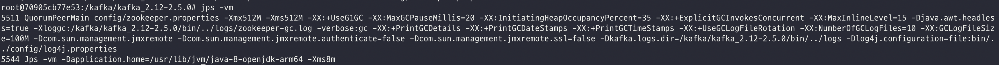
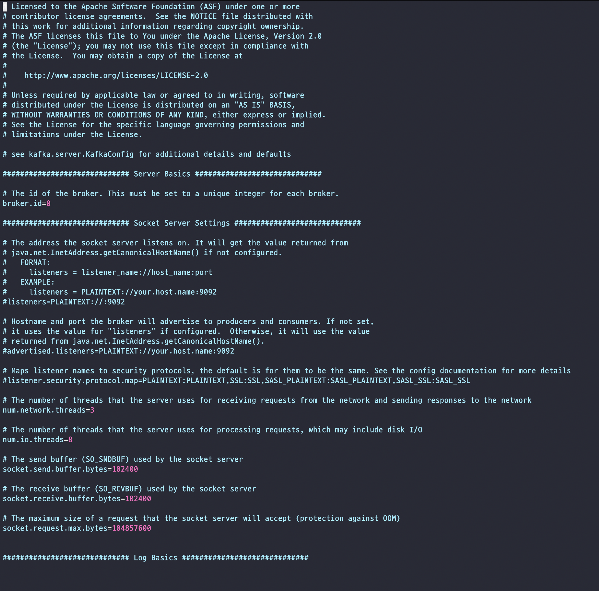
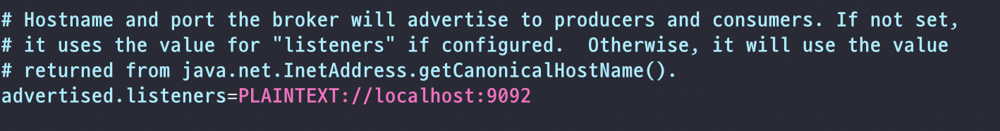
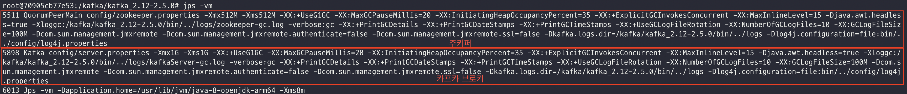
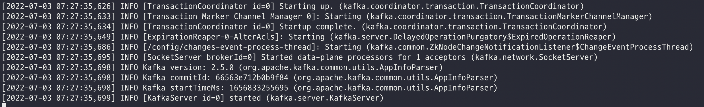
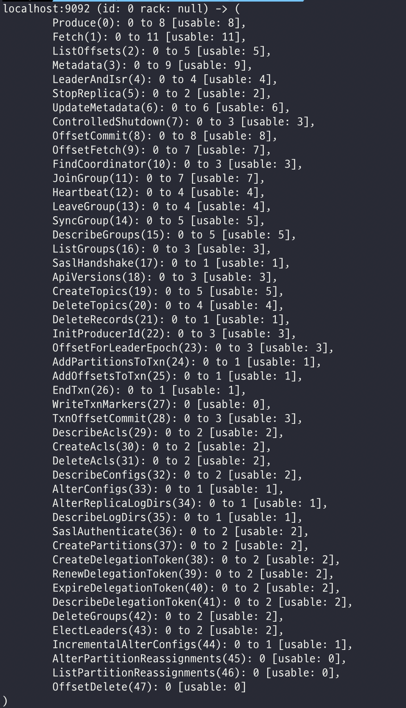
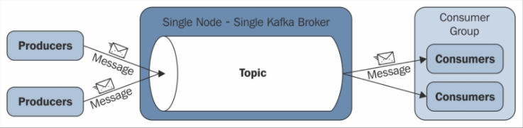

# 목차

<br>

- [목차](#목차)
- [들어가며](#들어가며)
- [Docker 기반의 환경 설정](#docker-기반의-환경-설정)
  - [Docker Ubuntu 컨테이너 실행](#docker-ubuntu-컨테이너-실행)
  - [자바 및 필수 애플리케이션 설치](#자바-및-필수-애플리케이션-설치)
- [카프카 브로커 실행](#카프카-브로커-실행)
  - [카프카 브로커 실행](#카프카-브로커-실행-1)
  - [주키퍼 실행](#주키퍼-실행)
  - [카프카 브로커 실행 옵션 설정](#카프카-브로커-실행-옵션-설정)
  - [카프카 브로커 실행](#카프카-브로커-실행-2)
  - [카프카 브로커 통신 확인](#카프카-브로커-통신-확인)
- [카프카 토픽 생성 및 관리](#카프카-토픽-생성-및-관리)
- [카프카 메시지 Producer](#카프카-메시지-producer)
- [카프카 메시지 Consumer](#카프카-메시지-consumer)
- [카프카 Consumer Groups](#카프카-consumer-groups)
- [카프카 메시지 producer, consumer 테스트](#카프카-메시지-producer-consumer-테스트)
- [카프카 메시지 삭제](#카프카-메시지-삭제)
- [마치며](#마치며)

<br>

# 들어가며
카프카는 대규모 이벤트 스트리밍 플랫폼이다.

이는 크게 세 가지의 기능을 가진다고 볼 수 있다.

1. 이벤트 스트림 publish(write)와 subscribe(read) 기능
2. 이벤트 스트림 저장 기능
3. 이벤트 스트림 처리 기능.

이외에도 카프카는 다양한 서브 기능들을 제공하고있다. 그래서인지 처음 카프카를 접하면 어렵고 복잡하다는 생각이 든다. (필자는 그랬다..)

개인적으로 특정 기술을 익히기 위한 가장 빠르고 효과적인 학습 방법은 직접 해보는 것이다.

이번 글은 카프카를 처음 사용해보는 개발자를 대상으로, 실습용 카프카 브로커 서버를 하나 띄우고, 로컬 컴퓨터에서 이것저것 직접 해보는 Hello World 글이다.

실습용으로 띄운 브로커 서버에 토픽을 생성, 수정하고 데이터를 전송(Producer)하고 받는(Consumer) 실습을 진행한다.

> 카프카의 핵심 기능인 pub/sub을 실습해본다고 이해하면 된다. 이번 글은 [데브원영님의 아파치 카프카 with 자바](http://www.yes24.com/Product/Goods/99122569)과 [공식 문서 - Quick Start](https://kafka.apache.org/documentation/#gettingStarted)를 많이 참고하였다.

<br>

# Docker 기반의 환경 설정
실습용 카프카 브로커는 Docker에 Ubuntu 컨테이너를 띄워서 구성할 계획이다.

> 브로커(broker)는 실행된 Kafka application 서버를 뜻한다.

Docker, 리눅스에 익숙하지 않아도 무관하다. Ubuntu 컨테이너 띄우는 것부터 카프카 브로커 서버 띄우는 것까지 하나하나 자세히 설명할 예정이다.

<br>

## Docker Ubuntu 컨테이너 실행
가장 먼저 해야할 것은 카프카 브로커 서버를 띄울 Ubuntu 서버를 띄우는 것이다.

이번 글에선 최대한 빠르게 진행하기 위해 Docker에 Ubuntu 서버를 띄워서 진행한다.

> Docker 설치와 관련된 내용은 생략한다. 구글링해보면 쉽게 찾아볼 수 있다.

<br>

**우분투 이미지 pull 및 실행**

```shell
# 우분투 이미지 pull
$ docker pull ubuntu:18.04

# 우분투 컨테이너 실행
$ docker run -it -d -p 9092:9092 --name kafka-server ubuntu:18.04
```
[docker run 옵션 참고](https://docs.docker.com/engine/reference/run/)

<br>

**우분투 컨테이너 접속**

```shell
# 우분투 컨테이너 조회
$ docker ps | grep kafka-server

# 우분투 컨테이너 접속
$ docker exec -itu 0 kafka-server /bin/bash
```
* `-u 0` 옵션: bash 접속시 권한을 루트 (0)으로 설정하는 옵션이다.

<br>

위 명령어를 문제없이 따라왔다면 아래와 같이 Docker Ubuntu 컨테이너에 접속하게 된다.

<p align="center"> </p>

<br>

## 자바 및 필수 애플리케이션 설치
이제 Docker Ubuntu 컨테이너를 띄우고, 접속했으니 카프카 브로커를 실행하기 위한 의존 프로그램을 설치해준다.

<br>

**자바 설치**

```shell
# JDK 8 설치
$ apt-get update
$ apt-get install openjdk-8-jdk
$ java -version
```

자바가 제대로 설치되었다면 아래와 같이 JDK 버전이 잘 출력된다.

<p align="center"> </p>

<br>

**카프카 바이너리 프로그램 설치를 위한 프로그램 설치**

```shell
$ apt-get install wget
$ apt-get install vim
```
* 카프카 바이너리 파일을 다운받기 위한 wget을 설치해준다.
* 카프카 설정파일을 수정하기 위해 vim을 설치해준다.

> 꼭 위 두 가지가 아니라도 상관없다. 같은 역할을 하는 프로그램이면 된다.

<br>

# 카프카 브로커 실행

카프카는 현재 Docker로 띄운 Ubuntu에 직접 카프카 바이너리 패키지를 다운 받아 실행할 예정이다.

<br>

## 카프카 브로커 실행
우선 카프카 프로젝트의 바이너리 파일을 다운 받는다.

<br>

**카프카 프로젝트 바이너리 다운 및 압축 풀기**

```shell
$ wget https://archive.apache.org/dist/kafka/2.5.0/kafka_2.12-2.5.0.tgz

$ tar xvf kafka_2.12-2.5.0.tgz
```

그리고 압축푼 카프카 폴더로 이동해준다.

<br>

## 주키퍼 실행
다운 받은 카프카 바이너리 폴더안에 주피커도 준비되어있다.

분산 코디네이션 서비스를 제공해주는 주키퍼는 카프카의 클러스터 설정 리더 정보, 컨트롤러 정보를 담고있어 카프카를 실행하는 데에 필요한 필수 애플리케이션이다.

> 주키퍼의 역할은 카프카 브로커의 메타데이터 정보를 저장 및 상태관리이다.

즉, 카프카 브로커 서버를 실행하기 위해선 필수로 실행해줘야한다.

> 실제 운영에선 주키퍼를 3대 이상으로 구성한다. 단, 이번 실습에선 가장 간단히 하기위해 1대만 실행한다.

<br>

**브로커 실행**

```shell
# 현재 위치는 압축푼 카프카 바이너리 폴더안이다.
# 주키퍼 실행
$ bin/zookeeper-server-start.sh -daemon config/zookeeper.properties

# 주키퍼가 제대로 실행되었는지 확인
$ jps -vm
```
* `bin`폴더에 위치한 `zookeeper-server-start.sh` 스크립트를 통해 주키퍼는 쉽게 실행할 수 있다.
  * `-daemon` 명령어는 데몬으로 계속해서 주키퍼를 실행시켜놓기 위한 옵션이다.
  * 주키퍼를 실행할 때 뒤에 설정 파일을 지정할 수 있다. (주키퍼 설정을 바꾸고 싶다면 `config/zookeeper.properties`를 수정해주고 주키퍼를 다시 실행해주면 된다.)
* `jps`는 JVM 위에서 동작중인 프로세스 상태를 보여주는 도구이다.
  * `-vm` 옵션으로 인해 main메서드와 JVM에 전달된 인자를 확인할 수 있다.

<p align="center"><br>주키퍼가 제대로 실행된 모습 </p>

<br>

## 카프카 브로커 실행 옵션 설정
주키퍼를 실행해줌으로써 이제 카프카 브로커를 실행할 조건은 모두 갖췄다.

카프카 브로커 실행을 위한 옵션을 설정하고 실행해주면 된다.

실행 옵션은 `config/server.properties`를 수정해주면 된다.

```shell
$ vim config/server.properties
```
설정 파일을 열어보면 아래와 같이 나온다.

<p align="center"> </p>

<br>

설정 가능한 옵션은 아래와 같다.

<details>
  <summary>설정 가능 옵션 및 설명</summary>
  
  ---
  * Server Basic
  * `broker.id`
    * 브로커 서버의 id를 의미한다. 카프카 클러스터에서 브로커를 구별하기 위해 사용된다. (유니크해야한다.)
  * Socket Server Settings
    * `listeners`
      * 카프카 브로커가 통신을 위해 열어둘 인터페이스 IP, Port, 프로토콜을 설정할 수 있다.
      * 따로 설정하지 않으면 모든 IP와 Port에서 접속가능하다.
    * `advertised.listeners`
      * 카프카 클라이언트 또는 카프카 커맨드 라인 툴에서 접속할 때 사용하는 IP와 port정보이다.
      * 만약 AWS EC2에 카프카 브로커를 띄운다면, EC2 인스턴스의 퍼블릿 IP와 port 정보를 기입해준다.
    * `listener.security.protocol.map`
      * SASL_SSL, SASL_PLAIN 보안 설정 시 프로토콜 매핑을 위한 설정
    * `num.network.threads`
      * 네트워크 스레드 개수 설정
    * `num.io.threads`
      * 카프카 브로커 내부에서 요청을 처리할 때 사용할 스레드 개수 설정 (Disk I/O도 포함)
  * Log Basics
    * `log.dirs`
      * 통신을 통해 카프카 브로커에 가져온 데이터를 파일로 저장할 디렉토리 위치
      * 카프카는 모든 데이터를 로그로 간주한다. (이때의 로그는 애플리케이션에서 남기는 로그와 조금 차이가 있다. 관련 내용은 추후에 다룰 예정)
    * `num.partitions`
      * 파티션 개수를 명시하지 않고 토픽을 생성할 때 기본 설정되는 파티션 개수 (글로벌 파티션 개수 설정)
      * 파티션 개수가 많아지면 병렬처리 데이터양이 늘어난다.
  * Internal Topic Settings
  * Log Flush Policy
  * Log Retention Policy
    * `log.retention.hours`
      * 카프카 브로커가 저장한 파일이 삭제되기까지 유지되는 시간을 설정한다.
      * 디폴트는 `log.retention.hours`이지만, `log.retention.ms`로 수정하여 짧은 시간으로 설정할 수 있다.
      * 만약 `log.retention.ms=-1`로하면 영원히 삭제하지 않는다.
    * `log.segment.bytes`
      * 카프카 브로커가 저장할 파일의 최대 크기를 지정한다.
      * 다 차면 파일을 새로 만든다.
  * Zookeeper
    * `zookeeper.connect`
      * 카프카 브로커와 연동될 주키퍼의 IP와 Port
    * `zookeeper.connection.timeout.ms`
      * 주키퍼의 세션 타임아웃 설정.
  
  ---
</details>

<br>

정리하다보니 옵션이 많다.. 이번 글에선 외부에서 카프카 브로커에 접속해야하기에 `advertised.listeners`설정만 해주면 된다.

Docker로 브로커 서버를 띄우고, 로컬 컴퓨터에서 접속할 것이기에 아래와 같이 `localhost`로 설정해주면 된다.

<p align="center"> </p>

<br>

## 카프카 브로커 실행
이제 드디어.. 카프카 브로커를 실행한다.

<br>

**카프카 브로커 실행**

```shell
# 카프카 브로커 실행 (현재 위치는 카프카 바이너리 폴더)
$ bin/kafka-server-start.sh -daemon config/server.properties

# JPS 확인
$ jps -vm
```

제대로 카프카 브로커가 실행되었다면 아래와 같이 jps 결과가 나온다.

<p align="center"> </p>

<br>

**만약 제대로 실행이 안된다면 로그를 확인해보면 된다.**

```shell
$ tail -f logs/server.log
```

아마 제대로 에러가 발생했다면 에러 로그가 찍혀있을 것이다.

제대로 실행되었다면 아래와 같이 로그가 출력된다.

<p align="center"> </p>

<br>

## 카프카 브로커 통신 확인
이제 로컬 컴퓨터에서 Docker Ubuntu에 띄운 카프카 브로커 서버와 제대로 통신이 되는지 확인해본다.

> 로컬 컴퓨터에서 CLI를 켜준다. (필자는 zsh을 사용한다.)

<br>

**카프카 바이너리 다운 및 압축 풀기**

카프카 브로커와 통신 확인 및 이후에 pub/sub을 위해선 로컬 컴퓨터에도 카프카 바이너리를 다운 받아야한다.

```shell
# 로컬 컴퓨터에서도 동일하게 카프카 바이너리를 다운 및 압축 해제해준다.
$ wget https://archive.apache.org/dist/kafka/2.5.0/kafka_2.12-2.5.0.tgz

$ tar xvf kafka_2.12-2.5.0.tgz
```

<br>

**카프카 브로커 통신 확인**

```shell
# 압축 해제한 카프카 바이너리 폴더로 이동후
$ bin/kafka-broker-api-versions.sh --bootstrap-server localhost:9092
```
* `kafka-broker-api-versions.sh`
  * 카프카 브로커에 대한 정보를 가져오는 스크립트

<br>

만약 브로커에 제대로 통신되었다면 아래와 같이 브로커에 대한 정보를 가져온다.

<p align="center"> </p>

<br>

# 카프카 토픽 생성 및 관리
이제 카프카 브로커에 직접 토픽을 생성하고 관리해본다.

카프카에서 기본적으로 제공하는 커맨드 라인 툴을 이용한다.

토픽 관련된 기본으로 제공해주는 스크립트는 `kafka-topics.sh`이다.

커맨드 라인 툴을 통해 토픽 관련 명령을 실행할 때 필수와 선택 옵션이 있다.

선택 옵션의 경우 입력하지 않으면 브로커에 설정된 디폴트값으로 실행된다.

<br>

**토픽이란?**

<p align="center"><br>출처: https://www.youtube.com/watch?v=7QfEpRTRdIQ</p>

* **데이터를 구분하는 가장 기본적인 개념을 의미한다.**
  * **RDBMS에서 테이블과 유사하다고 보면 된다.**
  * **Data가 저장되는 곳**
* 카프카 클러스터에 보통 여러 개의 토픽이 존재한다.
* 토픽은 파티션이 존재하며, 파티션의 개수는 최소 1개부터 시작된다.

<br>

**토픽을 생성하는 방법**

1. 카프카 컨슈머 또는 프로듀서가 카프카 브로커에 생성되지 않은 토픽에 대해 데이터 요청하는 방법.
2. 커맨드 라인 툴로 명시적으로 토픽을 생성하는 방법.

> 토픽을 효율적으로 관리하기위해선 커맨드 라인 툴을 이용하는 것을 추천한다.

<br>

**토픽 생성**

```shell
# 토픽 생성
$ bin/kafka-topics.sh \
  --create \
  --bootstrap-server localhost:9092 \
  --topic hello-world

# 토픽이 정상으로 생성되면 아래와 같이 출력된다.
Created topic hello-world

# 토픽 생성시 아래와 같이 다양한 옵션을 줄 수도 있다.
$ bin/kafka-topics.sh \
  --create \
  --bootstrap-server localhost:9092 \
  --partitions 3 \
  --replication-factor 1 \
  --config retention.ms=172800000 \
  --topic hello-world
```
* `--bootstrap-server`
  * 토픽을 생성할 카프카 클러스터를 구성하는 브로커들의 IP와 port를 기입하는 옵션.
  * 실습에선 1개의 카프카 브로커와 통신하므로 `localhost:9092`만 입력하면 된다.

<br>

**토픽 리스트 조회**

```shell
$ bin/kafka-topics.sh --bootstrap-server localhost:9092 --list
```
위 명령어를 통해 카프카 클러스터에 어떤 토픽이 존재하는지 확인할 수 있다.

<br>

**토픽 상세 조회**

```shell
$ bin/kafka-topics.sh --bootstrap-server localhost:9092 --describe --topic hello-world

# 결과
Topic: hello-world	PartitionCount: 1	ReplicationFactor: 1	Configs: segment.bytes=1073741824
	Topic: hello-world	Partition: 0	Leader: 0	Replicas: 0	Isr: 0
```
위 명령어를 통해 특정 토픽의 상세한 설정과 내용을 조회할 수 있다.

<br>

**토픽 옵션 수정**

```shell
# 파티션 개수 수정
$ bin/kafka-topics.sh --bootstrap-server localhost:9092 \
  --topic hello-world \
  --alter \
  --partitions 2

# 파티션 개수 수정된 것 확인
$ bin/kafka-topics.sh --bootstrap-server localhost:9092 --describe --topic hello-world

Topic: hello-world	PartitionCount: 2	ReplicationFactor: 1	Configs: segment.bytes=1073741824
	Topic: hello-world	Partition: 0	Leader: 0	Replicas: 0	Isr: 0
	Topic: hello-world	Partition: 1	Leader: 0	Replicas: 0	Isr: 0

# retention (카프카 브로커가 저장한 파일이 삭제되기까지 유지되는 시간) 시간 수정
$ bin/kafka-configs.sh --bootstrap-server localhost:9092 \
  --entity-type topics \
  --entity-name hello-world \
  --alter --add-config retention.ms=86400000

Completed updating config for topic hello-world.

# 수정된 설정 확인
$ bin/kafka-configs.sh --bootstrap-server localhost:9092 \
  --entity-type topics \
  --entity-name hello-world \
  --describe

Dynamic configs for topic hello-world are:
  retention.ms=86400000 sensitive=false synonyms={DYNAMIC_TOPIC_CONFIG:retention.ms=86400000}
```
* 토픽에 설정된 옵션을 수정하기 위해선 `kafka-topics.sh` 혹은 `kafka-configs.sh`를 사용해야한다.
  * 옵션이 파편화된 이유는 토픽에 대한 정보를 관리하는 일부 로직이 다른 명령어로 넘어갔기 때문이라고 한다.
  * 사용할 대 맞는 커맨들 라인 툴을 사용하면 될 듯 하다.

<br>

# 카프카 메시지 Producer
카프카 브로커와 토픽이 성공적으로 설정되었다면, 이제 Producer 입장에서 브로커에 메시지를 write해본다.

이 또한, 카프카에서 기본적으로 제공하는 커맨드 라인 툴을 이용한다.

토픽 관련된 기본으로 제공해주는 스크립트는 `kafka-console-producer.sh`이다.

**이후 다른 글에서 다룰 예정이지만, 토픽에 넣는 데이터는 `key:value` 형식으로 이루어져있다.**

<br>

**key가 없는 경우**

```shell
# 메시지 전송
$ bin/kafka-console-producer.sh --bootstrap-server localhost:9092 \
  --topic hello-world
>hello
>world
>kafka
>0
>1
>2
>3
>4
>5
```
* key없이 value만 담아서 메시지를 보내면, key는 자바의 null로 기본 설정되어 브로커에 전송된다.
  * key가 없이 null로 저장되는 방식은 라운드 로빈(Round robin) 방식으로 각 파티션에 번갈아가면서 레코드를 저장한다. (이와 관련된 내용은 추후 다른 글에서 다룰 예정이다.)
* `kafka-console-producer.sh` 커맨드 라인 툴로 보내는 모든 메시지는 UTF-8 기반의 `ByteArraySerializer`로 직렬화되어 전송된다.
  * 만약 `String`이 아닌 타입으로 직렬화하고 싶다면, 다른 카프카 프로듀서 애플리케이션을 직접 개발해야한다. (스프링에선 이와 관련된 기능을 제공한다.)

<br>

**key가 있는 경우**

```shell
# 메시지 전송
$ bin/kafka-console-producer.sh --bootstrap-server localhost:9092 \
  --topic hello-world \
  --property "parse.key=true" \
  --property "key.separator=:"
>test-key1:test-value1
>test-key2:test-value2
>test-key3:test-value3
```
* key가 있는 경우, key의 해시값을 통해 존재하는 파티션 중 한 개에 할당된다.
  * 동일한 key를 가진 메시지는 동일한 파티션으로 전송된다.

> 동일한 key를 가진 메시지는 동일한 파티션으로 보낸다면, 만약 새롭게 파티션이 추가된다면 어떻게 될까?
> 
> 즉, 파티션 추가 전엔 0번 파티션에 들어가던 메시지가 파티션 추가 후엔 1번 파티션에 들어갈 수도 있다.
> 
> 만약 일관성을 지키고싶다면 따로 파티셔너를 커스텀하게 구현해줘야한다.

<br>

# 카프카 메시지 Consumer
이번엔 카프카 브로커로 보낸 메시지를 read 해본다.

이 또한, 카프카에서 기본적으로 제공하는 커맨드 라인 툴을 이용한다.

토픽 관련된 기본으로 제공해주는 스크립트는 `kafka-console-consumer.sh`이다.

<br>

**Consumer를 통해 read**

```shell
$ bin/kafka-console-consumer.sh --bootstrap-server localhost:9092 \
  --topic hello-world \
  --property print.key=true \
  --property key.separator=":" \
  --group hello-group \
  --from-beginning

# 결과
null:hello
null:world
null:2
null:3
null:4
test-key1:test-value1
test-key2:test-value2
test-key3:test-value3
null:kafka
null:0
null:1
null:5
```
* 메시지 key를 넣지 않는 데이터는 null, key를 넣은 데이터는 key와 함께 value가 노출되는 것을 볼 수 있다.
* `--group hello-group`
  * 컨슈머 그룹을 지정하는 옵션이다. 만약 존재하지 않는 그룹이면 새로 생성한다.
  * **컨슈머 그룹은 1개 이상의 컨슈머로 이루어져 있다. 이 컨슈머 그룹을 통해 가져간 토픽의 메시지는 가져간 메시지에 대해 커밋(commit)한다.**
  * **여기서 말하는 커밋이란 컨슈머가 특정 레코드까지 처리를 완료했다고, 레코드의 오프셋 번호를 카프카 브로커에 저장하는 것을 의미한다.**
  * 커밋 정보는 `__consumer_offsets`이라는 내부 토픽에 저장된다.
  * 위와 동일한 명령어(consumer)를 보내면 아무 결과도 출력되지 않는다. 그 이유는 `hello-group`이라는 컨슈머 그룹이 이미 모든 메시지를 읽었기 때문이다.
* `--from-beginning`
  * 토픽에 저장된 가장 처음 데이터부터 출력한다.
* 위 결과를 보면 순서가 이상한 것을 볼 수 있다. 이는 카프카 핵심인 파티션 개념때문에 생기는 현상이다.
  * 커맨드 라인 consumer는 토픽의 데이터를 가져갈 때 모든 파티션으로부터 동일한 중요도로 데이터를 가져간다.
  * 이는, 프로듀서가 토픽에 넣은 데이터의 순서와 컨슈머가 토픽에서 가져간 데이터의 순서가 달라지게 되는 것이다.
  * 만약 넣은 순서를 보장하고싶다면 가장 간단한 방법은 파티션을 1개만 유지하는 것이다.

<br>

# 카프카 Consumer Groups
Consumer 부분에서 설명했듯이, 컨슈머는 컨슈머 그룹에 속한다. 

이번엔 카프카 Consumer Groups에 대한 명령어를 살펴본다.

<br>

**모든 그룹 조회**

```shell
$ bin/kafka-consumer-groups.sh --bootstrap-server localhost:9092 --list

hello-group
console-consumer-47338
```
위에서 생성한 `hello-group`이 생성되어있는 것을 볼 수 있다.

<br>

**그룹 상세 조회**

```shell
$ bin/kafka-consumer-groups.sh --bootstrap-server localhost:9092 \
  --group hello-group \
  --describe

# 결과
Consumer group 'hello-group' has no active members.

GROUP           TOPIC           PARTITION  CURRENT-OFFSET  LOG-END-OFFSET  LAG             CONSUMER-ID     HOST            CLIENT-ID
hello-group     hello-world     0          8               8               0               -               -               -
hello-group     hello-world     1          4               4               0               -               -               -
```
**위와 같이 그룹 상세 조회를 통해 컨슈머 그룹이 어떤 토픽의 데이터를 가져가는지 확인할 수 있다.**

실제 카프카를 운용할 때 위 정보를 통해 다양한 정보를 얻을 수 있다.

<br>

# 카프카 메시지 producer, consumer 테스트
카프카 브로커와 토픽을 구성하고나서 프로듀서와 컨슈머를 테스트하기 좋은 툴을 이미 제공하고있다.

바로 `kafka-verifiable-producer`와 `kafka-verifiable-consumer.sh`이다.

이를 통해 간단한 네트워크 통신 테스트를 유용하게 진행할 수 있다.

<br>

**producer 검증**

```shell
$ bin/kafka-verifiable-producer.sh --bootstrap-server localhost:9092 \
  --max-messages 10 \
  --topic verify-test

# 결과 (메시지별로 보낸 시간, 메시지 키, 메시지 값, 토픽, 저장된 파티션, 저장된 오프셋 번호)
{"timestamp":1656870102317,"name":"startup_complete"}
[2022-07-04 02:41:42,475] WARN [Producer clientId=producer-1] Error while fetching metadata with correlation id 1 : {verify-test=LEADER_NOT_AVAILABLE} (org.apache.kafka.clients.NetworkClient)
{"timestamp":1656870102610,"name":"producer_send_success","key":null,"value":"0","partition":0,"topic":"verify-test","offset":0}
{"timestamp":1656870102616,"name":"producer_send_success","key":null,"value":"1","partition":0,"topic":"verify-test","offset":1}
{"timestamp":1656870102616,"name":"producer_send_success","key":null,"value":"2","partition":0,"topic":"verify-test","offset":2}
{"timestamp":1656870102616,"name":"producer_send_success","key":null,"value":"3","partition":0,"topic":"verify-test","offset":3}
{"timestamp":1656870102616,"name":"producer_send_success","key":null,"value":"4","partition":0,"topic":"verify-test","offset":4}
{"timestamp":1656870102616,"name":"producer_send_success","key":null,"value":"5","partition":0,"topic":"verify-test","offset":5}
{"timestamp":1656870102616,"name":"producer_send_success","key":null,"value":"6","partition":0,"topic":"verify-test","offset":6}
{"timestamp":1656870102616,"name":"producer_send_success","key":null,"value":"7","partition":0,"topic":"verify-test","offset":7}
{"timestamp":1656870102616,"name":"producer_send_success","key":null,"value":"8","partition":0,"topic":"verify-test","offset":8}
{"timestamp":1656870102616,"name":"producer_send_success","key":null,"value":"9","partition":0,"topic":"verify-test","offset":9}
{"timestamp":1656870102625,"name":"shutdown_complete"}
{"timestamp":1656870102627,"name":"tool_data","sent":10,"acked":10,"target_throughput":-1,"avg_throughput":30.581039755351682}
```
* `max-messages`
  * 카프카 브로커에 보내는 데이터 개수를 지정. 만약 -1로 입력하면 해당 쉘 스크립트가 종료될 때까지 계속해서 보낸다.

<br>

**consumer 검증**

```shell
$ bin/kafka-verifiable-consumer.sh --bootstrap-server localhost:9092 \
  --topic verify-test \
  --group-id test-group

# 결과
{"timestamp":1656870242436,"name":"startup_complete"} -- 1
{"timestamp":1656870242772,"name":"partitions_assigned","partitions":[{"topic":"verify-test","partition":0}]} -- 2
{"timestamp":1656870242861,"name":"records_consumed","count":10,"partitions":[{"topic":"verify-test","partition":0,"count":10,"minOffset":0,"maxOffset":9}]} -- 3
{"timestamp":1656870242869,"name":"offsets_committed","offsets":[{"topic":"verify-test","partition":0,"offset":10}],"success":true} -- 4
```
* 결과는 아래와 같이 해석할 수 있다.
  * 1 -> 시작 시간이 출력된다.
  * 2 -> 컨슈머가 토픽에서 데이터를 가져오기 위해 파티션에 할당하는 과정을 출력한다.
  * 3 -> **컨슈머는 한 번에 다수의 메시지를 가져와서 처리가능하기에 한 번에 10개의 메시지를 정상적으로 받았음을 알 수 있다.**
  * 4 -> 메시지 수신 이후 10번 오프셋 커밋 여부를 확인할 수 있다.
* `--group-id`
  * 컨슈머 그룹을 지정한다.

<br>

# 카프카 메시지 삭제
카프카 브로커에 이미 적재된 레코드를 삭제하는 기능도 있다.

커맨드 라인 툴로는 `kafka-delete-records.sh`를 사용한다.

<br>

**토픽의 데이터 중 가장 오래된 데이터부터 특정 시점의 오프셋까지 삭제**

```shell
# 삭제해야할 정보를 따로 저장해야한다. (hello-world 토픽의 0번 파티션에서 오래된 것부터 3 오프셋까지 삭제)
$ vim delete-topic.json
{"partitions": [{"topic": "hello-world", "partition":0, "offset": 3}], "version":1}

# 삭제 명령
$ bin/kafka-delete-records.sh --bootstrap-server localhost:9092 \
  --offset-json-file delete-topic.json

Executing records delete operation
Records delete operation completed:
partition: hello-world-0	low_watermark: 3
```
주의할 점은 토픽의 특정 레코드 하나만 삭제되는 것이 아닌, 파티션에 존재하는 가장 오래된 오프셋부터 지정한 오프셋까지만 삭제된다는 점이다. (큐를 생각하면 이해가 쉽다.)

**카프카에서는 토픽의 파티션에 저장된 특정 데이터만 삭제할 수 없다고 한다.**

<br>

# 마치며
카프카에 대한 기본적인 Hello World 글을 정리해보았다.

글을 작성하고 실습을하면서 카프카에 대한 기본적인 개념을 익힐 수 있었다.

이후 글에선 카프카에서 사용되는 다양한 도메인 용어에 대해서 정리할 계획이다.
