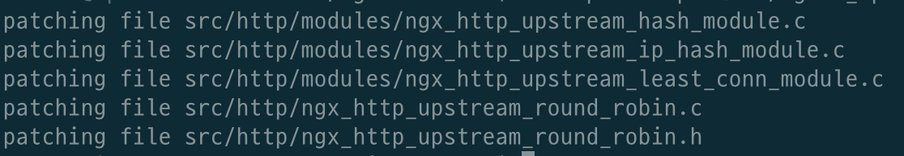
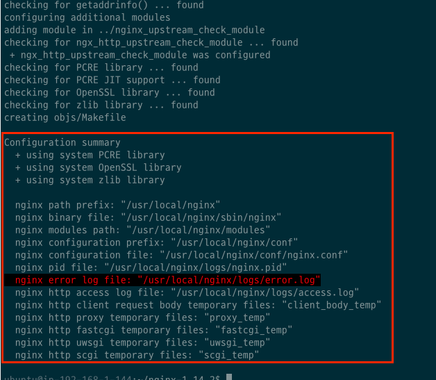
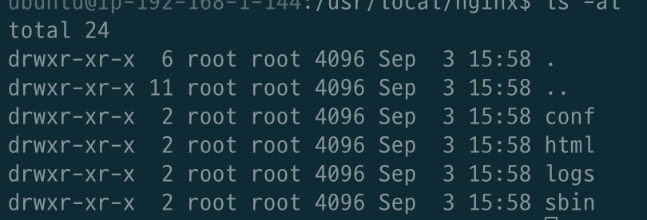
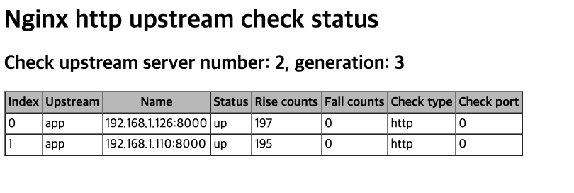

# 목차

<br>

- [목차](#목차)
- [개요](#개요)
- [준비물](#준비물)
- [NginX 컴파일 설치 with Module](#nginx-컴파일-설치-with-module)
- [NginX 설정](#nginx-설정)
  - [로드 밸런싱 및 헬스 체크 설정](#로드-밸런싱-및-헬스-체크-설정)
- [NginX 실행](#nginx-실행)
- [참고](#참고)

<br>

# 개요
NginX는 대표적으로 리버스 프록시와 로드 밸런서 역할을 담당할 수 있는 웹 서버이다.

로드 밸런싱을 구현하면 꼭 같이 구성해야하는 기능이 있다. 바로 '헬스 체크'다.

'헬스 체크'란 간단히 말하면 로드 밸런싱 서비스를 제공하는 다수의 서버의 상태를 점검하기 위한 기술이다.

> 쉽게 말해 WAS들의 건강을 체크하는 기술이다.

NginX는 헬스 체크 기능을 간편히 설정할 수 있도록 해준다. 하지만 이 설정을 하기위해선 NginX Plus를 사용해야 하는데.. 바로! 유료버전이다...

> [여기](https://docs.nginx.com/nginx/admin-guide/load-balancer/http-health-check/)를 가면 유료버전이라고 나와있다.

대체하는 방법이 있나 서칭해보니 무료로 사용가능한 모듈이 존재했다.

이 글은 NginX에 무료로 사용가능한 헬스 체크 모듈 ([nginx_upstream_check_module](https://github.com/yaoweibin/nginx_upstream_check_module))를 설치하고 설정하는 방법에 대해서 다룬다.

> 환경
> * Ubuntu 18.14 LTS
> * NginX 1.14.2

<br>

# 준비물
로드 밸런싱과 헬스 체크 기능을 테스트하기위해 NginX서버와 두 개의 WAS를 구성해보자.
* NginX 1대
* WAS 2대

> 본 글은 AWS EC2 기준으로 작성되었습니다. (모든 EC2의 한 VPC안에 존재시키며, Private IP를 통해 통신합니다.)

<br>

또한, 각각의 WAS에는 Spring기반의 프로젝트는 실행해둔다. (아무 프로젝트를 실행하면 된다.)

> 필자는 [Spring Petclinic](https://github.com/spring-projects/spring-petclinic)를 사용했다.

<br>

# NginX 컴파일 설치 with Module
NginX를 쉽게 설치하는 방법으론 자동인스톨(ex `apt`)와 Docker 컨테이너가 있다. [참고](./NGINX%20%EC%84%A4%EC%B9%98.md)

하지만 위와 같은 방법은 특정 모듈을 같이 설치하지 못한다. 

다시 말해, 특정 모듈은 컴파일 설치를 통해서만 설치 가능하다. 헬스 체크 모듈을 사용하기 위해선 NginX를 컴파일 설치해야하는 것이다.

> 공식 모듈 DOCS는 [여기](https://github.com/yaoweibin/nginx_upstream_check_module)를 참고하세요.

<br>

**1. 설치 파일 다운로드**

헬스 체크 모듈을 [깃허브](https://github.com/yaoweibin/nginx_upstream_check_module)에서 clone해온다.
```bash
$ git clone https://github.com/yaoweibin/nginx_upstream_check_module.git
```

<br>

NginX 다운로드 사이트에서 컴파일 버전도 다운받아준다. (본 글에선 1.14.2)

그리고 압축을 풀어준다.
```bash
$ wget 'http://nginx.org/download/nginx-1.14.2.tar.gz'
$ tar -xzvf nginx-1.14.2.tar.gz
```

<br>

**2. NginX 모듈 path**

압축 푼 NginX디렉토리에 들어가서 아래와 같이 헬스 체크 모듈을 patch 해준다. (NginX버전에 맞는 `*.patch`파일을 설정해주면 된다.)

```bash
$ cd nginx-1.14.2/
$ patch -p1 < {$module source directory}/check_1.14.0+.patch
```
<p align="center">patch 결과</p>

<br>

**3. 설정하기 위한 의존성 설치**

이제 설치하기 위한 configure를 해야한다.

이때 필요한 의존성이 있다.

* PCRE -> `apt install libpcre3-dev`
  * NginX는 Perl5에서 사용하는 정규표현식 라이브러리인 PCRE를 사용한다.
* openssl -> `apt install openssl`, `sudo apt install libssl-dev`
  * `https` 모듈인 `HttpSslModule`을 사용하기 위해서 설치해줘야 한다.
* zlib -> `apt install zlib1g`, `apt install zlib1g-dev`
  * `ngx_http_gzip_module` 모듈을 사용하기 위해서 설치하는 zlib 라이브러리.
* 컴파일 -> `apt install make`
  * 경우에 따라 `gcc`와 `g++`를 설치해야할 수도 있다.

<br>

**4. 컴파일 설치 전 configure**

NginX 소스 디렉토리로 이동하여 `configure` 명령을 실행한다.

`configure`의 설정은 [공식 문서](http://nginx.org/en/docs/configure.html)에서 쉽게 파악할 수 있다.

```bash
$ ./configure --add-module={$module source directory} --with-http_ssl_module
```

<p align="center"><br>설정 결과 </p>

<br>

**5. 컴파일 설치**

이제 마지막으로 컴파일 설치를 진행해주면 된다.

```bash
$ make
$ make install
```

<br>

**이제 `/usr/local/nginx`를 가면 설치된 nginx를 찾을 수 있다.**

<p align="center"> </p>

* conf: 설정 파일
* html: index와 500에러 관련 html (정적)
* logs: 로그 디렉터리 (기본)
* sbin: nginx 실행 파일 디렉토리

<br>

# NginX 설정
이제 헬스 체크 모듈을 포함한 NginX를 설치하였으니, 아래와 같이 설정해주면 된다.

```bash
worker_processes  auto;

events {
    worker_connections  1024;
}

http {
    include       ./mime.types;

    log_format  main  '$remote_addr - $remote_user [$time_local] "$request" '
                      '$status $body_bytes_sent "$http_referer" '
                      '"$http_user_agent" "$http_x_forwarded_for"';

    access_log  ./logs/access.log  main;

    upstream app {
      server 192.168.1.126:8000;
      server 192.168.1.110:8000;

      check interval=3000 rise=2 fall=5 timeout=4000 type=http;
      check_http_send "HEAD / HTTP/1.0\r\n\r\n";
      check_http_expect_alive http_2xx http_3xx;
    }

    server {
      listen 80;

      location / {
        proxy_pass http://app;
      }

      location /status {
        check_status;

        access_log off;
      }
    }
}
```

<br>

## 로드 밸런싱 및 헬스 체크 설정
```bash
upstream app {
    server 192.168.1.126:8000;
    server 192.168.1.110:8000;

    check interval=3000 rise=2 fall=5 timeout=4000 type=http;
    check_http_send "HEAD / HTTP/1.0\r\n\r\n";
    check_http_expect_alive http_2xx http_3xx;
}
```
* app이란 이름으로 서버 클러스터 설정.
  * 두 대의 WAS로 부하 분산
  * 이외에도 [로드 밸런싱 설정 공식 문서](https://docs.nginx.com/nginx/admin-guide/load-balancer/http-load-balancer/)에서 부하 분산 알고리즘등을 설정해줄 수 있다.
* 헬스 체크
  * 3초 단위로 체크, 두 번 성공하면 정상, 5번 실패하면 비정상으로 판단한다. (타임 아웃 4초)
  * http 프로토콜 사용
  * 서버에 HEAD 메서드, HTTP 1.0을 사용하여 보냄.
  * HTTP 응답 코드가 2xx이거나, 3xx라면 정상 상태로 판단.

<br>

# NginX 실행
> [NginX 실행 공식 문서](https://www.nginx.com/resources/wiki/start/topics/tutorials/commandline/)

```bash
$ ./sbin/nginx -t
$ ./sbin/nginx -c ./conf/nginx.conf
```
* `-t`를 통해 설정 파일을 테스트한다.
* `-c`를 통해 설정 파일 위치를 지정해주고 실행해주면 끝!

> `/status?format=json`으로 보내면 json형식으로 반환해준다.

<br>

<p align="center"> </p>

<br>

# 참고
* https://github.com/yaoweibin/nginx_upstream_check_module
* https://opentutorials.org/module/384/4511
* https://m.blog.naver.com/sehyunfa/221707853050

