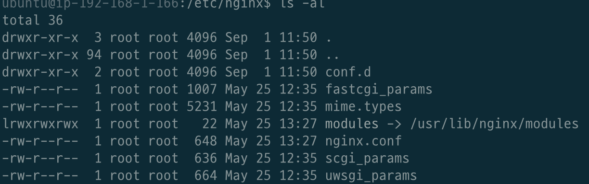

# 목차

<br>

- [목차](#목차)
- [개요](#개요)
- [한눈에 보는 예시](#한눈에-보는-예시)
- [NginX 설정](#nginx-설정)
  - [설정 파일의 역할](#설정-파일의-역할)
  - [메인 설정 파일의 구성](#메인-설정-파일의-구성)
    - [Core 모듈 설정](#core-모듈-설정)
    - [http](#http)
    - [server](#server)
    - [location](#location)
    - [events](#events)
- [Nginx 설정 예시](#nginx-설정-예시)
- [NginX 설정 반영](#nginx-설정-반영)
- [참고](#참고)

<br>

# 개요
이번 글에선 NginX 설정에 대한 간단히 다뤄보고자한다.

필자는 리버스 프록시와 로드 밸런싱을 구성하기위해서 NginX를 사용하게 되었고, 설정에 대한 기본적인 이해를 위해 글로 정리하게되었다.

우선 한눈에 볼 수 있는 전체적인 예시를 통해 설정 파일에 대한 구성을 눈에 익히고, NginX 설정에 대한 정리를 했다.

> 글의 내용은 대부분 [Nginx Wiki](https://www.nginx.com/resources/wiki/)를 바탕으로 작성되었다.

<br>

# 한눈에 보는 예시
한눈에 보는 예시의 목적은 NginX의 설정 파일이 어떻게 구성되어 있는가를 눈에 익히기 위함이다.

<br>

```bash
user       www www;  ## Default: nobody
worker_processes  5;  ## Default: 1
error_log  logs/error.log;
pid        logs/nginx.pid;
worker_rlimit_nofile 8192;

events {
  worker_connections  4096;  ## Default: 1024
}

http {
  include    conf/mime.types;
  include    /etc/nginx/proxy.conf;
  include    /etc/nginx/fastcgi.conf;
  index    index.html index.htm index.php;

  default_type application/octet-stream;
  log_format   main '$remote_addr - $remote_user [$time_local]  $status '
    '"$request" $body_bytes_sent "$http_referer" '
    '"$http_user_agent" "$http_x_forwarded_for"';
  access_log   logs/access.log  main;
  sendfile     on;
  tcp_nopush   on;
  server_names_hash_bucket_size 128; # this seems to be required for some vhosts

  server { # php/fastcgi
    listen       80;
    server_name  domain1.com www.domain1.com;
    access_log   logs/domain1.access.log  main;
    root         html;

    location ~ \.php$ {
      fastcgi_pass   127.0.0.1:1025;
    }
  }

  server { # simple reverse-proxy
    listen       80;
    server_name  domain2.com www.domain2.com;
    access_log   logs/domain2.access.log  main;

    # serve static files
    location ~ ^/(images|javascript|js|css|flash|media|static)/  {
      root    /var/www/virtual/big.server.com/htdocs;
      expires 30d;
    }

    # pass requests for dynamic content to rails/turbogears/zope, et al
    location / {
      proxy_pass      http://127.0.0.1:8080;
    }
  }

  upstream big_server_com {
    server 127.0.0.3:8000 weight=5;
    server 127.0.0.3:8001 weight=5;
    server 192.168.0.1:8000;
    server 192.168.0.1:8001;
  }

  server { # simple load balancing
    listen          80;
    server_name     big.server.com;
    access_log      logs/big.server.access.log main;

    location / {
      proxy_pass      http://big_server_com;
    }
  }
}
```

`nginx.conf`이 메인 설정 파일 역할을 하며, `include`를 통해 다른 설정 파일을 가져올 수 있다. (ex. `*.conf`, `*.types`등등)

> include는 별도의 파일에 설정을 기록해서 설정의 그룹핑, 재활용성을 높이는 방법이다.
> 
> 자세한 설정은 [여기](https://www.nginx.com/resources/wiki/start/topics/examples/full/)서 확인 가능하다.

<br>

# NginX 설정
이제 조금 더 자세히 NginX 설정에 대해서 알아보자.

> NginX를 설치하고나서 설정 파일들은 아래에 디렉토리에 위치한다.
> 
> * 컴파일을 통해 설치한 경우: `/usr/local/nginx/conf`
> * apt-get을 통해 설치한 경우: `/etc/nginx`
> * 도커를 통해 설치한 경우: `/etc/nginx`
> * 위 디렉토리에 없다면 직접 찾아봐도 좋다: `sudo find / -name nginx.conf`

<br>

## 설정 파일의 역할
<p align="center"> </p>

* `conf.d`: `nginx.conf`에서 불러들일 수 있는 파일을 저장한다. (include를 통해 불러옴)
* `nginx.conf`: 메인 설정 파일
* `fcgi.conf`: FastCGI 환경설정 파일
* `sites-enabled`: 활성화된 사이트들의 설정 파일들이 위치한다.
  * 아파치에서는 Virtual host 설정에 해당된다.
  * 기본적으로 존재하지 않을 수 있다.
  * 가상 호스팅을 사용할 경우 이 디렉토리를 직접 만들어서 사용한다.
* `sites-available`: 비활성화된 사이트들의 설정 파일들이 위치한다.
* `mime.types`: 파일 확장명과 MIME 타입 목록
* `proxy.conf`: 프록시 관련 환경 설정

<br>

## 메인 설정 파일의 구성
> 각 구성에 대한 이름을 기억하여 설정 지시어를 찾아 커스텀을 하면 된다.
```bash
user  nginx;
worker_processes  auto;

events {
    worker_connections  1024;
}


http {
    include       /etc/nginx/mime.types;

    log_format  main  '$remote_addr - $remote_user [$time_local] "$request" '
                      '$status $body_bytes_sent "$http_referer" '
                      '"$http_user_agent" "$http_x_forwarded_for"';

    access_log  /var/log/nginx/access.log  main;

    upstream app {
      server 192.168.1.110:8000;
    }

    server {
      listen 80;

      location / {
        proxy_pass http://app;
      }
    }

    include /etc/nginx/conf.d/*.conf;
}
```

<br>

### Core 모듈 설정
* `work_processes`와 같은 지시자 설정 파일 최상단에 위치하며, nginx의 기본적인 동작 방식을 정의한다.

<br>

### http
* `http` 블록은 `server`, `location`의 루트 블록이다.
* 여기서 설정된 값을 하위 블록들은 상속받는다.
  * 위 예시에서 `http`, `servler`, `location` 블록이 상속 계층구조를 갖고 있다.
  * `http`의 지시어는 `server`의 기본값이 되고, `server`의 지시어는 `location`의 기본 값이 되는 것.
  * 물론 하위 블록에서 선언된 지시어는 상위의 선언을 무시하고 적용된다.
* `http`블록은 여러 개를 사용할 수 있지만 관리상의 이슈로 한번만 사용하는 것을 권장한다.

<br>

### server
* `server` 블록은 하나의 웹사이트를 선언하는데 사용된다.
  * 가상 호스팅(Virtual Host)의 개념을 의미한다.
  * 하나의 서버로 `http://binghe819.com`과 `http://mark819.com`를 동시에 운영하고 싶은 경우 사용할 수 있는 방법이다.

<br>

### location
* `location` 블록은 `server` 블록 안에서 특정 URL을 처리하는 방법을 정의한다.
  * `http://binghe819.com`과 `http://mark819.com`로 접근하는 요청을 다르게 처리하고 싶을 때 사용된다.

<br>

### events
* `events`블록은 주로 네트워크의 동작방법과 관련된 설정을 정의한다.
  * `events`블록에서의 지시어는 `events`에서만 유효하며, 상속되지 않는다.

<br>

# Nginx 설정 예시
간단히 Nginx의 여러 가지 설정 예시를 살펴본다.

공식 문서에서 제공하는 여러가지 설정 레시피는 [여기](https://www.nginx.com/resources/wiki/start/#pre-canned-configurations)서 확인 가능하다.

<br>

**Docker를 사용한 설정**
> Docker를 사용하여 간단히 NginX를 띄우는 설정이다.
```bash
# Dockerfile
FROM nginx

COPY nginx.conf /etc/nginx/nginx.conf  
```
```bash
# nginx.conf
events {}

http {
  upstream app {
    server 172.17.0.1:8080;
  }

  server {
    listen 80;

    location / {
      proxy_pass http://app;
    }
  }
}
```
```bash
docker build -t nextstep/reverse-proxy .
docker run -d -p 80:80 nextstep/reverse-proxy
```

<br>

**또 다른 Full Example**

자세한 내용은 [여기](https://www.nginx.com/resources/wiki/start/topics/examples/fullexample2/)를 참고하자.

로그 설정, 프록시 설정등 위 설정파일을 참고하여 작성하면 좋을 듯 하여 기록해두었다.

<br>

**HTTPS 적용시킨 리버스 프록시 예시**
```bash
events {}

http {       
  upstream app {
    server 172.17.0.1:8080;
  }
  
  # Redirect all traffic to HTTPS
  server {
    listen 80;
    return 301 https://$host$request_uri;
  }

  server {
    listen 443 ssl;  
    ssl_certificate /etc/letsencrypt/live/[도메인주소]/fullchain.pem;
    ssl_certificate_key /etc/letsencrypt/live/[도메인주소]/privkey.pem;

    # Disable SSL
    ssl_protocols TLSv1 TLSv1.1 TLSv1.2;

    # 통신과정에서 사용할 암호화 알고리즘
    ssl_prefer_server_ciphers on;
    ssl_ciphers ECDH+AESGCM:ECDH+AES256:ECDH+AES128:DH+3DES:!ADH:!AECDH:!MD5;

    # Enable HSTS
    # client의 browser에게 http로 어떠한 것도 load 하지 말라고 규제합니다.
    # 이를 통해 http에서 https로 redirect 되는 request를 minimize 할 수 있습니다.
    add_header Strict-Transport-Security "max-age=31536000" always;

    # SSL sessions
    ssl_session_cache shared:SSL:10m;
    ssl_session_timeout 10m;      

    location / {
      proxy_pass http://app;    
    }
  }
}
```

<br>

# NginX 설정 반영
NginX를 한번 실행하고, 어떠한 명령어를 주기 위해서는 `-s` 파라미터를 꼭 붙여줘야 한다고 한다.

`nginx -s signal`

> s는 Signal의 약자로 NginX 서버에 특정 신호를 보낸다는 의미이다.

<br>

* stop - fast shutdown
* quit - graceful shutdown
  * 작업자 프로세스가 현재 요청 처리를 마칠 때까지 기다리면서 nginx 프로세스를 중지할 때 사용하는 명령어.
* reload - reloading the configuration file
  * nginx를 restart하지 않고 설정 파일만을 변경하는 명령어.
    1. 마스터 프로세스가 이 명령어를 받으면 새로운 구성 파일의 구문 유효성을 확인한다.
    2. 만약 유효성 문제가 없다면, 마스터 프로세스는 새 작업자 프로세스를 시작하고 이전 작업 프로세스에 종료를 요청하는 메시지를 보낸다.
    3. 만약 유효성 문제가 있다면, 마스터 프로세스가 변경 사항을 롤백하고 이전 구성으로 계속 작업한다.
    4. 유효성 문제가 없어 종료 명령을 받은 작업자 프로세스는 새 연결을 받지 않고, 현재 처리하고 있는 요청을 모두 처리하고 종료한다.
* reopen - reopening the log files

<br>

> 만약 PID를 통한 graceful한 종료를 원한다면 `kill -s QUIT $PID`를 사용하면 된다.

> 조금 더 자세한 내용은 [여기](https://www.nginx.com/resources/wiki/start/topics/tutorials/commandline/)를 참고하자.

# 참고
* https://www.nginx.com/resources/wiki/
* http://nginx.org/en/docs/beginners_guide.html
* https://opentutorials.org/module/384/4526