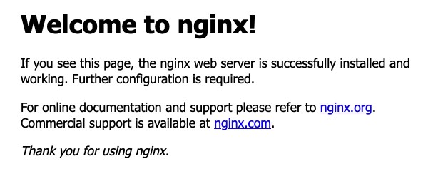

# 목차

<br>

- [목차](#목차)
- [개요](#개요)
- [Ubuntu에 NGINX 설치](#ubuntu에-nginx-설치)
- [도커에 NginX 설치](#도커에-nginx-설치)
- [참고](#참고)

<br>

# 개요
이번 글에선 NGINX를 설치하는 방법에 대해서 알아본다.

NGINX를 설치하는 방법은 크게 두 가지로 볼 수 있다.

1. OS에 직접 설치
2. Docker Container

이번 글에선 두 가지 방법 모두 알아본다.

<br>

# Ubuntu에 NGINX 설치
> Ubuntu 18.14 환경입니다.

지원하는 NginX Ubuntu는 [여기](https://nginx.org/packages/ubuntu/dists/)서 확인가능하다.

Ubuntu 버전과 매핑되는 NginX 버전은 [여기](https://wiki.ubuntu.com/Releases)서 확인가능하다.

> 18.14를 사용하는 필자는 Nginx버전 Bionic Beaver를 사용한다.

<br>

**1. NginX 레포지토리 source 추가**

적절한 버전의 NginX를 `/etc/apt/sources.list`에 다음과 같이 추가해준다.

```zsh
## $release를 우분투 버전에 따라 알맞게 수정해주세요.
deb https://nginx.org/packages/ubuntu/ $release nginx
deb-src https://nginx.org/packages/ubuntu/ $release nginx
```

ex. Ubuntu 18.14의 경우
```shell
deb https://nginx.org/packages/ubuntu/ bionic nginx
deb-src https://nginx.org/packages/ubuntu/ bionic nginx
```

<br>

**2. NginX 설치**

```zsh
sudo apt update
sudo apt install nginx
```

> 만약 NginX 레포지토리 업데이트 과정에서 다음과 같은 에러가 발생한다면 `W: GPG error: https://nginx.org/packages/ubuntu bionic InRelease: The following signatures couldn't be verified because the public key is not available: NO_PUBKEY $key`
> 
> 아래와 같이 실행하면 된다.
> 
> ```zsh
> ## $key부분을 GPG 에러에 나와있는 $key부분으로 대체하면 된다.
> sudo apt-key adv --keyserver keyserver.ubuntu.com --recv-keys $key
> sudo apt update
> sudo apt install nginx
> ```

<br>

**3. NginX 실행**

```zsh
sudo systemctl start nginx
```

nginx가 설치된 Ubuntu의 `Public IP:80`으로 접속하면 아래와 같이 잘 설치된 것을 알 수 있다.

<p align="center"> </p>

<br>

# 도커에 NginX 설치
이번엔 도커에 NginX를 설치하는 방법에 대해서 알아본다.

<br>

**1. nginx.conf 설정**

도커 컨테이너에 NginX를 띄우고 사용될 설정파일을 설정해준다.

```conf
events {}

http {
  upstream app {
    server 172.17.0.1:8080;
  }

  server {
    listen 80;

    location / {
      proxy_pass http://app;
    }
  }
}
```

<br>

**2. Dockerfile**

```
FROM nginx

COPY nginx.conf /etc/nginx/nginx.conf  
```

<br>

**3. 도커 빌드 및 실행**

```zsh
docker build -t nextstep/reverse-proxy .
docker run -d -p 80:80 nextstep/reverse-proxy
```


# 참고
- https://www.nginx.com/resources/wiki/start/topics/tutorials/install/
