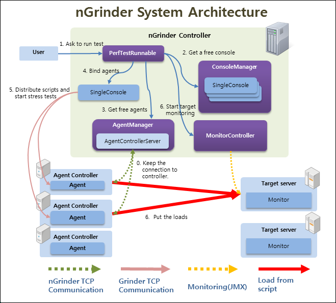
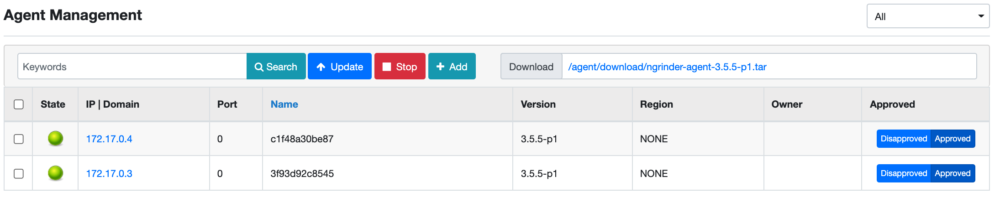

# 목차

<br>

- [목차](#목차)
- [들어가며](#들어가며)
- [nGrinder란?](#ngrinder란)
- [nGrinder 아키텍처](#ngrinder-아키텍처)
- [nGrinder 설치](#ngrinder-설치)
  - [선행 조건](#선행-조건)
  - [Controller 설치](#controller-설치)
  - [Agent 설치](#agent-설치)
- [마치며](#마치며)

<br>

# 들어가며
필자는 프로젝트에서 성능 진단을 위해 nGrinder를 사용한다.
> k6를 사용하지 않는 이유는 nGrinder가 시각화를 도와주기 때문이다.

미리 구축해둔 nGrinder 서버가 존재하지만, 다른 여러 성능 진단을 하기 위해 필자도 설치 방법과 맛보기용 Hello World를 작성하게 되었다.

이번 글은 우선 nGrinder의 개념과 아키텍처에 대해서 간략히 다루고, Docker를 통한 설치 방법에 대해서 다룬다.

<br>

# nGrinder란?
[nGrinder 공식 Repo](https://github.com/naver/ngrinder)에 들어가면 아래와 같이 나와있다.

> nGrinder is a platform for stress tests that enables you to execute script creation, test execution, monitoring, and result report generator simultaneously. The open-source nGrinder offers easy ways to conduct stress tests by eliminating inconveniences and providing integrated environments.

간단히 말해서, nGrinder는 테스트 스크립트를 작성하여 실행하고, 대상 서버도 모니터링하며 결과를 동시에 생성할 수 있게 도와주는 부하 테스트 도구이다.

내부적으로는 테스트 성능 테스트 툴인 Grinder를 사용한다.

<br>

# nGrinder 아키텍처
ngrinder는 JVM에서 동작하는 python인 jython 혹은 Groovy로 작성된 스크립트를 통해 여러 대의 장비에 테스트를 동작시키는 애플리케이션이다.

<p align="center"><br>https://github.com/naver/ngrinder</p>

아키텍처는 크게 3가지로 나눠볼 수 있다. 

* Controller
  * 테스트를 위한 웹 GUI를 제공한다.
  * 에이전트에게 신호를 보내 테스트 스크립트를 실행하며, nGrinder에 대한 전반적인 기능 관리를 제공한다.
  * 전반적인 작업 설정 및 컨트롤을 한다.
  * 테스트 결과를 수집해 시각화를 통해 통계를 보여준다.
* Agent
  * Controller의 명령을 받아 프로세스와 스레드를 동작시켜 Target 머신에 부하를 준다.
  * 두 가지 모드를 제공한다.
    * Agent 모드 -> Target에 부하를 발생시키는 모드. (a virtual user generator that creates loads.)
    * Monitor 모드 -> Target의 CPU 및 Memory등 리소스 사용량을 모니터링하는 모드.
* Target
  * 테스트 대상이 되는 머신.

> 더 자세한 내용은 [nGrinder 공식 Repo](https://github.com/naver/ngrinder)에서 찾아볼 수 있다.

<br>

# nGrinder 설치
> 설치 방법은 [nGrinder - Installation guide](https://github.com/naver/ngrinder/wiki/Installation-Guide)에서 쉽게 찾아볼 수 있다.

여러 대의 서버를 구축할 여건이 안된다면 하나를 사용하여 Docker를 사용하면 된다.

하지만, **Controller, Agent 그리고 테스트 서버를 모두 각각 구축하는 것이 좋다.** 

그 이유는 각각 서버의 온전한 역할을 수행하도록해야 정확한 수치를 산출할 수 있기 때문이다.

> 물론 큰 부하 테스트가 아니라면 한 대의 서버에 Docker를 이용하여 구축하여도 된다.

필자는 현재 무료로 사용가능한 EC2의 보안 설정으로 인해 부득이하게 Docker를 이용하여 설치한다.

만약 각각 따로 설치를 원한다면 [여기](./nGrinder%20각%20요소%20분리해서%20설치%20.md)를 참고하면 된다.

<br>

## 선행 조건
* nGrinder (controller, agent)를 설치하기 위해선, Oracle JDK 1.6 이상 혹은 OpenJDK 1.7이상의 JDK가 필요하다.
* 환경 변수 설정을 잘 설정해주어 어떤 환경에서도 자바가 잘 동작하도록 해주어야한다.
* nGrinder는 많은 포트를 이용하여 서로 통신한다. 방화벽으로 포트를 막아두었다면, 아래 포트를 열어두어야한다.
  * Agent: Any ==> Controller: 16001
    * Agent와 Controller가 잘 연결되었는지 확인하는 포트이다. 또한, 쉬고 있는 Agent가 Controller에게 테스트 가능 메시지를 전달하는 포트이기도하다.
  * Agent: Any ==> Controller: 12000 ~ 12000+(동시 테스트 허용수만큼)
    * 테스트 실행 및 종료, 컨트롤러의 각종 명령 및 통계를 수집하는 포트.
    * 컨트롤러가 부하 테스트시 Agent에게 명령을 할당하는 포트.
  * Controller: Any ==> Monitor: 13243
  * Controller ==> Public user: 톰캣설정에 따르지만 기본은 8080이다.

> 중요한 점은 Agent에서 Controller로 신호를 쏠 때 12000 ~ 12000번의 포트가 열려 있어야한다는 것이다.
> 
> 필자 실험 결과 12000이하면 연결 자체가 안된다. (포트를 변경하는 방법을 사용해도 안되서 뭔가 잘못 설정해준 것 같기도하다.)

<br>

## Controller 설치
> 자세한 내용은 [ngrinder Controller Docker Hub](https://hub.docker.com/r/ngrinder/controller/)에 나와있다.
```bash
$ docker pull ngrinder/controller
$ docker run -d -v ~/ngrinder-controller:/opt/ngrinder-controller --name controller \
-p 80:80 -p 16001:16001 -p 12000-12009:12000-12009 ngrinder/controller
```

<p align="center"> </p>

서버의 `{Public IP}:80`으로 접속하면 위와 같이 잘 나오는 것을 볼 수 있다.

초기 admin의 비밀번호는 admin이다.

<br>

## Agent 설치
> 본 설치는 한 대의 EC2에서 Docker를 이용하여 Controller와 Agent 모두를 설치한다.
```bash
$ docker pull ngrinder/agent
$ docker run -d --name agent --link controller:controller ngrinder/agent
```

<br>

이제 Controller의 `Agent Management`에 가면 아래와 같이 Agent가 잘 연결된 것을 볼 수 있다.

<p align="center"></p>

<br>

# 마치며
이제 nGrinder 부하 테스트 스크립트를 작성하고 부하 테스트를 진행하면 된다.
