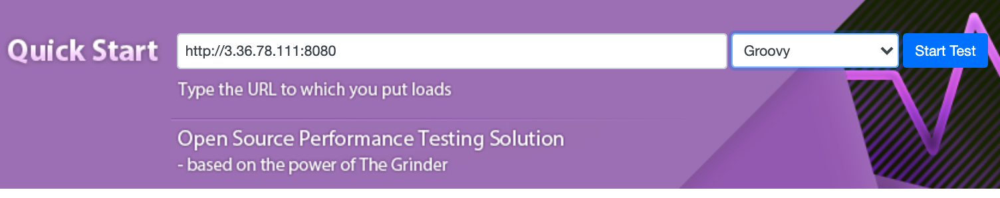
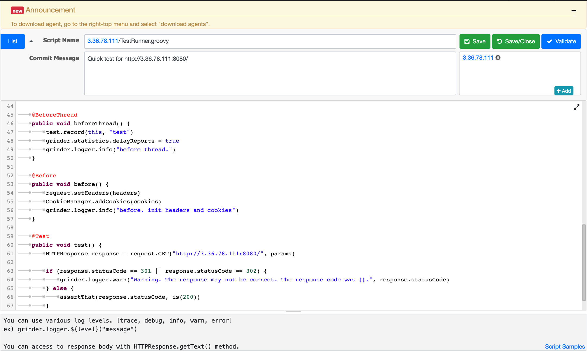

# 목차

<br>

- [목차](#목차)
- [들어가며](#들어가며)
- [테스트 Target 설정](#테스트-target-설정)
- [테스트 생성 및 스크립트 작성](#테스트-생성-및-스크립트-작성)
- [마치며](#마치며)

<br>

# 들어가며
이전 편은 nGrinder 설치였다.
* [Docker를 통한 nGrinder 설치 및 구성](./nGrinder%20Docker를%20이용한%20설치.md)
* [여러 대의 Linux를 통한 nGrinder 설치 및 구성](./nGrinder%20각%20요소%20분리해서%20설치%20.md)

<br>

이번 편은 nGrinder를 간단히 다뤄보는 Hello World 형식의 글이다.

nGrinder를 사용하여 어떻게 부하 테스트를 할 수 있는지 큰 그림을 그리기 위한 글이라고 생각하면 좋다.

공식 문서를 보며 한번 따라해보며, 큰 그림을 그리는 용이므로 더 정확한 정보는 [nGrinder Wiki - Quick Start](https://github.com/naver/ngrinder/wiki/Quick-Start)를 참고하길 바란다!

<br>

# 테스트 Target 설정
nGrinder Wiki에선 `www.google.com`을 대상으로 부하 테스트를 진행한다.

하지만, 한번 Script를 간단히 수정하기 위해서 본 글에선 [Spring Petclinic](https://github.com/spring-projects/spring-petclinic) 서버를 따로 띄워서 테스트하려고 한다.

테스트하고자하는 서버에서 아래와 같이 Spring-Petclinic을 띄워주면 된다.

```bash
$ git clone https://github.com/spring-projects/spring-petclinic
$ cd spring-petclinic
$ ./mvnw package
$ nohup java -jar target/*.jar &
```

<br>

# 테스트 생성 및 스크립트 작성
이제 간단히 부하 테스트를 진행해보자.

<p align="center"> </p>

위와 같이 URL을 작성하고 `Start Test`버튼을 누르면, 자동으로 테스트가 생성되며, 테스트 스크립트가 작성된다.

<br>

<p align="center"> </p>

테스트하고자하는 환경의 설정을 해주면 된다.

이와 관련된 내용은 [웹 성능 진단 지표](../웹%20성능%20진단/웹%20성능%20진단.md#부하테스트-목표-설정---중요)에 정리해두었다.

이를 참고하여 설정해주면 된다. 필자는 간단히 2개의 Agent에 각각 99명의 VUser를 설정하여 198명의 VUser로 설정하였다.

테스트 기간은 총 5분이다.

<br>

<p align="center"> </p>

그리고 스크립트를 작성한다. 물론 기본적으론 처음에 입력한 URL로 요청이 간다.

하지만 로그인(쿠키/세션 혹은 토큰)이나 파일 업로드등 여러가지 상황을 테스트하고자한다면 스크립트를 수정해야한다.

스크립트 관련한 자세한 내용은 [nGrinder Wiki - Groovy Script Structure](https://github.com/naver/ngrinder/wiki/Groovy-Script-Structure)가서 확인하면 된다.

> 추후에 시간이 된다면 이것도 정리하여 올릴 예정이다.

<br>

<p align="center"> </p>

이제 시작을 누르면 위와 같이 테스트가 돌아가는 것을 볼 수 있다.

> Agent State를 통해 Agent의 리소스 사용량도 볼 수 있다. 
> 
> Target도 Monitoring을 설정해주면 같이 나온다.

<br>

<p align="center"> </p>

설정된 시간동안의 테스트가 종료되면 위와 같이 그래프를 이용한 결과가 자세하게 나온다.

<br>

# 마치며
Hello World여서 그런지 굉장히 쉽다..

하지만 큰 그림을 위해 중요하게 짚고 넘어가야할 점은 다음과 같다.
* 테스트 Target 설정
* 테스트 지표 설정 (테스트에 대한 이해가 필요)
* Groovy를 통한 스크립트 + Groovy 스크립트 구조
* 테스트 실행
* 테스트 결과 분석

진짜 중요한 점은 당연히 테스트 결과를 분석하여 더 좋은 성능을 가진 서버를 구축하는 것이다!

그럼 안녕~
