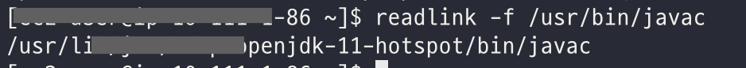

[nGrinder](https://github.com/naver/ngrinder) 공식 문서 내용을 바탕으로 작성된 글입니다.

# 목차

<br>

- [목차](#목차)
- [nGrinder 완벽가이드 (feat. 설치 및 사용법)](#ngrinder-완벽가이드-feat-설치-및-사용법)
- [1 nGrinder란?](#1-ngrinder란)
  - [1-1 nGrinder가 무엇인가](#1-1-ngrinder가-무엇인가)
  - [1-2 nGrinder 아키텍처](#1-2-ngrinder-아키텍처)
  - [1-3 nGrinder는 부하를 줄 때 어떤 HTTP 클라이언트를 사용하는가?](#1-3-ngrinder는-부하를-줄-때-어떤-http-클라이언트를-사용하는가)
- [2 nGrinder 설치](#2-ngrinder-설치)
  - [2-1 선행조건](#2-1-선행조건)
  - [2-2 Docker를 이용한 설치](#2-2-docker를-이용한-설치)
  - [2-3 직접 설치](#2-3-직접-설치)
- [3 nGrinder 성능 테스트 Hello World](#3-ngrinder-성능-테스트-hello-world)
  - [3-1 테스트 Target 설정](#3-1-테스트-target-설정)
  - [3-2 테스트 생성 및 스크립트 작성](#3-2-테스트-생성-및-스크립트-작성)
  - [3-3 성능 테스트시 체크 사항](#3-3-성능-테스트시-체크-사항)
- [참고](#참고)

<br>

# nGrinder 완벽가이드 (feat. 설치 및 사용법)
[nGrinder](https://github.com/naver/ngrinder)는 네이버가 Grinder를 바탕으로 개발해 오픈소스 소프트웨어로 공개한 서버 부하 테스트 플랫폼이다.

가상의 사용자 (vuser)를 모방해 타깃 서버에 부하를 가하는 형식이며, JVM에서 동작하는 python인 jython 혹은 Groovy로 작성된 스크리브를 통해 여러 대의 장비에 테스트를 동작시키는 애플리케이션이다.

각 스레드마다 타깃 서버에 요청은 HttpClient를 사용한다.

> 기존엔 HttpClient 4를 사용하다 nGrinder 3.5.5부터는 HttpClient 5를 사용한다.

이번 글은 nGrinder를 사용하는데 필요한 개념들은 정리하는 완벽 가이드형식의 글이다.

> 필자의 기준에서 완벽가이드일 뿐.. 정확하고 더 많은 정보는 [공식 문서](https://github.com/naver/ngrinder)를 참고하자.

<br>

# 1 nGrinder란?

<br>

## 1-1 nGrinder가 무엇인가

[nGrinder 공식 Repo](https://github.com/naver/ngrinder)에 들어가면 아래와 같이 나와있다.

> nGrinder is a platform for stress tests that enables you to execute script creation, test execution, monitoring, and result report generator simultaneously. The open-source nGrinder offers easy ways to conduct stress tests by eliminating inconveniences and providing integrated environments.

간단히 말해서, nGrinder는 테스트 스크립트를 작성하여 실행하고, 대상 서버도 모니터링하며 결과를 동시에 생성할 수 있게 도와주는 부하 테스트 도구이다.

부하 테스트를 통해서 순간적으로 많은 트래픽이 몰릴 경우 발생할 수 있는 장애나 오류 상황을 사전에 파악할 수 있다.

<br>

## 1-2 nGrinder 아키텍처
nGrinder는 JVM에서 동작하는 python인 jython 혹은 Groovy로 작성된 스크립트를 통해 여러 대의 장비에 테스트를 동작시키는 애플리케이션이다.

nGrinder의 내부 엔진은 Grinder를 기반으로 동작하며, Grinder의 콘솔과 에이전트를 각각 여러 기능을 확장해 여러 동시 테스트를 가능한 nGrinder의 컨트롤러와 에이전트로 만들었다.

<br>

💁‍♂️ **동작 방식과 아키텍처**

<p align="center"><br>https://github.com/naver/ngrinder</p>

위와 같이 nGrinder 아키텍처는 크게 3가지로 나눠볼 수 있다. 

* Controller
  * 테스트를 위한 웹 GUI를 제공한다.
  * 에이전트에게 신호를 보내 테스트 스크립트를 실행하며, nGrinder에 대한 전반적인 기능 관리를 제공한다.
  * 전반적인 작업 설정 및 컨트롤을 한다.
  * 테스트 결과를 수집해 시각화를 통해 통계를 보여준다.
  * 테스트 스트립트를 수정할 수 있다.
* Agent
  * Controller의 명령을 받아 프로세스와 스레드를 동작시켜 Target 머신에 부하를 준다.
  * 두 가지 모드를 제공한다.
    * Agent 모드 -> Target에 부하를 발생시키는 모드. (a virtual user generator that creates loads.)
    * Monitor 모드 -> Target의 CPU 및 Memory등 리소스 사용량을 모니터링하는 모드.
* Target
  * 테스트 대상이 되는 머신.

실제 타깃에 부하를 주는 에이전트가 시작되면 컨트롤러에 연결을 시도한다. 그런 다음 컨트롤러의 `AgentControllerServer` 구성 요소에 연결된다.

`AgentControllerServer`는 에이전트 풀과 유사하며, 사용자가 성능 테스트를 시작할 때마다 에이전트를 조율하는 새 콘솔이 생성되고 `AgentControllerServer`에서 필요한 수의 에이전트를 할당받게된다.

콘솔(Grinder의 콘솔과 구분하기위해 `SingleConsole`이란 용어를 사용한다고한다.)은 테스트 스크립트와 테스트 리소스를 할당된 여러 에이전트에 보내고 테스트가 끝날 때까지 테스트 흐름을 제어한다.

테스트가 끝나면 사용된 에이전트는 나중에 다른 테스트에서 사용할 수 있도록, 다시 `AgentControllerServer`로 반환된다.

이때, `SingleConsole`도 `ConsoleManager`로 반환된다.

<br>

💁‍♂️ **nGrinder와 Grinder의 차이점**

nGrinder와 Grinder의 가장 큰 차이점은 nGrinder는 컨트롤러에 여러 콘솔 인스턴스와 에이전트를 유지한다는 점이다.

각 콘솔은 서로 독립적이며 모두 동시에 실행할 수 있다. 여러 에이전트를 미리 첨부할 수 있으며, 요청시 언제든지 지정할 수도 있다.

Grinder와 달리 nGrinder는 에이전트 머신의 활용도를 극대화했다고 볼 수 있다.

> 더 자세한 내용은 [nGrinder 공식 Repo](https://github.com/naver/ngrinder)에서 찾아볼 수 있다.

<br>

## 1-3 nGrinder는 부하를 줄 때 어떤 HTTP 클라이언트를 사용하는가?
nGrinder의 에이전트를 실제 타킷 서버에 부하를 줄 때 Java의 HttpClient를 사용한다.

당연히 부하 테스트 플랫폼이니 특성상 상당히 많은 스레드를 사용해 HTTP 요청을 발생시킨다. 하나의 스레드는 하나의 가상 사용자의 역할을 한다고 볼 수 있다.

물론 동기 방식을 사용하는 HttpClient 4 특성상 스레드 수가 많아질수록 TPS 증가가 미미해진다는 한계가 있어, nGrinder 3.5.5부터는 완벽히 비동기로 동작하는 HttpClient 5로 전환했다고한다.

> 이와 관련해서 [자세히 정리된 글](https://d2.naver.com/helloworld/0881672)을 참고하자!

<br>

# 2 nGrinder 설치
nGrinder의 개념과 아키텍처에 대해서 간단히 알아보았다면, 이제 nGrinder를 설치하는 방법에 대해서 알아본다.

> 설치 방법은 [nGrinder - Installation guide](https://github.com/naver/ngrinder/wiki/Installation-Guide)에서 쉽게 찾아볼 수 있다.

설치하는 방법은 크게 Docker로 설치하는 방법과 서버에 직접 설치하는 방법이있다.

> **nGriner는 3.5.8 버전을 기준으로 설치한다.**

<br>

## 2-1 선행조건
nGrinder는 도커와 직접 설치방식이 존재하는데, 둘 다 아래 선행 조건을 지켜주어야한다.

* nGrinder (controller, agent)를 설치하기 위해선, Oracle JDK 1.6 이상 혹은 OpenJDK 1.7이상의 JDK가 필요하다.
* 환경 변수 설정을 잘 설정해주어 어떤 환경에서도 자바가 잘 동작하도록 해주어야한다.
* nGrinder는 많은 포트를 이용하여 서로 통신한다. 방화벽으로 포트를 막아두었다면, 아래 포트를 열어두어야한다.
  * Agent: Any ==> Controller: 16001
    * Agent와 Controller가 잘 연결되었는지 확인하는 포트이다. 또한, 쉬고 있는 Agent가 Controller에게 테스트 가능 메시지를 전달하는 포트이기도하다.
  * Agent: Any ==> Controller: 12000 ~ 12000+(동시 테스트 허용수만큼)
    * 테스트 실행 및 종료, 컨트롤러의 각종 명령 및 통계를 수집하는 포트.
    * 컨트롤러가 부하 테스트시 Agent에게 명령을 할당하는 포트.
  * Controller: Any ==> Monitor: 13243
  * Controller: Any ==> 9010 ~ 9019: Agent에서 Controller에 연결하기위해 사용되는 포트.
  * Controller ==> Public user: 톰캣설정에 따르지만 기본은 8080이다.
    * Docker와 직접 설치모두 Controller UI의 포트를 직접 수정해줄 수도 있다.

> 중요한 점은 Agent에서 Controller로 신호를 쏠 때 12000 ~ 12000번의 포트가 열려 있어야한다는 것이다.
> 
> 필자 실험 결과 12000이하면 연결 자체가 안된다. (포트를 변경하는 방법을 사용해도 안되서 뭔가 잘못 설정해준 것 같기도하다.)

<br>

## 2-2 Docker를 이용한 설치

Docker를 이용하면 간단히 Controller와 Agent를 설치할 수 있다.

가능한 Controller와 Agent 그리고 테스트 서버 모두 각각 서로 다른 물리적 서버에서 구축해줘야한다.

그레야 각각 서버의 온전한 역할을 수행하도록 함으로써 정확한 성능 테스트의 수치를 산출 할 수 있다.

> 이는 아래에서 다룰 직접 설치 방식에서도 동일하게 적용된다.

<br>

1️⃣ **Controller를 설치한다.**

우선 Docker Image를 가져온다.
```shell
$ docker pull ngrinder/controller:3.5.8
```

Controller 컨테이너를 띄워준다.

```shell
$ docker run -d -v ~/ngrinder-controller:/opt/ngrinder-controller --name controller -p 80:80 -p 16001:16001 -p 12000-12009:12000-12009 ngrinder/controller:3.5.8
```
* 컨트롤러는 테스트 기록 및 구성 데이터를 유지하기 위해 `/opt/ngrinder-controller`아래에 데이터를 마운트하여 저장한다.
  * 그러므로 Docker를 종료후 다시 실행했을 때 기존의 기록과 데이터를 모두 유지하려면 매번 해당 디렉토리를 마운트해줘야한다.

<p align="center"> </p>

서버의 `{Public IP}:80`으로 접속하면 위와 같이 잘 나오는 것을 볼 수 있다.

초기 `admin`의 비밀번호는 `admin`이다.

<br>

2️⃣ **Agent를 설치한다.**

> Agent는 Controller와 물리적으로 서로 다른 서버에 동작시키는게 좋으므로, 다른 서버에서 Agent 설치를 진행한다.

Docker Image를 가져온다.

```shell
$ docker pull ngrinder/agent:3.5.8
```

Agent를 설치한다.

```shell
$ docker run -d -v ~/ngrinder-agent:/opt/ngrinder-agent --name agent ngrinder/agent:3.5.8 {Controller Web Public IP}:{Controller Web Public Port}
```

설치하고나면 `Controller UI > Agent Management` 창에서 아래와 같이 Agent가 연결된 것을 볼 수 있다.

<p align="center"> </p>

만약 연결이 안되었다면 네트워크를 잘 설정해주자. (서로 접속 가능한 네트워크 상에있는지? 필요한 Port는 열려있는지? 등등.)

<br>

## 2-3 직접 설치
이번엔 Docker가 아닌 각 서버에 Controller와 Agent를 직접 설치해본다.

<br>

1️⃣ **Controller를 설치한다.**

우선 필요한 Controller 버전을 [여기](https://github.com/naver/ngrinder/releases)에서 확인하고 다운받는다.

```shell
# Controller 실행시킬 서버 접속후
$ wget {설치하고자하는 Controller 버전}.war
```

설치가 완료되었다면 아래 사항들을 확인한다.

```shell
# 1. 자바 설치여부 확인
$ java -version

# 2. JDK 11 설치 (설치가 안되었다면 설치해준다.)
$ sudo tum install java-1.8.0-openjdk

# 3. 환경변수 확인
$ readlink -f /usr/bin/javac
```
자바가 제대로 설치되어있다면 환경변수 확인시 아래와 같이 콘솔에 출력된다.

<p align="center"> </p>

```shell
# 4. 환경변수 설정.
$ vim /etc/profile

# 위에서 확인한 환경변수를 넣어준다. 이때 /bin/javac 부분은 빼고 넣어준다.
export JAVA_HOME=/usr/lib/jvm/adoptopenjdk-11-hotspot

# 저장후 변경내용 반영
$ source /etc/profile
```

위 사항들을 모두 확인했다면 아래와 같이 다운 받은 Controller를 실행해주면 된다.

```shell
$ java -Djava.io.tmpdir=${NGRINDER_HOME}/lib -XX:MaxPermSize=200m -jar  ngrinder-controller-3.4.war --port 80
```
* `${NGRINDER_HOME}`은 각자 알아서 원하는 디렉토리를 환경변수를 저장해주면된다.

실행하면 아래와 같이 스프링이 띄워지는 것을 볼 수 있다.

<p align="center"> </p>

그리고 해당 주소로 접속해보면 아래와 같이 nGrinder UI가 잘 노출된다.

<p align="center"> </p>

초기 `admin`의 비밀번호는 `admin`이다.

<br>

2️⃣ **Agent를 설치한다.**

nGrinder 3.3 이후버전부터는 Controller에서 agent 실행 파일을 바로 다운 받을 수 있다.

해당 실행 파일에는 Controller에 접속하기위한 설정이 이미 되어있다.

**1. Controller에서 아래와 같이 Agent를 다운받는다.**

<p align="center"> </p>

위와 같이 Controller의 `Download Agent`의 링크 주소를 복사하고 Agent 서버에서 아래와 같이 다운받아주면 된다.

```shell
# Agent 다운로드
$ wget {controller에서 복사한 주소 링크}

# 압축 풀기
$ sudo tar -xvf download
```
압축을 풀면 아래와 같이 나온다.

<p align="center"> </p>

<br>

**2. 설정파일 확인**

리눅스 기준 `run_agent.sh`으로 Agent를 실행할 수 있다.

하지만 그전에 설정파일을 확인해보는 것이 좋다.

* `~/.ngrinder_agent`에 `agent.conf`파일이 존재하는지 확인한다.
  * 만약 없다면 -> 다운받은 폴더의 `__agent.conf`를 `~/.ngrinder_agent/agnet.conf`에 복사해준다.
  * 만약 있다면 -> 그대로 `run_agent.sh`를 통해 실행해주면된다.

해당 설정파일은 아래와 같이 구성되어있다.

<p align="center"> </p>

만약 커스텀이 필요하면 해당 값들을 수정해주면 된다.

<br>

**3. Agent 실행**

```shell
run_agent.sh # for linux / mac

run_agent_bg.sh # If you want to run it in the background for linux / mac
```

문제없이 실행되었다면 아래와 같이 Agent가 Controller와 잘 연결된 것을 볼 수 있다.

<p align="center"> </p>

<br>

**4. Agent 서버 자원 limit 확인 - linux**

Agent를 리눅스에서 실행한다면, 자원의 limit을 확인하여 필요시 limit을 풀어줄 필요가있다.

```shell
$ ulimit -a

core file size          (blocks, -c) 0
data seg size           (kbytes, -d) unlimited
scheduling priority             (-e) 0
file size               (blocks, -f) unlimited
pending signals                 (-i) 30446
max locked memory       (kbytes, -l) unlimited
max memory size         (kbytes, -m) unlimited
open files                      (-n) 65535
pipe size            (512 bytes, -p) 8
POSIX message queues     (bytes, -q) 819200
real-time priority              (-r) 0
stack size              (kbytes, -s) 10240
cpu time               (seconds, -t) unlimited
max user processes              (-u) unlimited
virtual memory          (kbytes, -v) unlimited
file locks                      (-x) unlimited
```
만약 `max user processes`와 `open files`값이 작다면, nGrinder 권고사항에 따라 적어도 10000 이상으로 설정해주는 것이 좋다.

`/etc/security/limits.conf`파일에서 수정해주면된다.

<br>

# 3 nGrinder 성능 테스트 Hello World
마지막으로 nGrinder를 간단히 다뤄보는 Hello World식 부하 테스트를 진행해본다.

> 더 정확한 정보는 [nGrinder Wiki - Quick Start](https://github.com/naver/ngrinder/wiki/Quick-Start)를 참고.

<br>

## 3-1 테스트 Target 설정
nGrinder Wiki에선 `www.google.com`을 대상으로 부하 테스트를 진행한다.

이번 글에선 간단히 다른 서버에 [Spring Petclinic](https://github.com/spring-projects/spring-petclinic) 서버를 따로 띄워서 테스트해본다.

테스트하고자하는 서버에서 아래와 같이 Spring-Petclinic을 띄워주면 된다.

```bash
$ git clone https://github.com/spring-projects/spring-petclinic
$ cd spring-petclinic
$ ./mvnw package
$ nohup java -jar target/*.jar &
```

<br>

## 3-2 테스트 생성 및 스크립트 작성
이제 간단히 부하 테스트를 진행해보자.

<p align="center"> </p>

위와 같이 URL을 작성하고 `Start Test`버튼을 누르면, 자동으로 테스트가 생성되며, 테스트 스크립트가 작성된다.

<br>

<p align="center"> </p>

테스트하고자하는 환경의 설정을 해주면 된다.

* Agent: test로 사용할 agent 개수.
* Vuser per agent: agent별 Vuser 수.
* Script: 부하 테스트를 진행할 스크립트 선택. (타겟 서버에 어떻게 호출할지 설정.)
* Duration: 얼마동안 부하 테스트를 진행할지 선택.
* Run Count: Vuser별 몇 개를 타겟 서버에 호출할지 지정.
* Enable Ramp-up: 부하 테스트시 점점 부하를 줄것인지 선택.
  * 체크하면 process를 증가시킬 것인지, thread를 증가시킬 것인지 선택할 수 있다.
* Initial Count: 처음 시작할 process/thread 수 (몇부터 시작하여 점점 증가시킬것인지)
* Incremental Step: process/thread를 몇 개씩 증가시킬 것인지
* Initial Sleep Time: 초기 대기시간 (얼마나 쉬고 시작할 것인지)
* Interval: 어느정도 주기로 점차 증가시킬 것인지 설정.

<br>

<p align="center"> </p>

그리고 스크립트를 작성한다. 물론 기본적으론 처음에 입력한 URL로 요청이 간다.

하지만 로그인(쿠키/세션 혹은 토큰)이나 파일 업로드등 여러가지 상황을 테스트하고자한다면 스크립트를 수정해야한다.

스크립트 관련한 자세한 내용은 [nGrinder Wiki - Groovy Script Structure](https://github.com/naver/ngrinder/wiki/Groovy-Script-Structure)가서 확인하면 된다.

> 필요에 따라 스크립트를 수정해주면된다.

<br>

<p align="center"> </p>

이제 시작을 누르면 위와 같이 테스트가 돌아가는 것을 볼 수 있다.

> Agent State를 통해 Agent의 리소스 사용량도 볼 수 있다. 
> 
> Target도 Monitoring을 설정해주면 같이 나온다.

<br>

<p align="center"> </p>

설정된 시간동안의 테스트가 종료되면 위와 같이 그래프를 이용한 결과가 자세하게 나온다.

<br>

💁‍♂️ **각 지표별 설명**

* Total Vusers: Vusers 수
* TPS: 평균 TPS (초당 처리량이므로 높을 수록 좋다.)
* Peak TPS: 최고 TPS
* Mean Test Time: 평균 테스트시간 (평균 Response Time)
* Executed Tests: 테스트 실행 횟수
* Successful Tests: 테스트 성공 횟수
* Errors: 에러 횟수
* Run time: 테스트 실행시간

<br>

## 3-3 성능 테스트시 체크 사항
Hello World여서 그런지 굉장히 쉽다..

하지만 큰 그림을 위해 중요하게 짚고 넘어가야할 점은 다음과 같다.
* 테스트 Target 설정
* 테스트 지표 설정 (테스트에 대한 이해가 필요)
* Groovy를 통한 스크립트 + Groovy 스크립트 구조
* 테스트 실행
* 테스트 결과 분석

진짜 중요한 점은 당연히 테스트 결과를 분석하여 더 좋은 성능을 가진 서버를 구축하는 것이다!

<br>

# 참고
* https://github.com/naver/ngrinder
