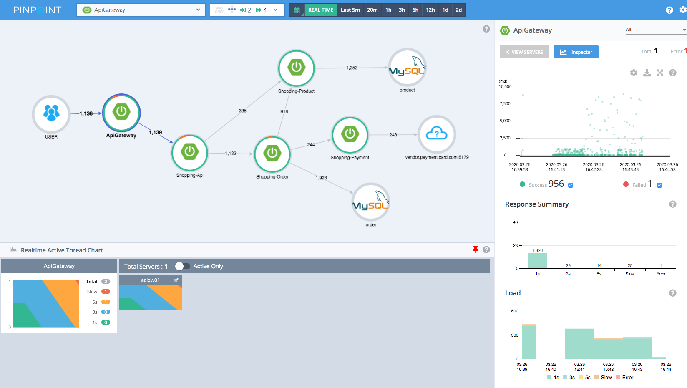
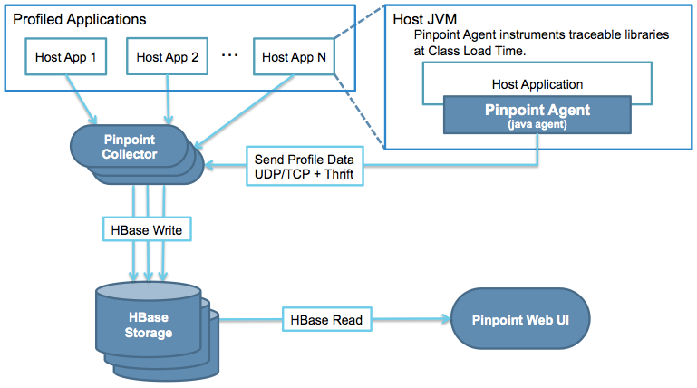
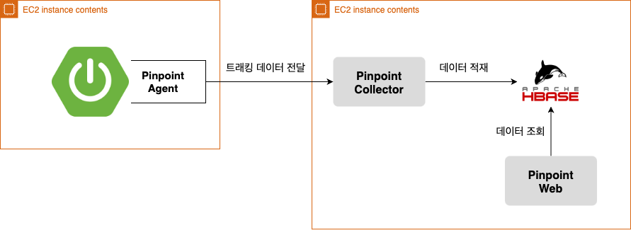
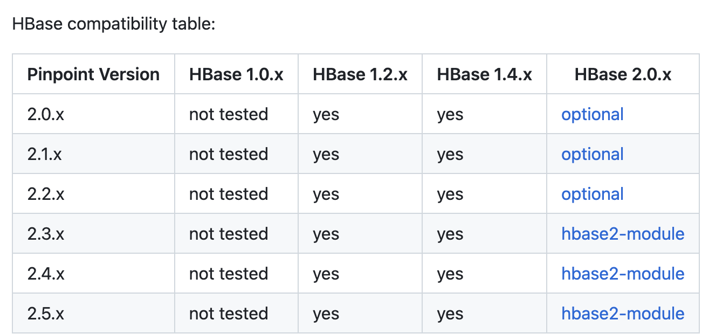
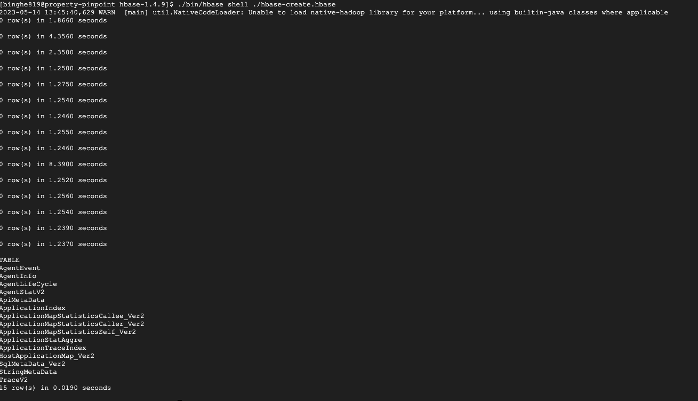
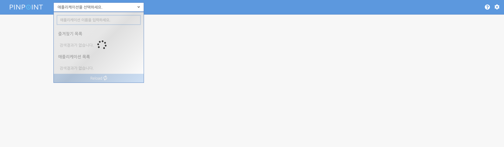
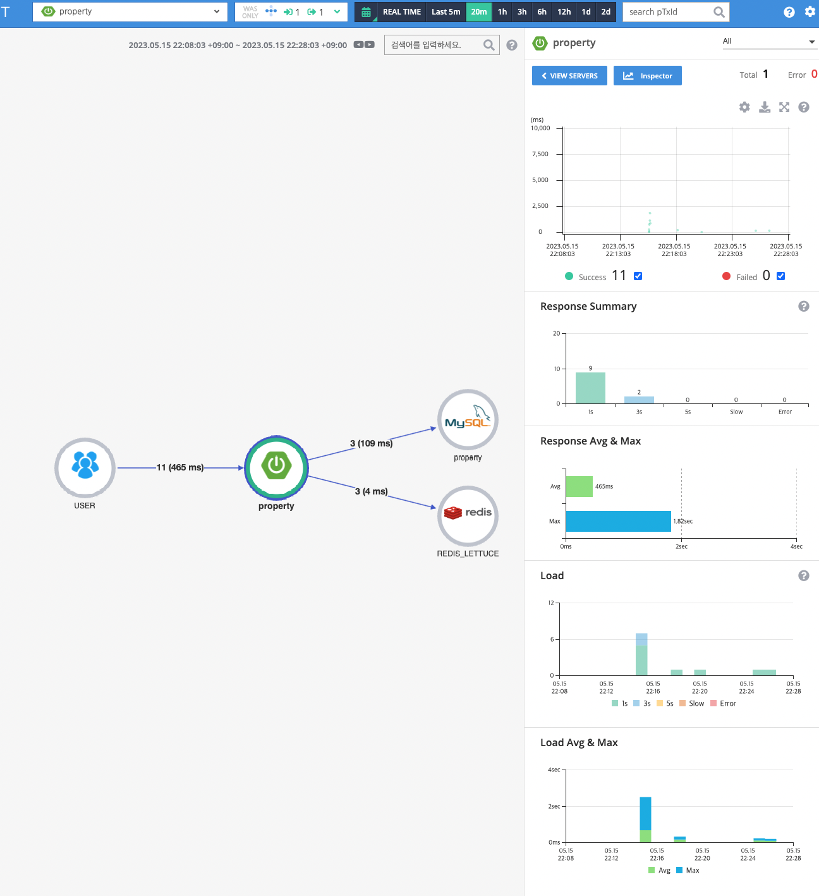

# 목차

<br>

- [목차](#목차)
- [Pinpoint 소개 및 적용](#pinpoint-소개-및-적용)
- [1 Pinpoint란](#1-pinpoint란)
- [2 Pinpoint 아키텍처](#2-pinpoint-아키텍처)
- [3 Pinpoint 설치 및 적용](#3-pinpoint-설치-및-적용)
  - [3-1 HBase](#3-1-hbase)
  - [3-2 핀포인트 모듈 빌드 (optional)](#3-2-핀포인트-모듈-빌드-optional)
  - [3-2 Collector](#3-2-collector)
  - [3-3 Web](#3-3-web)
  - [3-4 Agent](#3-4-agent)
- [정리](#정리)
- [참고](#참고)

<br>

# Pinpoint 소개 및 적용
서버를 운영 및 관리하면서 다양한 에러와 장애를 마주하게된다. 

이럴때 꼭 필요한 것인 모니터링 도구이며, 자바진영에선 다양한 분산 환경 APM (Application Performance Monitoring) 도구가 존재한다.

Newrelic, Datadog, ELK등등. 필자는 여러가지 모니터링 도구를 사용하지만, 보통 장애대응이나 병목 지점을 해결하기위해 Pinpoint를 많이 활용한다.

이번 글은 자바 기반의 대규모 분산 시스템의 성능을 분석하고 문제를 진단 및 처리하는 플랫폼인 Pinpoint를 소개하고 직접 적용해본다.

<br>

# 1 Pinpoint란

<br>

💁‍♂️ **Pinpoint 소개**

Pinpoint는 [Google의 Dapper](https://research.google/pubs/pub36356/)에 영감을 받아 개발된 자바/PHP 기반의 대용량 분산 시스템을 모니터링하는 툴이다.

Pinpoint는 분산된 애플리케이션 서버에서 트랜잭션을 추적하여 시스템의 전체 구조와 구성 요소가 상호 연결되는 방식을 분석하는 데 도움이 되는 솔루션을 제공한다.

<br>

🤔 **분산 시스템이란 어떤 것을 말하는것인가?**

분산 시스템이란 공동의 목표를 달성하기 위해 여러 개의 단일 컴퓨팅 노드에서 컴퓨팅 리소스를 활용하는 방식이다.

즉, 여러 컴퓨터들의 처리 능력을 이용하여 메시지를 하나에서 다른 하나로 보냄으로써 거대한 계산 문제를 해결하는 분산처리 모델을 뜻한다.

조금 어렵게 느껴지는데.. 예를 들자면.

구글에서 검색을 요청하면, 거대한 구글 시스템내에서 스펠링을 체크하고, 검색어에따른 광고를 찾고, 검색어에대한 이미지, 비디오를 찾아준다.

각각의 결과는 모두 하나의 컴퓨팅 노드에서 나오는 것이 아닌, 시스템내에서 네트워크를 이용하여 각각의 역할을 수행하는 단일 컴퓨터에 요청하여 결과를 얻어낸다.

<br>

💁‍♂️ **Pinpoint는 이러한 분산 시스템을 쉽게 트래킹하게해준다.**

<p align="center"><br>출처: https://pinpoint-apm.gitbook.io/pinpoint/ </p>

Pinpoint는 위와 같이 각 노드 (게이트웨이서버, 쇼핑상품, 쇼핑주문, 쇼핑결제, DB, 외부서버)등의 연결고리를 그림으로 쉽게 표현해주며, 요청량, 레이턴시등등 다양한 지표를 쉽게 트래킹할 수 있도록 제공해준다.

<br>

💁‍♂️ **이외에도 Pinpoint는 다양한 장점을 가진다.**

* 실시간으로 분산 시스템 노드들의 상태를 모니터링할 수 있다.
* 별도의 로그를 남기지않고 매트랜잭션마다 코드레벨을 트래킹할 수 있다.
* 최소한의 서버 성능 영향을 끼친다. (대략 3%의 리소스 사용량을 증가시킨다고한다.)
* 비교적 레이턴시가 높은 오래걸리는 API를 쉽게 발견할 수 있다.
* 다양한 노드의 모니터링을 제공한다. (Redis, MongoDB, MySQL 등등)

<br>

# 2 Pinpoint 아키텍처

<br>

<p align="center"><br>출처: https://pinpoint-apm.gitbook.io/pinpoint/want-a-quick-tour/overview </p>

Pinpoint를 구성하는 가장 중요한 모듈은 4가지이다.

* Pinpoint Agent
  * 애플리케이션별로 모니터링 정보를 Collector로 전달한다.
  * JVM의 javagent 옵션을 활용하여, 클래스 로더가 클래스를 읽어올 때 동적으로 바이트코드를 조작한다.
    * 즉, Pinpoint 도입으로인한 애플리케이션 내의 코드는 수정할 필요가없다.
* Pinpoint Collector
  * Agent로부터 받은 정보를 HBase에 적재한다.
* HBase
  * 대용량의 Agent 모니터링 데이터를 저장한다.
  * 코드 수준의 정보를 추적하기때문에 트래픽이 많아지면 저장하는 데이터 양도 기하급수적으로 증가하게된다. 이런 대용량을 저장하기위해 하둡가빈의 분산 데이터베이스인 HBase를 사용한다.
* Pinpoint Web
  * HBase에 적재된 데이터를 Web을 통해 쉽게 모니터링할 수 있게해준다.

<br>

# 3 Pinpoint 설치 및 적용
이제 실제 애플리케이션에 Pinpoint를 설치 및 적용해본다.

<p align="center"> </p>

본래 운영 환경의 서비스를 제공하는 애플리케이션은 대용량 트래픽을 감당해야하기에, 각 모듈들을 별도의 서버에 구축해야한다.

다만, 이번 글은 학습용이므로, 위와 같이 하나의 EC2에 HBase, Collector, Web을 모두 설치하고, 기존의 애플리케이션 서버를 운영하고 EC2에 Agent와 애플리케이션을 띄워본다.

<br>

💁‍♂️ **준비 - 자바 설치**

Pinpoint의 Collector과 Web이 자바 기반으로 동작하기에 자바는 기본적으로 설치되어있어야한다.

이번 글에선 Pinpoint는 2.3.1을 사용하며, HBase는 호환되는 1.4.9를 사용한다.

해당 버전에 맞는 JDK는 8버전이므로, JDK 8버전을 설치해준다.

<details>
  <summary>JDK 1.8 설치 및 환경 설정</summary>
  
  ---
  
  ```bash
    $ sudo yum install java-1.8.0-openjdk -y
    $ sudo yum install java-1.8.0-openjdk-devel -y

    # 환경변수 설정
    $ readlink -f /usr/bin/java

    $ sudo vi /etc/profile

    # 맨 아래에 추가
    export JAVA_HOME=/usr/lib/jvm/java-1.8.0-openjdk-1.8.0.362.b08-1.el7_9.x86_64/jre
    export PATH=$PATH:$JAVA_HOME/bin
    export CLASSPATH=$JAVA_HOME/lib:$JAVA_HOME/lib/tools.jar

    # 적용
    source /etc/profile

    # 확인
    echo $JAVA_HOME 

    # 적용
    source /etc/profile

    # 확인
    echo $JAVA_HOME 
  ```
  
  ---
</details>

<br>

## 3-1 HBase
Pinpoint는 Agent로부터 받은 데이터를 Collector가 HBase에 저장한다.

그리고 Web이 HBase의 데이터를 조회한다.

<br>

💁‍♂️ **HBase 호환되는 버전 확인**

Pinpoint를 설치하기위해선 호환되는 HBase를 다운해야한다.

<p align="center"><br>출처: https://github.com/pinpoint-apm/pinpoint </p>

이번 글에서 설치하는 Pinpoint는 [2.3.3](https://github.com/pinpoint-apm/pinpoint/releases/tag/v2.3.3)이므로 가능한 Yes가 명시된 `HBase 1.4.x` 설치한다.

<br>

💁‍♂️ **HBase 설치 및 스키마 생성**

1. HBase 다운 및 설치한다.
   ```bash
   # 다운로드
   $ wget http://archive.apache.org/dist/hbase/1.4.9/hbase-1.4.9-bin.tar.gz
   $ tar -zxvf hbase-1.4.9-bin.tar.gz

   # 실행
   $ cd hbase-1.4.9
   $ ./bin/start-hbase.sh

   # 실행 확인
   $ ps -aux | grep hbase
   ```
2. HBase 스키마를 생성한다.
   * HBase의 설치와 실행이 모두 끝났다면, 이제 Pinpoint 정보를 담을 테이블을 만들어준다.
   * 이와 관련해서는 이미 Pinpoint Github에 스크립트가 존재한다. 아래와 같이 버전에 맞는 스크립트를 다운받아 실행해주면된다.
   ```bash
   $ wget https://raw.githubusercontent.com/pinpoint-apm/pinpoint/{branch}/hbase/scripts/hbase-create.hbase
   $ ./bin/hbase shell ./hbase-create.hbase
   ```

스키마가 아래와 같이 문제없이 생성되었다면, 이제 HBase의 설치및 실행은 완료다.

<p align="center"> </p>

<br>

## 3-2 핀포인트 모듈 빌드 (optional)
앞서 말했듯이, 핀포인트는 Collector와 Web, Agent로 구성되는데 모두 JVM기반의 JAVA로 실행된다.

당연히 Github에 올라와있는 JAVA 코드를 빌드해주어야하는데, 핀포인트는 미리 빌드된 jar를 제공한다.

그러므로 꼭 빌드를 하지 않아도된다. 실제 공식문서에도 직접 빌드하는 것보단 빌드된 파일 사용을 추천한다.

예를들어, 2.3.3의 release된 빌드 파일은 [여기](https://github.com/pinpoint-apm/pinpoint/releases/tag/v2.3.3)에서 확인할 수 있다.

만약 직접 빌드해야될 상황이라면 [공식문서](https://pinpoint-apm.gitbook.io/pinpoint/getting-started/installation#2.-building-pinpoint)를 참고하여 빌드해주면된다.

> 이번 글에선 직접 빌드하진 않는다. 
> 
> JDK를 7부터 버전별로 환경설정해주어야하는데.. 굳이 할 필요 없어서 직접하진 않는다.

<br>

## 3-2 Collector

Collector는 Agent로부터 받은 정보를 HBase에 적재하는 역할을한다.

<br>

💁‍♂️ **빌드된 JAR 다운 및 실행**

```bash
# 빌드된 Pinpoint-Collector 2.3.3 jar 파일 다운
$ wget https://github.com/pinpoint-apm/pinpoint/releases/download/v2.3.3/pinpoint-collector-boot-2.3.3.jar

# 실행권한 부여
$ chmod +x pinpoint-collector-boot-2.3.3.jar

# 실행
$ nohup java -jar -Dpinpoint.zookeeper.address=localhost pinpoint-collector-boot-2.3.3.jar >/dev/null 2>&1 &
```
* `nohup ~ >/dev/null 2>&1 &`
  * `nohup.out` 로그 파일 생성 없고, 세션 종료도 없이 백그라운드에서 자바 실행을 위해 사용.
* `-Dpinpoint.zookeeper.address=localhost`
  * 분산된 HBase의 Zookeeper 주소를 작성해주면 된다. 이 글에선 동일한 인스턴스안에 있으므로 localhost를 사용한다.

<br>

💁‍♂️ **설정**

Collector의 설정은 크게 3가지로 구성된다.

* `pinpoint-collector-root.properties` - Agent와 연결에 사용되는 설정
  * `collector.receiver.base.port` : Agent로부터 TCP 연결을 받기위한 포트. 디폴트는 9994/TCP
  * `collector.receiver.stat.udp.port` : Agent로부터 Stat을 받기위한 UDP 포트. 디폴트는 9995/UDP
  * `collector.receiver.span.udp.port` : Agent로부터 Span을 받기위한 UDP 포트. 디폴트는 9996/UDP
* `pinpoint-collector-grpc.properties` - grpc를 이용한 연결에 사용되는 설정.
  * `collector.receiver.grpc.agent.port`
  * `collector.receiver.grpc.stat.port`
  * `collector.receiver.grpc.span.port`
* `hbase.properties` - HBase와의 연결에 사용되는 설정.
  * `hbase.client.host`
  * `hbase.client.port`

<br>

3가지 설정에 대한 더 많은 설정과 디폴트 값은 아래 참고.

* [pinpoint-collector-root.properties](https://github.com/pinpoint-apm/pinpoint/blob/master/collector/src/main/resources/pinpoint-collector-root.properties)
* [pinpoint-collector-grpc.properties](https://github.com/pinpoint-apm/pinpoint/blob/master/collector/src/main/resources/profiles/local/pinpoint-collector-grpc.properties)
* [hbase.properties](https://github.com/pinpoint-apm/pinpoint/blob/master/collector/src/main/resources/profiles/local/hbase.properties)

<br>

💁‍♂️ **설정 적용 방법**

* 수동 빌드
  * `collector/src/main/resources/profiles/.`에 Configuration 설정 파일을 두고 수동으로 빌드.
* Configuration Override (추천!)
  * 자바 실행시 `-D` 옵션을 이용하여 설정 Override.
  * ex. `java -jar -Dspring.profiles.active=release -Dpinpoint.zookeeper.address=localhost -Dhbase.client.port=1234 pinpoint-collector-boot-2.2.1.jar`

<br>

💁‍♂️ **Profiles**

Collector는 기본적으로 두 개의 Profile을 제공한다.

* [release](https://github.com/pinpoint-apm/pinpoint/tree/master/collector/src/main/resources/profiles/release)
* [local](https://github.com/pinpoint-apm/pinpoint/tree/master/collector/src/main/resources/profiles/local) (default)

> 물론 따로 커스텀한 Profile을 모듈에 넣고 빌드해도 사용할 수 있다.

<br>

## 3-3 Web

Web은 HBase에 적재된 데이터를 Web을 통해 쉽게 모니터링할 수 있게해준다.

<br>

💁‍♂️ **다운로드 및 실행**

```bash
# 다운로드
$ wget https://github.com/pinpoint-apm/pinpoint/releases/download/v2.3.3/pinpoint-web-boot-2.3.3.jar

# 실행권한 부여
chmod +x pinpoint-web-boot-2.3.3.jar 

# 실행
nohup java -jar -Dpinpoint.zookeeper.address=localhost pinpoint-web-boot-2.3.3.jar >/dev/null 2>&1 &
```

<br>

💁‍♂️ **설정**

Collector와 동일하게 HBase 설정 및 Profile등을 설정할 수 있다.

관련하여 더 자세한 내용은 [공식 문서](https://pinpoint-apm.gitbook.io/pinpoint/getting-started/installation#4.-pinpoint-web) 참고.

<br>

Web까지 모두 설치되면 아래와 같이 8080으로 접속할 수 있다.

<p align="center"> </p>

<br>

## 3-4 Agent
Pinpoint Agent는 애플리케이션 서버 (ex. Tomcat)에 연결된 JAVA 애플리케이션으로 실행된다.

아래와 같이 JVM의 javagent 옵션을 활용하여, 클래스 로더가 클래스를 읽어올 때 동적으로 바이트코드를 조작하는 방식으로 실행된다.

```bash
-javaagent:$AGENT_PATH/pinpoint-bootstrap-$VERSION.jar
```

<br>

💁‍♂️ **Pinpoint Agent EC2 구성**

실제 서버 애플리케이션이 실행되는 서버로 이동한다.

```bash
# Agent 다운로드
$ wget https://github.com/pinpoint-apm/pinpoint/releases/download/v2.3.3/pinpoint-agent-2.3.3.tar.gz

# 압축 해제
$ tar xvzf pinpoint-agent-2.3.3.tar.gz

# 이동후 config 파일 수정
$ cd pinpoint-agent-2.3.3
$ sudo vi pinpoint-root.config

# default로 127.0.0.1로 되어있는데, 앞서 구성한 Pinpoint 서버의 ip로 수정해준다.
profiler.transport.grpc.collector.ip=pinpoint ip로 변경
```

<br>

💁‍♂️ **서버 인스턴스 실행**

```bash
# 서버 인스턴스 실행
$ nohup java -javaagent:${pinpoint-agent}/pinpoint-bootstrap-2.3.3.jar \
-Dpinpoint.agentId=property-01 \
-Dpinpoint.applicationName=property \
-Dprofiler.sampling.type=PERCENT \
-Dprofiler.sampling.percent.sampling-rate=100 \
-Dpinpoint.config=${pinpoint-agent}/pinpoint-root.config \
-Dserver.port=8080 \
-Dspring.profiles.active=prod -jar property-be-0.0.1-SNAPSHOT.jar &
```

<br>

💁‍♂️ **설정**

* applicationName
  * Pinpoint에 연결된 수많은 프로젝트중, 이 프로젝트를 구분짓기위한 Name이다.
  * Scale-out하여 여러 EC2로 구성되어있더라도 같은 프로젝트라면 이 값을 모두 같은 값으로 설정한다.
* agentId
  * 같은 `PINPOINT_APPLICATION_NAME` 내에서 각 서버들을 구분하기 위한 ID.
* config
  * 앞서 수정한 config를 명시해서 적용되도록 설정.
* sampling.type
  * 샘플링 타입. 성능 저하를 막기위해 모든 요청이 아닌 몇 퍼센트만 골라서 Pinpoint에 트래킹 정보를 저장할 수 있다.
* sampling.percent
  * 샘플링 퍼센트. 100로 설정하면 서버로 들어오는 모든 요청을 기록한다.

> 더 자세한 다양한 설정은 [여기](https://pinpoint-apm.gitbook.io/pinpoint/getting-started/installation#configuration-2)를 참고

<br>

문제없이 Agent가 연결되었다면 아래와 같이 서버에 대한 트래킹이 가능하다.

<p align="center"> </p>

<br>

# 정리
이번 글은 자바 기반의 대규모 분산 시스템의 성능을 분석하고 문제를 진단 및 처리하는 플랫폼인 Pinpoint를 소개하고 직접 설치 및 적용해보았다.

Pinpoint를 활용하면 굉장히 다양한 분석이 가능하다. 관련된 자세한 기능은 [공식 문서](https://pinpoint-apm.gitbook.io/pinpoint/want-a-quick-tour/overview)를 참고하면된다.

다음 글은 Pinpoint가 어떻게 데이터를 수집하는지 Tech적인 부분을 다룰 예정이다. (다른 정리해야할 부분이 많아 언제가 될진 모르겠다..)

<br>

# 참고
* https://pinpoint-apm.gitbook.io/pinpoint/

