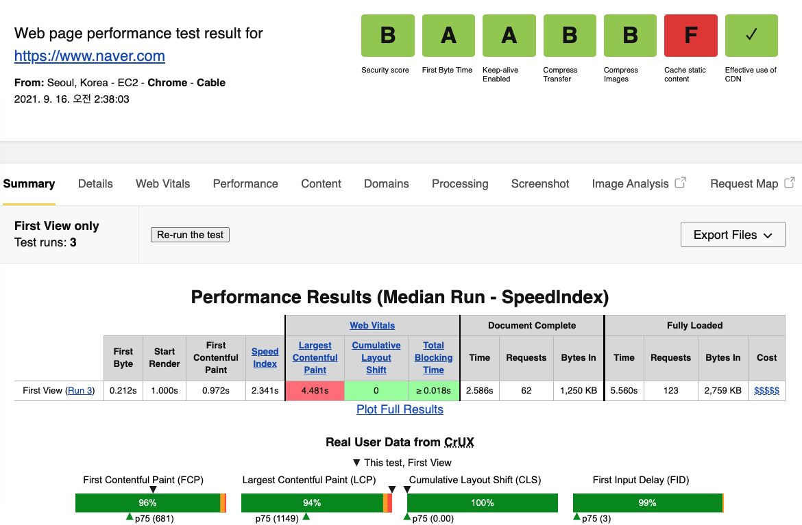
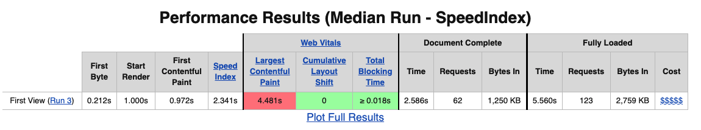

# 목차

<br>

- [목차](#목차)
- [개요](#개요)
- [왜 웹 성능 진단을 해야할까?](#왜-웹-성능-진단을-해야할까)
- [웹 성능 진단 단계](#웹-성능-진단-단계)
- [첫번째. 웹 페이지 진단](#첫번째-웹-페이지-진단)
  - [성능에 영향주는 요소](#성능에-영향주는-요소)
  - [웹 페이지의 성능을 측정하는 지표](#웹-페이지의-성능을-측정하는-지표)
    - [웹 서버에 영향을 받는 지표](#웹-서버에-영향을-받는-지표)
    - [정적 컨텐츠와 네트워크 상태에 영향을 받는 지표](#정적-컨텐츠와-네트워크-상태에-영향을-받는-지표)
  - [웹 성능 측정하기](#웹-성능-측정하기)
- [두번째. 부하 테스트](#두번째-부하-테스트)
  - [부하테스트 진단 지표](#부하테스트-진단-지표)
    - [가용성](#가용성)
    - [성능](#성능)
  - [부하테스트 종류](#부하테스트-종류)
    - [smoke](#smoke)
    - [load](#load)
    - [stress](#stress)
  - [부하테스트 목표 설정 - 중요](#부하테스트-목표-설정---중요)
- [마치며](#마치며)
- [참고](#참고)

<br>

# 개요

<br>

# 왜 웹 성능 진단을 해야할까?
가장 먼저 **왜 웹 성능을 진단해야하는지**에 대해 생각해봐야한다.

이유를 알아야 진단하는 목적을 세울 수 있기 때문이다.

웹 성능을 진단하는 **가장 큰 이유는 고객 창출과 고객 만족**에 있다.

즉, 성능의 개선 및 저하가 고객 유입에 대해 크게 작용하고, 수익에 직접적인 영향을 주기 때문이다.

실제로 사용자는 응답시간이 20% 이상일 때 차이를 인식하기 시작한다고 한다.

> 예를 들어, 배민과 쿠팡이츠의 결제 속도가 차이나는 것을 인지하는 것은 응답 시간이다.

심지어 3초안에 로딩되지 않으면 53%의 사용자가 떠난다는 3초 법칙도 존재한다. 

<br>

# 웹 성능 진단 단계
우선 본격적인 성능 진단에 대해서 알아보기 전에 큰 그림을 그려본다.

웹 성능을 진단하는 단계는 여러가지이다.

* 브라우저로 직접 QA하며 **전구간**을 테스트 (진단).
* webpagetest등의 도구로 **인터넷구간**을 테스트 (진단).
* 부하테스트로 **전구간**을 테스트 (이때 브라우저 렌더링은 제외한다.)

이를 그림을 통해 살펴보자.

<p align="center"><br>브라우저를 통한 전구간 테스트 </p>

<br>

<p align="center"><br>webpagetest를 통한 인터넷구간 테스트 </p>

<br>

<p align="center"><br>부하테스트를 통한 전구간 테스트</p>

<br>

> 브라우저를 통해 직접 QA는 인간테스트이므로, 스킵하고 `webpagetest`와 부하 테스트에 대해 자세히 다뤄보려고한다.

<br>

# 첫번째. 웹 페이지 진단
가장 먼저 [webpagetest](https://www.webpagetest.org/)등의 도구로 인터넷구간을 테스트하는 웹 페이지 진단에 대해서 알아본다.

아래 그림은 실제 네이버에 대한 [webpagetest](https://www.webpagetest.org/)를 실행한 결과이다.

<p align="center"><br>네이버에 대한 webpagetest 결과 </p>

지금부터 위 테스트 결과에 대한 자세한 내용을 알아본다.

<br>

## 성능에 영향주는 요소
웹 페이지에 영향을 주는 요소는 크게 5가지이다.
* HTML
* CSS
* JS
* 이미지
* 웹 폰트

브라우저가 위 파일들을 서버로부터 받아서 랜더링하기 때문에 어떻게 보면 당연하다.

<br>

## 웹 페이지의 성능을 측정하는 지표
> 실제로 웹 페이지의 성능을 측정하는 지표들은 무엇이 있을까?

<br>

### 웹 서버에 영향을 받는 지표

<br>

💁‍♂️ **웹 서버에 영향을 받는 지표**

<p align="center"></p>

* Security Score
  * TLS 및 HTTP 헤더 보안성에 대한 지표
  * JS 라이브러리의 보안 취약성도 포함된다.
* First Byte
  * 웹서버에서 받은 컨텐츠의 첫번째 바이트가 얼마만에 도착했는지 측정.
  * 서버 응답시간 + 네트워크 비용에 대한 평가를 하기 위함이다.
* Keep-alive Enabled
  * keep-alive 설정을 했는지에 대해서 측정.
  * 즉, 매번 3 way handshake등읠 과정을 거쳐 Connection을 생성하지 않고 재사용하는지 측정한다.
* Compress Transfer
  * gzip 압축을 했는지 평가.
* Compress Images
  * 이미지 압축을 했는지 평가.
  * 사용자는 이미지 품질에 따른 차이보다 네트워크 지연에 더 민감함으로 이러한 지표를 통해 평가한다.
* Cache static content
  * JS, CSS, 이미지, 웹 폰트등 정적 컨텍츠를 캐싱했는지 평가한다.
  * 전송 비용을 줄이는 것보다 불필요한 요청 수를 줄이는 것이 더 효과적이다.
* Effective use of CDN
  * CDN을 사용했는지 평가한다.
  * 가까운 곳에서 받는 것이 효과적이므로 이를 평가한다.

<br>

🤔 위 지표들이 우수하다는 게 어떤 의미일까?
* CDN 덕분에 가까운 곳에서 응답을 받고,
* keep-alive 설정으로 connection을 재사용하고,
* 캐싱으로 요청 수를 최소화하고,
* gzip 압축을 통해 각 리소스의 전송 인코딩을 최적화하고,
* 이미지를 압축하여 패킷 사이즈를 줄여
* 네트워크 비용을 줄였다는 것을 의미한다.

<br>

### 정적 컨텐츠와 네트워크 상태에 영향을 받는 지표

💁‍♂️ **정적 컨텐츠와 네트워크 상태에 영향을 받는 지표**

<p align="center"></p>

<br>

> 사용자 경험에 직접적인 영향을 주는 지표는 아래와 같다.

* First Contentful Paint
  * 첫번째 이미지, 텍스트가 표시되는 시간을 평가.
  * gzip등의 압축이 큰 영향을 미친다고 한다.
* Speed Index
  * 컨텐츠가 얼마나 빨리 표시되는지를 평가.
  * JS/CSS 지연로딩하여 랜더링 차단 리소스를 제거하면 좋다.
* Largest Contentful Paint
  * 가장 큰 컨텐츠 요소가 화면에 랜더링되는 시기를 평가한다.
  * 최대 페인트 이미지를 미리 로드하거나, 압축하여 네트워크 비용을 줄이면 좋다.
* Cumulative Layout Shift, Total Blocking Time
  * JS 코드 설계에 영향을 받는다.

<br>

🤔 위 지표들이 우수하다는 게 어떤 의미일까?
* gzip 압축하거나
* JS/CSS 지연로딩하거나
* 불필요한 JS를 제거하여
* 각 정적 리소스들의 전송 비용을 줄여 사용자 경험을 개선됨으로 우수하다고 볼 수 있다.

<br>

## 웹 성능 측정하기
이제 웹 성능을 어떤 지표로 그리고 어떤 방식으로 측정하는지 알아보았다.

우선 성능 개선은 끝이 없다. 어느정도까지 허용가능한지를 목표로 정해야한다.

> 이때 경쟁사를 통해 우리 서비스는 이런 성능은 꼭 나오는 것이 좋겠다라는 목표를 정할 수도 있다.

1. 성능 측정에 대한 기준과 목표를 세운다.
2. 우선 순위를 설정한다.
3. 각각의 우선 순위를 통해 최종 목표를 설정한다.

<br>

🤔 그렇다면 어떤 기준를 가지고 성능을 측정해야할까?
> 아래 기준은 가장 보편적인 기준일 뿐이다. 팀바팀으로 설정하면 좋을 듯 하다.
* Quantity-based
  * 정적인 기준치 설정하는 방식
    * 이미지 최대 크기, 웹 글꼴 최대 크기, 스크립트 최대 크기, 스크립트 최대 개수, HTML/CSS 최대 크기, 동영상 최대 크기등등
  * ex. 압축된 리소스 최대 크디 200KB 미만으로 목표 설정
* Timing-based
  * ex. FCP (First Contentful Paint)로 측정 (3초 미만)
* Rule-based
  * 특정 성능 측정 도구의 점수가 목표 점수를 넘어야 합격
  * ex. 90점을 넘어야한다.

<br>

🤔 우선 순위는 어떻게 정하는 것이 좋을까?
> 예시를 살펴보자면..
* 사용자에게 컨텐츠가 빠르게 노출되는 것이 중요한지 -> FCP가 짧은게 좋음
* 사용자가 관련 링크를 빠르게 클릭하는 것이 중요한지
* 사용자가 페이지에 오랫동안 접속해있는 것이 중요한지
* ... 등등

<br>

💁‍♂️ 최종 목표에 대한 예시
* 메인 페이지의 모든 오브젝트 파일 크기는 10MB 미만으로 제한한다.
* 모든 웹 페이지의 각 페이지 내 포함된 JS 크기는 1MB를 넘지 않아야 한다.
* ...

<br>

# 두번째. 부하 테스트
두번째 성능 진단은 부하 테스트이다. 바로 서버가 어느정도의 부하를 견디느냐를 테스트하는 것을 의미한다.

모든 서버는 장애가 없을 순 없다. 그렇다면 **장애 내성을 가진 서비스를 만들어야 하는데, 어떻게 만들까?**

우선은 아래와 같은 사항을 체크한다.

* 현재 시스템이 **어느 정도의 부하**를 견디는지?
* 한계치에서 **병목이 발생하는 지점**은 어디인지?

즉, **서비스가 어느정도 트래픽까지는 괜찮은지 파악하고, 한계점을 넘어설 때 어떤 증상이 나타나는지 파악한다**.

마지막으로 **장애 발생시 어떻게 대응하고 복구해야 할 지 계획하고 개선해나가면된다.**

<br>

## 부하테스트 진단 지표
> 부하테스트를 진행하는데 있어서 사용되는 지표는 무엇이 있을까?

<br>

### 가용성
🤔 가용성?
* **시스템이 서비스를 정상적으로 제공할 수 있는 상태**를 의미한다.
  * 흔히 가용률, uptime이라는 용어로도 사용된다.
  * **서버가 띄워져있는 시간**

🤔 가용성을 높이기 위해선 어떻게 해야할까?
* 단일 장애점 (SPOF)를 없애고 확장성 있는 서비스를 만들면 된다.
* 대표적인 다중화로는 서버를 로드 밸런싱하는 것과 DB는 리플리케이션함으로써 단일 장애점을 없앨 수 있다.

> 단일 장애점이란?
> * 시스템 구성 요소 중에서, 동작하지 않으면 전체 시스템이 중단되는 요소를 말한다
> * ex. DB가 죽으면 서버도 서비스를 못한다. 혹은 서버가 죽으면 서비스가 중단된다.

<br>

### 성능
> 성능이 좋다는 의미가 무엇인지 알아보자.

웹 서버 부하테스트에서의 성능은 보통 아래 지표를 사용하여 측정한다.
* Users
  * 얼마나 많은 사람들이 동시에 사용할 수 있는지
* TPS
  * 일정시간동안 얼마나 많이 처리할 수 있는지
* Time
  * 서비스가 얼마나 빠른지

<br>

💁‍♂️ **Users (사용자)**

<p align="center"><br>출처: https://techblog.woowahan.com/2627/ </p>

* Registerd, Not Registerd user
  * 시스템 관리자 입장에서의 등록된 사용자와 등록되지 않은 사용자
  * 회원가입하면 등록된 사용자가 된다.
* Logged in, Not Logged in user
  * 서버의 관점에서 로그인한 사용자와 로그인하지 않은 사용자.
  * 쿠키/세션 혹은 JWT를 발급한 유저를 로그인한 사용자라한다.
* **Concurrent user, Active user**
  * 성능 테스터 관점에서 Concurrent와 Active라는 두 유저가 존재한다.
  * Concurrent user: 서버에 계속해서 요청을 날리진 않고 그저 연결되어있는 사용자.
  * Active user: GET, POST등등 계속해서 서버에 요청을 날리는 사용자 ex. 수강신청을 위한 새로고침, 채팅을 위해 POST(VUser와 유사하다.)

<br>

💁‍♂️ **TPS**

* TPS란?
  * **Transaction per Second의 약자로서, 1초당 처리할 수 있는 트랜잭션의 개수를 의미한다.**
  * **초당 최대 처리 건수**, 즉 초당 교환되는 데이터의 수치를 의미한다.
  * ex. 100만 TPS는 1초당 100만 건의 트랜잭션을 처리할 수 있는 속도를 말한다
* TPS를 통해 무엇을 알 수 있는가?
  * **일정시간동안 얼마나 많은 요청을 처리할 수 있는지 확인할 수 있다.**
    * ex. 치킨 이벤트를 하는데 일정시간동안 얼마나 많은 요청을 처리할 수 있는지 진단할 수 있다.
  * TPS가 갑자기 증가하는 시점이 서버의 한계점이기도하다.
    * 즉, 일정시간동안 많은 요청을 처리하다보면 병목점이 발견되고, 요청당 레이턴시가 높아지는 시점이 있다. 이 지점이 바로 서버의 한계점을 의미한다.
* TPS 성능을 높이는 전략
  * Scale-Up
    * 사용자가 많지도 않은데도 **단일 사용자에 대한 응답이 느리다면, Scale-Out을 해봤자 개선되지 않으므로, 이땐 Scale-Up을 해주어야 한다.** (3초 ~ 5초) 
    * 혹은 코드를 통해 성능을 높이거나...아니면 캐싱...
  * Scale-Out
    * **단일 사용자에 대한 응답은 빠른데, 요청들이 한번에 굉장히 몰려와서 부하가 증가했을 땐, 처리하려고해도 처리하지 못하는 대기하는 요청이 존재하게 된다. 이때 Scale-Out 전략을 사용하면 된다.**
    * 즉, 포화 상태 (CPU, RAM, 네트워크)일 때, Scale-Out을 통해 성능을 높일 수 있다.
    * 부하 분산

<br>

💁‍♂️ **Time (시간)**

> 사용자에겐 응답시간만 존재한다.

<p align="center"><br>출처: https://techblog.woowahan.com/2627/ </p>

* Think Time: 사용자가 아무 요청을 하지 않고 생각하는 시간.
* 네트워크적인 요소는 webpagetest로 진단할 수 있다.
* Server: 네트워크적인 요소가 전혀 문제가 없는데, Server에서 문제가 발생한다면 아래 내용들을 의심해볼 수 있다.
  * 서버의 리소스 문제
  * 프로그램 로직상의 문제
  * DB 혹은 다른 서비스와의 연결 문제 (혹은 쿼리 성능)

<br>

## 부하테스트 종류
부하테스트에는 3종류가 존재한다.

<br>

### smoke
* **최소한의 부하로, 테스트 시나리오 오류를 검증하는 테스트.**
  * VUser 1 ~ 2로 구성한다.
* 최소 부하 상태에서 시스템 오류가 없는지 확인할 수 있다.

<br>

### load
> smoke 테스트에서 문제가 없다면 load 테스트를 진행한다.

* 서비스의 **평소 트래픽과 최대 트래픽으로 구성**한다.
  * 목표치는 실제 평소 트래픽이나 최대 트래픽으로 구성하면 된다.
* **목적은 기능이 정상 동작하는지 검증하는데 있다.**
* 배포, 인프라 변경 (scale-out, DB failover)시 성능 변화를 테스트하기 위함.

<br>

### stress
* **서비스의 한계점을 확인하는 테스트.**
  * 보통 점진적으로 부하를 증가하도록 구성한다. 이를 통해 최대 사용자, 최대 처리량등 한계점을 확인한다.
  * **TPS가 갑자기 증가하는 부분을 테스트하는 것.**
* 서비스의 한계점이 도달해서 장애가 발생했을 때, 자동으로 해당 장애가 복구되는지도 확인한다.
  * 사용자의 수동 개입 없이 자동으로 장애를 처리하는지 확인.

<br>

## 부하테스트 목표 설정 - 중요
이제 어떤 지표로 측정하고, 어떤 종류로 측정하는지 알게 되었다.

그렇다면 목표는 어떻게 설정하는 것이 좋을까?

목표를 설정하기 위해 적어도 아래와 같은 데이터가 필요하다.

* DAU (Daily Active Users)
  *  일별 활동 사용자 수
  *  **DAU는 순수 방문자 수(Unique Visitor)를 나타내야 하기 때문에 한 명이 여러 번 서비스를 이용했더라도 단 한명으로 집계해야 한다.**
  *  **하루에 서비스에 요청을 날린 사용자 수.**
  *  보통 게임 시작 화면, 앱이 켜지는 로딩 화면등에서 집계하기도 한다.
* 피크 시간대 집중률 (최대 트래픽 / 평소 트래픽)
  * ex. 2배, 3배, 10배..
* 1명당 1일 평균 요청 수

> **만약 위 데이터가 없다면 가설을 세워서 하면 된다.**
> 
> **혹은 경쟁사의 DAU를 확인하여 비슷한 성능을 발휘하도록 목표를 세우면 된다.**

<br>

**전제 조건**
* 테스트하려는 Target 시스템의 범위를 정해야 한다.
* 부하 테스트시에 저장될 데이터 건수와 크기를 결정해야한다.
  * 서비스 이용자 수
  * 서비스 행동 패턴
  * 사용 기간
* 목표값에 대한 성능 유지기간을 정해야 한다.
* 서버에 같이 동작하고 있는 다른 시스템, 제약 사항등을 파악한다.

<br>

**처리량 산정 - 중요**

위 3가지 데이터를 바탕으로 서버의 처리량(Throughput)을 측정할 수 있다.

* 처리량 (Throughput): 1일 평균 rps ~ 1일 최대 rps
  * 1일 사용자 수 (DAU) x 1명당 1일 평균 접속수 = 1일 총 접속수
  * 1일 총 접속수 / 86,400 (초/일) = 1일 평균 rps
  * 1일 평균 rps x (최대 트래픽 / 평소 트래픽) = 1일 최대 rps
* Latency: 일반적으로 50 ~ 100ms이하로 잡는 것이 좋다.
* 목표 VUser 구하는 방법
  * Request Rate: measured by the number of requests per second (RPS)
  * VU: the number of virtual users
  * R: the number of requests per VU iteration
  * T: a value larger than the time needed to complete a VU iteration
```
T = (R * http_req_duration) (+ 1s) ; // 내부망에서 테스트할 경우 예상 latency를 추가한다

VUser = (목표 rps * T) / R
```

<br>

**처리량 산정 예시**

아래와 같은 데이터가 있다고 가정한다면
* DAU = 8,640,000
* 피크시간대 집중율 = 10 (평소보다 10배를 의미한다)
* 1명당 1일 최대 요청 수 = 1

아래와 같은 결과가 나올 수 있다.
* 처리량
  * 1일 총 접속수 = 8,640,000 x 1 = 8,640,000
  * 1일 평균 rps = 100
  * 1일 최대 rps = 1,000
  * Throughput = 100 ~ 1,000
* 목표 RPS를 1,000으로 한다면
  * R = 1 (유저당 요청하는 횟수)
  * http_req_duration = 0.5 (네트워크 왕복 시간)
  * T = (R * http_req_duration) (+ 1s) = (1 * 0.5) + 1 = 1.5
  * VUser = (목표 rps * T) / R = (1,000 * 1.5) / 1 = 1,500

<br>

**시나리오**

* 접속 빈도가 높은 기능
  * 메인 페이지
* 서버 리소스 소비량이 높은 기능
  * CPU
    * 이미지, 동영상 변환
    * 인증
    * 파일 압축/해제
  * Network
    * 응답 컨텐츠 크기가 큰 페이지
    * 이미지, 동영상 업로드/다운로드
  * Disk
    * 로그가 많은 페이지
* DB를 사용하는 기능
  * 많은 리소스를 조합하여 결과를 보여주는 페이지
  * 여러 사용자가 같은 리소스를 갱신하는 페이지
* 외부 시스템과 통신하는 기능
  * 결제 기능
  * 알림 기능
  * 인증/인가

<br>

# 마치며
사실 백엔드 개발자인 필자에게 중요한 부분은 가장 마지막 부분인 [부하테스트 목표 설정 - 중요](#부하테스트-목표-설정---중요)이다.

그래도 웹 개발자로써 성능을 어떻게 진단하고 어떤 지표를 통해 진단하는지를 알 수 있는 좋은 기회였다.

이렇게 다시 한번 시야를 넓혀준 우아한 테크코스 명강사 CU에게 감사를 표하고싶다 :)

<br>

# 참고
* 우아한 테크코스 CU이 인프라 강의 :+1
* https://techblog.woowahan.com/2627/
* https://nesoy.github.io/articles/2018-08/Testing-Performance

