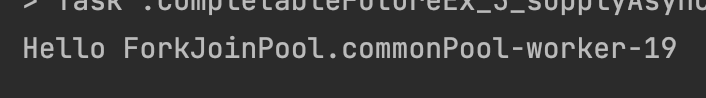
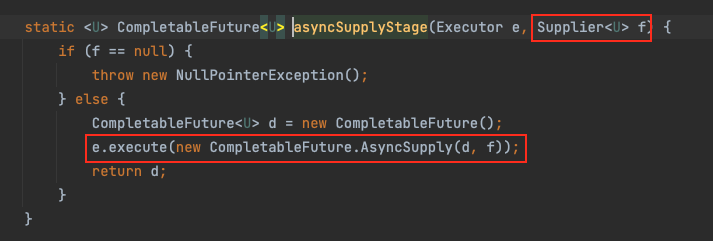
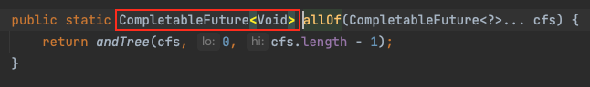

# 목차

<br>

- [목차](#목차)
- [CompletableFuture](#completablefuture)
- [1 Future만으론 복잡한 비동기 로직을 구성하기 어렵다](#1-future만으론-복잡한-비동기-로직을-구성하기-어렵다)
- [2 CompletableFuture를 이용한 기본적인 비동기 요청](#2-completablefuture를-이용한-기본적인-비동기-요청)
  - [2-1 리턴값이 없는 경우 - runAsync(Runnable)](#2-1-리턴값이-없는-경우---runasyncrunnable)
  - [2-2 리턴값이 있는 경우 - supplyAsync(Supplier)](#2-2-리턴값이-있는-경우---supplyasyncsupplier)
- [3 비동기 작업 Callback](#3-비동기-작업-callback)
  - [3-1 thenApply(Function)](#3-1-thenapplyfunction)
  - [3-2 thenAccept(Consumer)](#3-2-thenacceptconsumer)
  - [3-3 thenRun(Runnable)](#3-3-thenrunrunnable)
- [4 Future의 조합](#4-future의-조합)
  - [4-1 thenCompose()](#4-1-thencompose)
    - [thenApply() vs thenCompose()](#thenapply-vs-thencompose)
  - [4-2 thenCombine()](#4-2-thencombine)
  - [4-3 thenAcceptBoth()](#4-3-thenacceptboth)
- [5 여러 Future 병렬 실행](#5-여러-future-병렬-실행)
  - [5-1 allOf()](#5-1-allof)
  - [5-2 anyOf()](#5-2-anyof)
- [6 예외 처리](#6-예외-처리)
  - [6-1 exceptionally(Function)](#6-1-exceptionallyfunction)
  - [6-2 handle(BiFunction)](#6-2-handlebifunction)
- [참고](#참고)

<br>

# CompletableFuture
[이전 글 - 자바 비동기 처리와 Future](./Java%20Asynchronization-Future.md)에 이어서 이번 글은 자바 비동기 프로그래밍을 정리하는 시리즈의 두번째 글이다.

이전 글에서도 알아보았듯이, JDK 1.5에 나온 `Future`은 한계가 분명했다.

이로인해 JDK 1.8부터 `CompletableFuture` 인터페이스가 소개되었고, 이 인터페이스는 `Future` 인터페이스도 구현하기때문에 기존의 `Future`를 기반으로 외부에서 완료시킬 수 있으므로 `CompletableFuture`란 이름을 갖게되었다.

> `CompletableFuture`의 사전적 의미는 "완료된 미래"이다.

그리고 **동시에 `CompletionStage` 인터페이스를 구현함으로써 비동기 연산 단계(Step)를 제공하며, 이는 비동기 연산을 계속해서 체이닝 형태로 조합하는 것이 가능해졌다.**

> Future은 Collection, CompletableFuture은 Stream의 관계로 비유할 수도 있다.

이번 글은 `Future`의 한계를 통해 `CompletableFuture`가 필요한 이유를 알아보고, `CompletableFuture`의 사용법에 대해서 정리해본다.

<br>

# 1 Future만으론 복잡한 비동기 로직을 구성하기 어렵다

<br>

💁‍♂️ **`Future`의 가장 큰 함계점은 블로킹 코드 (`get())`를 사용하지 않고서는 Callback을 실행할 수 없는 것이다.**

[이전 글 - 자바 비동기 처리와 Future](./Java%20Asynchronization-Future.md#4-future의-한계---callback-부재)에서 정리했듯이, Future의 가장 큰 한계점은 비동기 처리 결과에 따른 Callback 처리하는 것이 어렵다는 것이다.

물론 앞선 글처럼 `FutureTask`를 구현함으로써 Callback 기능을 사용할 순 있지만, 콜백 처리를 위한 코드를 따로 또 구성해줘야하는 번거로움이 존재한다.

<br>

💁‍♂️ **이외에도 `Future`은 여러가지 한계가 존재한다.**

* **여러 비동기 Task 처리에 대한 예외 처리나 타임아웃 설정하기 쉽지 않다.**
* **여러 `Future`를 조합하기 어렵다.**
  * 보통 두 개의 비동기 Task 처리를 해야한다면, 두 개의 비동기 처리는 서로 독립적일수도, 두 번째가 첫 번째에 의존적일 수도 있다.
  * `Future`은 위와 같은 비동기 처리끼리의 조합을 구성하는것을 직접 구현해줘야하기때문에 쉽지않다.
  * 이외에도 다양한 요구사항에 맞는 `Future`끼리의 조합을 구성하기 힘들다.
* **`Future` 집합이 실행하는 모든 Task의 완료를 기다려야한다.**
* **코드상에서 `Future`를 완료시킬 수 없다.**
  * 기존의 `Future`은 외부에서 완료시킬 수 없다. 취소하거나, `get()`에 타임아웃을 설정해줘야한다.
* **`Future` 집합에서 가장 빨리 완료되는 Task만 기다리고 나머지는 중지하는 요구사항을 지키기 어렵다.**
  * 예를 들어 여러 Task가 다양한 방식으로 같은 결과를 구하는 상황.

<br>

💁‍♂️ **`Future`의 한계를 해결한 `CompletableFuture`.**

기존의 `Futuru` JDK 1.5부터 추가되어 비동기 결과를 얻는데 잘 사용되었지만, 위와 같이 계산들을 다양한 형태로 결합하거나 오류를 처리하는 방법이 까다로웠다.

그로인해 JDK 1.8부터 `CompletableFuture`가 추가되었다.

`CompletableFuture`은 기존의 `Future` 인터페이스를 구현할 뿐만 아니라, `CompletionStage`도 구현한다.

이는 **`CompletableFuture`가 기존의 `Future` 기능을 모두 지원할 뿐만 아니라, `CompletionStage`의 기능도 추가로 제공한다고 이해할 수 있다.**

<br>

💁‍♂️ `CompletionStage`

`CompletionStage` 공식 문서에선 아래와 같이 설명하고있다.

```
A stage of a possibly asynchronous computation, that performs an action or computes a value when another CompletionStage completes. 

A stage completes upon termination of its computation, but this may in turn trigger other dependent stages.
```

해석하면 `CompletionStage`는 다른 `CompletionStage`가 완료될 때 작업을 수행하거나 값을 계산하는 **하나의 비동기 계산 단계**(Stage)라고 볼 수 있다.

즉, **여러 단계의 비동기 Task 처리를 단계별로 구성하여 처리할 수 있음을 나타낸다.**

**게다가 각 단계에서 발생한 에러를 관리하고 전달할 수 있다.**

> 간단한 예시.
```java
stage.thenApply(x -> square(x))
      .thenAccept(x -> System.out.print(x))
      .thenRun(() -> System.out.println());
```

> **비동기 Task 처리의 결과를 얻는 `Future`는 `Stream`과 유사한 것 같다.**

<br>

# 2 CompletableFuture를 이용한 기본적인 비동기 요청

`CompletableFuture`를 이용하여 기본적인 비동기 요청과 콜백을 직접 구현해보면서 어떻게 사용하는지 살펴본다.

**비동기 요청은 크게 아래 두 가지로 나뉜다.**

* 리턴값이 없는 경우: `runAsync()`
* 리턴값이 있는 경우: `supplyAsync()`

<br>

## 2-1 리턴값이 없는 경우 - runAsync(Runnable)

`runAsync()`는 가장 대표적으로 `CompletableFuture`를 이용하여 비동기 처리 요청하는 메서드다.

그리고 `runAsync()`는 비동기적으로 동작하길 원하는 작업중 리턴값이 없는 경우 사용된다.

```java
CompletableFuture<Void> future = CompletableFuture.runAsync(() -> {
    System.out.println("Hello " + currentThread().getName());
});

// get()을 호출해야지만, 비동기적으로 동작한다.
System.out.println(future.get()); // Hello ForkJoinPool.commonPool-worker-19
```
위와 같이 쉽게 비동기 처리를 요청할 수 있다.

> `runAsync()`는 `get()`을 호출해줘야 실행된다.

<br>

💁‍♂️ **`runAsync()`는 입력값으로 `Runnable`을 받는다.**

`Runnable`은 입력값과 리턴값 모두 없는 함수형 인터페이스이다.

그러므로 `runAsync()`는 결과 값이 필요없는 비동기 요청에 사용된다.

<br>

💁‍♂️ **Task를 비동기로 처리할 때 사용되는 디폴트 스레드는 `ForkJoinPool`이다.**

`runAsync()`와 뒤에서 살펴볼 `supplyAsync()`모두 실행할 때 스레드 풀을 지정해주지않으면 아래와 같이 `ForkJoinPool`을 사용한다.

<p align="center"> </p>

<br>

## 2-2 리턴값이 있는 경우 - supplyAsync(Supplier)

`supplyAsync()`는 `runAsync()`와 같이 대표적으로 비동기 처리를 요청하는 메서드이다.

**차이점이라면 `supplyAsync()`는 이름에서 알 수 있듯이 비동기적으로 동작하길 원하는 작업중 리턴값이 있는 경우 사용된다.**

```java
ExecutorService es = Executors.newFixedThreadPool(4);

// get()을 호출하지않아도 비동기로 Task가 실행된다.
CompletableFuture<String> future = CompletableFuture.supplyAsync(() -> "Hello " + Thread.currentThread().getName(), es);

System.out.println(future.get()); // Hello pool-1-thread-1

es.shutdown();
```
위와 같이 쉽게 비동기 요청을 할 수 있다.

> **주의할 점은 기존의 `Future`와 동일하게 `get()`호출시 Blocking이 된다.** 
> **그리고 `get()`을 호출하지않아도 `supplyAsync()`로 넘겨준 Task가 비동기로 실행된다.**

<br>

💁‍♂️ **`applyAsync()`는 입력값으로 `Supplier`을 받는다.**

`Supplier`는 입력 값은 없지만, 리턴값이 존재하는 함수형 인터페이스이다.

그러므로 `runAsync()`는 결과 값이 필요한 비동기 요청에 사용된다.

<p align="center"> </p>

<br>

# 3 비동기 작업 Callback

**`CompletableFuture`의 가장 큰 장점은 함수형 형태로 비동기 처리 결과의 Callback을 지원한다는 것이다.**

`CompletableFuture`은 `CompletionStage`를 구현함으로써 아래 메서드를 지원한다.

* `thenApply(Function)`: 비동기로 동작한 결과값을 리턴받아서 다른 값으로 바꾸는 콜백
  * `Stream.map`과 유사하다.
* `thenAccept(Consumer)`: 비동기로 동작한 결과값을 리턴받아서 또 다른 작업을 처리하는 콜백 (리턴없이)
* `thenRun(Runnable)`: 비동기로 동작한 결과값을 리턴받지 않고 다른 작업을 처리하는 콜백

위 메서드들을 이용하여 비동기 처리 요청시 콜백을 정의할 수 있으며, 체이닝을 통해 다양한 조합을 만들 수 있다.

<br>

## 3-1 thenApply(Function)

```java
public <U> CompletableFuture<U> thenApply(Function<? super T, ? extends U> fn) {
    return this.uniApplyStage((Executor)null, fn);
}
```

`thenApply(Function)`은 `CompletableFuture<U>`를 반환하며, 이름에서도 알 수 있듯이, 결과값을 리턴받아서 다른 값을 바꾸는 콜백이다.

> 비동기로처리한 문자열 결과를 모두 대문자열로 변환하는 예시.
```java
CompletableFuture<String> future = CompletableFuture.supplyAsync(() -> {
    System.out.println("Hello " + Thread.currentThread().getName());
    return "Hello ";
}).thenApply((s) -> {
    System.out.println(Thread.currentThread().getName());
    return s.toUpperCase();
});

// get()을 호출해야 비동기 작업이 동작한다.
System.out.println(future.get()); // HELLO
```
**위 예시에서 볼 수 있듯이, `thenApply(Function)`는 `Stream.map`과 동일한 역할을 수행한다.**

> `thenApply`로 넘어오는 `Function`은 `supplyAsync()`와 동일한 스레드에서 동작한다. 별도의 스레드에서 실행하고싶다면 `thenApplyAsync()`를 사용해야한다.

<br>

## 3-2 thenAccept(Consumer)

```java
public CompletableFuture<Void> thenAccept(Consumer<? super T> action) {
    return this.uniAcceptStage((Executor)null, action);
}
```

`thenAccept(Consumer)`는 `CompletableFuture<Void>`를 반환한다. 즉, 결과값을 반환하지않는다.

이는 **결과값을 리턴받아서 또 다른 작업을 처리하는 콜백라고 볼 수 있다.**

단, `thenApply(Function)`와는 다르게 결과값을 리턴하지않는다. 그저 사용하는 비동기로 처리한 결과를 콜백으로 Consume하는 역할을 수행한다.

```java
CompletableFuture<Void> future = CompletableFuture.supplyAsync(() -> {
    System.out.println("Hello " + Thread.currentThread().getName());
    return "Hello ";
}).thenAccept((s) -> {
    System.out.println(Thread.currentThread().getName());
    System.out.println(s.toLowerCase());
});

// get()을 호출해야 thenAccept가 동작한다.
future.get();
```
예시에서 볼 수 있듯이, `thenAccept`는 입력값을 받아서 소비만할 뿐, 결과값을 리턴하지않는다.

> `get()`을 호출해야 `thenAccept()`가 동작하며, `get()`이 없을경우 `supplyAsync()`로 주어진 비동기 Task만 수행된다.

> `thenAccept`로 넘어오는 `Consumer`는 `supplyAsync`와 동일한 스레드에서 동작한다. 별도의 스레드에서 실행하고싶다면 `thenAccepyAsync()`를 사용해야한다.

<br>

## 3-3 thenRun(Runnable)

```java
public CompletableFuture<Void> thenRun(Runnable action) {
    return this.uniRunStage((Executor)null, action);
}
```

`thenRun(Runnable)`은 결과값을 리턴받지 않고 다른 작업을 처리하는 콜백이다.

```java
CompletableFuture<Void> future = CompletableFuture.supplyAsync(() -> {
    System.out.println("Hello " + Thread.currentThread().getName());

    // 3초간 Sleep
    try {
        Thread.sleep(3_000);
    } catch (InterruptedException e) {
        e.printStackTrace();
    }
    
    return "Hello ";
}).thenRun(() -> {
    System.out.println("Computation Finished");
});

future.get();
```
주의할 점은 기존의 비동기 처리가 완료되어야지 `thenRun`으로 주어진 `Runnable`이 실행된다.

계산 값이 필요하지 않거나 체인 끝에서 일부 값을 반환하지 않으려고할 때 사용될 수 있다.

<br>

# 4 Future의 조합
Callback을 지원하는 것 외에도 `CompletableFuture`에서 가장 중요한 부분은 여러 `Future`를 병렬로 조합해서 비동기 작업 파이프라인을 구성할 수 있다는 것이다.

매 체이닝마다 `CompletableFuture`를 반환하기때문에 여러가지 비동기 Task를 연결 및 결합할 수 있다.

예를 들어, 2개의 `CompletableFuture`를 병렬로 실행하고 결과를 합칠 수 있다.

조합할 때 사용되는 메서드는 아래와 같다.

* `thenCompose()`: 두 작업이 서로 이어서 실행하도록 조합.
  * 뒤 순번 작업이 앞 순번 작업에 의존적이다.
* `thenCombine()`: 두 작업을 독립적으로 실행하고 둘 다 종료 했을 때 콜백을 실행.

<br>

## 4-1 thenCompose()

```java
public <U> CompletableFuture<U> thenCompose(Function<? super T, ? extends CompletionStage<U>> fn) {
    return this.uniComposeStage((Executor)null, fn);
}
```

`thenCompose()`는 두 개의 `Future`를 순차적으로 연결한다.

```java
CompletableFuture<String> combinedFuture = CompletableFuture.supplyAsync(() -> {
    try {
        Thread.sleep(3_000);
    } catch (InterruptedException e) {
        e.printStackTrace();
    }

    System.out.println("Hello " + Thread.currentThread().getName());
    return "Hello ";
}).thenCompose((result) -> CompletableFuture.supplyAsync(() -> {
    try {
        Thread.sleep(2_000);
    } catch (InterruptedException e) {
        e.printStackTrace();
    }

    System.out.println("World " + Thread.currentThread().getName());
    return result + " World";
}));

System.out.println(combinedFuture.get());
// Hello ForkJoinPool.commonPool-worker-19
// World ForkJoinPool.commonPool-worker-19
// Hello  World
```
뒤에 주어진 `Future` (위 예시에서 `World`)가 앞 순번의 `Future` (위 예시에서 `Hello`)결과에 의존적이므로, 순차적으로 `Future`가 실행된다.

<br>

### thenApply() vs thenCompose()

`thenApply()`와 `thenCompose()`가 하는 역할이 비슷하다보니 두 메서드가 큰 차이가 없어보인다.

```java
public <U> CompletableFuture<U> thenApply(Function<? super T, ? extends U> fn)

public <U> CompletableFuture<U> thenCompose(Function<? super T, ? extends CompletionStage<U>> fn)
```

메서드 시그니처에서 알 수 있듯이, 두 메서드는 반환값은 같지만 매개변수의 타입이 다르다.

* `thenApply()`는 `Future` 결과를 받았을 때, 반환 전에 어떤 처리를 apply할 때 사용된다.
  * `map`과 같이 `Future`의 결과를 특정 값으로 변환할 때 사용될 수 있다. (반환 값이 이전 `Future`로 처리한 결과이다.)
* `thenCompose()`는 `Future` 다음에 또 다른 `Future`를 이어서 실행하게끔 연결할 때 사용된다.
  * `flatmap`과 같이 또 다른 CompletableFuture를 파이프라인 형식으로 연결해서 실행할 수 있게 한다. (반환 값이 새로운 비동기 처리의 결과인 `CompletionStage` 타입이어야한다..)

> [좋은 참고 및 예시](https://stackoverflow.com/questions/43019126/completablefuture-thenapply-vs-thencompose)

<br>

## 4-2 thenCombine()

```java
public <U> CompletableFuture<U> thenCompose(Function<? super T, ? extends CompletionStage<U>> fn) {
    return this.uniComposeStage((Executor)null, fn);
}
```

`thenCompose()`는 두 작업이 서로 이어서 실행되도록 조합하기때문에, 뒷 순번의 Task가 앞 순번의 Task를 의존한다.

반면에, **`thenCombine()`은 두 개의 Task를 서로 독립적으로 실행한다.**

```java
CompletableFuture<String> hello = CompletableFuture.supplyAsync(() -> {
    try {
        Thread.sleep(3_000);
    } catch (InterruptedException e) {
        e.printStackTrace();
    }

    System.out.println("Hello " + Thread.currentThread().getName());
    return "Hello";
});

CompletableFuture<String> world = CompletableFuture.supplyAsync(() -> {
    try {
        Thread.sleep(1_500);
    } catch (InterruptedException e) {
        e.printStackTrace();
    }

    System.out.println("World " + Thread.currentThread().getName());
    return "World";
});

CompletableFuture<String> future = hello.thenCombine(world, (h_result, w_result) -> {
    return h_result + " " + w_result;
});

System.out.println(future.get());
// World ForkJoinPool.commonPool-worker-5
// Hello ForkJoinPool.commonPool-worker-19
// Hello World
```
**`thenCombine()`은 두 Task가 서로 독립적이므로, 순번에 상관없이 동시에 비동기로 실행하고나서 둘 다 완료되었을때 Combine된다.**

<br>

## 4-3 thenAcceptBoth()

`thenAcceptBoth()`는 두 개의 `Future` 결과로 무언가를 하고싶지만, 결과 값을 `Future` 체인으로 전달할 필요가없을 때 사용된다.

```java
CompletableFuture<Void> completableFuture = CompletableFuture.supplyAsync(() -> {
    try {
        Thread.sleep(3_000);
    } catch (InterruptedException e) {
        e.printStackTrace();
    }
    System.out.println("Hello " + Thread.currentThread().getName());
    return "Hello ";
}).thenAcceptBoth(CompletableFuture.supplyAsync(() -> {
    try {
        Thread.sleep(2_000);
    } catch (InterruptedException e) {
        e.printStackTrace();
    }
    System.out.println("World " + Thread.currentThread().getName());
    return "World";
}), (s1, s2) -> System.out.println(s1 + s2));

completableFuture.get();
// World ForkJoinPool.commonPool-worker-5
// Hello ForkJoinPool.commonPool-worker-19
// Hello World
```
두 개의 `Future` 결과로 Comsume만하고싶을때 사용된다.

또한, 두 Task가 서로 독립적이므로, 순번에 상관없이 동시에 비동기로 실행하고나서 둘 다 완료되었을 때 Comsume된다.

<br>

# 5 여러 Future 병렬 실행

`CompletableFuture`은 여러 `Future`를 조합해서 비동기 작업 파이프라인을 만들 수 있을 뿐만 아니라, 여러 `Future`를 병렬로 실행하고 모든 `Future`가 실행될때까지 기다려서 결합된 결과를 한번에 얻는 방법도 제공한다.

쉽게 말해.. **`CompletableFuture`은 여러 `Future`를 병렬로 실행할 수 있게해주는 두 가지 메서드를 제공한다.**

* `allOf()`: 여러 Task를 모두 실행하고 모든 작업 결과에 콜백 실행.
* `anyOf()`: 여러 Task중에 가장 빨린 끝난 하나의 결과에 콜백 실행.

<br>

## 5-1 allOf()

`allOf()`는 여러 작업을 조합하며, 여러 Task를 모두 실행하고 모든 작업 결과에 콜백 실행한다.

`allOf()` 메서드를 사용하면 매개변수로 제공된 모든 `Future`가 완료될 때까지 Blocking 된다.

```java
CompletableFuture<String> future1 = CompletableFuture.supplyAsync(() -> "Hello");
CompletableFuture<String> future2 = CompletableFuture.supplyAsync(() -> "Beautiful");
CompletableFuture<String> future3 = CompletableFuture.supplyAsync(() -> "World");

CompletableFuture<Void> combinedFuture = CompletableFuture.allOf(future1, future2, future3);

// ... 비동기 요청후 따로 처리해야할 코드가 있으면 여기에 정의하면 된다. ...

// allOf()는 get()을 호출하면 매개변수로 넘어온 모든 Future가 완료될 때까지 Blocking된다.
combinedFuture.get();

// get()의 Blocking이 풀리면, allOf()의 매개변수로 넘어온 모든 Future는 완료된 상태이다.
assertTrue(future1.isDone());
assertTrue(future2.isDone());
assertTrue(future3.isDone());
```

이는 여러 `Future`의 결과를 모두 얻기위해 한번에 Blocking할 때 아주 유용하다.

<br>

💁‍♂️ **한가지 주의할 점으로 `CompletableFuture.allOf()`의 반환 유형은 `CompletableFuture<Void>`이다.**

```java
CompletableFuture<String> future1 = CompletableFuture.supplyAsync(() -> "Hello");
CompletableFuture<String> future2 = CompletableFuture.supplyAsync(() -> "World");

CompletableFuture<Void> combinedFutures = CompletableFuture.allOf(future1, future2)
        .thenAccept(System.out::println);

System.out.println(combinedFutures);
// null
```

위와 같이 `allOf()` 결과를 직접 반환하진 않는다. 그리고 실제로 아래와 같이 메서드 시그니처를보면 `CompletableFuture<Void>`를 반환한다.

<p align="center"> </p>

**이는 `allOf()`의 한계이기도한데.. `allOf()`는 위와 같이 매개변수로 주어진 모든 `Future`의 결합된 결과를 반환하지 않는다.**

> **결합된 결과를 반환하지않는 이유는 각각의 `Future`가 반환하는 타입이 서로 다를 수 있기때문이다.**
> 
> **`future1`은 `String`을 `future2`는 `Integer`를 반환한다면, 하나의 결합된 결과로 반환할 수 없기때문에 어쩔 수 없이 `Void`를 반환하고 수동으로 각자 처리해줘야하는 것이다.**

<br>

💁‍♂️ **만약 모든 `Future`의 결합된 결과를 얻고싶으면 수동으로 결과를 가져와야한다.**

다행히 JDK 1.8의 `CompletableFuture`는 `join()` 메서드를 지원함으로써 비교적 간단히 `allOf()`의 매개변수로 주어진 모든 `Future`의 결과를 얻을 수 있게하였다.

```java
CompletableFuture<String> future1 = CompletableFuture.supplyAsync(() -> "Hello");
CompletableFuture<String> future2 = CompletableFuture.supplyAsync(() -> "Beautiful");
CompletableFuture<String> future3 = CompletableFuture.supplyAsync(() -> "World");

String combined = Stream.of(future1, future2, future3)
  .map(CompletableFuture::join)
  .collect(Collectors.joining(" "));

assertEquals("Hello Beautiful World", combined);
```

<br>

🤔 **`get()`과 `join()`의 차이점은?**

`Future.get()`과 `CompletableFuture.join()`의 가장 큰 차이점은 예외를 던지는 방식에 있다.

```java
// Future.get()
V get() throws InterruptedException, ExecutionException;

// CompletableFuture.join()
public T join()
```

`get()`은 두 개의 CheckedException을 던지기때문에 사용하는 클라이언트측에서 예외 처리를 해주어야한다.

반면에, `join()`은 어떠한 CheckedException을 던지지않기때문에 크라리언트에서 따로 예외처리해줄 필요가없다.

대신 `CompletionException`라는 UncheckedException를 던지는데, 이는 `exceptionally()`로 예외를 처리할 수 있다.

> 더 자세한 내용은 [여기](https://stackoverflow.com/questions/45490316/completablefuturet-class-join-vs-get)를 참고.

<br>

💁‍♂️ **여러 `Future` 각각의 결과 값을 얻어오는 예시**

여러 `Future`의 결과 값을 결합하지않고 각각 얻어오고싶을때 사용되는 예시이다.

```java
CompletableFuture<String> hello = CompletableFuture.supplyAsync(() -> {
    System.out.println("Hello " + Thread.currentThread().getName());
    return "Hello";
});

CompletableFuture<String> world = CompletableFuture.supplyAsync(() -> {
    System.out.println("World " + Thread.currentThread().getName());
    return "World";
});

List<CompletableFuture<String>> futures = Arrays.asList(hello, world);
CompletableFuture[] futuresArray = futures.toArray(new CompletableFuture[futures.size()]);

// allOf()는 futuresArray로 주어진 Future들이 모두 끝났다는 것을 보장한다. 
// 그러므로 thenApply로 주어진 콜백이 실행될 땐 이미 모든 Future가 완료된 상태이다.
// v는 Void의 약자로, 아무 의미없다.
CompletableFuture<List<String>> results = CompletableFuture.allOf(futuresArray) 
        .thenApply(v -> futures.stream()
                .map(stringCompletableFuture -> stringCompletableFuture.join())
                .collect(Collectors.toList()));

results.get().forEach(System.out::println);
// World ForkJoinPool.commonPool-worker-19
// Hello ForkJoinPool.commonPool-worker-5
// Hello
// World
```
`allOf()`를 통해 모든 작업이 완료되었음을 보장받고나면, `thenApply()`를 통해 직접 `allOf()`의 매개변수로 넘긴 `CompletableFuture`에서 `join()`를 통해 값을 꺼내줘야한다.

<br>

## 5-2 anyOf()

`anyOf()`는 `allOf()`와 동일한 특징을 가지지만, `allOf()`와 다르게 여러 `Future`중 가장 빨리 끝난 하나의 결과만 가져온다.

```java
CompletableFuture<String> hello = CompletableFuture.supplyAsync(() -> {
    System.out.println("Hello " + Thread.currentThread().getName());
    return "Hello";
});

CompletableFuture<String> world = CompletableFuture.supplyAsync(() -> {
    System.out.println("World " + Thread.currentThread().getName());
    return "World";
});

CompletableFuture<Void> future = CompletableFuture.anyOf(hello, world).thenAccept(System.out::println);

future.get();
```
위 예시의 출력 결과는 `Hello` 혹은 `World`중 가장 먼저 끝난 Task 하나만 출력된다.

<br>

# 6 예외 처리
비동기로 요청한 Task에서 언제든 예외가 발생할 수 있다. 이러한 예외 처리를 위해 `CompletableFuture`은 아래 두 가지 메서드를 지원한다.

* exceptionally(Function): Task가 예외로 인해 완료되었을 때 예외처리를 위한 콜백.
* handle(BiFunction): Task가 정상 혹은 예외로 완료되었을 때의 콜백

<br>

## 6-1 exceptionally(Function)

`CompletableFuture`의 예외 처리는 아래와 같이 굉장히 간단하다.

```java
boolean throwError = true;

CompletableFuture<String> future = CompletableFuture.supplyAsync(() -> {
    if (throwError) {
        throw new IllegalArgumentException();
    }

    System.out.println("Hello " + Thread.currentThread().getName());
    return "Hello";
}).exceptionally(ex -> {
    System.out.println(ex); // java.util.concurrent.CompletionException: java.lang.IllegalArgumentException
    return "ERROR!";
});

System.out.println(future.get()); // ERROR
```
`supplyAsync`, `thenApply`, `thenAccept` 등의 메서드에서 예외가 발생했을 때 `exceptionally()`를 통해 예외를 핸들링할 수 있다.

<br>

## 6-2 handle(BiFunction)

`handle`메서드를 이용하면 `Future`가 정상적으로 처리되었을 때와 예외가 발생하여 처리되었을때의 콜백을 한번에 정의할 수 있다.

```java
boolean throwError = true;

CompletableFuture<String> future = CompletableFuture.supplyAsync(() -> {
    if (throwError) {
        throw new IllegalArgumentException();
    }

    System.out.println("Hello " + Thread.currentThread().getName());
    return "Hello";
}).handle((result, ex) -> {
    if (ex != null) {
        System.out.println(ex);
        return "ERROR!";
    }
    return result;
});

System.out.println(future.get());
```

<br>

# 참고
* https://docs.oracle.com/en/java/javase/11/docs/api/java.base/java/util/concurrent/CompletionStage.html
* https://www.baeldung.com/java-completablefuture
* https://www.inflearn.com/course/the-java-java8


