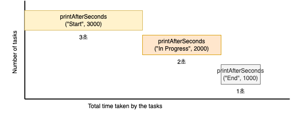
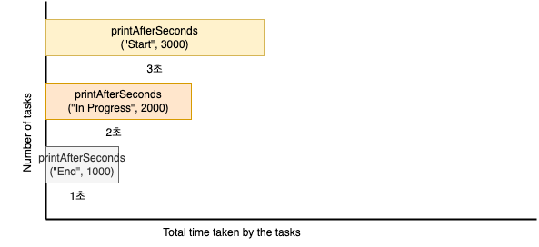
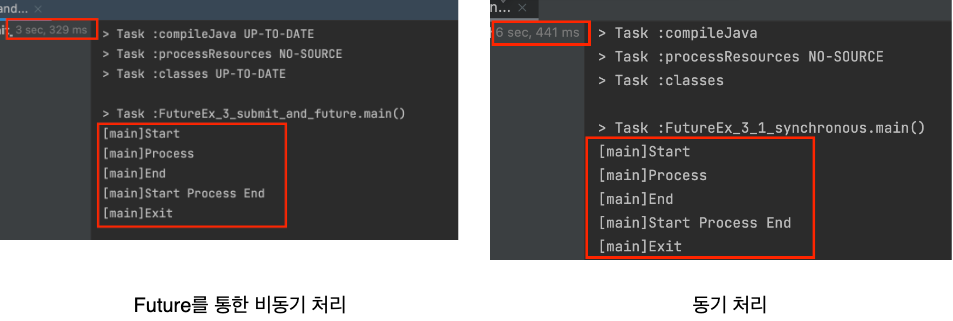
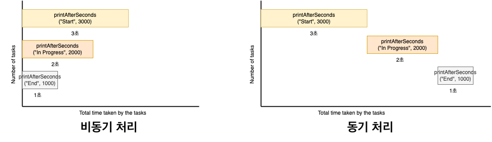
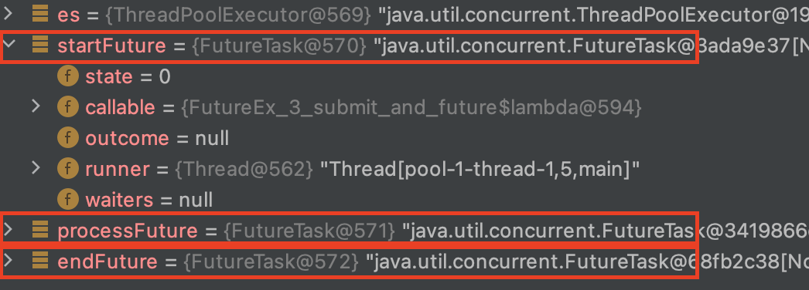

# 목차

<br>

- [목차](#목차)
- [자바 비동기 처리와 Future](#자바-비동기-처리와-future)
- [1 동기 코드로 알아보는 비동기가 좋은 이유](#1-동기-코드로-알아보는-비동기가-좋은-이유)
  - [1-1 동기 코드](#1-1-동기-코드)
  - [1-2 비동기 코드](#1-2-비동기-코드)
- [2 Future의 역할 - 비동기 처리 결과를 표현하기위한 인터페이스](#2-future의-역할---비동기-처리-결과를-표현하기위한-인터페이스)
  - [2-1 비동기 처리 결과가 필요없는 경우 - execute](#2-1-비동기-처리-결과가-필요없는-경우---execute)
  - [2-2 비동기 처리 결과가 필요한 경우 - submit과 Future](#2-2-비동기-처리-결과가-필요한-경우---submit과-future)
- [3 Future](#3-future)
  - [3-1 Future란 - pending completion](#3-1-future란---pending-completion)
  - [3-2 Future의 역할](#3-2-future의-역할)
- [4 Future의 한계 - Callback 부재](#4-future의-한계---callback-부재)
- [정리](#정리)
- [참고](#참고)
- [그외 - Runnable vs Callable](#그외---runnable-vs-callable)
- [그외 - execute()와 submit()](#그외---execute와-submit)

<br>

# 자바 비동기 처리와 Future
비동기처리에 대한 중요성은 나날이 커지고있으며, 현재는 컴퓨터 발전에 따라 비동기란 개념을 모르고선 대용량 처리를 할 수 없을정도가 되었다.

이번 글은 자바 비동기 프로그래밍를 정리하는 시리즈의 첫번째 글이다.

자바 비동기 프로그래밍 역사에따라 JDK 1.5에 발표된 `Future`에 대해서 먼저 이야기해본다.

글 시작부터 `Future`란 무엇이며 어떻게 사용하는지에 대해서 다루는 것은 사실 다른 글도 많으므로, **이번 글은 `Future`가 왜 필요한지 그리고 무엇이 좋은지 알아본다.**

그리고 **`Future`의 한계와 제대로된 비동기처리를 하기 힘든 이유를 살펴보며, 다음으로 나온 비동기 프레임워크인 `CompletableFuture` 내용의 밑밥을 깔아보려고한다.**

> 이번 글의 내용은 필자가 직접 테스트하며 이해한 내용은 정리한 것이다. 틀린 내용이 있을 수 있다.

<br>

# 1 동기 코드로 알아보는 비동기가 좋은 이유
우선 본격적으로 `Future`을 알아보기에 앞서 자바를 이용하여 동기로 동작하는 코드를 살펴보자.

<br>

## 1-1 동기 코드

동기 (Synchronous)로 동작하는 간단한 예시를 살펴본다.

```java
public class FutureEx_1_synchronism {

    public static void main(String[] args) throws InterruptedException {
        printAfterSeconds("Start", 3000);
        printAfterSeconds("In Progress", 2000);
        printAfterSeconds("End", 1000);
    }

    private static void printAfterSeconds(String text, long millis) throws InterruptedException {
        Thread.sleep(millis);
        System.out.println(text);
    }
}
```
실행 결과는 아래와 같다.

```
[main] Start 
[main] In Progress
[main] End
```

<br>

실행 순서는 아래와 같다.

1. 3초 sleep이후 Start 출력
2. Start가 출력되고나서 2초 sleep이후 In Progress 출력
3. In Progress가 출력되고나서 1초 sleep이후 End 출력

<br>

**실행결과와 순서를 보면 알 수 있듯이, 하나의 스레드에서 두 개의 Print가 `동기/블로킹` 방식으로 동작한다.**

어떤가? 굉장히 간단하며, 직관적이고 이해하기도 쉽다.

<br>

❗️ **하지만 동기방식은 아래와 같이 각각의 처리 결과가 주어질 때까지 아무것도 못하고 대기해야하는 단점이 있다.**

<p align="center"><br>총 6초의 시간이 소요된다. </p>

지금은 간단한 예시를 위해 특정 텍스트를 몇초후에 출력하는 예시이지만, 

**만약 하나의 스레드안에서 동기적으로 오래걸리는 여러가지일을 실행하면 처리시간이 선형적으로 늘어날 수 밖에없다. - 중요**

이게 바로 동기 처리방식의 문제이며, 비동기 처리방식이 필요한 이유이기도하다.

> 정확히하자면 위 방식은 `동기/블로킹`이다.

<br>

## 1-2 비동기 코드

그렇다면 위 예시를 비동기로 실행하면 어떻게 될까? 비동기로 동일한 작업을 수행하면 아래와 같다.

```java
public class FutureEx_2_execute {

    public static void main(String[] args) {
        ExecutorService es = Executors.newCachedThreadPool();

        es.execute(() -> {
            try {
                Thread.sleep(3000);
            } catch (InterruptedException e) {}
            System.out.println("Start");
        });

        es.execute(() -> {
            try {
                Thread.sleep(2000);
            } catch (InterruptedException e) {}
            System.out.println("Process");
        });

        es.execute(() -> {
            try {
                Thread.sleep(1000);
            } catch (InterruptedException e) {}
            System.out.println("End");
        });

        es.shutdown();
    }
}
```
실행 결과는 아래와 같다. (우선 `execute()`이 무엇인지는 알지않아도된다.)

```
[pool-1-thread-3] End
[pool-1-thread-2] Process
[pool-1-thread-1] Start
```

<br>

실행 순서는 아래와 같다.

1. Start, Process, End 순으로 3초, 2초, 1초를 sleep하고 텍스트를 출력하도록 비동기로 요청한다.
2. 각 작업은 주어진 시간만큼 sleep하고 텍스트를 출력한다.

<br>

여기서 **눈여겨봐야할 부분은 실행 결과가 End이 먼저 출력되고, 그 다음 Process, 마지막으로 Start가 출력되었다는 것이다.** 

또한, 6초 걸리던 모든 작업이 3초만에 끝났다.

이를 그림으로 그려보면 아래와같다.

<p align="center"><br>총 3초의 시간이 소요된다. </p>

**그림에서도 쉽게 알 수 있듯이, 비동기는 동기와는 다르게 CPU 자원들을 최대한 사용해서 idle(놀고있는)한 작업이 없도록함으로써 같은 작업이라도 더 빠르게 작업을 완료할 수 있다.**

이게 바로 비동기가 좋은 가장 큰 이유이기도하다. 그리고 **정확히하자면 위 방식은 `비동기/논블로킹`이다.**

> 여기서 `아하! 호출되는 함수의 작업 완료를 호출한 함수가 신경쓰지 않으므로 비동기구나! 그리고 호출하고 바로 리턴받으니 논블로킹이구나!`를 이해해야한다.
> 
> 만약 이해가 안된다면 4가지의 I/O 방식의 차이점을 제대로 이해하고오는게 좋다.

> 그렇다고 무조건 비동기 방식이 좋은 것만은 아니다. **제대로 알고 사용해야 효율적으로 사용할 수 있다. 제대로 모르면 오히려 역효과가 날 수 있다.**

<br>

# 2 Future의 역할 - 비동기 처리 결과를 표현하기위한 인터페이스
앞서 간단한 동기와 비동기코드로 비동기가 어떤 점에서 좋은지 알아보았다.

간단히 정리하자면, **비동기 방식은 동시성을 활용하여 CPU 자원을 최대한으로 활용하여 더 빠르게 특정 작업을 수행할 수 있다.**

하지만 비동기도 물론 단점이 여러가지 존재한다. 예를 들어, 실행 결과를 예측하기힘들고, 잘못사용하면 CPU 사용량이 굉장히 증가할 수도 있다.

그러기에 **비동기 로직을 구성할 땐 비동기 처리방식과 Flow를 제대로 이해하고 사용하는 것이좋다.**

**이번 장엔 비동기 처리방식을 제대로 이해하기위해 꼭 알아야하는 비동기 Task 처리하는 방식에대해서 알아본다.**

**이를 통해 `Future`가 어떤 역할을 하는지 알아본다.**

<br>

💁‍♂️ **비동기로 처리하는 방식에는 크게 두가지가 있다.**

1. 비동기 처리 결과가 필요없는 경우
2. 비동기 처리 결과가 필요한 경우

위에서 **살펴본 [간단한 비동기 예시](#비동기-코드)는 사실 `비동기 처리 결과가 필요없는 경우`이다.**

다시말해, **`Start`, `Process`, `End`를 출력하는 처리은 서로 연관관계가 전혀없으며, 동시간에 서로의 작업 완료 여부가 연관없으므로 서로의 일에 집중할 수 있었다.**

이렇게 텍스트로만 말하면 이해하기가 힘드니, **비동기 처리 결과가 필요없는 경우와 필요한 경우를 예시를통해 살펴보자.**

<br>

## 2-1 비동기 처리 결과가 필요없는 경우 - execute
💁‍♂️ 먼저 위에서 살펴본 동일한 예시 마지막에 `Exit`를 한번 더 출력하는 예시를 살펴보자.

```java
public class FutureEx_2_execute {

    public static void main(String[] args) {
        ExecutorService es = Executors.newCachedThreadPool();

        es.execute(() -> {
            try {
                Thread.sleep(3000);
            } catch (InterruptedException e) {}
            System.out.println("Start");
        });

        es.execute(() -> {
            try {
                Thread.sleep(2000);
            } catch (InterruptedException e) {}
            System.out.println("Process");
        });

        es.execute(() -> {
            try {
                Thread.sleep(1000);
            } catch (InterruptedException e) {}
            System.out.println("End");
        });

        // 새로 작성된 코드
        System.out.println("Exit")

        es.shutdown();
    }
}
```
실행 결과는 아래와 같다.
```
[main] Exit
[pool-1-thread-3] End
[pool-1-thread-2] Process
[pool-1-thread-1] Start
```
결과에서 알 수 있듯이, 4개의 스레드가 각각 비동기로 동작한다.

**여기서 눈여겨봐야할 부분은 호출하는 쪽인 main 스레드에서의 `Exit`이 가장 먼저 출력되었으며, Sleep의 따라 오름차순으로 출력되는 것을 볼 수 있다.**

**그리고 이는 main에서 다른 비동기로 요청한 각각의 스레드가 서로의 작업 완료 여부를 전혀 신경쓰지 않는다.**

**이렇게 비동기로 요청한 처리 결과를 리턴 받을 필요가 없을 경우 자바의 `Executor.execute(Runnable runnable)`을 사용하면 스레드 풀을 활용하여 효과적으로 스레드를 제어할 수 있다.**

이와 같은 대표적인 예시로 `로그 기록`이 있다.

> 이번 글에서 다루는 비동기 처리방식은 모두 `Concurrency` (병행) 처리 방식이다.

<br>

## 2-2 비동기 처리 결과가 필요한 경우 - submit과 Future
위와 같이 비동기/논블로킹 방식으로만 코드를 작성할 수 있으면 모든 개발자들은 행복하게 개발할 수 있을 것이다.

하지만 **현실에선 비동기로 처리를 요청하되 비동기로 처리한 결과가 필요한 경우가 훨씬 많다.**

요구사항을 조금 더 추가하여 결과가 필요한 경우가 무엇인지 살펴보자.

<br>

🤔 **만약 4개의 스레드에 비동기로 요청하여 각각 `Start`, `Process`, `End`, `Exit`를 순서대로 리턴받아, 이를 하나의 문자열로 합쳐 처리해야한다면 어떻게 해야할까??**

새로운 요구사항을 보면 각각의 비동기로 요청한 처리 결과의 연관 관계가 생긴 것을 알 수 있다.

이때 아마 가장 쉬운 방법은 처음의 [동기 코드](#동기-코드)처럼 처리하는 것이다.

하지만 이는 다시 CPU 자원을 십분 활용하지못해 비효율적으로 연산을 처리하기때문에 좋은 방법이 아니다.

이때 **가장 효율적인 방법은 비동기/논블로킹으로 연산을 처리하고 비동기 처리 결과를 반환받아 처리하는 것이다.**

**그리고 이렇게 비동기로 요청한 처리의 결과를 반환받을 수 있도록 자바에서 추상화한 인터페이스가 바로 `Future`인터페이스다.**

<br>

💁‍♂️ **`Future` - 비동기 처리 결과를 표현하기위한 인터페이스**

[Javadoc - Future](https://docs.oracle.com/javase/7/docs/api/java/util/concurrent/Future.html)의 가장 첫문장은 아래와 같이 적혀있다.

```
A Future represents the result of an asynchronous computation. Methods are provided to check if the computation is complete, to wait for its completion, and to retrieve the result of the computation

Future은 비동기 처리의 결과를 나타낸다. 처리가 완료되었는지 확인하고 완료를 기다리며 처리 결과를 찾을 수 있다 (반환 받을 수 있다.).
```

한마디로 **`Future`은 비동기적 연산의 처리 결과를 표현하기 위한 인터페이스이다.** 

예시를 통해 `Future`의 사용 예시를 살펴보자.

```java
public class FutureEx_3_submit_and_future {

    public static void main(String[] args) throws ExecutionException, InterruptedException {
        ExecutorService es = Executors.newCachedThreadPool();

        // 비동기 요청
        Future<String> startFuture = es.submit(() -> {
            Thread.sleep(3000);
            return "Start";
        });

        // 비동기 요청
        Future<String> processFuture = es.submit(() -> {
            Thread.sleep(2000);
            return "Process";
        });

        // 비동기 요청
        Future<String> endFuture = es.submit(() -> {
            Thread.sleep(1000);
            return "End";
        });

        // ... main에서의 작업 실행 ...

        // 비동기 작업의 결과를 받아서 출력.
        String start = startFuture.get();
        System.out.println(start);
        String process = processFuture.get();
        System.out.println(process);
        String end = endFuture.get();
        System.out.println(end);

        // 비동기로 요청한 작업의 결과를 합쳐서 출력.
        System.out.println(start + " " + process + " " + end);
        System.out.println("Exit");
        es.shutdown();
    }
}
```
처리 결과는 아래와 같다.

```
[main]Start
[main]Process
[main]End
[main]Start Process End
[main]Exit
```

<br>

실행 순서는 아래와 같다.

1. main 스레드가 각각 주어진 시간만큼 sleep하고 `Start`, `Process`, `End`를 반환하는 Task (처리)을 스레드 풀에 요청한다.
   * 이때, main은 논블로킹으로 요청한다. 즉, 제어권을 main에게 바로 반환한다.
2. main은 자신의 작업을 실행하다, 비동기로 요청한 Task의 결과들을 얻기위해 `Future.get()`을 요청한다.
   * 이후에 얘기하겠지만, 이때 main은 비동기로 요청한 Task가 결과값을 반환하기전까지 블로킹된다.
3. main은 각각의 `Future`로부터 처리의 결과를 얻은 문자열을 합쳐 출력한다.

<br>

💁‍♂️ **`Future`은 비동기적 연산의 처리 결과를 표현하기 위한 인터페이스이다.**

위와 같이 **`Future`은 비동기로 요청한 처리 결과를 얻기위해 사용되는 인터페이스이다.**

그리고 Java의 스레드 풀을 추상화한 `ExecutorService`인터페이스는 `submit()` 메서드를 호출하면 `Future`를 반환한다.

개발자는 `submit()`으로 요청한 비동기 연산의 결과를 `Future`로 접근할 수 있다.

> 물론 `Future`없이 직접 스레드를 구현해서, 결과를 담는 객체를 직접 구현해도된다. 
> 
> 다만 직접 구현은 굉장히 번거로우며, 스레드 안전도 신경써야한다.
> 
> Java는 이러한 작업을 `Future`로 추상화시킨 것이다.

<br>

🤔 **출력 결과만보면 동기로 처리하는 것과 차이가 없어보이는데, 어떤 차이가있는가? - Future를 통한 비동기 처리방식의 장점**

출력 결과만보면 동기로 처리하는 것과 차이가 없어보인다.

> 동기로 처리하는 코드는 굉장히 간단하므로 생략한다.

하지만 아래와 같이 실행결과를보면 큰 차이가있다.

<p align="center"></p>

결과에서도 알 수 있듯이, `Future`를 통한 비동기처리는 약 3초, 동기를 약 6초이다.

> 지금은 두 배지만, 만약 Task가 많다면 몇 배이상 차이가난다.

이렇게 차이나는 이유는 앞서 살펴본 동기와 비동기 처리의 실행 결과가 차이가나는 것과 동일하다.

<p align="center"> </p>

* 동기 - 3초 sleep 후 `Start` 반환 -> 2초 sleep 후 `Process` 반환 -> 1초 후 sleep 후 `End` 반환
* 비동기 - 동일한 시간에 각각 3초, 2초, 1초 sleep 이후 각각의 텍스트를 반환.

즉, `Future.get()`을 호출하면 해당 스레드는 블로킹되지만, 여전히 이전에 비동기로 요청한 작업들은 비동기로 동작한다.

> **정확히 말하면 비동기 예시의 경우 `Future.get()`을 호출하기전까진 `비동기/논블로킹`으로 동작하지만,**
> 
> **`get()`을 호출하는순간부터는 비동기 처리 결과가 반환되기전까지 `블로킹`가 된다.**
> 
> 정말 비동기로 동작시키려면 Callback을 같이 넘겨야한다. 이와 관련해서는 아래에서 더 자세히 다룰 예정이다.

<br>

# 3 Future
앞서 동기와 비동기의 차이점은 무엇이며, `Future`가 어떤 역할을하는지 살펴보았다.

이번 장에선 Future의 기본적인 개념을 정리할 예정이다.

> 이번 장의 내용은 사실 다른 블로그에도 많으므로 스킵해도 무방하다.

<br>

## 3-1 Future란 - pending completion

💁‍♂️ **`Future`란 - pending completion**

* Java 1.5부터 나온 인터페이스로 비동기 연산의 결과를 표현하기위해 사용된다.
  * 비동기 처리이 완료되었는지 확인할 수 있으며, 처리 완료를 기다려서 처리 결과를 반환하는 메서드를 제공한다.
* `Future`를 사용하면 멀티 스레드 환경에서 처리된 데이터를 다른 스레드에 전달할 수 있으며, `Future`은 내부적으로 스레드 안전하다.
  * 굳이 `synchronized` 키워드를 사용하지않아도된다.
* **`Future`은 비동기 처리이 완료될 때까지 기다렸다가 최종 결과를 얻는 방식으로 동작하기때문에, 지연 완료 (pending completion)이라고도 불린다.**

<br>

## 3-2 Future의 역할

💁‍♂️ **Future가 제공하는 메서드**

```java
public interface Future<V> {
    boolean cancel(boolean var1);

    boolean isCancelled();

    boolean isDone();

    V get() throws InterruptedException, ExecutionException;

    V get(long var1, TimeUnit var3) throws InterruptedException, ExecutionException, TimeoutException;
}
```
* `get()`
  * 비동기로 요청한 Task의 결과를 가져오는 메서드.
  * **만약 비동기로 요청한 Task의 처리 결과가 리턴(완료)되지 않았다면, 결과가 나올때까지 Blocking되어 기다린다.**
* `get(Long time, TimeUnit unit)`
  * `get()` 메서드는 결과가 나올때까지 Blocking되어 기다리기때문에, 잘못하면 Thread가 무한하게 대기하여 프로그램이 응답없는 상태로 만들 수 있다.
  * 이로인해 **`Future`은 Timeout`을 설정할 수 있다. 해당 메서드를 통해 일정 시간내에 결과를 리턴하지않으면 `TimeoutException`을 던진다.**
* `isDone()`
  * 비동기로 요청한 Task의 완료여부를 boolean으로 반환한다.
* `isCancelled()`
  * 비동기로 요청한 Task의 취소 여부를 boolean으로 반환한다.
* `cancel(boolean var1)`
  * 비동기로 요청한 처리의 중단을 시도하는 메서드이다. 이때 만약 연산이 이미 완료되었다면 `cancel()`메서드는 동작하지않는다.
  * 비동기로 요청한 처리의 중단 성공여부를 boolean으로 반환한다.
  * 매개변수로 true를 전달하면 비동기로 요청한 스레드에 `interrupt()`를 발생시킨다.

**위 메서드의 기능들은 직접 코드로 보고싶다면 `Future`의 구현체인 `FutureTask`를 살펴보면된다.**

실제로 지금까지의 예시를 디버깅해보면 아래와 같이 `Future`의 구현체로 `FutureTask`가 사용된 것을 알 수 있다.

<p align="center"> </p>

> 이는 `CompletableFuture`과는 별개의 이야기이다. CompletableFuture를 이용한다면 다른 구현체가 사용된다.

<br>

# 4 Future의 한계 - Callback 부재
Java는 1.5에 `Future`를 릴리즈하고, Java 8에 `Future`과 `CompletionStage`가 결합된 `CompletableFuture`를 발표되었다.

이는 `Future`만으로는 비동기 프로그래밍을 처리하는데 한계가있다는 의미이기도하다.

그리고 그 대표적인 한계는 바로 `Future`가 비동기 처리후의 `Callback` 실행에 대한 기능을 제공하지 않는다는 것이다.

<br>

💁‍♂️ **`get()`을 호출하는순간 블로킹된다.**

`Future`은 비동기로 요청한 Task의 결과를 얻을 수 있도록 `get()`메서드를 제공한다. 

문제는 앞서말했듯, **이 `get()`메서드를 호출하는 순간 해당 스레드는 `join`문과 유사하게 비동기로 요청한 Task의 결과가 리턴될 때까지 블로킹된다.**

즉, **비동기로 요청한 작업이 `get()`을 호출하기전까진 `비동기/논블로킹` 방식처럼 동작하다, `get()`을 호출하는순간부터는 비동기 처리 결과가 반환되기전까지 `블로킹`이 되는 것이다.**

<br>

🤔 **이 문제를 해결하는방법은 무엇일까?**

**바로 Callback을 사용하는 것이다. 즉, 비동기 요청시 Callback 함수도 같이 보내는 것이다.**

이렇게되면 **비동기 처리결과가 반환되는 시점에 Callback을 실행되어 비동기 요청을 호출한 스레드가 전혀 결과를 알필요가 없어지기에 `get()`을 호출할 필요가없어진다.**

<br>

💁‍♂️ **`FutureTask.done()`을 활용한 직접 Callback 포함 비동기 요청 만들기**

그렇다면 `Future`을 사용해서 Callback을 아예 구현하지못하는가? 

아니다. 직접 구현해서 사용하면 Callback을 사용할 수 있다.

실제로 `Future`의 기본 구현체인 `FutureTask`는 처리가 완료되었을경우 아래와 같이 `done`메서드를 호출한다.

```java
public class FutureEx_6_FutureTask_Done {

    public static void main(String[] args) throws ExecutionException, InterruptedException {
        ExecutorService es = Executors.newCachedThreadPool();

        FutureTask<String> futureTask = new FutureTask<>(() -> {
            Thread.sleep(1_000);
            return "Async Hello ";
        }) {
            // 비동기작업이 모두 수행하고나면 호출되는 메서드. (hook 역할)
            @Override
            protected void done() {
                try {
                    System.out.println(get());
                } catch (InterruptedException e) {
                    e.printStackTrace();
                } catch (ExecutionException e) {
                    e.printStackTrace();
                }
            }
        };

        es.execute(futureTask);

        // Future.get()을 호출하지않는다. 즉, main 스레드는 전혀 blocking되지 않는다.
        System.out.println("Exit");
        es.shutdown();
    }
}

[main]Exit
[pool-1-thread-1]Async Hello
```
**이를 활용하면 Callback을 포함한 비동기 요청을 할 수 있다.**

<br>

실제로 성공과 예외에 대한 Callback을 포함한 비동기 요청을 보내는 예시를 살펴보자.

```java
public class FutureEx_7_FutureTask_Callback {
    interface SuccessCallback {
        public void onSuccess(String result);
    }

    interface ExceptionCallback {
        public void onError(Throwable t);
    }

    public static class CallbackFutureTask extends FutureTask<String> {
        SuccessCallback sc;
        ExceptionCallback ec;

        public CallbackFutureTask(Callable<String> callable, SuccessCallback sc, ExceptionCallback ec) {
            super(callable);
            this.sc = Objects.requireNonNull(sc);
            this.ec = Objects.requireNonNull(ec);
        }

        // Callback 처리 메서드.
        @Override
        protected void done() {
            try {
                // get이 여기서 비동기로 동작하는 스레드에서 실행되기때문에, 기존의 Main 스레드는 Blocking 되지 않는다.
                sc.onSuccess(get());
            } catch (InterruptedException e) {
                // 인터럽트가 발생했을때의 예외 처리
                Thread.currentThread().interrupt();
            } catch (ExecutionException e) {
                // 비동기 작업중 발생한 예외 처리.
                ec.onError(e.getCause());
            }
        }
    }

    public static void main(String[] args) {
        ExecutorService es = Executors.newCachedThreadPool();

        CallbackFutureTask callbackFutureTask = new CallbackFutureTask(() -> {
            Thread.sleep(1_000);
            // 에러 Callback 테스트
            // if (1==1) throw new RuntimeException("비동기 처리중 Error!!");
            return "Async Hello ";
        },
        s -> System.out.println("Result : " + s),
        e -> System.out.println("Error : " + e.getMessage()));

        es.execute(callbackFutureTask);
        System.out.println("Exit");
        es.shutdown();
    }
}
```
위와 같이 `FutureTask`의 `done`을 사용하여 성공과 에러에 대한 Callback을 처리할 수 있다.

이때 호출하는 스레드 (main 스레드)는 비동기 작업의 `Future.get()`을 호출하는 것이 아니기에 블로킹되지 않는다.

> 실제로 [토비님의 유튜브 강의](https://www.youtube.com/watch?v=aSTuQiPB4Ns&list=PLOLeoJ50I1kkqC4FuEztT__3xKSfR2fpw&index=4)를보면 `CompletableFuture`이 나오기전에 이렇게 사용했다고한다.

<br>

물론 `CompletableFuture`을 사용해도 `get()`을 호출하면 blocking된다.

**그렇지만 `CompletableFuture`은 기본적으로 Callback을 지원한다.**

단순한 Callback뿐만 아니라 여러가지 비동기 Task를 조합하여, 효과적으로 비동기 요청을 처리할 수 있도록 지원한다.

더 자세한 내용은 다음 글에서 정리할 예정이다. 

**이 글에선 `Future`은 자체적인 Callback을 지원하지않으며, 다양한 비동기 요청의 결과인 `Future`를 조합해서 사용할 수 없다는 것만 이해하면된다.**

<br>

# 정리
* 컴퓨터 자원을 십분 활용하는 비동기처리는 동시성 (Concurrency)의 꽃이라고봐도 좋을 것 같다.
  * 실제로 이번 글에서 설명했듯이, 동기에 비해 비동기 처리가 똑바로 사용하면 굉장히 효과적이다.
* 비동기 처리의 연산 결과를 얻기위해선 비동기 처리 결과를 표현하는 인터페이스인 `Future`가 필요하다.
  * `Future`은 비동기 처리 결과에 접근할 수 있는 인터페이스 역할을 하며, 다양한 메서드를 지원한다.
* 다만.. `Future`를 사용해서 비동기 처리 결과를 얻기위해 `get()`을 호출하면 해당 스레드는 Blocking이 걸리는 문제가있다.
  * 그럼에도 잘만 활용하면 동기보다 훨씬 빠른 처리 결과를 얻을 수 있다.
* `get()` 호출로인한 Blocking을 막는 좋은 방법은 Callback인데 `Future`은 이를 자체적으로 지원하지않는다.
  * 물론 직접 구현해도되지만, 깔끔하지않다.
  * Java 8부터 함수형이 등장함에따라 `CompletableFuture`이 발표되었고, 이는 자체적으로 Callback과 비동기 Task간의 조합을 쉽게 구성할 수 있도록 지원한다.

<br>

# 참고
* https://docs.oracle.com/javase/7/docs/api/java/util/concurrent/Future.html
* https://www.youtube.com/watch?v=aSTuQiPB4Ns&list=PLOLeoJ50I1kkqC4FuEztT__3xKSfR2fpw&index=4

<br>

# 그외 - Runnable vs Callable

Task를 만들어 스레드에 할당하기 위해선 두 인터페이스중 하나를 구현해야한다.

사실 이 두 인터페이스의 차이점은 코드를 보면 쉽게 파악할 수 있다.

> Runnable.java

```java
public interface Runnalbe {
    public abstract void run();
}
```

> Callable.java

```java
public interface Callable {
    V call() throws Exception;
}
```

차이점은 아래와 같다.

* 리턴값 유무
  * `Callable.call()`은 Task를 처리 후 결과 값을 반환할 수 있다. 반면에, `Runnable.run()`은 결과 값을 반환할 수 없다.
* Checked Exception 유무
  * `Callable.call()`은 Checked Exception`을 던질 수 있다. 반면에, `Runnable.run()`은 Checked Exception을 던질 수 없다.
  * 물론, Unchecked Exception은 둘 다 던질 수 있다.

> 생각보다 별거 없다. 그저 Task에 대한 결과를 얻어야하는 경우 `Callable`을 이용하고, 결과가 필요없다면 `Runnable`을 이용하면 된다.

<br>

# 그외 - execute()와 submit()
💁‍♂️ **`Executor.execute(Runnable runnable)`**

**스레드 풀을 사용하면서 비동기 처리 결과가 필요없는 경우 `Executor.execute(Runnable runnable)`를 사용한다.**

`execute`는 `Executor`의 추상 메서드이며, 인자로 넘어오는 `Runnable`을 비동기적으로 실행한다. 

```
void execute(Runnable runnable);
```

메서드의 구조에서 알 수 있듯이, 비동기 처리 결과를 다로 반환하지 않는다.

<br>

💁‍♂️ **`ExecutorService.Submit(...)`**

**스레드 풀을 사용하면서 비동기 처리 결과가 필요한 경우 `Executor.submit(...)`를 사용한다.**

submit 메서드는 아래와 같이 서로 다른 매개변수를 받는 세 개의 메서드를 지원한다.

```java
<T> Future<T> submit(Callable<T> task);

<T> Future<T> submit(Runnable task, T result);

Future<?> submit(Runnable task);
```

주목할 점은 `execute`와 다르게 `submit`은 결과값으로 `Future`를 반환한다는 것이다.

그리고 이를 통해 아래와 같이 유추할 수 있다.


