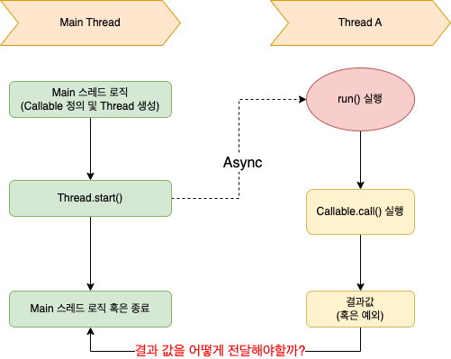
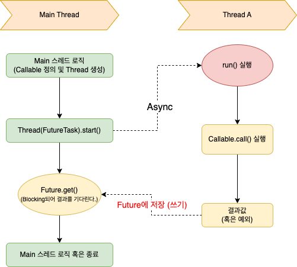

# 목차

<br>

- [목차](#목차)
- [Future 이해하기 (1) - Future은 어떻게 비동기 결과를 얻는가?](#future-이해하기-1---future은-어떻게-비동기-결과를-얻는가)
- [1 Runnable과 Callable](#1-runnable과-callable)
- [2 Callable은 어떻게 비동기 처리결과를 반환하는가?](#2-callable은-어떻게-비동기-처리결과를-반환하는가)
- [3 FutureTask 겉핡기](#3-futuretask-겉핡기)
- [4 예제를 통해 FutureTask를 조금 더 이해해본다](#4-예제를-통해-futuretask를-조금-더-이해해본다)
  - [4-1 비동기로 실행할 Callable 구현체를 매개변수로 넘겨주며 FutureTask를 생성한다.](#4-1-비동기로-실행할-callable-구현체를-매개변수로-넘겨주며-futuretask를-생성한다)
  - [4-2 FutureTask인스턴스를 Thread에 전달하고 실행한다.](#4-2-futuretask인스턴스를-thread에-전달하고-실행한다)
  - [4-3 비동기 작업이 완료될 때까지 Blocking되어 결과를 기다려 얻는다.](#4-3-비동기-작업이-완료될-때까지-blocking되어-결과를-기다려-얻는다)
- [정리](#정리)

<br>

# Future 이해하기 (1) - Future은 어떻게 비동기 결과를 얻는가?

자바는 비동기 연산의 결과를 표현하기 위해 `Future`라는 용어를 사용한다. 이는 `미래`를 의미하며, 비동기를 통해 연산이 완료된 미래의 결과를 표현하고 접근하는데 사용되는 인터페이스이다.

`Future`은 자바에서 비동기 구현에 대한 기초가되며, 자바 비동기 연산을 이해하는게있어 굉장히 중요한 개념이라고 볼 수 있다.

이번 글은 `Future`를 제대로 이해하기위한 첫번째 글로 다음 글인 `FutureTask`를 이해하는데 필요한 선수 지식을 정리한다.

이 글을 읽고나서 추상적으로 `Future`가 어떤 역할을 수행하는지 이해하기실 바란다.

<br>

# 1 Runnable과 Callable
> [Thread](../Thread%26ThreadPool/README.md)을 모두 보고 이 글 읽는 것을 추천한다.

💁‍♂️ **`Runnable`의 한계**

Thread를 생성하고 실행하는데 가장 중요한 것은 `run()`메서드를 구현하여 전달하는 것일 것이다.

`run()`메서드는 해당 스레드가 수행할 작업을 정의하며, 이는 `Runnable`이라는 인터페이스로 추상화하였다.

```java
@FunctionalInterface
public interface Runnable {
    public abstract void run();
}
```
하지만 `run()`메서드는 어떤 값도 반환하지 않는다. 

<br>

🤔 **그렇다면 새로운 Thread에 비동기로 어떠한 작업을 수행하도록 요청하고 그 결과는 어떻게 얻어올 수 있을까?**

새로운 Thread에서 비동기로 특정 작업을 수행하도록하고 그 실행 결과를 얻기 위한 가장 쉬운 방법은 해당 Thread가 작업 결과 자체를 반환하도록 하는 것이다.

`run()`메서드와 다르게 `void`가 아닌 특정 유형의 반환 값을 반환하는 메서드가 필요하다.

**그러한 메서드를 추상화한 것이 바로 `Callable`이다.**

```java
@FunctionalInterface
public interface Callable<V> {
    V call() throws Exception;
}
```

💁‍♂️ `Callable`과 `Runnable`의 차이점은 크게 두가지이다.

* 리턴값 유무
  * `Callable.call()`은 Task를 처리 후 결과 값을 반환할 수 있다. 반면에, `Runnable.run()`은 결과 값을 반환할 수 없다.
* Checked Exception 유무
  * `Callable.call()`은 `Checked Exception`을 던질 수 있다. 반면에, `Runnable.run()`은 Checked Exception을 던질 수 없다.
  * 물론, Unchecked Exception은 둘 다 던질 수 있다.

<br>

💁‍♂️ 물론 `Callable`을 그대로 사용하면 실행 결과 반환 문제는 해결되지만, 새로운 문제가 있다.

```java
public static void main(String[] args) {
    Callable<String> callableExample = () -> "This is the results.";
    try {
        String result = callableExample.call();
        System.out.println("Callable 실행 결과: " + result);
    } catch (Exception e) {
        System.out.println("There is a exception.");
    }
}
```
위와 같이 `Callable`로 특정 로직을 수행하고 결과 값을 받을 수 있지만, 위 방식은 동기방식이므로, 굳이 `Callable`을 이용할 필요가없다.

그래서 `Callable`을 생성만하고 다른 스레드에 제출하여 적절한 경우 작업 완료 여부를 판단하여 실행 결과를 얻어와야한다.

이런 역할을 수행하는 인터페이스가 바로 `Future`이다.

<br>

# 2 Callable은 어떻게 비동기 처리결과를 반환하는가?
https://cloud.tencent.com/developer/article/2118889?from=article.detail.1692202&areaSource=106000.2&traceId=_LN__NXak4S2tOOKXmSVM

`Callable`을 다른 스레드에 제출하여 적절한 경우 작업 완료 여부를 판단하여 실행 결과를 얻어는 역할을 `Future`가 한다고 한다.

이를 그림으로 그려보면 아래와 같다.

<p align="center"> </p>

의문이다.. **Thread-A 스레드의 처리 결과를 Main 스레드가 받는다? 어떻게..?**

Main 스레드에서 비동기로 실행할 내용을 `Callable`에 정의하고 `Thread.start()`를 통해 비동기적으로 Thread-A를 실행한다.

문제는 이렇게 끝나면 Main 스레드는 바로 종료될 것이다.

스레드가 비동기이기 때문에 결과를 얻으려면 Main 스레드를 차단한 다음 Thread A가 끝날 때까지 기다렸다가 결과를 메인 스레드로 가져와야한다.

<p align="center"> </p>

이러한 역할을 수행하는 것이 바로 `Future`다. 간단히 말해, **`Future`는 비동기 스레드 (`Thread-A`)의 미래 결과를 나타낸다.**

이 비동기 결과는 처리가 완료된 후 `Future`에 나타나며, `Future.get()` 호출을 통해 값을 가져올 수 있다.

**이때 주의할 점은 `get()`을 호출한 스레드는 비동기 스레드가 결과를 반환할 때까지 Blocking이 되버린다.**

<br>

정리하면, **Main 스레드는 `FutureTask`라는 객체를 생성하여 새로운 `Thread-A`에 전달함과 동시에 `start()`를 호출한다. `Thread-A`는 `FutureTask`내부의 `Callable.call()`을 실행완료하고 Main 스레드는 그 결과를 `Future.get()`을 통해 가져온다.**

<br>

# 3 FutureTask 겉핡기

<br>

🤔 **`FutureTask`는 어떤 역할을 수행하는가?**

지금까지 `Runnable`, `Callable`, `Future`, `FutureTask`등등의 클래스와 인터페이스들이 등장했다.

이러한 인터페이스와 클래스를 구현 및 상속받는 녀석이 바로 `FutureTask`이다. (가장 핵심 클래스라고 볼 수 있다.)

<p align="center"> </p>

위 클래스 다이어그램을 통해 알 수 있듯이, `FutureTask`는 `Future`과 `Runnable`의 구현체이며, 동시에 `Thread`와 `Callable` 인터페이스를 상태로 가지고있다.

즉, `FutureTask`가 `Future`의 `get()`을 통해 비동기 처리 결과를 얻어오는 기능과 스레드를 취소 및 중단하는 기타 기능을 모두 구현하고 있다는 의미이기도하다.

> 지금은 그저 어떤 방식으로 동작하는지 큰그림만 이해해도 좋다. 앞으로 `FutureTask`에 대해서 더 깊게 다룰 예정이다.

이와 같이 `FutureTask` 비동기 작업의 핵심이며, `Thread`와 `Callable`의 기능을 결합한 작업 관리자 역할을 수행한다.

<br>

# 4 예제를 통해 FutureTask를 조금 더 이해해본다

💁‍♂️ **간단한 예제**

`FutureTask`를 이용하여 간단히 구현한 예제이다.

```java
public class FutureTest {
    public static void main(String[] args) {
        // 1. 비동기로 실행할 Callable 구현체를 매개변수로 넘겨주며 FutureTask를 생성한다.
        Future<String> stringFutureTask = new FutureTask<>(new Callable<String>() {
            @Override
            public String call() throws Exception {
                Thread.sleep(3000);
                return "FutureTask";
            }
        });
        //2. FutureTask인스턴스를 Thread에 전달하고 실행한다.
        new Thread(stringFutureTask).start();

        String s = "";
        try {
            //3. 비동기 작업이 완료될 때까지 Blocking되어 결과를 기다려 얻는다.
            s = stringFutureTask.get();
        } catch (Exception e) {
            e.printStackTrace();
        }
        System.out.printf(s);
    }
}
```
위와 같이 비동기 작업은 크게 3가지로 볼 수 있다.

1. 비동기로 실행할 Callable 구현체를 매개변수로 넘겨주며 FutureTask를 생성한다.
2. FutureTask인스턴스를 Thread에 전달하고 실행한다.
3. 비동기 작업이 완료될 때까지 Blocking되어 결과를 기다려 얻는다.

<br>

## 4-1 비동기로 실행할 Callable 구현체를 매개변수로 넘겨주며 FutureTask를 생성한다.

> `FutureTask.java`
```java
public FutureTask(Callable<V> callable) {
    ...
    this.callable = callable;
   this.state = NEW;
}
```
`FutureTask`는 위와 같이 생성자를 통해 `Callable`을 전달 받는다.

<br>

## 4-2 FutureTask인스턴스를 Thread에 전달하고 실행한다.

`new Thread(stringFutureTask).start()`를 실행하면, `Thread`는 `run()`을 실행할 것이다.

`FutureTask`는 아래와 같이 `Thread.run()` 오버라이딩하고 있다.

> `FutureTask.java`
```java
@Override
public void run() {
    // 현재 스레드를 FutureTask.runner 인스턴스에 할당한다.
    runner = Thread.currentThread();
    try {
      // 변수 할당
      Callable<V> c = callable;
      // FutureTask의 상태를 시작 상태인 NEW로 설정한다.
      if (c != null && state == NEW) {
        // 결과를 담을 변수를 정의한다.
        V result;
        boolean ran;
        try {
          // 1. 여기서 첫번째 단계에서 전달받은 Callable의 call()을 호출하고 결과를 반환받는다.
          result = c.call();
          ran = true;
        } catch (Throwable ex) {
          //만약 Callable.call 실행 과정에서 예외가 발생했다면，
          result = null;
          ran = false;
          // FutureTask의 스레드 상태를 COMPLETING으로 수정한다.
          if (STATE.compareAndSet(this, NEW, COMPLETING)) {
              // 2. 예외를 FutureTask의 결과 담는 변수인 outcome에 할당한다.
              outcome = ex;
              // FutureTask의 스레드 상태를 EXCEPTIONAL로 변경한다.
              STATE.setRelease(this, EXCEPTIONAL);
         }
        }
        if (ran) {
          // 결과를 설정하고 비동기 결과를 대기 중인 모든 스레드에 알린다.
          set(result);
        }
      }
    } finally {
      ...
    }
}

protected void set(V v) {
    // FutureTask의 스레드 상태를 EXCEPTIONAL로 변경한다.
    if (STATE.compareAndSet(this, NEW, COMPLETING)) {
      //3. 비동기로 실행한 결과를 outcome변수에 할당한다. - 중요
      outcome = v;
      // FutureTask의 스레드 상태를 NORMAL로 변경한다.
      STATE.setRelease(this, NORMAL);
      // 4. 비동기 결과을 얻기 위한 잠금을 획득하기 위해 대기중인 차단된 스레드를 순회하여 잠금이 해제되었음을 알린다. - 중요
      for (WaitNode q; (q = waiters) != null;) {
        if (WAITERS.weakCompareAndSet(this, q, null)) {
          for (;;) {
            Thread t = q.thread;
            if (t != null) {
              q.thread = null;
              // 알림 잠금 해제됨.
              LockSupport.unpark(t);
            }
            FutureTask.WaitNode next = q.next;
            if (next == null) {
              break;
            }
            q.next = null;
            q = next;
          }
          break;
        }
      }
      callable = null;
    }
}
```
위 코드에서 핵심은 크게 4가지이다.

1. `result = c.call()`
   * FutureTask를 생성할 때 전달받은 Callable의 `call()` 함수를 호출하여 연산 결과를 저장한다. 
2. `outcome = ex;`
   * 만약 예외가 발생하면 객체 결과 변수에 예외를 저장한다.
3. `outcome = v;`
   * 만약 정상적으로 반환되면 결과 변수에 저장한다.
4. `for (WaitNode q; (q = waiters) != null;) {...}`
   * 비동기 결과를 얻기 위한 잠금을 획득하기 위해 대기 중인 차단된 스레드를 순회하여 잠금이 해제되었음을 알린다.

**실제로 비동기 스레드 실행이 끝나면 정상 또는 예외를 `Object outcome` 변수에 저장하고, 잠금일 해제함과 동시에 모든 결과를 기다리는 스레드에 알린다.**

> `Callable.call()`이 호출되는 과정은 아래와 같다.
> * Thread.start() --> native start0() --> run() -> call()

<br>

## 4-3 비동기 작업이 완료될 때까지 Blocking되어 결과를 기다려 얻는다.

이제 마지막으로 `Future.get()`를 통해 Blocking 상태에서 비동기 처리 결과를 기다려 얻는 과정이다.

> `FutureTask.java`
```java
public V get() throws Exception {
    int s = state;
    if (s <= COMPLETING) {
     // 1. 비동기 Task를 실행중인 스레드가 아직 실행중이라면 대기자 연결 목록으로 이동하여 Blocking 상태에서 결과를 기다린다.
     s = awaitDone();
    }
    // 비동기 처리 결과를 얻는다.
    if (s == NORMAL) {
       // 2. 정상적으로 결과가 반환된 경우 결과가 저장된 outcome을 그대로 반환한다. (이제 Blocking이 풀린다.)
       return (V)outcome;
    }
    // 3. 만약 예외로 던져였을 경우 outcome에 저장된 예외를 직접 풀린다.
    throw new Exception((Throwable)outcome);
}

// 이 메서드는 비동기 Task를 실행중인 스레드가 여전히 실행 중인 경우, waiters 연결 목록에서 대기시키는 역할을 수행한다.
// LockSupport.unpark()에 의해 깨어날때까지 수행된다.
private int awaitDone() {
    WaitNode q = null;
    boolean queued = false;
    for (;;) {
        int s = state;
        if (s > COMPLETING) {
          return s;
        } else if (s == COMPLETING) {
          Thread.yield();
        } else if (q == null) {
          q = new WaitNode();
        }  if (!queued) {
          queued = WAITERS.weakCompareAndSet(this, q.next = waiters, q);
        } else {
          LockSupport.park(this);
        }
    }
}
```
위 코드에서 핵심은 크게 3가지이다.

1. `s = awaitDone()`
   * 비동기 Task를 실행중인 스레드가 아직 실행중이라면 대기자 연결 목록으로 이동하여 Blocking 상태에서 결과를 기다린다.
2. `return (V)outcome;`
   * 정상적으로 결과가 반환된 경우 결과가 저장된 outcome을 그대로 반환한다. (이제 Blocking이 풀린다.)
3. `throw new Exception((Throwable)outcome)`
   * 만약 예외로 던져였을 경우 outcome에 저장된 예외를 직접 던진다. (이제 Blocking이 풀린다.)

<br>

# 정리
이렇게 실제 코드를 분석해보면 생각보다 크게 어렵지않게 로직을 이해할 수 있다.

이번 글은 `Future`가 탄생하게 된 배경과 역할, 그리고 그 구현체인 `FutureTask`를 내가 이해한대로 정리해보았다.

다음 글은 `FutureTask`을 조금 더 자세히 알아볼 예정이다.
