[자바의 정석](http://www.yes24.com/Product/Goods/24259565?OzSrank=2)을 바탕으로 정리한 자료입니다.


# 목차

- [Collection Framework](#collection-framework)
  * [1 핵심 인터페이스](#1-핵심-인터페이스)
    + [1-1 Collection 인터페이스](#1-1-collection-인터페이스)
    + [1-2 List인터페이스](#1-2-list인터페이스)
    + [1-3 Set인터페이스](#1-3-set인터페이스)
    + [1-4 Map인터페이스](#1-4-map인터페이스)
      - [Map.Entry인터페이스](#mapentry인터페이스)
  * [2 List](#2-list)
    + [2-1 ArrayList](#2-1-arraylist)
      - [2-1-1 ArrayList란](#2-1-1-arraylist란)
      - [2-1-2 ArrayList의 요소 삭제과정](#2-1-2-arraylist의-요소-삭제과정)
      - [2-1-3 ArrayList의 크기와 용량](#2-1-3-arraylist의-크기와-용량)
      - [2-1-4 ArrayList의 특징](#2-1-4-arraylist의-특징)
        * [기본적인 특징](#기본적인-특징)
        * [Doubling](#doubling)
    + [2-2 LinkedList](#2-2-linkedlist)
      - [2-2-1 LinkedList란](#2-2-1-linkedlist란)
      - [2-2-2 LinkedList의 요소 삭제](#2-2-2-linkedlist의-요소-삭제)
      - [2-2-3 LinkedList의 요소 추가](#2-2-3-linkedlist의-요소-추가)
      - [2-2-4 LinkedList의 종류](#2-2-4-linkedlist의-종류)
        * [단방향](#단방향)
        * [양방향](#양방향)
        * [이중 원형](#이중-원형)
    + [2-3 ArrayList vs LinkedList](#2-3-arraylist-vs-linkedlist)
      - [데이터 추가/삭제](#데이터-추가/삭제)
      - [접근 시간 (탐색)](#접근-시간-(탐색))
  * [3 Stack과 Queue](#3-stack과-queue)
    + [3-1 Stack과 Queue의 개념](#3-1-stack과-queue의-개념)
    + [3-2 Queue의 변형](#3-2-queue의-변형)
      - [Deque](#deque)
      - [PriorityQueue](#priorityqueue)
  * [4 Arrays](#4-arrays)
  * [5 Comparator와 Comparable](#5-comparator와-comparable)
    + [5-1 비교 메서드](#5-1-비교-메서드)
    + [5-2 Comparable](#5-2-comparable)
      - [예제](#예제)
    + [5-3 Comparator](#5-3-comparator)
  * [6 Set](#6-set)
    + [6-1 HashSet](#6-1-hashset)
      - [hashCode과 equals](#hashcode과-equals)
      - [집합연산](#집합연산)
    + [6-2 TreeSet](#6-2-treeset)
      - [이진 트리](#이진-트리)
      - [BST](#bst)
      - [특징](#특징)
      - [범위 검색](#범위-검색)
  * [7 Map](#7-map)
    + [7-1 HashMap](#7-1-hashmap)
      - [Hashing](#hashing)
      - [HashMap](#hashmap)
      - [Entry](#entry)
      - [주요 메서드](#주요-메서드)
      - [예제](#예제1)
    + [7-2 TreeMap](#7-2-treemap)
      - [예제](#예제2)
    + [7-3 Properties](#7-3-properties)
  * [8 Collections](#8-collections)
    + [8-1 synchronized](#8-1-synchronized)
    + [8-2 unmodifiableXXX](#8-2-unmodifiablexxx)
    + [8-3 singletonXXX (싱글톤)](#8-3-singletonxxx-(싱글톤))
      - [싱글톤이란?](#싱글톤이란?)
    + [8-4 checkedXXX](#8-4-checkedxxx)
  * [9 Collection Framework의 큰 그림](#9-collection-framework의-큰-그림)


# Collection Framework

`Collection`은 **다수의 데이터, 즉 데이터 그룹**을 의미한다.

`Framework`는 **표준화된 프로그래밍 방식**을 의미한다. ( Frame : 틀; Work : 작업 )

> Framework : 라이브러리(기능) + 프로그래밍 방식

`Collection Class`는 **다수의 데이터를 저장할 수 있는 클래스**를 의미한다. (Vector, ArrayList등)

> 저장, 삭제, 검색, 비교, 정렬 등을 쉽게 할 수 있게 해주는 클래스


> **자료구조를 공부할 때 고민해봐야 할 KeyPoint**
>
> * Order : 정렬
> * Unique : 중복
> * Search : 탐색
> * Modification : 추가/삭제/수정


## 1 핵심 인터페이스

이번 챕터에서는 `Collection Framework` (이하`Collection`)의 전체적인 그림을 그려보고자 한다.

**자바의 컬렉션에는 크게 3가지의 타입**이 존재한다. 이 3가지의 타입 모두 인터페이스를 가지고 있다.

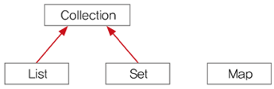

* **`List`와 `Set`을 구현한 컬렉션 클래스들은 서로 많은 공통부분이 있어서, 공통된 부분을 뽑아 `Collection`인터페이스를 정의하였다.**
* **`Map`인터페이스는 이들과는 전혀 다른 형태로 데이터를 다루기 때문에 같은 상속계층도에 포함되지 않았다.**


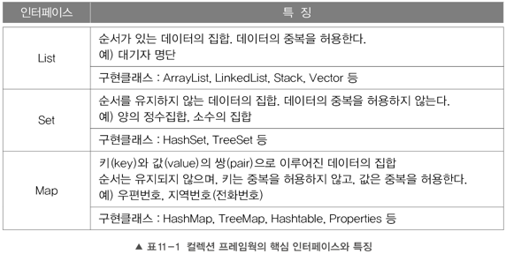

* `Collection Framework`의 모든 컬렉션 클래스들은 `List`, `Set`, `Map` 중의 하나를 구현하고 있다.
  * List : 순서 o 중복 x (대기자 명단)
  * Set : 순서 x 중복 x (집합)
  * Map : 순서 x 키는 중복 x 값은 중복 o


> **`Vector`나 `HashTable`은 같은 기존의(이전의) 컬렉션 클래스들을 호환하기 위해서 존재할 뿐, 가능한 `ArrayList`나 `HashMap`으로 사용하자.**

> 키(key)란, 데이터 집합 중에서 어떤 값(value)를 찾는데 열쇠(key)가 된다는 의미에서 붙여진 이름이다.


---

### 1-1 Collection 인터페이스

`Collection`은 `List`와 `Set`의 조상 인터페이스이다.

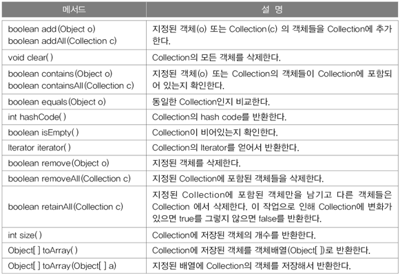

* `Collection`인터페이스는 **컬렉션 클래스에 저장된 데이터를 읽고, 추가하고 삭제하는 등 컬렉션을 다루는데 가장 기본적인 메서드들을 정의**하고 있다.


### 1-2 List인터페이스

**`List`인터페이스는 중복을 허용하면서 저장순서가 유지되는 컬렉션을 구현하는데 사용된다.**

아래는 List인터페이스의 상속계층도이다.

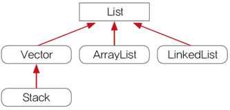

* **주의할 점은 `Stack`이 `Vector`를 상속받고 있다. (`Stack`은 기존에 존재하던 `Vector`를 사용한다.)**

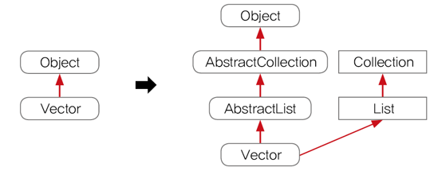

* 위 그림은 JDK1.2 전후의 변화이다.

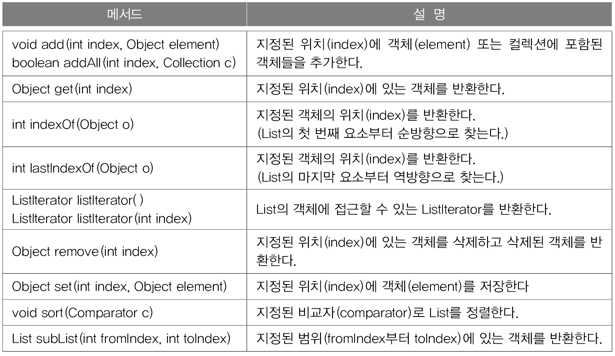


---

### 1-3 Set인터페이스

`Set`인터페이스는 **중복을 허용하지 않고 저장순서가 유지되지 않는 컬렉션 클래스**를 구현하는데 사용된다.

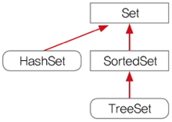

* Set은 '집합'이라고 보면 된다.

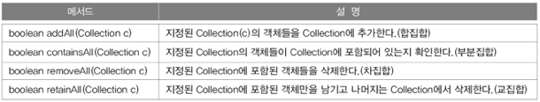


> 여러가지 집합 (출처 : 생활코딩)

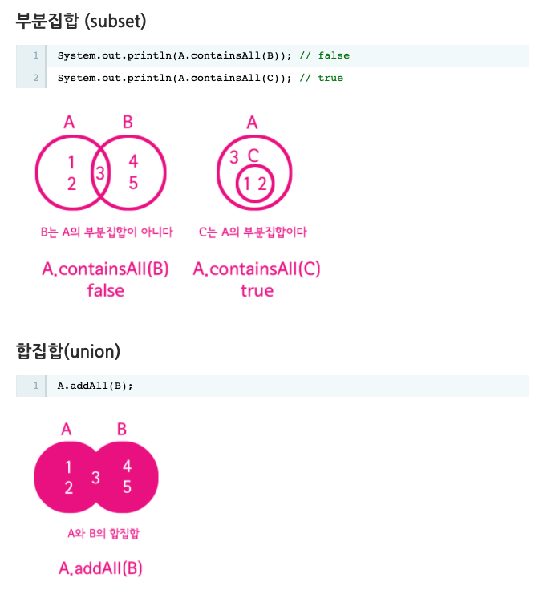

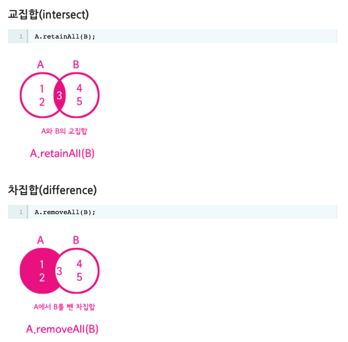


---

### 1-4 Map인터페이스

Map인터페이스는 **키(key)와 값(value)을 하나의 쌍으로 묶어서 저장하는 컬렉션 클래스**를 구현하는데 사용된다.

* 키는 중복 될 수 없다.
* 값은 중복을 허용한다.

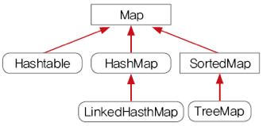

> Map이란, 어떤 두 값을 연결한다는 의미로 붙여진 이름이다.

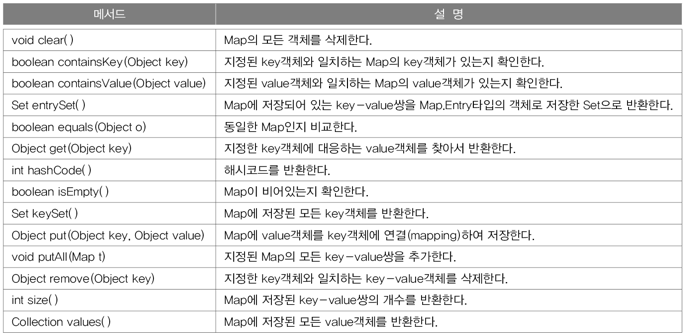

* `values()`- 값은 중복을 허용하기 때문에 `Collection`타입의 모든 `value`객체를 반환한다.
* `keySet()` - 중복을 허용하지 않기 때문에 모든 `Set`객체를 반환한다.


#### Map.Entry인터페이스

`Map.Entry`인터페이스는 `Map`인터페이스의 내부 인터페이스이다.

> 인터페이스도 클래스와 같이 내부인터페이스를 정의할 수 있다.

```java
public interface Map {
  ...
  interface Entry {
    Object getKey();
    Object getValue();
    Object setValue(Object value);
    boolean equals(Object o);
    int hashCode();
    ...
  }
}
```

* `Map`에 저장되는 `key-value`쌍을 다루기 위해 내부적으로 `Entry`인터페이스를 정의해놓았다.
  * **객체지향적으로 설계하도록 유도한 것이며, `Map`인터페이스를 구현하는 클래스에서는 `Map.Entry`인터페이스도 함께 구현해야 한다.**


> Map.Entry 객체의 저장하는 구조는 아래와 같다.

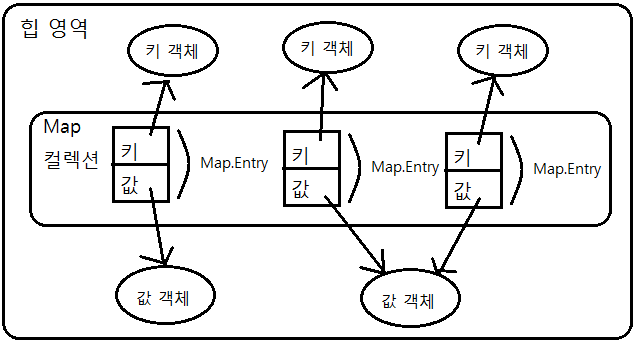

* 키와 값 모두 객체이다.
  * 키는 중복으로 저장될 수 없지만, 값는 중복 저장이 가능하다.


## 2 List

리스트에는 `ArrayList`와 `LinkedList`가 있다.


### 2-1 ArrayList


#### 2-1-1 ArrayList란

`ArrayList`는 기존의 `Vector`를 개선한 것으로 구현원리와 기능적으로 동일하다.

**`Vector`는 자체적으로 동기화처리가 되어 있으나 `ArrayList`는 그렇지 않다.**

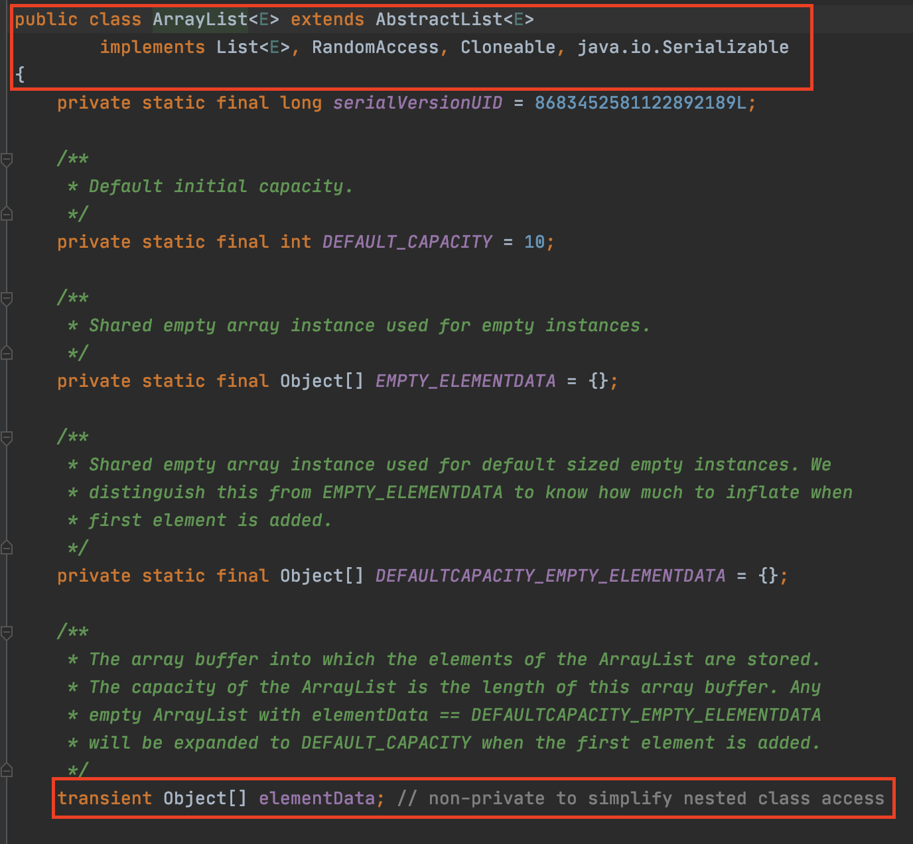

* List인터페이스를 구현하므로, 저장순서가 유지되고 중복을 허용한다.
  * **순차적으로 데이터를 저장한다.**
* 데이터의 저장공간으로 배열을 사용한다.
  * `transient Object[] elementData;`
  * **배열에 더 이상 저장공간이 없으면 보다 큰 새로운 배열을 생성해서 기존의 배열에 저장된 내용을 새로운 배열로 복사한 다음에 저장된다.**

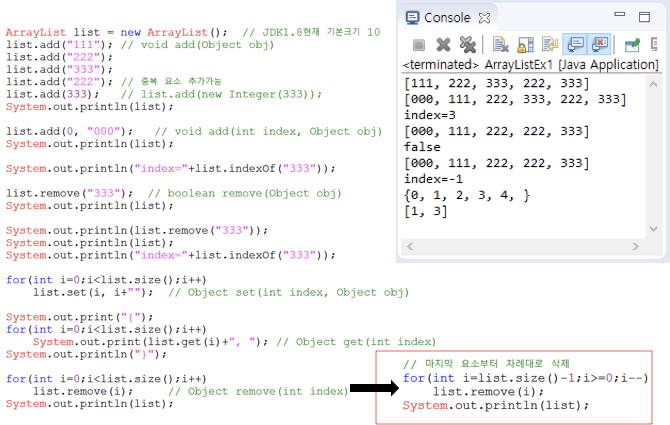


#### 2-1-2 ArrayList의 요소 삭제과정

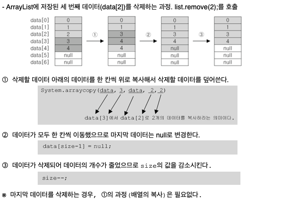

* **한 요소가 삭제될 때마다 빈 공간을 채우기 위해 나머지 요소들이 자리이동을 한다.**

  

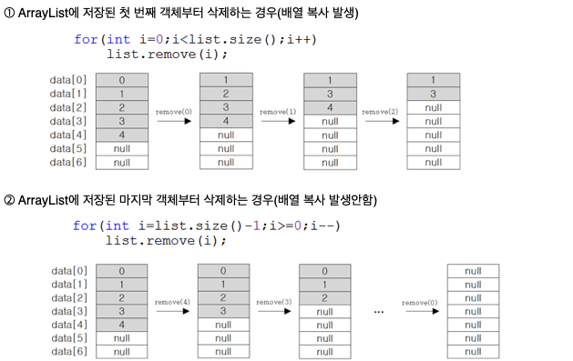

* **인덱스를 가리키는 변수 i를 0부터 증가시켜가면서 요소를 삭제하면 매우 비효율적이다.**
* 그래서 변수 i를 감소시켜가면서 삭제를 해야 자리이동이 발생해도 영향을 받지 않고 비교적 효율적이게 된다.


#### 2-1-3 ArrayList의 크기와 용량

```java
// 1. 용량 (capacity)이 5인 ArrayList를 생성한다.
ArrayList v = new ArrayList(5);
v.add("1");
v.add("2");
v.add("3");

// 2. 빈 공간을 없앤다. ( 용량과 크기가 같아진다. )
v.trimToSize();

// 3. capacity가 6이상 되도록한다.
v.ensureCapacity(6);

// 4. size가 7이 되게 한다.
v.setSize(7);

// 5. ArrayList에 저장된 모든 요소를 제거한다.
v.clear();
```

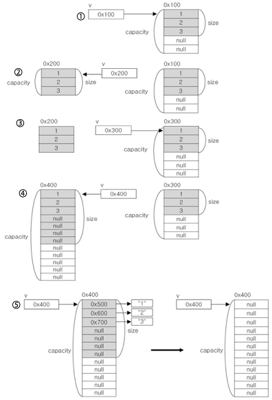

* `ArrayList`는 새로운 크기(size)나 용량(capacity)를 설정하면, 새로운 객체를 생성하여 참조변수를 변경한다.
  * **새로운 객체를 생성하는 비용이 발생하게 된다**.


#### 2-1-4 ArrayList의 특징

##### 기본적인 특징

* 장점 : 배열은 구조가 간단하고 데이터를 읽는 시간이 짧다.
* 단점 : 크기를 변경할 수 없다.
  * **크기를 변경해야되는 경우 새로운 배열을 생성 후 데이터를 복사해야 한다.**
  * **크기 변경을 피하기 위해 충분히 큰 배열을 생성하면 메모리의 낭비**
* 비 순차적인 데이터의 추가, 삭제 시간이 많이 걸린다.
  * **데이터를 추가하거나, 삭제하기 위해 다른 데이터를 옮겨야 한다.**
  * 순차적인 데이터추가는 빠르다. ( 데이터의 끝에 추가, 끝부터 삭제 )


> ArrayList는 처음에 인스턴스를 생성할 때, 저장할 데이터의 개수를 잘 고려하여 충분한 용량의 인스턴스를 생성하는 것이 좋다.


##### Doubling

생성한 `ArrayList`의 용량이 가득 차고, 새로운 데이터를 넣어야 할 때 Doubling이 발생한다.

**Doubling이란 기존 `ArrayList`를 복사해서 `ArrayList` 두 배 크기로 생성하고 복사하는 것을 의미한다.**

> 현재는 `새로운 용량 = 이전용량 + 이전용량 / 2 (전 용량보다 1.5배 증가)`로 되어있다고 한다.


---

### 2-2 LinkedList

앞서 `ArrayList`는 데이터를 읽어오는데 걸리는 시간(접근 시간)은 빨랐지만, 아래와 같은 단점이 있었다.

* 크기를 변경할 수 없다.
* 비순차적인 데이터의 추가 또는 삭제에 시간이 많이 걸린다.

이를 보완하기 위해서 `LinkedList`라는 자료구조가 탄생했다.


> `LinkedList`가 `Queue`와 `Deque`을 모두 구현하고 있다.


#### 2-2-1 LinkedList란

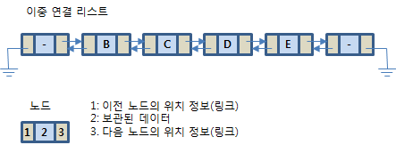

* 불연속적으로 존재하는 데이터를 서로 연결한 형태로 구성된다.
* `LinkedList`의 각 요소(`node`)들은 자신과 연결된 다음 요소에 대한 참조(주소값)과 데이터로 구성되어 있다.


#### 2-2-2 LinkedList의 요소 삭제

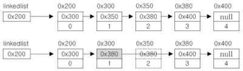

* 단 한 번의 참조변경만으로 가능하다.
  * 삭제하고자 하는 요소의 이전요소가 삭제하고자하는 요소의 다음 요소를 참조하도록 변경하기만 하면 된다.
  * 단 하나의 참조만 변경하면 삭제가 이루어진다.


#### 2-2-3 LinkedList의 요소 추가

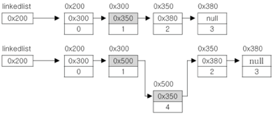

* 한번의 Node객체생성과 두 번의 참조변경만으로 가능하다.


#### 2-2-4 LinkedList의 종류

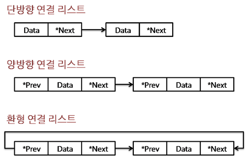

##### 단방향

단방향은 노드에 다음 요소의 참조변수만을 가지고 있는다.

다음 요소에 대한 접근은 쉽지만, 이전 요소에 대한 접근은 어렵다.

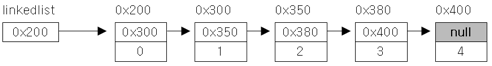

```java
class Node {
  Node next; // 다음 요소의 주소를 저장
  Object obj; // 데이터를 저장
}
```


##### 양방향

양방향은 노드에 다음 요소와 이전 요소의 참조변수 모두 가지고 있다.

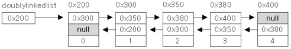

```java
class Node {
  Node next; // 다음 요소의 주소를 저장.
  Node previous; // 이전 요소의 주소를 저장
  Object obj; // 데이터를 저장
}
```

양방향은 단방향보다 각 요소에 대한 접근과 이동이 쉽기 때문에 많이 사용된다.


##### 이중 원형

양방향보다 더 접근성이 좋다.

단순히 양방향의 첫 번째 요소와 마지막 요소를 서로 연결시킨 것이다.

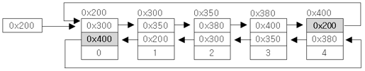


> 자바의 `LinkedList`는 양방향으로 구현되어 있다고 한다.


### 2-3 ArrayList vs LinkedList


#### 데이터 추가/삭제

* 순차적으로 데이터를 추가/삭제 - `ArrayList`가 빠름
  * 마지막 데이터부터 역순으로 삭제해나가는게 제일 빠르다.
* 비순차적으로 데이터를 추가/삭제 - `LinkedList`가 빠름
  * 중간 요소를 추가/삭제하는 경우, `LinkedList`는 각 요소간의 연결만 변경해주면 되기 때문에 훨씬 빠르다.


#### 접근 시간 (탐색)

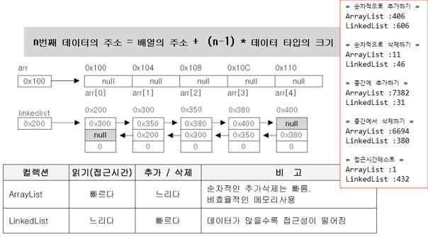

* `ArrayList`는 `n번째 데이터의 주소 = 배열의 주소 + n * 데이터 타입의 크기`를 통해 접근하므로 굉장히 빠르다.
* `LinkedList`는 첫번째 요소나, 마지막 요소부터 하나하나 탐색을 해야하므로 오래 걸린다.
  * **`LinkedList`는 저장해야하는 데이터의 개수가 많아질수록 데이터를 읽어 오는 시간이 점점 길어진다.**


> **다루고자 하는 데이터의 개수가 변하지 않는 경우라면, `ArrayList`가 최상의 선택이 되겠지만,** 
>
> **데이터 개수의 변경이 잦다면 `LinkedList`를 사용하는 것이 더 나은 선택이 될 것이다.**


## 3 Stack과 Queue


### 3-1 Stack과 Queue의 개념

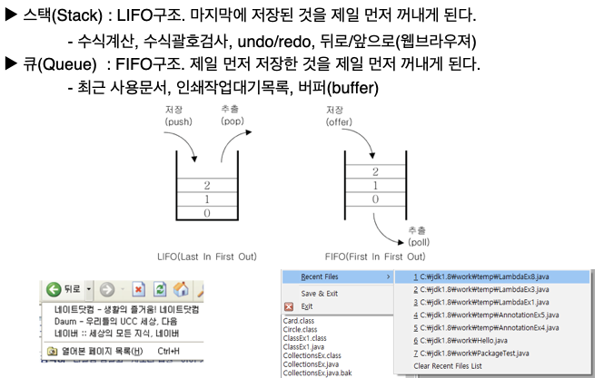

* **스택에는 `ArrayList`와 같은 배열기반의 컬렉션 클래스가 적합하다.**
  * **배열의 끝 요소만 추가/삭제하기 때문에, `ArrayList`가 가장 빠르다.**
* **큐에는 `ArrayList`보다 데이터의 추가/삭제가 쉬운 `LinkedList`로 구현하는 것이 적합하다.**
  * **큐는 데이터를 꺼낼 때 항상 첫 번째 저장된 데이터를 삭제하므로, `ArrayList`와 같은 배열 기반은 부적합하다.**


> 자바에서는 스택을 `Stack`클래스로 구현하여 제공하고 있지만,
>
> **큐는 `Queue`인터페이스로만 정의해 놓았을 뿐 별도의 클래스를 제공하고 있지 않다.**
>
> **대신 `Queue`인터페이스를 구현한 클래스들이 있어서 이들 중의 하나를 선택해서 사용하면 된다.**


```java
Stack st = new Stack();
Queue q = new LinkedList();

st.push("0");

q.offer("0");

while(!st.empty()){
  System.out.println(st.pop());
}

while(!q.isEmpty()){
  System.out.println(q.poll());
}
```


### 3-2 Queue의 변형


#### Deque

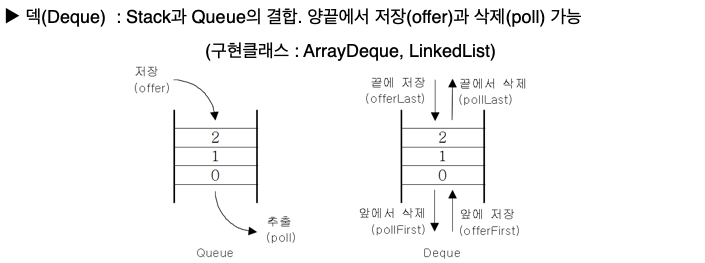

* Deque ( Double - Ended Queue )
  * Deque는 양쪽 끝에 추가/삭제가 가능하다.
  * Deque의 조상은 Queue이다.


> 덱은 스택과 큐를 하나로 합쳐놓은 것과 같으며, 스택으로 사용할 수도 있고, 큐로 사용할 수도 있다.


#### PriorityQueue

Queue인터페이스의 구현제 중의 하나로, 저장한 순서에 관계없이 우선순위(priority)가 높은 것부터 꺼내게 된다는 특징이 있다.


* 우선순위 큐는 힙(heap)이라는 자료구조를 사용한다. 


## 4 Arrays

`Arrays`클래스에는 배열을 다루는데 유용한 메서드가 정의되어 있다.

> `Arrays`에 정의된 메서드는 모두 `static`메서드이다.

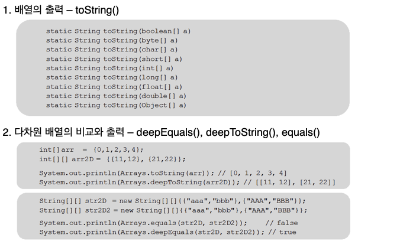

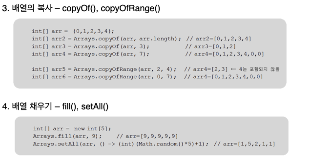

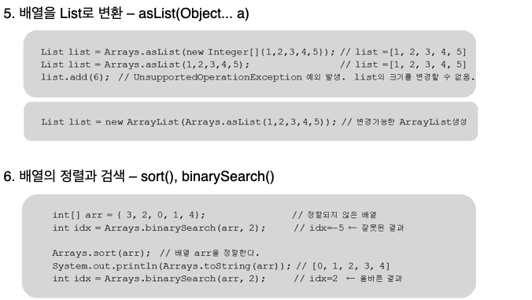


## 5 Comparator와 Comparable

자바에서는 `Arrays.sort()`를 호출만 하면 알아서 배열을 정렬해준다.

**컴퓨터가 알아서 해주는 것 같지만, 사실은 클래스의 `Comparable`의 구현에 의해 정렬되는 것이다.**

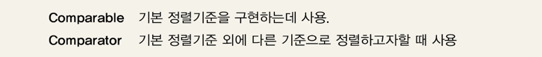

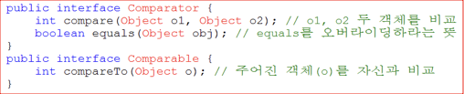

* **`Comparable` : 이미 대부분의 클래스에 구현되어 있는 인터페이스**
* **`Comparator` : 기본 정렬기준 외에 개발자가 원하는 다른 기준으로 정렬하고자 할 때 구현하는 인터페이스**


---

### 5-1 비교 메서드

비교 메서드에는 `compare()`와 `compareTo`가 있다.

**두 메서드는 선언형태와 이름이 약간 다를 뿐 두 객체를 비교한다는 같은 기능을 목적으로 고안되었다.**

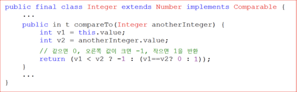

* 두 객체
  * 같으면 0
  * 비교하는 값보다 작으면 음수
  * 비교하는 값보다 크면 양수를 반환한다.


> `compare()`도 객체를 비교해서 음수, 0, 양수 중의 하나를 반환하도록 구현해야 한다.
>
> **`Comparator`은 보통 개발자가 구현하는 인터페이스이므로 개발자가 원하는 규칙에 따라 정렬을 할 수도 있다.**


---

### 5-2 Comparable

**`Comparable`을 구현하고 있는 클래스들은 같은 타입의 인스턴스끼리 서로 비교할 수 있는 클래스들이다.**

wrapper클래스와 `String`, `Date`등의 클래스가 이에 속한다.

> [JAVA 11 API - Comparable](https://docs.oracle.com/en/java/javase/11/docs/api/java.base/java/lang/Comparable.html)에 가보면 어떤 클래스들이 `Comparable`을 구현(`implement`)하고 있는지 나와 있다.


#### 예제

어떠한 객체에 기본적인 정렬 기준을 정해줄 때 Comparable을 구현해주면 된다.

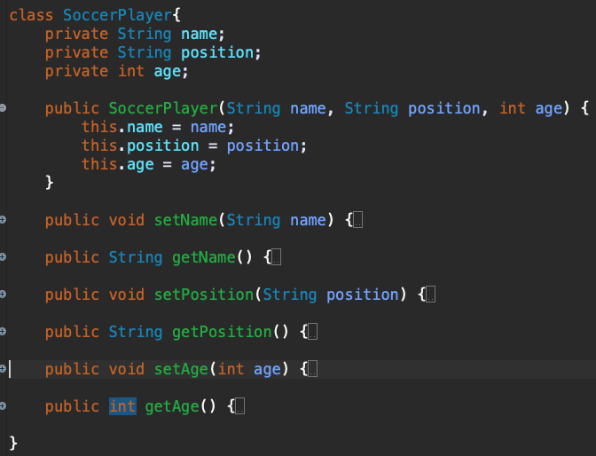

위와 같이 축구선수의 대한 기본 정보를 담는 객체를 만들었다고 가정한다.

**`SoccerPlayer`객체에 정렬을 시도하면 오류가 발생한다. 그 이유는 정렬의 기준을 설정해주지 않았기 때문이다.**

> `Comparable`을 `implement`한 뒤 `compareTo()`메서드를 구현하면 정렬을 할 수 있게 된다.

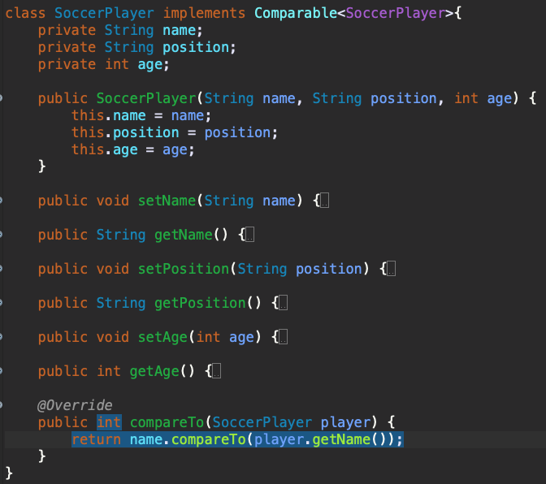

`compareTo`를 오버라이딩하고, 이름을 기준으로 정렬을 시켜주었다.

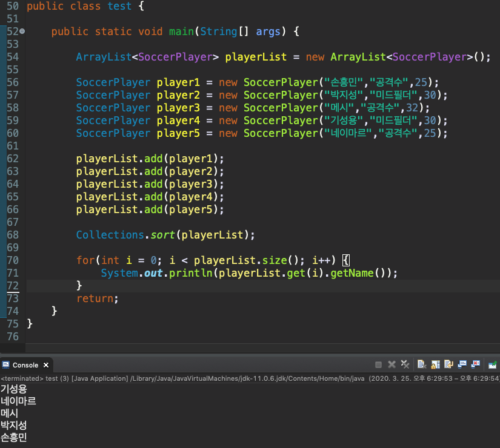

**선수의 이름을 기준으로 정렬된 것을 볼 수 있다.**


> * **개발자가 해야되는 것은 정렬 기준을 잡아주고, 비교 코드를 만들어주는 것이다.**
>
> * **`Arrays.sort`의 정렬 기준은 대상이 되는 객체에 있어야 한다. (`compareTo`, `compare`중 하나)**


---

### 5-3 Comparator

`Comparator`은 보통 기본 정렬기준 외에 다른 기준으로 정렬하고자할 때 사용한다.

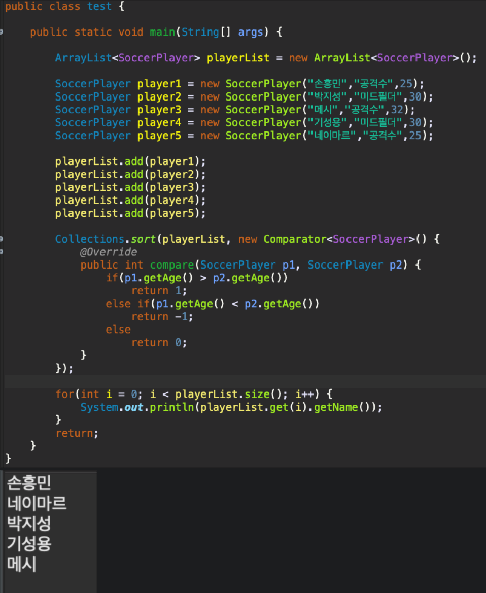

* **위와 같이 객체에 직접 구현하지 않고 단발성으로 원하는 정렬을 할 때 사용되는 것 같다.**

  

> `Comparable`과 `Comparator` 모두 동일하게 사용 될 수 있다.
>
> 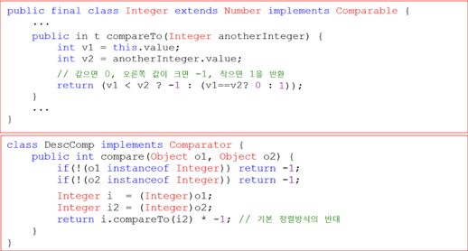
>
> **일반적으로 이미 구현된 클래스에는 `Comparable`을 개발자가 직접 새로운 클래스나 단발적인 정렬을 원할 때는 `Comparator`을 사용하는 것 같다.**


## 6 Set

자바의 `Set`인터페이스에는 `HashSet`과 `TreeSet`이 있다.

> `Set`의 특징
>
> * 순서 X
> * 중복 X


* `HashSet`
  * `Set`인터페이스를 구현한 대표적인 컬렉션 클래스
  * 순서를 유지하려면, `LinkedHashSet`클래스를 사용해야 한다.
* `TreeSet`
  * 범위 검색과 정렬에 유리한 컬렉션 클래스
  * `HashSet`보다 데이터 추가, 삭제에 시간이 더 걸린다. (자동적으로 정렬을 하기 때문)


---

### 6-1 HashSet

`HashSet`은 해싱(hashing)을 이용한 `Set`이다.


#### hashCode과 equals

`HashSet`은 다음과 같은 과정을 통해 객체의 중복을 제거한다.


* **`HashSet`에서는 `equals()`만으로 객체를 판단하지 않고 `hashCode()`도 같이 판단한다.**
  * `equals()`와 `hashCode()`가 동등하게 나와야 같은 객체로 판단한다.


> **두 객체에 대해 `equals`메서드를 호출한 결과가 `true`이면, 두 객체의 해시코드는 반드시 같아야하지만, **
>
> **두 객체의 해시코드가 같다고 해서 `equals`메서드의 호출결과가 반드시 `true`이어야 하는 것은 아니다.**


> 예제 1

```java
public class Test {
    public static void main(String[] args) {
        Object[] objArr = {"1", new Integer("1"), "2", "2", "3", "3", "4", "4", "4"};
        Set set = new HashSet();

        for(int i = 0; i < objArr.length; i++){
            set.add(objArr[i]); // HashSet에 objArr의 요소들을 저장.
        }

        // HashSet에 저장된 요소들을 출력
        System.out.println(set);
    }
}

// 결과 ( 1이 두번이나 저장되었다. )
[1, 1, 2, 3, 4]
```

* `Set`은 중복된 값을 저장하지 않는다.
  * **`add`메서드는 객체를 추가할 때 `HashSet`에 이미 같은 객체가 있으면 중복으로 간주하고 저장하지 않는다.**
* "1"이 두 번 출력 된 것을 볼 수 있다.
  * **둘 다 "1"로 보이지만, 하나는 `String`인스턴스이고, 다른 하나는 `Integer`인스턴스이다.**
  * **서로 다른 객체이므로 중복으로 간주하지 않는 것이다.**


> 예제 2

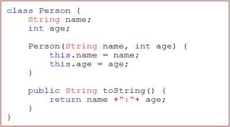

```java
public class Test {
    public static void main(String[] args) {

        HashSet<Person> hashSet = new HashSet<>();

        Person person1 = new Person("kim", 10);
        Person person2 = new Person("kim", 10);

        hashSet.add(person1);
        hashSet.add(person2);

        System.out.println(hashSet);
    }
}

// 결과
[name : kim, age : 10, name : kim, age : 10]
```

* **`Person`의 `name`과 `age`가 같은 객체를 두 개 만들어 `HashSet`에 넣으면 동일하지 않는 객체로 인식한다.**
  * **즉, `person1`과 `person2`를 동일한 객체로 보지 않는다는 것이다.**

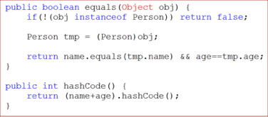

* 위와 같이 Person클래스에서 `equals()`와 `hashCode()`를 오버라이딩 해주면 동일 객체로 인식하게 할 수 있다.

```java
class Person {
    String name;
    int age;

    public Person(String name, int age) {
        this.name = name;
        this.age = age;
    }

    @Override
    public String toString() {
        return "name : "+ this.name + ", age : "+this.age;
    }

    @Override
    public int hashCode() {
        return (name+age).hashCode();
    }

    @Override
    public boolean equals(Object obj) {
        // Person으로 형변환이 안된다면
        if(!(obj instanceof Person))
            return false;

        Person tmp = (Person)obj;
        return this.name.equals(tmp.name) && this.age == tmp.age;
    }
}

public class Test {
    public static void main(String[] args) {

        HashSet<Person> hashSet = new HashSet<>();

        Person person1 = new Person("kim", 10);
        Person person2 = new Person("kim", 10);

        hashSet.add(person1);
        hashSet.add(person2);

        System.out.println(hashSet);
    }
}
// 결과
[name : kim, age : 10]
```

* **두 개의 `Person`을 `add`했지만, 하나로 인식하는 것을 볼 수 있다.**
  * 두 인스턴스의 `name`과 `age`가 서로 같으면 `true`를 반환하도록 `equals()`를 구현하였다.
  * 두 인스턴스의 `name`과 `age`를 합친 내용을 바탕으로 `hashCode()`를 구현하였다.


> JDK 1.8부터는 아래와 같이 많이 사용된다고 한다.
>
> ```java
> public int hashCode() {
>   return Objects.hash(name, age);
> }
> ```


#### 집합연산

아래 예제는 두 개의 HashSet에 저장된 객체들을 비교해서 합집합, 교집합, 차집합을 구현하는 방법을 보여준다.

```java
public class Test {
    public static void main(String[] args) {

        HashSet setA = new HashSet();
        HashSet setB = new HashSet();
        HashSet setSum = new HashSet(); // 합집합
        HashSet setIntersection = new HashSet(); // 교집합
        HashSet setComplement = new HashSet(); // 차집합

        // 집합 A
        setA.add("1"); setA.add("2"); setA.add("3");
        System.out.println("A = "+setA);

        // 집합 B
        setB.add("3"); setB.add("4"); setB.add("5");

        // 교집합 구하기
        Iterator it = setB.iterator();
        while(it.hasNext()){
            Object tmp = it.next();
            if(setA.contains(tmp))
                setIntersection.add(tmp);
        }

        // 차집합 구하기
        it = setA.iterator();
        while(it.hasNext()){
            Object tmp = it.next();
            if(!setB.contains(tmp))
                setComplement.add(tmp);
        }

        // 합집합 구하기
        it = setA.iterator();
        while(it.hasNext())
            setSum.add(it.next());

        it = setB.iterator();
        while(it.hasNext())
            setSum.add(it.next());

        System.out.println("A ∩ B = "+setIntersection);
        System.out.println("A ∪ B = "+setSum);
        System.out.println("A - B = "+setComplement);
    }
}
```


---

### 6-2 TreeSet

`TreeSet`은 이진 검색 트리(binary search tree, BST)라는 자료구조의 형태로 데이터를 저장하는 컬렉션 클래스이다.

**BST는 정렬, 검색, 범위검색에 높은 성능을 보이는 자료구조이며 `Treeset`은 BST의 성능을 향상시킨 '레드-블랙 트리'로 구현되어 있다.**


#### 이진 트리

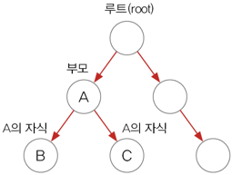

이진 트리는 링크드리스트처럼 여러 개의 노드가 서로 연결된 구조로, 각 노드에 최대 2개의 노드를 연결할 수 있으며, 

'루트'라고 불리는 하나의 노드에서 부터 시작해서 계속 확장해 나간다.

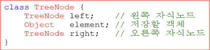


#### BST

**이진 검색 트리(BST)는 부모노드의 왼쪽에는 부모노드의 값보다 작은 값의 자식노드를 오른쪽에는 큰 값의 자식노드를 저장하는 이진트리이다.**

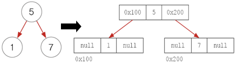


BST에 7, 4, 9, 1, 5의 순서로 데이터를 저장하면, 아래의 과정을 거친다.

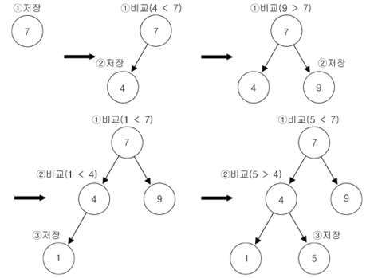

* 왼쪽 마지막 레벨 : 제일 작은 값
* 오른쪽 마지막 레벨 : 제일 큰 값


> **컴퓨터는 알아서 값을 비교하지 않는다.**
>
> **`Treeset`에 저장되는 객체가 `Comparable`을 구현하던가 아니면 `Comparator`를 제공해서 두 객체를 비교할 방법을 알려줘야 한다.**


#### 특징

`Treeset`은 이진트리검색을 따르며, 이진트리검색의 특징은 아래와 같다.

* 모든 노드는 최대 두 개의 자식노드를 가질 수 있다.
* **왼쪽 자식노드의 값은 부모노드의 값보다 작고 오른쪽자식노드의 값은 부모노드의 값보다 커야한다.**
* **노드의 추가/삭제에 시간이 걸린다. ( 순차적으로 저장하지 않고, 추가/삭제마다 정렬을 하기 때문이다. )**
* **검색(범위검색)과 정렬에 유리하다.**
* 중복된 값을 저장하지 못한다.


#### 범위 검색

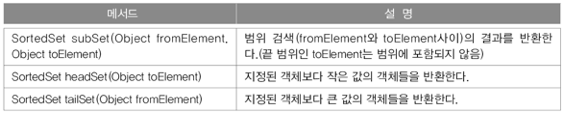


> 문자열 범위 검색 ( subSet )

```java
public class Test {

    public static void main(String[] args){
        TreeSet set = new TreeSet();

        String from = "b";
        String to = "d";

        set.add("abc"); set.add("alien"); set.add("bat"); set.add("car");
        set.add("Car"); set.add("disc"); set.add("dance"); set.add("dZZZZ");
        set.add("dzzzz"); set.add("elephant"); set.add("elevator"); set.add("fan");
        set.add("flower");

        System.out.println(set);
        System.out.println("range search : from "+from +" to "+to);
        System.out.println("result1 : "+set.subSet(from, to));
        System.out.println("result2 : "+set.subSet(from, to+"zzz"));
    }
}
// 결과
[Car, abc, alien, bat, car, dZZZZ, dance, disc, dzzzz, elephant, elevator, fan, flower]
range search : from b to d
result1 : [bat, car]
result2 : [bat, car, dZZZZ, dance, disc]
```

* `subSet()`을 이용해서 범위검색 할 때 시작범위는 포함되지만 끝 범위는 포함되지 않는다.
  * [ , )
  * **만약 끝 범위인 `d`로 시작하는 단어까지 포함시키고자 한다면, `zzz`를 붙이면 된다.**
    * `d`로 시작하는 단어 중에서 `dzzz` 다음에 오는 단어는 없을 것에 `d`로 시작하는 모든 단어들이 포함될 것이다.
    * 한마디로 `dzzz`가 `d`의 마지막 점(?)이라고 생각하면 된다.
* `set`의 결과를 보면 `Car`가 `abc`보다 우선인 것을 볼 수 있다.
  * **이는 `TreeSet`의 기본적인 정렬이 `ASCII`코드로 되어 있어서 그런 것이다. (오름차순)**
  * **아스키코드에서 대문자(A = 65)가 소문자(a = 97) 보다 작다.**   


> 정수의 범위 검색 (headSet, tailSet)

```java
public class Test {

    public static void main(String[] args){
        TreeSet set = new TreeSet();

        int[] score = {80, 95, 50, 35, 45, 65, 10, 100};

        for(int i = 0; i < score.length; i++)
            set.add(score[i]);

        System.out.println("50보다 작은 값 : "+set.headSet(50));
        System.out.println("50보다 큰 값 : "+set.tailSet(50));
    }
}
// 결과
50보다 작은 값 : [10, 35, 45]
50보다 큰 값 : [50, 65, 80, 95, 100]
```

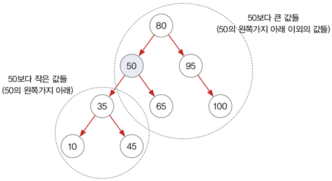

* **`headSet`과 `tailSet`을 이용하면 `TreeSet`에 저장된 객체 중 지정된 기준 값보다 큰 객체나 작은 객체을 구할 수 있다.**


## 7 Map

`Map`인터페이스를 구현한 클래스들은 데이터를 키와 값의 쌍으로 저장한다.

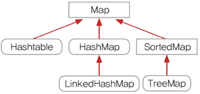

* `HashMap`
  * `Map`인터페이스를 구현한 대표적인 컬렉션 클래스
  * 순서를 유지하려면, `LinkedHashMap`클래스를 사용하면 된다.
* `TreeMap`
  * 범위 검색과 정렬에 유리한 컬렉션 클래스
  * `HashMap`보다 데이터 추가, 삭제에 시간이 더 걸린다.


> `Hashtable`과 `HashMap`의 관계를 `Vector`와 `ArrayList`의 관계롸 같다.
>
> * **`HashMap`(동기화 X)은 `Hashtable`(동기화 O)의 신버전이다.**


---

### 7-1 HashMap

> `HashMap`은 보조 해시 함수(`Additional Hash Function`)를 사용하기 때문에 **보조 해시 함수를 사용하지 않는 `HashTable`에 비하여 해시 충돌(`hash collision`)이 덜 발생할 수 있어 상대으로 성능상 이점이 있다.**

> `HashMap`과 `HashTable`을 정의한다면, '키에 대한 해시 값을 사용하여 값을 저장하고 조회하며, 키-값 쌍의 개수에 따라 동적으로 크기가 증가하는 `associate array`'라고 할 수 있다. **이 associate array를 지칭하는 다른 용어가 있는데, 대표적으로 `Map`, `Dictionary`, `Symbol Table` 등이다.**

> **`map`(또는 `mapping`)은 원래 수학 함수에서의 대응 관계를 지칭하는 용어로**, 경우에 따라서는 함수 자체를 의미하기도 한다. 즉 `HashMap`이란 이름에서 알 수 있듯이, **`HashMap`은 키 집합인 정의역과 값 집합인 공역의 대응에 해시 함수를 이용한다.**
>
> 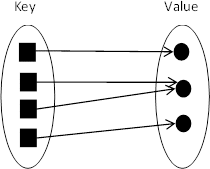


#### Hashing

해싱이란 해시함수를 이용해서 데이터를 해시테이블에 저장하고 검색하는 기법을 말한다.

> 해시 함수란?
>
> * ***인덱스 계산기***

> 자바의 `HashMap`에서 사용하는 방식은 `Separate Channing(닫힌 어드레싱 방법)`이다. `Open Addressing`은 데이터를 삭제할 때 처리가 효율적이기 어려운데, `HashMap`에서 `remove()` 메서드는 매우 빈번하게 호출될 수 있기 때문이다. 게다가 `HashMap`에 저장된 키-값 쌍 개수가 일정 개수 이상으로 많아지면, 일반적으로 `Open Addressing`은 `Separate Chaining`보다 느리다.


> **해시테이블에 저장된 데이터를 가져오는 과정**

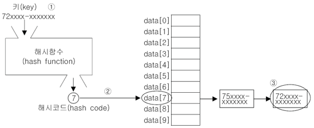

1. 키로 해시함수를 호출해서 해시코드를 얻는다.
2. 해시코드(해시함수의 반환값)에 대응하는 `LinkedList`를 배열에서 찾는다.
3. `LinkedList`에서 키와 일치하는 데이터를 찾는다.
   * **이 방법은 `LinkedList`에 데이터가 점점 쌓일수록 연산이 오래 걸린다.**


> **자바에서 사용하는 해싱 자료구조는 "배열"과 "링크드 리스트의 조합으로 되어 있다."**


* **이는 해싱의 충돌 기법중 "닫힌 어드레싱"방법에 속한다.**
* 저장할 데이터의 키를 해시함수에 넣으면 배열의 한 요소를 얻게 되고, 다시 그 곳에 연결되어 있는 링크드 리스트에 저장하게 된다.
  * 아래와 같이 서랍이 대표적인 예제이다.


* **`HashMap`의 성능을 최대한으로 끌어 올릴려면, 해시함수가 서로 다른 키에 대해서 중복된 해시코드의 반환을 최소화 해야 한다.**
  * **서랍을 많이 만들어야하고, 서랍마다 서류를 조금만 가지고 있어야 사람도 빨리 찾을 수 있다.**


> 여러가지 정보
>
> * `HashMap`과 같이 해싱을 구현한 클래스들은 Object클래스에 정의된 `hashCode()`를 해시함수로 사용한다.
>   * `String`의 경우 `hashCode()`를 오버라이딩하여 문자열 내용으로 해시코드를 만든다.
> * `HashMap`도 `HashSet`과 동일하게 `equals()`와 `hashCode()`모두를 비교하여 객체를 인식한다.


#### HashMap


* **해싱기법으로 데이터를 저장한다.**
  * 데이터가 많아도 검색이 빠르다.
* **Map인터페이스를 구현. 데이터를 키와 값의 쌍으로 저장한다.**


#### Entry

**`HashMap`은 `Map`을 구현했으므로 앞에서 살펴본 `Map`의 특징, 키와 값을 묶어서 하나의 데이터(`entry`)로 저장한다.**


* `entry`로 저장하면 더 객체지향적인 코드가 완성된다.


* **`HashMap`은 `Entry`라는 내부 클래스를 정의하고, 다시 `Entry`타입의 배열을 선언하고 있다**.
  * 키와 값을 별개의 값으로 하는 것보다 하나의 클래스로 정의해서 하나의 배열로 다루는 것이 데이터의 무결성적인 측면에서 더 바람직하기 때문이다.


* `transient`로 선언된 이유는 직렬화(`serialize`)할 때 전체, `table` 배열 자체를 직렬화하는 것보다 키-값 쌍을 차례로 기록하는 것이 더 효율적이기 때문이다.


#### 주요 메서드

> `public Set<Map.Entry<K,V>> entrySet()`
>
> * `HashMap`에 저장된 키와 값을 엔트리(키와 값의 결합)의 형태로 Set에 저장해서 반환.
> * `Set`을 반환한다.
>   * `Set`의 요소는 `Map.Entry`이다.
>   * **`Map.Entry`는 `HashMap`에 저장되는 키와 값으로 구성된 일반적인 클래스이다.**
>
> 
>
> `public Set<K> keySet()`
>
> * `HashMap`에 저장된 모든 키가 저장된 `Set`을 반환.

```java
// Map에 저장된 요소들을 전부 출력하는 예제
public class Test {

    public static void main(String[] args){

        HashMap<String, String> hashMap = new HashMap<>();
        hashMap.put("key1", "value1");
        hashMap.put("key2", "value2");
        hashMap.put("key3", "value3");
        hashMap.put("key4", "value4");
        hashMap.put("key5", "value5");

        // 방법 1 : entrySet()
        System.out.println("--------entrySet()--------");
        for(Map.Entry<String, String> entry : hashMap.entrySet()){
            System.out.println("key : "+entry.getKey()+", value : "+entry.getValue());
        }

        // 방법 2 : keySet()
        System.out.println("--------keySet()--------");
        for(String key : hashMap.keySet()){
            System.out.println("key : "+key+", value : "+hashMap.get(key));
        }

        // 방법 3 : entrySet().iterator()
        System.out.println("--------entrySet().interator()--------");
        Set<Map.Entry<String, String>> set = hashMap.entrySet();
        Iterator<Map.Entry<String, String>> it = set.iterator();
        while(it.hasNext()){
            Map.Entry<String, String> e = it.next();
            String key = e.getKey();
            String value = e.getValue();
            System.out.println("key : "+key+", value : "+value);
        }

        // 방법 4 : keySet().iterator()
        System.out.println("--------keySet().iterator()--------");
        Iterator<String> iteratorK = hashMap.keySet().iterator();
        while(iteratorK.hasNext()){
            String key = iteratorK.next();
            String value = hashMap.get(key);
            System.out.println("key : "+key+", value : "+value);
        }
    }
}
// 결과
--------entrySet()--------
key : key1, value : value1
key : key2, value : value2
key : key5, value : value5
key : key3, value : value3
key : key4, value : value4
--------keySet()--------
key : key1, value : value1
key : key2, value : value2
key : key5, value : value5
key : key3, value : value3
key : key4, value : value4
--------entrySet().interator()--------
key : key1, value : value1
key : key2, value : value2
key : key5, value : value5
key : key3, value : value3
key : key4, value : value4
--------keySet().iterator()--------
key : key1, value : value1
key : key2, value : value2
key : key5, value : value5
key : key3, value : value3
key : key4, value : value4
```


#### 예제

```java
public class Test {

    static HashMap phoneBook = new HashMap();

    public static void main(String[] args){
        addPhoneNo("친구", "이자바", "010-111-1111");
        addPhoneNo("친구", "김자바", "010-222-2222");
        addPhoneNo("친구", "김자바", "010-333-3333");
        addPhoneNo("회사", "김대리", "010-444-4444");
        addPhoneNo("회사", "김대리", "010-555-5555");
        addPhoneNo("회사", "박대리", "010-666-6666");
        addPhoneNo("회사", "이과장", "010-777-7777");
        addPhoneNo("세탁", "010-888-8888");

        printList();
    }

    // 그룹을 추가하는 메서드
    static void addGroup(String groupName){
        if(!phoneBook.containsKey(groupName)){
            phoneBook.put(groupName, new HashMap());
        }
    }

    // 그룹에 전화번호를 추가하는 메서드
    static void addPhoneNo(String groupName, String name, String tel){
        addGroup(groupName);
        HashMap group = (HashMap)phoneBook.get(groupName);
        group.put(tel, name); // 이름은 중복가능하므로, 전화번호를 key로 저장
    }

    static void addPhoneNo(String name, String tel){
        addPhoneNo("기타", name, tel); // default값 설정해주는 것과 비슷
    }

    // 전화번호 전체를 출력하는 메서드
    static void printList(){
        Set set = phoneBook.entrySet(); // Set<Map.Entry<String, HashMap>>

        Iterator it = set.iterator();

        while(it.hasNext()){
            Map.Entry e = (Map.Entry)it.next();

            Set subSet = ((HashMap)e.getValue()).entrySet();
            Iterator subIt = subSet.iterator();

            System.out.println(" * "+e.getKey()+"["+subSet.size()+"]");

            while(subIt.hasNext()){
                Map.Entry subE = (Map.Entry)subIt.next();
                String telNo = (String)subE.getKey();
                String name = (String)subE.getValue();
                System.out.println(name+" "+telNo);
            }
            System.out.println();
        }
    }
}

// 결과
 * 기타[1]
세탁 010-888-8888

 * 친구[3]
이자바 010-111-1111
김자바 010-222-2222
김자바 010-333-3333

 * 회사[4]
이과장 010-777-7777
김대리 010-444-4444
김대리 010-555-5555
박대리 010-666-6666
```


---

### 7-2 TreeMap

`Treemap`은 이름에서 알 수 있듯이 BST의 형태로 키와 값의 쌍으로 이루어진 데이터를 저장한다.

`TreeSet`과 비슷한 특징을 가지고 있다.

* `TreeSet`처럼 데이터를 정렬(키)해서 저장하기 때문에 저장 시간이 길다.
  * 실제로  `TreeSet`은 `TreeMap`을 이용해서 구현되어 있다.
* 다수의 데이터에서 개별적인 검색은 `TreeMap`보다 `HashMap`이 더 빠르다.
* **`Map`이 필요할 때 주로 `HashMap`을 사용하고, 정렬이나 범위검색이 필요한 경우에 `TreeMap`을 사용한다.**


#### 예제

`TreeMap`의 `Value`를 가지고 정렬을 예제이다.

```java
public class Test {
    public static void main(String[] args){

        String[] data = { "A","K","A","K","D","K","A","K","K","K","Z","D" };

        TreeMap<String, Integer> treeMap = new TreeMap<>();

        // data의 요소들 출현 빈도 체크
        for(int i = 0; i < data.length; i++){
            if(treeMap.containsKey(data[i])){
                int tmp = treeMap.get(data[i])+1;
                treeMap.put(data[i], tmp);
            } else {
                treeMap.put(data[i], 1);
            }
        }

        // 출력 ( 기본정렬로 되어 있다. key(String)를 기준으로 정렬 )
        System.out.println("= 기본 정렬 = ");
        for(Map.Entry entry : treeMap.entrySet()){
            System.out.println(entry.toString());
        }

        // 값을 기준으로 정렬 ( entrySet()을 통한 정렬 )
//        Set<Map.Entry<String, Integer>> mapEntry = treeMap.entrySet();
//        List list = new ArrayList(mapEntry);

        // Collections는 list의 매개변수만 받아들인다.
//        Collections.sort(list, new Comparator<Object>() {
//            @Override
//            public int compare(Object o1, Object o2) {
//                if(o1 instanceof Map.Entry && o2 instanceof Map.Entry){
//                    Map.Entry e1 = (Map.Entry)o1;
//                    Map.Entry e2 = (Map.Entry)o2;
//
//                    int v1 = (Integer)e1.getValue();
//                    int v2 = (Integer)e2.getValue();
//
//                    return v2-v1;
//                }
//                return -1;
//            }
//        });
//
//        System.out.println("= 값을 기준으로 정 = ");
//        for(int i = 0; i < list.size(); i++){
//            Map.Entry<String, Integer> e = (Map.Entry)list.get(i);
//            System.out.println(e.toString());
//        }

        // Key값만 가지고 정렬을 하면 더 쉽다.
        List<String> keySetList = new ArrayList<>(treeMap.keySet());
        // 값을 통한 내림차순 ( 키 값만 가지고, 값에 접근하여 정렬을 한다. )
        Collections.sort(keySetList, new Comparator<String>() {
            @Override
            public int compare(String o1, String o2) {
                return treeMap.get(o2).compareTo(treeMap.get(o1)); // 내림차순
                // return treeMap.get(o1).compareTo(treemap.get(o2)); // 오름차
            }
        });

        System.out.println("= 값을 기준으로 정 = ");
        for(String key : keySetList){
            System.out.println(key+"="+treeMap.get(key));
        }

    }
}
// 결과
= 기본 정렬 = 
A=3
D=2
K=6
Z=1
= 값을 기준으로 정 = 
K=6
A=3
D=2
Z=1
```


---

### 7-3 Properties

`Properties`의 특징

* **내부적으로 `Hashtable`을 사용하며, `key`와 `value`를 `(String, String)`으로 저장한다.**
* 주로 어플리케이션의 환경설정에 관련된 속성을 저장하는데 사용되며 파일로부터 편리하게 값을 읽고 쓸 수 있는 메서드를 제공한다.


## 8 Collections

`Collections`는 컬렉션을 위한 메서드(`static`)을 제공한다.

> `java.util.Collection`은 인터페이스이고, `java.util.Collections`는 클래스이다.


### 8-1 synchronized

**멀티 쓰레드에서는 하나의 객체를 여러 쓰레드가 동시에 접근 할 수 있기 때문에, 데이터의 일관성을 유지하기 위해서는 공유되는 객체에 동기화가 필요하다.**

**`Vector`와 `Hashtable`같이 구버전은 자체적으로 동기화가 되어 있지만, 싱글 쓰레드 환경에서는 성능 저하를 일으킨다.**

**그래서 `ArrayList`와 `HashMap`처럼 신버전에서는 동기화를 자체적으로 처리하지 않고, 필요한 경우 `Collections`에서 메서드를 사용하여 동기화를 시키도록 하였다.**


### 8-2 unmodifiableXXX

멀티 쓰레드에서 여러 쓰레드가 하나의 컬렉션을 공유하다보면 데이터가 손상될 수 있다.

컬렉션에 저장된 데이터를 보호하기 위해 컬렉션의 내용을 변경할 수 없게 하는 메서드이다. ( Read Only )


### 8-3 singletonXXX (싱글톤)

싱글톤 기능을 제공하는 메서드이다.


* 매개변수로 저장할 요소를 지정하면, 해당 요소를 저장하는 컬렉션을 반환한다. 그리고 반환된 컬렉션은 변경할 수 없다.


#### 싱글톤이란?

**애플리케이션이 시작될 때 어떤 클래스가 최초 한번만 메모리를 할당하고(`static`) 그 메모리에 인스턴스를 만들어 사용하는 디자인 패턴이다.**

생성자가 여러 차례 호출되더라도 실제로 객체는 하나고 최초 생성 이후에 호출된 생성자는 최초에 생성한 객체를 반환한다.

> 싱글톤은 단 하나의 인스턴스를 생성해 사용하는 디자인 패턴이다.
>
> * **인스턴스가 필요 할 때 똑같은 인스턴스를 만들어 내는 것이 아니라, 동일(기존) 인스턴스를 사용하게 한다.**

```java
class Singleton {
  // getInstance()에서 사용될 수 있도록 인스턴스가 미리 생성되어야 하므로 static이다.
  private static Singleton s = new Singleton(); 
  
  private Singleton() {
    ...
  }
  
  // 인스턴스를 생성하지 않고도 호출할 수 있어야 하므로 static
  public static Singleton getInstance() {
    return s;
  }
  ...
}
```

출처 : https://jeong-pro.tistory.com/86


### 8-4 checkedXXX

컬렉션에 지정된 종류의 객체만 저장할 수 있도록 제한하고 싶을 때 사용하는 메서드이다.

> 한 종류의 객체만 저장하는 컬렉션 만들기


## 9 Collection Framework의 큰 그림


