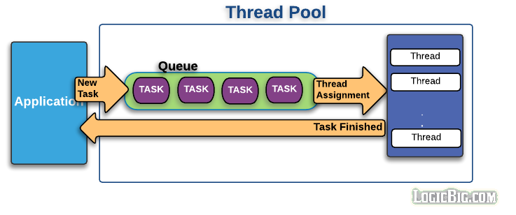
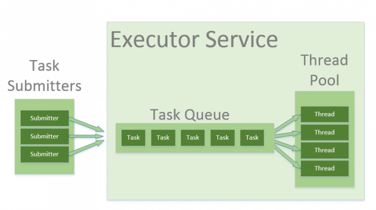
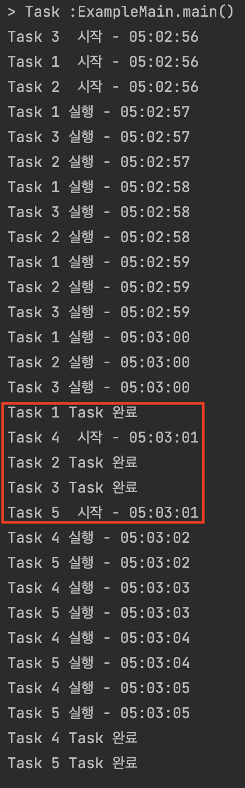

# 목차

<br>

- [목차](#목차)
- [들어가며](#들어가며)
- [ThreadPool이 등장하게 된 배경](#threadpool이-등장하게-된-배경)
- [ThreadPool은 어떻게 동작하는가?](#threadpool은-어떻게-동작하는가)
- [Thread Pool In Java](#thread-pool-in-java)
  - [Executor vs ExecutorService](#executor-vs-executorservice)
  - [ThreadPool 사용 예시](#threadpool-사용-예시)
- [ExecutorService](#executorservice)
  - [ExecutorService 구현체](#executorservice-구현체)
  - [꼭 Shutdown을 해줘야한다](#꼭-shutdown을-해줘야한다)
  - [Execute Runnable vs Submit Runnable](#execute-runnable-vs-submit-runnable)
  - [Runnable vs Callable](#runnable-vs-callable)
  - [invokeAny() vs invokeAll()](#invokeany-vs-invokeall)
  - [Task Cancel](#task-cancel)
- [마치며](#마치며)
- [참고](#참고)

<br>

# 들어가며
이전 글에서 Thread에 대한 기본 개념과 Thread In Java에 대해서 다뤘다면 이번 글에선 ThreadPool에 대한 기본 개념과 자바에선 어떻게 사용되는지 다룬다.

우선 ThreadPool에 대한 기본적인 개념에 대해서 다루고, Java에서 ThreadPool을 다루기 위해 꼭 알아야하는 `Executor`와 `ExecutorService`에 대해서 정리하였다.

<br>

# ThreadPool이 등장하게 된 배경

<br>

❗️ **ThreadPool을 사용하지 않는다면**

많은 프로그램은 스레드를 이용하여 병렬 (혹은 병행)처리를 한다.

문제는 점차 필요한 스레드의 개수가 많아지면서, 잦은 스레드 생성과 스케줄링으로 인해 CPU와 메모리 사용량이 증가한다.

각 스레드는 메모리(RAM)과 같은 특정 수준의 컴퓨터 리소스를 사용하기 때문에 동시에 너무 많은 스레드가 활성된다면 컴퓨터의 속도가 저하된다.

또한 스레드의 생성 개수를 제어하기 힘들기 때문에 자칫하면 컴퓨터가 멈출 수도 있다.

> 예를 들어, 메모리(RAM)이 너무 많이 소모되어 OS가 RAM을 Disk로 스왑아웃하기 시작하면 속도는 현저히 느려진다.

물론 스레드 생성뿐만 아니라 회수도 해야한다..

<br>

👍 **ThreadPool을 사용한다면**

**ThreadPool의 핵심은 `스레드 재사용`이다.**

ThreadPool을 사용하지 않는 기존의 Thread 전략은 한번 사용하면 종료되고 다시 만들어애했다.

하지만 ThreadPool은 정해진 숫자만큼 만들어둔 **기존 스레드를 종료시키지않고 계속해서 작업을 맡겨 실행하게 된다.**

> 스레드를 미리 만들어두고 작업이 들어올면 스레드들에게 작업을 적절히 분배한다.

<br>

🤔 **그래서 뭐가 좋다는건데? - Thread Pool의 장점**

결론적으론 정해진 숫자의 기존 스레드를 재사용하기 때문에 리소스 사용량을 절약하고, 총 처리량도 더 높일 수 있다.

1. 스레드 풀을 사용하면 한 번에 활성 상태인 스레드 수를 쉽게 제어할 수 있다. 이를 통해 스레드의 생성과 회수로 인한 부하를 줄일 수 있다.
2. 한 번에 많은 요청이 들어올 때 빠르고 효율적으로 동시 작업을 수행할 수 있다.

<br>

❗️ **그렇다고 좋은 것만은 아니다 - Thread Pool의 단점**

1. 메모리 낭비
   * ThreadPool은 Thread를 미리 만들어두고 재사용한다는 측면에서 굉장히 유용한 솔루션이다.
   * 하지만 **몇 개의 Thread를 미리 만들어둘지가 중요하다. 만약 너무 많은 스레드를 만들어둔다면 메모리만 차지하고 아무것도 하지 않는 스레드가 존재할 수도 있다.**
2. 놀고먹는 스레드 발생 가능성
   * 병렬적으로 처리요청을 한다면 한 스레드는 요청을 처리하느라 허덕이고 있는와중에 다른 스레드는 놀고있을 수 있다.
   * 이로인해 미리 만들어둔 스레드를 잘 활용하지 못할 수도 있는 문제가 있다.
   * 물론 이는 자바에서는 `ForkJoinPool`을 지원한다.
3. DeadLock
   * ThreadPool만의 문제라기보다는 멀티스레딩 환경에서 발생할 수 있는 대표적인 문제점은 데드락이다. ThreadPool도 데드락이 발생할 수 있다.
   * ThreadPool에 경우, 만약 하나의 Task의 결과를 기다리는 또 다른 Task를 Queue에 넣으면 데드락이 발생할 확률이 높다.
4. 스레드 없어짐 문제
   * ThreadPool에 미리 생성된 스레드가 요청을 처리하고나서 다시 대기상태가 안되고 제거될 수 있다. (재사용 불가)
   * 예를 들어, 스레드에 할당된 Task가 예외를 던졌는데 해당 예외를 잡지 못한다면 Thread 자체가 종료되기 때문에 ThreadPool에서 스레드의 개수가 하나씩 줄어들 수 있다.

<br>

# ThreadPool은 어떻게 동작하는가?

<p align="center"><br>출처: https://www.logicbig.com/tutorials/core-java-tutorial/java-multi-threading/thread-pools.html </p>

사실 위 그림만봐도 ThreadPool이 어떻게 동작하는지 알 수 있다. 그래도 조금 글로 정리하자면 다음과 같다.

* ThreadPool에 요구에 맞는 스레드를 재사용하기 위해 미리 생성해둔다. (New ThreadPool)
* 새로운 작업이 들어올 때마다 TaskQueue에 넣는다. (New Task)
* TaskQueue에서 하나씩 꺼내서 분할 방식에따라 유휴 스레드에 작업을 할당한다. (Thread Assignment)
* 각 작업이 완료되면, 콜백 형태로 작업을 요청한 주체에게 결과를 알려준다. (Task Finished)

> ThreadPool은 어렵고 복잡한 기술이라기보다는 그저 Thread를 잘 활용할 수 있게해주는 디자인패턴에 가깝다고 생각한다.

<br>

# Thread Pool In Java
자바는 5버전부터 자체적으로 Thread Pool을 지원하기 시작했다. `java.util.concurrent` 패키지에 ThreadPool과 관련된 클래스가 존재한다.

자바에서의 ThreadPool도 아래와 같이 동일하게 동작한다.

<p align="center"><br>출처: https://www.baeldung.com/thread-pool-java-and-guava </p>

스레드 풀의 실제 구현에서 코드를 분리한 상태로 유지하고 애플리케이션 전체에서 이러한 인터페이스를 사용해야 합니다.

자바는 ThreadPool과 관련된 코드를 비즈니스 로직과 분리시키기위해 `Executor`과 `ExecutorService`라는 인터페이스로 추상화시켰으며, `Executors`라는 유틸성 클래스를 만들어 편의 메서드를 제공한다. 

<br>

## Executor vs ExecutorService

자바에서는 ThreadPool과 관련된 코드를 `Executor`과 `ExecutorService`로 추상화시켰다. 그렇다면 이 둘의 차이점은 무엇일까?

<br>

🤔 `Executor`

```java
public interface Executor {
    // Executes the given command at some time in the future. 
    // The command may execute in a new thread, in a pooled thread, or in the calling thread, at the discretion of the Executor implementation.
    void execute(Runnable command);
}
```

**`Executor`는 넘겨받은 Runnable Task를 실행하는 메서드를 가진 간단한 인터페이스다.**

인터페이스로 따로 빼둔 이유는 넘겨받은 Task를 스레드가 어떻게 실행할지, 스레드 스케줄링은 어떻게 할지등을 추상화시키기 위함이다.

쉽게 얘기하자면 기존엔 `new Thread(new RunnableTask()).start()`해야했던 작업을 아래와 같이 추상화 시킨것이다.

```java
Executor executor = anExecutor;
executor.execute(new RunnableTask1()); // 새로운 Task를 어떻게 처리할지는 Executor 구현체에 따라 다르다.
executor.execute(new RunnableTask2());
```

> 한마디로하면 OCP를 사용한 것.

<br>

**이렇게 추상화시킴으로써 아래와같이 상황에 맞게 Executor 구현체를 만들어 Task를 처리할 수 있게 되었다.**

<br>

1. 동기적으로 Task 처리 (Thread를 활용한 비동기를 사용하지 않음)

```java
class DirectExecutor implements Executor {
    public void execute(Runnable r) {
        r.run();
    }
}
```

<br>

2. 매 Task마다 새로운 스레드를 생성하여 처리

```java
class ThreadPerTaskExecutor implements Executor {
    public void execute(Runnable r) {
        new Thread(r).start();
    }
}
```

<br>

3. Task를 특정 스레드에 스케줄링할 때 컴포지트 혹은 프록시 패턴과 같이 사용하여 처리할 수 있다.

```java
class SerialExecutor implements Executor {
    final Queue<Runnable> tasks = new ArrayDeque<Runnable>();
    final Executor executor;
    Runnable active;

    SerialExecutor(Executor executor) {
        this.executor = executor;
    }

    public synchronized void execute(final Runnable r) {
        tasks.offer(new Runnable() {
           try {
              r.run();
           } final {
              // 매 Task마다 끝나면 다음 Task 호출.
              scheduleNext();
           }
        });

        // 만약 현재 active(실행)되고있는 Task가 없다면 다음 Task 호출.
        if (active == null) {
           scheduleNext();
        }
    }

    // TaskQueue에서 다음 Task를 꺼내서 스레드에 스케줄링. (실행)
    protected synchronized void scheduleNext() {
        if ((active == tasks.poll() != null)) {
            executor.execute(active);
        }
    }
}
```

위와 같이 `Executor`라는 인터페이스를 분리시킴으로써 상황에 맞는 구현체를 만들거나 조합해서 다양하게 사용할 수 있다.

<br>

🤔 `ExecutorService`

```java
public interface ExecutorService extends Executor {

    void shutdown();

    List<Runnable> shutdownNow();

    boolean isShutdown();

    boolean isTerminated();

    boolean awaitTermination(long timeout, TimeUnit unit)
        throws InterruptedException;

    <T> Future<T> submit(Callable<T> task);

    <T> Future<T> submit(Runnable task, T result);

    Future<?> submit(Runnable task);

    <T> List<Future<T>> invokeAll(Collection<? extends Callable<T>> tasks)
        throws InterruptedException;

    <T> List<Future<T>> invokeAll(Collection<? extends Callable<T>> tasks,
                                  long timeout, TimeUnit unit)
        throws InterruptedException;

    <T> T invokeAny(Collection<? extends Callable<T>> tasks)
        throws InterruptedException, ExecutionException;

    <T> T invokeAny(Collection<? extends Callable<T>> tasks,
                    long timeout, TimeUnit unit)
        throws InterruptedException, ExecutionException, TimeoutException;
}
```

`ExecutorService`는 Task를 관리하고 제어하는데 사용되는 Execute 인터페이스의 하위 인터페이스이다.

쉽게 말해 `Execute`보다 더 확장된 기능을 제공하기위한 인터페이스이다.

ThreadPool을 종료하는 메서드와 하나 이상의 비동기 작업을 추적하기 위한 `Future`를 반환하는 메서드를 제공한다.

* `ExecutorService`는 안전하게 종료할 수 있게 두 메서드를 제공한다.
  * `shutdown()`: 종료전에 요청된 Task (실행중인 Task + 대기중인 Task)는 모두 수행하도록하고 종료된다.
  * `shutdownNow()`: 대기 중인 Task가 시작되는 것을 멈추도록하고, 현재 실행중인 Task도 중지한다.
* `ExecutorService`는 `Executor.execute(Runnable)`를 확장하여 Task를 취소하거나 완료를 기다릴 때 사용되는 `Future`을 만들어 반환한다.
* `ExecutorService`는 `invokeAny`와 `invokeAll`을 통해 여러 개의 Task를 한번에 Submit되도록 벌크 연산을 지원한다.

<br>

🤔 `Executor` vs `ExecutorService`

* `Executor`: 주어진 Runnable을 실행만 한다.
* `ExecutorService`: `Execute`의 확장 -> `Execute`의 실행뿐만 아니라 시작하거나 종료하는등의 여러 기능을 확장.

<br>

💁‍♂️ 간단 예시 - Thread Pool을 활용하여 들어오는 요청을 처리하는 예시

> NetworkService.java

```java
class NetworkService implements Runnable {
    private final ServerSocket serverSocket;
    private final ExecutorService pool;

    public NetworkService(int port, int poolSize) throws IOException {
        serverSocket = new ServerSocket(port);
        pool = Executors.newFixedThreadPool(poolSize);
    }

    public void run {
        try {
           for (;;) {
              pool.execute(new Handler(serverSocket.accept()));
           }
        } catch (IOException ex) {
           pool.shutdown();
        }
    }
}
```

> Handler.java

```java
class Handler implements Runnable {
    private final Socket socket;
    
    Handler (Socket socket) {
        this.socket = socket;
    }

    public void run() {
       // read and service request on socket
    }
}
```

<br>

## ThreadPool 사용 예시

자바에서 제공하는 `FixedThreadPool`을 이용한 간단한 스레드 풀 예시

<br>

> Task.java

```java
public class Task implements Runnable {

    private String name;

    public Task(String name) {
        this.name = name;
    }

    @Override
    public void run() {
        try {
            for (int i = 0; i < 5; i++) {
                Date now = new Date();
                SimpleDateFormat dateFormat = new SimpleDateFormat("hh:mm:ss");

                if (i == 0) {
                    System.out.println(this.name + "  시작 - " + dateFormat.format(now));
                } else {
                    System.out.println(this.name + " 실행 - " + dateFormat.format(now));
                }
                Thread.sleep(1_000);
            }
        } catch (InterruptedException e) {
            e.printStackTrace();
        }
        System.out.println(this.name + " Task 완료");
    }
}
```

> ExampleMain.java

```java
public class ExampleMain {

    public static void main(String[] args) {
        // given
        Runnable task1 = new Task("Task 1");
        Runnable task2 = new Task("Task 2");
        Runnable task3 = new Task("Task 3");
        Runnable task4 = new Task("Task 4");
        Runnable task5 = new Task("Task 5");

        ExecutorService threadPool = Executors.newFixedThreadPool(3); // ThreadPool의 Queue 최대 사이즈 3개 설정

        // when
        threadPool.execute(task1);
        threadPool.execute(task2);
        threadPool.execute(task3);
        threadPool.execute(task4);
        threadPool.execute(task5);

        // and
        threadPool.shutdown();
    }
}
```

<p align="center"><br> 실행 결과 </p>

* ThreadPool의 ThreadCore 최대 사이즈를 3개로 설정하여 5개의 Task를 요청한 예시이다.
  * 최대 사이즈가 3이기 때문에 `Task4`와 `Task5`는 `Task1, 2, 3`중 하나가 끝나 `완료` 상태가되서야 시작하는 것을 볼 수 있다.

<br>

# ExecutorService

자바에서 ThreadPool을 사용하는 코드를 보면 대부분 `ExecutorService`를 구현한 클래스를 사용한다. 가장 중요하다고 볼 수 있다.

> 실제로 [HikariCP의 일부 코드](https://github.com/brettwooldridge/HikariCP/blob/dev/src/main/java/com/zaxxer/hikari/pool/HikariPool.java)를 보면 `ExecutorService`를 구현한 `ThreadPoolExecutor`를 사용한다. 
> 
> 정확한 것은 아니다.. 추후에 HikariCP를 정리할 때 한번 더 알아볼 예정.

이번 챕터에선 `ExecutorService`의 대해서 정리하였다.

우선 어떻게 생성하는지, 어떤 구현체가 있는지 설명한다. 그리고 Task를 어떤 방식으로 요청하고 컨트롤하는지에 대해서 다룬다. 

> `ExecutorService`가 무엇인지에 대해선 [위에 정리한 내용](#executor-vs-executorservice)을 참고.

<br>

## ExecutorService 구현체

자바에서 제공하는 `ExecutorService`의 구현체는 다양하다. 그리고 이 인터페이스를 구현한 객체는 ThreadPool 역할을 한다.

그런 의미에서 `ExecutorService`를 구현한 구현체 대부분은 ThreadPool이라고 봐도 될 것 같다.

`ExecutorService`의 구현체는 크게 두 개로 나뉜다.

* `java.util.concurrent.ThreadPoolExecutor`
* `java.util.concurrent.ScheduledExecutorService`

<br>

💁‍♂️ `java.util.concurrent.ThreadPoolExecutor`

<br>

```java
// 직접 생성
int  corePoolSize  =    5;
int  maxPoolSize   =   10;
long keepAliveTime = 5000;

ExecutorService threadPoolExecutor =
        new ThreadPoolExecutor(
                corePoolSize,
                maxPoolSize,
                keepAliveTime,
                TimeUnit.MILLISECONDS,
                new LinkedBlockingQueue<Runnable>()
        );

// Executors 이용하여 생성
ExecutorService executorService = Executors.newSingleThreadExecutor();
ExecutorService executorService = Executors.newFixedThreadPool(int nThreads);
ExecutorService executorService = Executors.newCachedThreadPool();
```

* 동작 과정
  * 주어진 Task (Callable 혹은 Runnable)을 내부적으로 동작하고 있는 ThreadPool을 이용해서 실행한다.
* 설정
  * Thread 개수
    * `corePoolSize`: Thread 개수 (Thread가 놀고있어도 계속 유지되는 개수)
    * `maximumPoolSize`: 최대 Thread 개수 (TaskQueue가 Full인 상태에서 corePoolSize보다 더 많은 스레드가 필요하면 Thread를 생성한다. 이때의 최대 생성 개수)
  * `KeepAliveTime`: Thread KeepAlive 시간
  * `unit`: KeepAliveTime 단위
  * `workQueue`: TaskQueue의 구현체 (ex. Runnable을 저장하는 BlockingQueue)
* Executors에서 제공하는 편의 메서드
  * `Executors.newSingleThreadExecutor()`: 단일 스레드 생성
    * 실패 시 새로 스레드를 생성하지 않는다 -> `corePoolSize: 1, maximumPoolSize: 1`
  * `Executors.newFixedThreadPool(int nThreads)`: 고정 개수의 스레드 생성.
    * 모든 스레드가 작업중이면 TaskQueue에 작업을 적재한다. -> `corePoolSize: n, maximumPoolSize: n`
  * `Executors.newCachedThreadPool()`: 필요에 따라 새로운 스레드를 생성하며, 이전에 생성했던 스레드가 존재하면 재사용한다.
    * 디폴트로는 60초동안 스레드가 유지된다. -> `corePoolSize: 0, maximumPoolSize: Integer.MAX_VALUE`

> 설정에 대한 더 자세한 내용은 [여기](https://www.logicbig.com/tutorials/core-java-tutorial/java-multi-threading/thread-pools.html)를 참고.

<br>

💁‍♂️ `java.util.concurrent.ScheduledThreadPoolExecutor`

<br>

```java
public class ScheduledExecutorExample {

    public static void main(String[] args) throws ExecutionException, InterruptedException {
        ScheduledExecutorService scheduledExecutorService =
                Executors.newScheduledThreadPool(5);

        ScheduledFuture<String> scheduledFuture =
                scheduledExecutorService.schedule(
                        () -> {
                            System.out.println("Executed!");
                            return "Callable Result";
                        },
                        5,
                        TimeUnit.SECONDS
                );
        
        System.out.println("실행 결과 (5초후) : " + scheduledFuture.get());
        scheduledExecutorService.shutdown();
    }
}
// 결과
Executed!
실행 결과 (5초후) : Callable Result
```

* 동작과정
  * 지정된 시간만큼 Delay후 Task를 실행하거나 주기적으로 실행한다.
  * `ThreadPoolExecutor`과 동일하다. 다만 `ScheduledExecutorService`인터페이스를 구현함으로써 `schedule` 메서드를 구현하고 있다.
    * `public class ScheduledThreadPoolExecutor extends ThreadPoolExecutor implements ScheduledExecutorService {}`
* 주요 메서드
  * `schedule(Callable task, long delay, TimeUnit timeunit)`
  * `schedule(Runnable task, long delay, TimeUnit timeunit)`
  * `scheduleAtFixedRate(Runnable task, long initialDelay, long period, TimeUnit timeunit)`
  * `scheduleWithFixedDelay(Runnable task, long initialDelay, long period, TimeUnit timeunit)`

> 더 자세한 내용은 [여기](http://tutorials.jenkov.com/java-util-concurrent/scheduledexecutorservice.html)를 확인.

<br>

## 꼭 Shutdown을 해줘야한다

모든 요청을 처리하고 더 이상 사용하지 않는다면 어떠한 `ExecutorService`든 `shutdown()`을 해야한다.

안그럼 JVM이 계속해서 ThreadPool의 Thread가 활성화된 상태에서 Task를 기다리기 때문에 프로그램이 종료되지 않는다.

> 종료시키는 메서드로는 `shutdown()`, `shutdownNow()`, `awaitTermination()`등이 있다.

<br>

## Execute Runnable vs Submit Runnable
`ExecuteService`는 `Executor`를 상속받는 인터페이스이기 때문에 단 건의Task를 요청하는 방법이 크게 두 가지있다.

바로 `execute(Runnable)`와 `submit(Runnable)`이다.

두 메서드는 모두 비동기 (asynchronously)적으로 동작한다는 공통점이있다.

> `submit(Callable)`도 있다. Runnable와 Callable에 관련된 차이는 아래서 다룬다.

<br>

💁‍♂️ `void execute(Runnable command)`

```java
ExecutorService executeService = Executors.newSingleThreadExcutor();

executeService.execute(() -> {
    System.out.println("비동기 Task 실행");
});

executeService.shutdown();
```

`execute`는 `Executor`의 추상 메서드이며, 인자로 넘어오는 `Runnable`을 비동기적으로 실행한다. 

특징으로는 `Callable`을 받는 `submit`과 다르게 실행에 대한 결과를 얻을 수 없다.

<br>

💁‍♂️ `<T> Future<T> submit(Callable<T> task)`

```java
<T> Future<T> submit(Callable<T> task);

<T> Future<T> submit(Runnable task, T result);

Future<?> submit(Runnable task);
```

<br>

> submit(Runnable) 예시

```java
Future<?> future = executorService.submit(() -> {
    System.out.println("비동기 Task");
});

System.out.println(future.get()); // null이 나오면 Task가 정상적으로 처리되었다는 의미.
System.out.println(future.isDone()); // true
```

`submit`은 `ExecutorService`의 추상 메서드이며, 인자로 넘어노는 `Callable` 혹은 `Runnable`을 비동기적으로 실행한다.

`execute`와 동일하게 `Runnable`을 인자로 받아 Task를 처리할 수 있다. 다만, `Future` 객체를 반환하며, 이를 통해 인자로 넘어온 `Runnable`이 모두 완료되었는지 체크할 수 있다.

<br>

> submit(Callable) 예시

```java
Future<String> future = executorService.submit(() -> {
    System.out.println("비동기적 Task");
    return "비동기적 Task 완료";
});

System.out.println(future.get()); // "비동기적 Task 완료"가 출력되면 Task가 정상적으로 처리되었다는 의미
System.out.println(future.isDone()); // true
```

`submit`은 `Runnable`뿐만 아니라 `Callble`도 인자로 받아 Task를 처리할 수 있다.

`Callable`을 인자로 준다면 비동기적으로 요청한 Task의 결과도 받아볼 수 있다.

> `Runnable`과 `Callable`의 차이는 바로 아래서 다룬다.

<br>

## Runnable vs Callable

Task를 만들어 스레드에 할당하기 위해선 두 인터페이스중 하나를 구현해야한다.

사실 이 두 인터페이스의 차이점은 코드를 보면 쉽게 파악할 수 있다.

> Runnable.java

```java
public interface Runnalbe {
    public abstract void run();
}
```

> Callable.java

```java
public interface Callable {
    V call() throws Exception;
}
```

차이점은 아래와 같다.

* 리턴값 유무
  * `Callable.call()`은 Task를 처리 후 결과 값을 반환할 수 있다. 반면에, `Runnable.run()`은 결과 값을 반환할 수 없다.
* Checked Exception 유무
  * `Callable.call()`은 Checked Exception`을 던질 수 있다. 반면에, `Runnable.run()`은 Checked Exception을 던질 수 없다.
  * 물론, Unchecked Exception은 둘 다 던질 수 있다.

> 생각보다 별거 없다. 그저 Task에 대한 결과를 얻어야하는 경우 `Callable`을 이용하고, 결과가 필요없다면 `Runnable`을 이용하면 된다.

<br>

## invokeAny() vs invokeAll()
`invoke`가 붙은 메서드는 여러 개의 Task를 한번에 요청할 때 사용된다.

<br>

💁‍♂️ `invokeAny()`

`invokeAny()`는 `Callable`을 구현한 객체(Task)의 컬렉션을 매개변수로 받는다.

매 `Callable`의 `Future`를 반환하지 않고, 넘겨받은 컬렉션중 하나의 `Callable`에 대한 결과만을 반환한다.

`<T> T invokeAny(Collection<? extends Callable<T>> tasks) throws ...`

즉, 요청한 Task (Callable)중에서 하나라도 완료되면 해당 Task의 결과를 반환하고, 나머지 Task는 모두 Cancel한다.

> If one of the tasks complete (or throws an exception), the rest of the Callable's are cancelled.

<br>

```java
// invokeAny() 예시
public static void main(String[] args) throws ExecutionException, InterruptedException {
    ExecutorService executorService = Executors.newSingleThreadExecutor();

    Set<Callable<String>> callables = new HashSet<>();
    callables.add(() -> "Task 1 Completed");
    callables.add(() -> "Task 2 Completed");
    callables.add(() -> "Task 3 Completed");

    String result = executorService.invokeAny(callables);
    System.out.println(result); // Task 1 or Task 2 or Task 3

    executorService.shutdown();
}

// 결과
// Task 1 Completed 혹은 Task 2 Completed 혹은 Task 3 Completed
```

<br>

💁‍♂️ `invokeAll()`

`invokeAll()` 메서드는 `invokeAny()`와 다르게 모든 Task가 완료되어야 결과를 반환한다.

하나라도 완료되지 않았다면 holding된다. 

결과는 `List<Future>`를 반환하며, 넘겨받은 Task (`Callable`)가 정상 처리되었던 예외가 발생하여 끝났던 완료된 것으로 본다.

즉, 동작중에 전달받은 Task들이 변경되거나 잘못되어도 결과를 보장하지 않는다.

> 잘못사용하면 요청한 `Callable` 결과를 기다리느라 Blocking이 되어 원치않게 성능이 저하될 수도 있다.

<br>

```java
// invokeAll() 예시
public static void main(String[] args) throws InterruptedException, ExecutionException {
    ExecutorService executorService = Executors.newSingleThreadExecutor();

    Set<Callable<String>> callables = new HashSet<>();
    callables.add(() -> "Task 1 Completed");
    callables.add(() -> "Task 2 Completed");
    callables.add(() -> "Task 3 Completed");

    // 만약 Task들의 시간이 오래 걸린다면 여기서 Block되어 성능이 저하될 수도 있다.
    List<Future<String>> futures = executorService.invokeAll(callables);

    for (Future<String> future : futures) {
        System.out.println(future.get());
    }

    executorService.shutdown();
}
// 결과
Task 2 Completed
Task 3 Completed
Task 1 Completed
```

<br>

## Task Cancel

`ExecutorService`에 요청한 Task (Runnable 혹은 Callable)은 `Future.cancel()`메서드를 호출하여 취소할 수 있다.

다만, Task가 아직 실행전일 때만 취소할 수 있다. 만약 실행중이라면 취소할 수 없다.

```java
future.cancel();
```

<br>

# 마치며
예상보다 글이 길어졌다. 그래도 ThreadPool에 대한 개념을 잡을 수 있었고, 자바에선 어떻게 처리하는지 큰그림을 그릴 수 있었다.

누군가에겐 도움이 되는 글이 되기를~~~

> 간단한 ThreadPool을 직접 구현해보고싶다면 [여기](http://tutorials.jenkov.com/java-concurrency/thread-pools.html)를 참고하면 된다.
> 
> 필자는 직접 구현해보니 조금은 도움이 되었다.

<br>

# 참고
* https://en.wikipedia.org/wiki/Thread_pool
* http://tutorials.jenkov.com/java-concurrency/thread-pools.html
* http://tutorials.jenkov.com/java-util-concurrent/executorservice.html
* https://www.javatpoint.com/java-thread-pool
* https://stackoverflow.com/questions/15052317/whats-the-difference-between-executor-and-executorservice
* https://docs.oracle.com/javase/8/docs/api/java/util/concurrent/Executor.html
* https://docs.oracle.com/javase/8/docs/api/java/util/concurrent/ExecutorService.html
