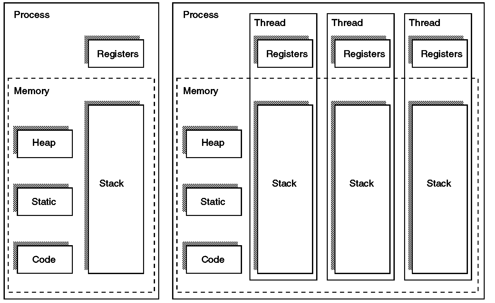

# 목차

 

 

# 들어가며
자바는 개발자가 멀티 스레드 프로그램을 만들도록 지원하는 대표적인 프로그래밍 언어이다.

본격적으로 자바에서의 멀티 스레드와 관련된 동시성에 대해서 다루기 전에 스레드에 대한 개념을 정리하고자 한다.

이번 글은 스레드란 무엇이며 멀티 스레드와 관련된 다양한 내용에 대해서 정리하였다.

> 추후에 스레드와 관련된 내용의 사전 개념이므로 꼭 알고 넘어가면 좋을 내용만 정리해보았다.

 

# Process와 Thread
동시성 프로그래밍에선 크게 두 가지의 실행 단위가 존재한다. **바로 프로세스와 스레드이다.**

 Program vs Process vs Thread

이번 챕터에선 간단히 프로세스와 스레드에 대한 개념과 차이점에 대해서 정리하였다.

 

## Process
우선 스레드를 이해하기 위해 꼭 알아야하는 프로세스에 대한 개념을 정리한다.

 

🤔 **프로세스란?**
* **프로세스는 실행 중인 프로그램을 의미한다.**
  * 디스크에 실행파일 형태로 존재하던 프로그램이 메모리(RAM)에 올라가면 생명력을 갖는 프로세스가 된다.
  * 이때부터 프로세스는 CPU를 점유하며 자신의 코드를 수행한다.
* 프로세스는 OS로부터 할당받은 여러 리소스를 가지고 있다.
  * 메모리 (코드와 데이터), 파일, 소켓, 디바이스 핸들러, PCB등등
  * 프로세스는 모두 독립적이므로 리소스도 모두 독립적이다.

 

🤔 **컴퓨터(정확히는 CPU)는 여러 프로세스를 어떻게 동시에 실행할까?**

컴퓨터 내의 가장 핵심적인 역할을 하는 중앙 처리 장치인 CPU는 사람의 뇌와 같다.

사람이 두 가지의 생각을 동시에 하지 못하듯, 하나의 CPU도 동시에 두 개의 프로세스를 실행하고 관리하지 못한다.

그렇지만, **컴퓨터는 여러 개의 프로그램이 함께 동작하는 것 처럼 프로세스를 처리한다.** (마치 동시에 실행되는 것 처럼)

제한된 CPU가 여러 개의 프로세스들을 동시에 처리할 수 있는 이유는 병행(Concurrency)으로 처리하기 때문이다.

 병행 처리 예시

위와 같이 크롬과 멜론은 **시분할 (Time-Sharing)으로 CPU를 나눠 사용함으로써 병행성을 만족**한다.

위 과정이 너무 빠르게 반복되고 실행되므로 사람들은 이를 알아차리지 못하는 것이다.

그리고 위 개념을 컴퓨터 공학에선 흔히 `컨텍스트 스위칭`라는 용어로 부른다.

 컨텍스트 스위칭 과정 출처: Operating System (공룡책) 

 

🤔 **프로세스 컨텍스트?**

> 컨텍스트 스위칭에서의 컨텍스트 (문맥)은 무엇인가?

* **프로세스 문맥 (Context)이란?**
  * 프로세스가 현재 어떤 상태에서 수행되고 있는지 정확히 규명하기 위해 필요한 정보를 의미한다.
* **프로세스 문맥 (Context)이 왜 필요한가?**
  * CPU는 시분할 시스템으로 돌아가며, 각각의 프로세스가 문맥 교환 (Context Switching)을 통해 돌아가면서 실행된다.
  * 이때 프로세스는 CPU를 점유하는 시점에, 이전까지 실행한 정확한 상태를 재현할 필요가 있다. 이를 위해 문맥(Context)이 필요하다.
* **프로세스 문맥 구성**
  * 프로세스의 주소 공간 (코드, 데이터, 스택 상태)
  * 레지스터
  * 커널에서 수행한 일의 상태 (커널 스택)
  * PCB
  * ...
* **프로세스 메모리 구조**
  * 코드 영역: 프로세스가 실행할 코드가 기계어의 형태로 저장된 공간.
    * 컴파일 타임에 결정되며 Read-Only이다.
  * 데이터 영역: 전역 변수, static 변수등이 저장된 공간.
    * 컴파일 타임에 결정되며 Read-Write(실행 도중 변경 가능)이다.
  * 힙 영역: 개발자가 관리하는 메모리 영역으로, 동적 할당할 때 사용된다. (ex. malloc)
    * 런타임에 결정되며 개발자에 의해 메모리 공간이 동적으로 할당되고 해제된다.
  * 스택 영역: 호출된 함수의 수행을 마치고 복귀할 주소 및 데이터(지역변수, 매개변수, 리턴값 등)를 임시로 저장하는 공간
    * 컴파일 타임에 결정되며, 정해진 크기가 있으므로 초과시 StackOverFlow가 발생한다.

 

> 프로세스 메모리와 PCB의 차이
> 
> * PCB는 프로세스를 제어하기 위해 운영체제가 저장하는 자료구조이다. (프로세스의 위치 값, PC값 등등)
> * 프로세스 메모리는 그저 프로그램을 실행하는데 필요한 메모리를 저장시켜놓는 공간이다.

 

❗️ 프로세스에 대한 더 자세한 내용은 [여기](https://github.com/binghe819/TIL/blob/master/OS/%EC%9A%B4%EC%98%81%EC%B2%B4%EC%A0%9C%EC%99%80%20%EC%A0%95%EB%B3%B4%EA%B8%B0%EC%88%A0%EC%9D%98%20%EC%9B%90%EB%A6%AC/3%20%ED%94%84%EB%A1%9C%EC%84%B8%EC%8A%A4%20%EA%B4%80%EB%A6%AC.md)를 참고하면 된다.

 

## Thread
이번엔 이번 글의 주제인 Thread에 대해 간단히 다뤄보자.

 

🤔 **Thread?**

 출처: https://ko.wikipedia.org/wiki/스레드_(컴퓨팅)

* **Thread는 경량 프로세스 (lightweight process)라고도 불리우며, 프로세스의 실행 단위를 의미한다.**
* 스레드(thread)는 어떠한 프로그램 내에서, 특히 **프로세스 내에서 실행되는 흐름의 단위**를 말한다.
  * 프로세스가 할당받는 자원을 이용하는 실행 단위

 

🤔 Thread 동작 방식

프로그램을 실행하면 운영체제는 프로세스를 만들어 메모리를 할당하여 적재한다.

실행된 프로세스의 Main 역할을 하는 Thread가 실행되면서 프로세스가 실행된다.

이때 프로세스의 여러 Thread가 동시에 동작하는 것이 아니라, 여러 Thread간의 컨텍스트 스위칭을 하면서 동시에 동작하는 것처럼 보이는 것이다.

**프로세스간에도 컨텍스트 스위칭을 통해 CPU를 점유한다면, 한 프로세스안에서의 Thread간에도 컨텍스트 스위칭을 통해 CPU를 점유한다.**

이떄 프로세스는 PCB, Thread는 TCB라는 이름을 가진 자료구조(저장소가 더 정확할 듯?)로 프로세스와 스레드의 진행사항을 저장한다.

 

🤔 **Thread 개념이 나오게 된 배경**

> 컴퓨터는 여러 프로세스를 시분할로 처리가능한데 왜 Thread라는 개념이 나오게 된 것일까?

* **Thread가 없을 때의 단점**
  1. 프로세스간의 컨텍스트 스위칭 오버헤드
     * 프로세스는 프로세스마다의 독립적인 메모리를 가진다. 그러므로 멀티 프로세스로 동작한다면 빈번한 컨텍스트 스위칭으로 인한 성능 저하가 발생한다.
  2. 프로세스간의 통신의 어려움
     * 프로세스들은 독립된 주소공간을 가지고 있기 때문에, 단순한 방법으로 서로의 메모리 공간을 접근할 수 없다.
     * IPC (Inter-Process Communication)을 이용해야하며, 메시지 전달 방식과 공유메모리 방식으로 나뉜다.
* **Thread를 사용한다면**
  1. 빠른 컨텍스트 스위칭
     * 스케줄링 단위가 Process면, 컨텍스트 스위칭이 일어날 때마다 캐시와 MMU의 TLB 모두 Flush 해주어야한다. 그리고 CPU를 점유하는 프로세스의 데이터로 다시 채워야한다. (캐시 Flush + 캐시 복구)
     * 스케줄링 단위가 Thread면, 같은 프로세스 내의 Thread들을 컨텍스트 스위칭할 때 TCB(Thread Control Block)만 바꿔주면 된다.
     * 메모리 상에서의 주소 이동도 필요없으므로 훨씬 빠르다.
  2. Thread간 통신으로 멀티스레드 구현
     * Thread는 하나의 Process에 여러 개 존재하며, 프로세스의 Heap, Static, Code 영역을 공유한다.
     * 이는 같은 Process내에서 Thread끼리의 통신은 굉장히 빠르고 쉽게 가능하다는 의미이다.

> **위 배경은 하나의 Job에 대한 멀티 프로세스와 멀티 스레드 관점에서의 배경**이다. 이와 관련된 내용은 [아래]() 더 자세히 다룬다.

 

## Process vs Thread
Process와 Thread에 대한 기본적인 개념을 알았으니 간단히 두 개념의 차이점을 알아본다.

 출처: https://eun-jeong.tistory.com/19

|  |Process|Thread|
|---|---|---|
| 정의 | 프로그램이 실행되어 메모리에 올라간 것을 의미 | 프로세스의 실행 단위 |
| 생성 시간 | 비교적 많은 시간이 소요된다 | 비교적 적은 시간이 소요된다 |
| 종료 시간 | 비교적 많은 시간이 소요된다 | 비교적 적은 시간이 소요된다 |
| 통신 | 프로세스간의 데이터를 공유하지 않으므로 비교적 많은 시간이 소요된다 (IPC) | 스레드간의 데이터를 공유함으로 비교적 적은 시간이 소요된다 |
| 컨텍스트 스위칭 | 비교적 많은 시간이 소요된다 | 비교적 적은 시간이 소요된다 |
| 리소스 | 비교적 많은 리소스가 필요하다 | 비교적 적은 리소스가 필요하다 |
| OS | Different process are tread seperately by OS | All the level peer threads are treated as a single task by OS |
| 메모리 | 각 프로세스들의 메모리는 모두 격리된다 | 스레드는 프로세스내에서 메모리를 공유한다 |
| 공유 | 각 프로세스들끼리 데이터를 공유하지 않는다 | 프로세스내의 스레드간의 메모리를 공유한다 |

 

# User-Level Thread vs Kernel-Level Thread
Thread에 대한 자료를 찾다보면 많이 나오는 두 가지 레벨이 있다. 

바로 User-Level Thread와 Kernel-Level Thread이다.

 출처: https://www.youtube.com/watch?v=_5q8ZK6hwzM&ab_channel=Udacity 

 

## User-Level Thread

 

🤔 **User-Level Thread**

User Level Thread는 커널 위 사용자 영역에서 동작하며 커널 지원 없이 관리된다.

* 커널은 user-level thread를 전혀 모르며, 그들을 single-threaded 프로세스처럼 처리한다.
* 런타임에 라이브러리에 의해 관리되는 스레드.
  * 커널에 의존적이지 않는 형태로 스레드의 기능을 제공하는 라이브러리를 활용하는 방식.
* 예시 -> Java Thread, POSIX Threads

 

👍 **장점**

* 운영체제게 종속적이지 않기 때문에, 운영체제에서 스레드를 지원할 필요가 없다.
* 빠르고 쉽게 생성하고 관리된다. (빠르고 효율적)
  * 커널은 사용자 레벨 스레드의 존재조차 몰라서 모드 간의 전환이 없고 성능상 더 효율적이다
  * 생성, 스위치, 동기화(synchronized)면에서 프로세스의 간섭이 필요없다. -> 성능상 이득
* 컨텍스트 스위칭 시간이 커널 레벨보다 적다.
  * 사용자 레벨 스레드는 커널을 호출하지 않기 때문에 OS 레벨에서의 컨텍스트 스위칭이 발생하지 않는다.
* 사용자 레벨 스레드는 간단하게 표현되며, Register, PC, Stack등을 담은 TCB가 User-Level Process에 저장된다.

 

👎 **단점**

* **프로세스에 속한 스레드 중 I/O 작업등에 의해 하나라도 블록이 걸리면 전체 스레드 (해당 프로세스)가 블록된다.**
* 시스템 전반에 걸친 스케줄링 우선순위를 지원하지 않는다.

 

## Kernel-Level Thread

 

🤔 **Kernel-Level Thread**

> A kernel thread is a "lightweight" unit of kernel scheduling. At least one kernel thread exists within each process.

커널 수준 스레드는 OS에서 처리하고 커널에 의해서 관리된다.

* 커널이 스레드를 관리하며 스레드 연산을 수행한다.
* 커널 스레드는 가장 가벼운 커널 스케줄링 단위
  * 하나의 코어당 적어도 하나의 커널 스레드를 가진다.
  * 하나의 프로세스는 적어도 하나의 커널 스레드를 가진다.
* 보통 개발자 요청에 따라 스레드를 생성하고 스케줄링하는 주체가 커널이면 커널 레벨 스레드라고 부른다.
  * 개발자의 커널 레벨 스레드 생성 및 관리요청은 OS의 시스템 콜을 통해 이루어진다.

 

👍 **장점**

* 프로세스의 스레드들을 몇몇 프로세서에 한번에 디스패치 할 수 있기 때문에 멀티프로세서 환경에서 효율적으로 동작한다.
* 다른 스레드가 입출력 작업이 다 끝날 때까지 다른 스레드를 사용해 다른 작업을 수행할 수 있다.
  * 자주 블록되는 응용 프로그램에선 사용자 레벨 스레드보다 더 효율적일 수 있다.
* 커널이 각 스레드를 개별적으로 관리할 수 있다.

 

👎 **단점**

* 사용자 레벨 스레드보다 비용이 크다. -> 자원을 더 많이 소비하는 경향이 있다.
* 커널 레벨 스레드를 구현하는 것은 쉽지 않다.
* 컨텍스트 스위칭 비용이 사용자 레벨 스레드보다 더 소요된다 (시간)
  * 저장한 내용을 다시 불러오는 과정이 필요하기 때문

 

## User-Level Thread Models
사용자 레벨 스레드는 아래와 같이 4가지 모델로 구현될 수 있다.

 출처: Understanding the Linux Kernel, 3rd Edition

사용자 레벨 스레드가 어떻게 커널 레벨 스레드에 매핑이 되는지에 대한 모델링이라고 이해하면 쉽다.

> User threads may be executed by kernel threads in various ways (one-to-one, many-to-one, many-to-many).

 

* Many-To-One
  * 모든 사용자 레벨 스레드가 같은 커널 스레드에 매핑된다. -> 여러 개의 사용자 레벨 스레드들이 하나의 커널 스레드로 매핑
    * **주로 커널 스레드를 지원하지 않는 시스템에서 사용하며, 한 번에 하나의 스레드만이 커널에 접근할 수 있다는 단점이 있다.**
    * **하나의 스레드가 커널에 시스템 호출을 하면 나머지 스레드들은 대기해야 하는 단점도 있다. (여러 개의 스레드가 동시에 시스템 호출을 할 수 없다)**
  * 프로세스는 한 번에 하나의 사용자 수준 스레드만 실행할 수 있다. (커널 스레드가 하나이기 때문에 당연함)
* One-To-One
  * 매 사용자 레벨 스레드마다 별도의 커널 레벨 스레드에 매핑되며 실행된다. -> 사용자 레벨 스레드들을 각각 하나의 커널 스레드로 매핑.
    * 사용자 레벨 스레드가 생성되면 그에 따른 커널 스레드가 생성되는 방식.
    * **커널 스레드는 한정된 자원이기에 무한정 생성할 수 없기에, 사용자 레벨 스레드를 생성할 때 개수를 염두에 두어야한다.**
  * 이 모델은 새로운 커널 스레드를 생성하기 위해 시스템 콜을 제공해야한다.
* Many-To-Many
  * N개의 사용자 레벨 스레드를 실행하기 위해 M개의 커널 레벨 스레드를 할당한다.
* Two-Level
  * 다대다 모델과 유사하지만 특정 사용자 레벨 스레드를 단일 커널 레벨 스레드에 매핑할 수 있다.
  * 일대다와 일대일방식을 합친 것과 유사하다.

 

# 참고
* http://www.it.uu.se/education/course/homepage/os/vt18/module-4/implementing-threads/
* https://unix.stackexchange.com/questions/472324/what-are-the-relations-between-processes-kernel-threads-lightweight-processes
* https://ko.wikipedia.org/wiki/%EB%A9%80%ED%8B%B0%EC%8A%A4%EB%A0%88%EB%94%A9
* https://en.wikipedia.org/wiki/Thread_(computing)
