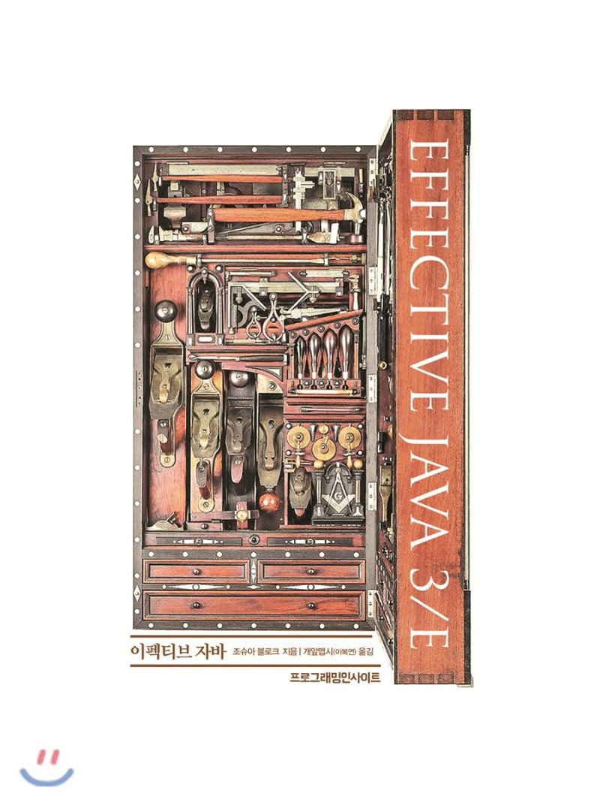

# Effective Java 3/E 정리

## 목차

* 2장 객체 생성과 파괴
  * [아이템 1. 생성자 대신 static 팩토리 메서드를 고려하라](https://github.com/binghe819/TIL/blob/master/JAVA/Effective%20Java/item01.md)
  * [아이템 2. 생성자에 매개변수가 많다면 빌더를 고려하라](https://github.com/binghe819/TIL/blob/master/JAVA/Effective%20Java/item02.md)
  * [아이템 3. private 생성자나 열거 타입으로 싱글톤임을 보증하라](https://github.com/binghe819/TIL/blob/master/JAVA/Effective%20Java/item03.md)
  * [아이템 4. 인스턴스화를 막으려거든 private 생성자를 사용하라](https://github.com/binghe819/TIL/blob/master/JAVA/Effective%20Java/item04.md)
  * [아이템 5. 자원을 직접 명시하지 말고 의존 객체 주입을 사용하라](https://github.com/binghe819/TIL/blob/master/JAVA/Effective%20Java/item05.md)
  * [아이템 6. 불필요한 객체 생성을 피하라](https://github.com/binghe819/TIL/blob/master/JAVA/Effective%20Java/item06.md)
  * [아이템 7. 다 쓴 객체 참조를 해제하라](https://github.com/binghe819/TIL/blob/master/JAVA/Effective%20Java/item07.md)
  * [아이템 8. finalizer와 cleaner 사용을 피하라 - 미완성](https://github.com/binghe819/TIL/blob/master/JAVA/Effective%20Java/item08.md)
  * [아이템 9. try-finally 보다는 try-with-resources를 사용하라](https://github.com/binghe819/TIL/blob/master/JAVA/Effective%20Java/item09.md)
* 3장 모든 객체의 공통 메서드
  * [아이템 10. equals는 일반 규약을 지켜 재정의하라](https://github.com/binghe819/TIL/blob/master/JAVA/Effective%20Java/item10.md)
  * [아이템 11. equals를 재정의하려거든 hashcode도 재정의하라](https://github.com/binghe819/TIL/blob/master/JAVA/Effective%20Java/item11.md)
  * [아이템 12. toString을 항상 재정의하라](https://github.com/binghe819/TIL/blob/master/JAVA/Effective%20Java/item12.md)
  * [아이템 13. clone 재정의는 주의해서 진행하라](https://github.com/binghe819/TIL/blob/master/JAVA/Effective%20Java/item13.md)
  * [아이템 14. 아이템 14. Comparable을 구현할지 고려하라 - 미완성](https://github.com/binghe819/TIL/blob/master/JAVA/Effective%20Java/item14.md)
* 4장 클래스와 인터페이스
  * [아이템 15. 클래스와 멤버의 접근 권한을 최소화하라](https://github.com/binghe819/TIL/blob/master/JAVA/Effective%20Java/item15.md)
  * [아이템 16. public 클래스에서는 public 필드가 아닌 접근자 메서드를 사용하라](https://github.com/binghe819/TIL/blob/master/JAVA/Effective%20Java/item16.md)
  * [아이템 17. 변경 가능성을 최소화하라 (불변객체)](https://github.com/binghe819/TIL/blob/master/JAVA/Effective%20Java/item17.md)
  * [아이템 18. 상속보다는 조합을 사용하라](https://github.com/binghe819/TIL/blob/master/JAVA/Effective%20Java/item18.md)
  * [아이템 19. 상속을 고려해 설계하고 문서화하라. 아니면 상속을 금지하라](https://github.com/binghe819/TIL/blob/master/JAVA/Effective%20Java/item19.md)
  * [아이템 20. 추상 클래스보다는 인터페이스를 우선하라](https://github.com/binghe819/TIL/blob/master/JAVA/Effective%20Java/item20.md)
  * [아이템 21. 인터페이스는 구현하는 쪽을 생각해 설계하라](https://github.com/binghe819/TIL/blob/master/JAVA/Effective%20Java/item21.md)
  * [아이템 22. 인터페이스는 타입을 정의하는 용도로만 사용하라](https://github.com/binghe819/TIL/blob/master/JAVA/Effective%20Java/item22.md)
  * [아이템 23. 태그 달린 클래스보다는 클래스 계층구조를 활용하라](https://github.com/binghe819/TIL/blob/master/JAVA/Effective%20Java/item23.md)
  * [아이템 24. 멤버 클래스는 되도록 static으로 만들라](https://github.com/binghe819/TIL/blob/master/JAVA/Effective%20Java/item24.md)
  * [아이템 25. 톱레벨 클래스는 한 파일에 하나만 담아라](https://github.com/binghe819/TIL/blob/master/JAVA/Effective%20Java/item25.md)
* 5장 제네릭
  * [제네릭 기초 간단 정리](https://github.com/binghe819/TIL/blob/master/JAVA/Effective%20Java/generic.md)
  * [아이템 26. 로 타입은 사용하지 말라](https://github.com/binghe819/TIL/blob/master/JAVA/Effective%20Java/item26.md)
  * [아이템 27. 비검사 경고를 제거하라](https://github.com/binghe819/TIL/blob/master/JAVA/Effective%20Java/item27.md)
  * [아이템 28. 배열보다는 리스트를 사용하라](https://github.com/binghe819/TIL/blob/master/JAVA/Effective%20Java/item28.md)
  * [아이템 29. 이왕이면 제네릭 타입으로 만들라](https://github.com/binghe819/TIL/blob/master/JAVA/Effective%20Java/item29.md)
  * [아이템 30. 이왕이면 제네릭 메서드로 만들라](https://github.com/binghe819/TIL/blob/master/JAVA/Effective%20Java/item30.md)
  * [아이템 31. 한정적 와일드카드를 사용해 API 유연성을 높이라](https://github.com/binghe819/TIL/blob/master/JAVA/Effective%20Java/item31.md)
  * [아이템 32. 제네릭과 가변인수를 함께 쓸 때는 신중하라 - 이해못함](https://github.com/binghe819/TIL/blob/master/JAVA/Effective%20Java/item32.md)
  * [아이템 33. 타입 안전 이종 컨테이너를 고려하라 - 이해못함](https://github.com/binghe819/TIL/blob/master/JAVA/Effective%20Java/item33.md)
* 6장 열거 타입과 애너테이션
  * [아이템 34. int 상수 대신 열거 타입을 사용하라](https://github.com/binghe819/TIL/blob/master/JAVA/Effective%20Java/item34.md)
  * [아이템 35. ordinal 메서드 대신 인스턴스 필드를 사용하라](https://github.com/binghe819/TIL/blob/master/JAVA/Effective%20Java/item35.md)
  * [아이템 36. 비트 필드 대신 EnumSet을 사용하라](https://github.com/binghe819/TIL/blob/master/JAVA/Effective%20Java/item36.md)
  * [아이템 37. ordinal 인덱싱 대신 EnumMap을 사용하라](https://github.com/binghe819/TIL/blob/master/JAVA/Effective%20Java/item37.md)
  * [아이템 38. 확장할 수 있는 열거 타입이 필요하면 인터페이스를 사용하라](https://github.com/binghe819/TIL/blob/master/JAVA/Effective%20Java/item38.md)

