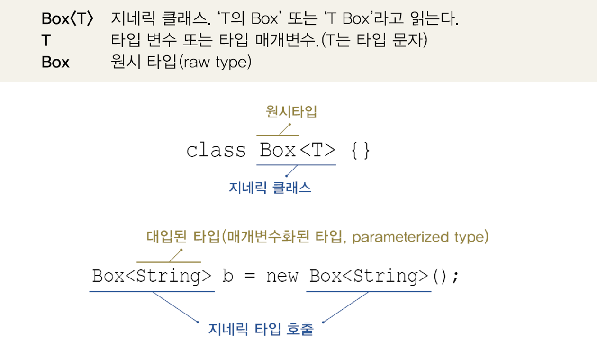
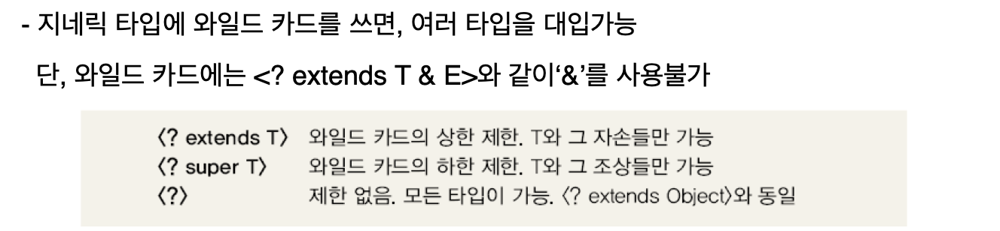
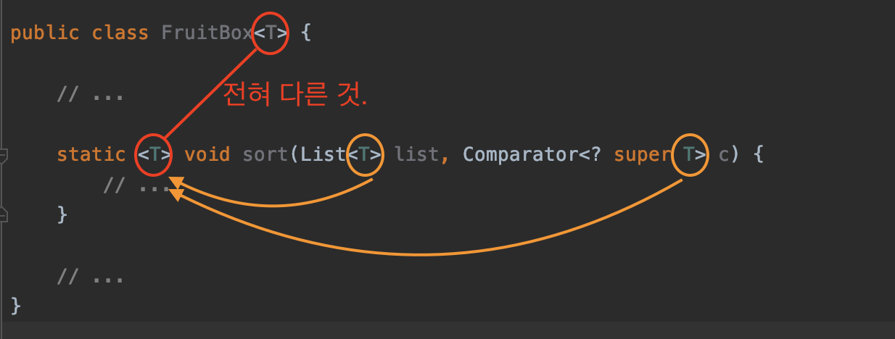

# Generic 사전 개념 정리
> 5장 제네릭 (아이템 26 - 아이템 33)을 이해하는데 필요한 개념 정리본

- [Generic 사전 개념 정리](#generic-사전-개념-정리)
  - [기본 용어](#기본-용어)
  - [매개변수화 타입](#매개변수화-타입)
    - [Generic이란?](#generic이란)
    - [Generic의 특징](#generic의-특징)
    - [Generic 타입의 제거 (중요)](#generic-타입의-제거-중요)
  - [제한된 제네릭 클래스](#제한된-제네릭-클래스)
  - [와일드 카드](#와일드-카드)
    - [타입 변수 T는 static멤버에 사용할 수 없다](#타입-변수-t는-static멤버에-사용할-수-없다)
    - [와일드 카드란?](#와일드-카드란)
    - [Set과 Set<?>의 차이점은?](#set과-set의-차이점은)
  - [제네릭 메서드](#제네릭-메서드)
    - [제네릭 메서드란?](#제네릭-메서드란)
    - [제네릭 클래스와 제네릭 메서드](#제네릭-클래스와-제네릭-메서드)

<br>

## 기본 용어
<p align="center"><br>기본적인 용어<br>출처 : 자바의 정석</p>

<br>

## 매개변수화 타입

제네릭 (Generic)을 흔히 **타입 변수 (Type Variable) 혹은 매개변수화 타입**이라 부른다.
```java
public class Box<T> {
    private T item;

    void setItem(T item) { this.item = item; }
    T getItem() { return item; }
}
```

<br>

### Generic이란?
* 제네릭은 클래스나 메서드에서 사용할 내부 데이터 타입을 **컴파일 시 미리 지정하는 방법**이다.
  * 코드 작성(컴파일)시에 어떤 타입을 사용할 것인지 의도를 들어내고, 그에 맞춰 코드를 작성한다.
  * 런타임때는 제네릭이 소거되면서, 자동적으로 형변환을 해주기 때문에 타입 안정성을 보장할 수 있다.
* 컴파일시점과 런타임시점의 타입 안정성을 모두 보장하는 방법.
* 제네릭은 제네릭 클래스(혹은 인터페이스)가 담을 수 있는 **타입을 컴파일러에 알려주는 역할**을 한다.

<br>

### Generic의 특징
* **컴파일타임때 타입을 체크하여 런타임시 타입 안정성을 보장 (목적)**
* **객체의 타입 안정성을 높이고 형변환의 번거로움을 줄여준다**

<br>

### Generic 타입의 제거 (중요)
* 컴파일러는 제네릭 타입을 이용해서 소스파일을 체크하고, 필요한 곳에 형변환을 넣어준다. 그리고 제네릭 타입을 제거한다.
* 즉, 컴파일된 `.class`파일에는 제네릭 타입에 대한 정보가 전혀 없다.
* 당연히 런타임때도 제네릭 타입 정보가 전혀 없다.
```java
<T extends Fruit> // T는 Fruit으로 치환된다.
<T>               // T는 Object로 치환된다.

// 자동적으로 형변환이 된다.
T get(int i) { return list.get(i) } => Fruit get(int i) { return (Fruit)list.get(i); }
```
  
<br>

## 제한된 제네릭 클래스
**제네릭(Generic)은 `extends`를 이용해서 어떤 타입을 받을지 제한할 수 있다.**
```java
// 안좋은 예시 - 제한이 없는 제네릭 클래스
FruitBox<Toy> fruitBox = new FruitBox<>();
fruitBox.add(new Toy()); // 과일 상자에 장난감을 담을 수 있다. (의도를 파악하기 힘들어진다.)

// 좋은 예시 - 제한된 제네릭 클래스
class FruitBox<T extends Fruit> { // Fruit의 자손만 타입으로 지정가능하다.
    ArrayList<T> list = new ArrayList<>();
}
FruitBox<Apple> fruitBox = new FruitBox<>(); // OK
FruitBox<Toy> fruitBox = new FruitBox<>(); // Error
```
* **함수의 매개변수와 유사하다고 생각하면 쉽다.**
  * 매개변수도 타입을 지정하여 원하는 타입만 입력받듯이, 제네릭도 원하는 타입만을 입력받을 수 있다.

<br>

## 와일드 카드

<br>

### 타입 변수 T는 static멤버에 사용할 수 없다
```java
class Box<T> {
    static T item; // 에러
    static int compare(T t1, T t2) {...} // 에러
}
```
* 인스턴스 생성 전에 사용이 가능한 static 멤버에는 타입 변수 T를 사용할 수 없다.
  * T는 기본적으로 인스턴스변수로 간주되기 때문이다.
  * 또한, static 멤버는 대입된 타입 변수(T)의 종류에 관계없이 동일한 것이어야하기 때문에 불가한 것.
> **매개변수를 넘기지도 않았는데 함수가 실행되는 것과 비슷하게 당연히 불가능한 것.**

<br>

### 와일드 카드란?
**static멤버에 타입 변수 T를 사용할 수 없기 때문에 자바에서는 와일드 카드를 이용해서 이 문제를 해결하였다.**
```java
// 안좋은 예시
class Juicer {
    static Juice makeJuice(FruitBox<Fruit> box) { // <Fruit>으로 지정
        ...
    }
}
Juice.makeJuice(new FruitBox<Fruit>()); // OK
Juice.makeJuice(new FruitBox<Apple>()); // Error

// 좋은 예시
class Juicer {
    static Juice makeJuice(FruitBox<? extends Fruit> box) {
        ...
    }
}
Juicer.makeJuice(new FruitBox<Fruit>()); // OK
Juicer.makeJuice(new FruitBox<Apple>()); // OK
```

* 와일드 카드란?
  * 타입에 제한을 두지 않음을 표현하는 데 사용되는 기호 (`?`)
  * 와일드 카드는 어떠한 타입도 될 수 있다.
* 참고
  * 와일드 카드는 제네릭 클래스와 다르게 `<? extends T & E>`처럼 `&`을 사용할 수 없다.

<p align="center"><br>출처 : 자바의 정석</p>

<br>

### Set과 Set<?>의 차이점은?
* 로타입인 `Set`은 어떠한 타입도 넣을 수 있다. (타입 불안정)
* 와일드카드를 사용하는 `Set<?>은 null 외에는 어떤 원소도 넣을 수 없다. (타입 안정)
  * 만약 어떤 특정 타입만을 입력으로 받고 싶다면 `Set<? extends 원하는타입>`처럼 사용하면 된다.

<br>

## 제네릭 메서드

### 제네릭 메서드란?
* 메서드의 선언부에 제네릭 타입이 선언된 메서드를 제네릭 메서드라 한다.
* 제네릭 타입의 선언 위치는 반환 타입 바로 앞이다.
* 예시
```java
static <T> void sort(List<T> list, Comparator<? super T> c)
```

<br>

### 제네릭 클래스와 제네릭 메서드

<p align="center"></p>

* 제네릭 클래스에 정의된 타입 매개변수(T)와 제네릭 메서드에 정의된 타입 매개변수는 전혀 별개의 것이다.
  * static멤버에는 타입 매개변수를 사용할 수 없지만, 이처럼 제네릭 메서드는 사용이 가능하다.
* **제네릭 메서드 지역 변수를 선언한 것과 같다고 생각하면 이해하기 쉽다.**
  * 메서드에 선언된 타입 변수는 메서드 내에서만 지역적으로 사용된다.
```java
// 제네릭 메서드 사용 전 - 와일드카드를 사용해야 한다.
static Juice makeJuice(FruitBox<? extends Fruit> box) {
    ...
}

// 제네릭 메서드 사용 후 - 와일드카드를 사용할 필요가 없다.
static <T extends Fruit> Juice makeJuice(FruitBox<T> box) {
    ...
}
```
```java
// 컴파일러에 의해 생략해도 되지만, 만약 생략이 안된다면 아래와 같이 사용해야 한다.
Juicer.<Fruit>makeJuice(new FruitBox<Apple>());
```