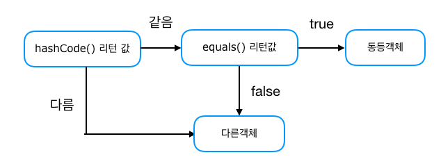

> 본 자료는 [Effective Java 3/E]()를 바탕으로 작성되었습니다.

# 아이템 11. equals를 재정의하려거든 hashcode도 재정의하라

`equals`를 재정의한 클래스 모두에서 `hashCode`도 재정의해야 한다. 

안그럼 `HashMap`이나 `HashSet` 같은 컬렉션에서 문제가 발생하다.

* **equals - 논리적 동치성**
* **hashCode - 물리적 동치성**

- [Object명세 - equals](#object명세---equals)
- [hashCode를 재정의하지 않는다면?](#hashcode를-재정의하지-않는다면)
- [hashCode 재정의 방법](#hashcode-재정의-방법)
  * [방법 1](#방법-1)
  * [방법 2](#방법-2)
- [해시코드 캐싱](#해시코드-캐싱)
- [주의할 점](#주의할-점)
- [핵심 정리](#핵심-정리)

<br>

## Object명세 - equals

1. `equals` 비교에 사용되는 정보가 변경되지 않았다면, 그 객체의 `hashCode` 메서드는 몇 번을 호출해도 일관되게 항상 같은 값을 반환해야 한다. (일관성)

2. **`equals(Object)`가 두 객체를 같다고 판단한다면, 두 객체의 `hashCode`는 똑같은 값을 반환해야 한다.**

3. `equals(Object)`가 두 객체를 다르다고 판단했더라도, 두 객체의 `hashCode`가 서로 다른 값을 반환할 필요는 없다.

`hashCode` 재정의를 잘못했을 때 크게 문제가 되는 조항은 **두번째**다. 즉, **논리적으로 같은 객체는 같은 해시코드를 반환해야 한다.**

* `equals`는 물리적으로 다른 두 객체 (주소가 다른 두 객체)를 논리적으로 같다고 할 수 있다. 
* 하지만 `Object`의 `hashCode`는 이 둘을 물리적으로 전혀 다르다고 판단한다. (문제점)

<br>

## hashCode를 재정의하지 않는다면?

만약 `equals`를 재정의하고, `hashCode`를 재정의하지 않은 상태에서 HashMap에 넣으면 다음과 같은 결과가 나온다.

```java
public class Main {
    public static void main(String[] args) {
        Map<PhoneNumber, String> phoneBook = new HashMap<>();

        phoneBook.put(new PhoneNumber(010, 1111, 1111), "binghe");

        String name = phoneBook.get(new PhoneNumber(010, 1111, 1111));
        System.out.println(name); // null (binghe가 나와야 정상)
    }
}
```

위 코드에서 논리적으로 같은 객체를 HashMap은 인식하지 못한다.

그 이유는 HashMap은 다음과 같은 순서로 동치성을 확인하기 때문이다.

<p align="center"></p>

**만약 물리적 동치성(`hashCode()`)가 일치하지 않으면, 논리적 동치성(`equals()`)를 확인조차 하지 않는다.**

이렇게 되면 문제는 잘못하면 해시 테이블의 버킷 하나에 담겨 마치 연결리스트처럼 동작한다. O(1)이 O(n)이 된다.

<br>

## hashCode 재정의 방법


### 방법 1

```java
@Override
public int hashCode() {
    int result = Integer.hashCode($인스턴스변수1);
    result = 31 * result + Integer.hashCode($인스턴스변수2);
    result = 31 * result + Integer.hashCode($인스턴스변수3);
    return result;
}
```

* 핵심 인스턴스 멤버들을 각각 위와 같이 계산하고 갱신해준다.
* **`equals` 비교에 사용되지 않은 필드는 '반드시' 제외해야 한다.**
* 곱할 숫자를 31로 정한 이유는 31이 홀수이면서 소수이기 때문이다.

<br>

### 방법 2

해시 충돌이 더욱 적은 방법을 꼭 써야 한다면 구아바의 `com.google.common.hash.Hashing`을 참고하자.

> Object 클래스도 해시코드를 계산해주는 메서드인 `hash`를 제공하지만, 속도가 느리다. 가능한 위 2가지중 하나를 사용하자.

<br>

## 해시코드 캐싱

클래스가 불변이고 해시코드를 계산하는 비용이 크다면, 매번 새로 계산하기보다는 캐싱하는 방식을 고려해야 한다.

**이 타입의 객체가 주로 해시의 키로 사용될 것 같다면 인스턴스가 만들어질 때 해시코드를 계산해둬야 한다.**

```java
private int hashCode; // 자동으로 0으로 초기화

@Override
public int hashCode() {
    int result = hashCode;
    if (result == 0) { // 지연 초기화 (lazy initialization)
        int result = Integer.hashCode($인스턴스변수1);
        result = 31 * result + Integer.hashCode($인스턴스변수2);
        result = 31 * result + Integer.hashCode($인스턴스변수3);
        return result;
    }
    return result;
}
```

<br>

## 주의할 점

* 성능을 높인답시고 해시코드를 계산할 때 핵심 필드를 생략해서는 안된다.
  * 속도야 빨리지겠지만, 해시 품질이 나빠져 해시 테이블의 성능을 심각하게 떨어뜨릴 수 있다.
* `hashCode`가 반환하는 값의 생성 규칙을 API 사용자에게 자세히 공표하지 말자.
  * 그래야 클라이언트가 이 값에 의지하지 않게 되고, 추후에 계산 방식을 바꿀 수도 있다.

<br>

## 핵심 정리

* `equals`를 재정의할 때는 `hashCode`도 반드시 재정의하자.
* 재정의된 `hashCode`는 `Object`의 일반 규약을 따라야하고, 서로 다른 인스턴스라면 해시코드도 서로 다르게 구현해야 한다. (물리적 + 논리적으로 모두 다르다면)
* [아이템 10](./Item10.md)의 `AutoValue` 프레임워크를 사용하면 `equals`와 `hashCode`를 모두 자동으로 만들어준다.