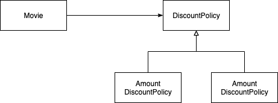
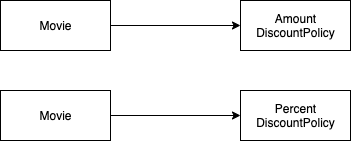

> 본 자료는 [Effective Java 3/E]()를 바탕으로 작성되었습니다.

# 아이템 23. 태그 달린 클래스보다는 클래스 계층구조를 활용하라

- [아이템 23. 태그 달린 클래스보다는 클래스 계층구조를 활용하라](#아이템-23-태그-달린-클래스보다는-클래스-계층구조를-활용하라)
  - [태그 달린 클래스의 폐해](#태그-달린-클래스의-폐해)
  - [클래스 계층 구조](#클래스-계층-구조)
  - [컴파일타임 의존성과 런타임 의존성](#컴파일타임-의존성과-런타임-의존성)
    - [컴파일타임? 런타임?](#컴파일타임-런타임)
    - [정적과 동적](#정적과-동적)
    - [예시 - OCP](#예시---ocp)
      - [컴파일타임 의존성](#컴파일타임-의존성)
      - [런타임 의존성](#런타임-의존성)

<br>

## 태그 달린 클래스의 폐해
```java
class Figure {
    enum Shape { RECTANGLE, CIRCLE };

    // 태그 피드 - 현재 모양을 나타낸다.
    final Shape shape;

    // 모양이 사각형 (RECTANGLE)일 때만 쓰인다.
    private double length;
    private double width;

    // 모양이 원 (CIRCLE)일 때만 쓰인다.
    private double radius;

    // 원용 생성사
    Figure(double radius) {
        shape = Shape.CIRCLE;
        this.radius = radius;
    }

    // 사각형용 생성자 
    Figure(double length, double width) {
        shape = Shape.RECTANGLE;
        this.length = length;
        this.width = width;
    }

    double area() {
        switch(shape) {
            case RECTANGLE:
                return ...;
            case CIRCLE:
                return ...;
            default:
                throw new AssertionError(shape);
        }
    }
}
```
* 태그 달린 클래스는 장황하고, 오류를 내기 쉽고, 비효율적이다.
  * 우선 열거 타입 선언, 태그 필드, switch문 등 쓸데없이 코드가 없다.
  * 여러 구현이 한 클래스에 혼합돼 있어 가독성이 나쁘다.
  * 새로운 태그를 추가하면 여러 변경이 일어난다. (switch)
  * 메모리도 낭비된다.
  * 필드들을 final로 선언하면 사용하지 않는 필드들도 초기화해줘야한다.

<br>

## 클래스 계층 구조
```java
abstract class Figure {
    abstract double area();
}

class Circle extends Figure {
    private final double radius;

    Circle(double radius) {
        this.radius = radius;
    }

    @Override
    double area() {
        return Math.PI * (radius * radius);
    }
}

class Rectangle extends Figure {
    private final double length;
    private final double width;

    Rectangle(double length, double width) {
        this.length = length;
        this.width = width;
    }

    @Override
    double area() {
        return length * width;
    }
}
```
* 클래스 계층구조는 태그 달린 클래스의 단점을 모두 날려버린다.

<br>

## 컴파일타임 의존성과 런타임 의존성
이번 아이템에서 조금 더 얘기해보자면 컴파일타임 의존성보다 런타임 의존성에 맞게 객체를 설계하라는 것 같다.

<br>

### 컴파일타임? 런타임?
* 컴파일타임
  * 작성된 코드를 컴파일하는 시점
  * 코드 그자체는 가리키기도 한다. (정적 코드) -> .java
* 런타임
  * 말 그대로 애플리케이션이 실행되는 시점

<br>

### 정적과 동적
* 런타임의 주인공은 객체다. (동적)
  * 따라서 런타임 의존성이 다루는 주제는 객체 사이의 의존성이다.
* 컴파일의 주인공은 클래스다. (정적)
  * 따라서 컴파일타임 의존성이 다루는 주제는 클래스 사이의 의존성이다.

<br>

### 예시 - OCP
```java
public class Movie {
    private DiscountPolicy discountPolicy; // 컴파일 타임 의존성

    ... 의존성 주입 로직 ... 
}
```

<br>

#### 컴파일타임 의존성
<p align="center"> </p>

* **코드 작성 시점의 `Movie`와 `DiscountPolicy`사이의 의존성**
* 중요한 것은 `Movie`에서 `Amount`와 `Percent`로 향하는 어떠한 의존성도 존재하지 않다는 것. ➡️ OCP

<br>

#### 런타임 의존성
<p align="center"> </p>

* **`Movie`의 인스턴스가 가지는 런타임 의존성**
* 당연히 `Movie`가 인터페이스인 `DiscountPolicy`에 의존하면 실행 자체가 안된다. 하지만 런타임 시점에는 이렇게 구현한 객체가 의존성으로 들어오게 된다.

> 코드 작성 시점의 `Movie`클래스는 할인 정책을 구현한 두 클래스의 존재를 모르지만 실행 시점의 `Movie`객체는 두 클래스의 인스턴스와 협력할 수 있게 된다.

<br>

더 자세한 내용은 [여기](https://github.com/binghe819/TIL/blob/master/OOP/%EC%98%A4%EB%B8%8C%EC%A0%9D%ED%8A%B8/08%20%EC%9D%98%EC%A1%B4%EC%84%B1%20%EA%B4%80%EB%A6%AC%ED%95%98%EA%B8%B0.md#1-3-%EB%9F%B0%ED%83%80%EC%9E%84-%EC%9D%98%EC%A1%B4%EC%84%B1%EA%B3%BC-%EC%BB%B4%ED%8C%8C%EC%9D%BC%ED%83%80%EC%9E%84-%EC%9D%98%EC%A1%B4%EC%84%B1)에서 확인가능합니다.