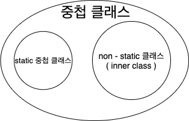
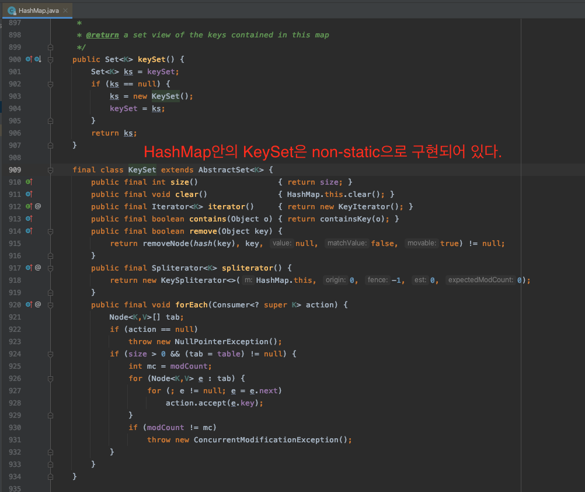

> 본 자료는 [Effective Java 3/E]()를 바탕으로 작성되었습니다.

# 아이템 24. 멤버 클래스는 되도록 static으로 만들라
이번 아이템에서는 중첩 클래스를 언제 그리고 왜 사용해야하는지 얘기한다.

- [아이템 24. 멤버 클래스는 되도록 static으로 만들라](#아이템-24-멤버-클래스는-되도록-static으로-만들라)
  - [중첩 클래스](#중첩-클래스)
    - [중첩 클래스란?](#중첩-클래스란)
    - [nested와 inner](#nested와-inner)
    - [중첩 클래스는 왜 사용하는가?](#중첩-클래스는-왜-사용하는가)
  - [static 멤버 클래스](#static-멤버-클래스)
    - [static 멤버 클래스와 접근 제어자](#static-멤버-클래스와-접근-제어자)
    - [도우미 클래스 역할을 한다](#도우미-클래스-역할을-한다)
  - [non-static 멤버 클래스](#non-static-멤버-클래스)
    - [정규화된 this](#정규화된-this)
    - [어댑터 역할을 한다](#어댑터-역할을-한다)
  - [결론](#결론)
  - [익명 클래스](#익명-클래스)
  - [지역 클래스](#지역-클래스)
  - [핵심 정리](#핵심-정리)

<br>

## 중첩 클래스

### 중첩 클래스란?
```java
class OuterClass {
    ...
    class NestedClass {
        ...
    }
}
```
* 중첩 클래스 (nested class)란 다른 클래스 안에 정의된 클래스를 말한다.
  * 즉, 클래스 안에 정의된 클래스를 중첩 클래스라 부른다.
* 중첩 클래스의 4가지 종류
  * static 멤버 클래스
  * non-static 멤버 클래스
  * 익명 클래스
  * 지역 클래스

<br>

### nested와 inner
```java
class OuterClass {
    ...
    static class StaticNestedClass { ... }

    class InnerClass { ... }
}
```
<p align="center"></p>

* static으로 선언된 멤버 클래스는 static 중첩 클래스라 부른다.
* non-static 멤버 클래스들은 모두 inner 클래스라 부른다.

<br>

### 중첩 클래스는 왜 사용하는가?
* 관련된 클래스들을 논리적으로 그룹핑할 수 있다.
* 
* 가독성과 유지보수가 좋은 코드
  * 최상위 클래스와 작은 클래스를 중첩하면 코드가 사용되는 위치게 비교적 가깝다.

<br>

## static 멤버 클래스
`static 멤버 클래스`는 **바깥 클래스 안에 선언**되며 **바깥 클래스의 private 멤버에도 접근 가능한 것**을 제외하면 **일반 클래스와 동일하다**.

<br>

### static 멤버 클래스와 접근 제어자
`static 멤버 클래스`를 private으로 하면 바깥 클래스(Outer)에서만 접근할 수 있다.

바깥 클래스가 표현하는 객체의 한 부분(구성요소)을 나타낼 때 쓴다.

> 클래스를 유틸성 클래스처럼 사용한다는 것인가??

<br>

### 도우미 클래스 역할을 한다

`static 멤버 클래스`는 흔히 바깥 클래스(Outer)와 함께 쓰일 때만 **public 도우미 클래스**로 쓰인다.

```java
// 빌더 패턴
public class NutritionFacts {

    private final int servingSize;
    private final int servings;
    private final int calories;
    private final int fat;
    private final int sodium;
    private final int carbohydrate;

    // static 멤버 클래스 (도우미 클래스)
    public static class Builder {
        // 필수 매개변수
        private final int servingSize;
        private final int servings;
        
        // 선택 매개변수 - 기본값으로 초기화한다.
        private int calories = 0;
        private int fat = 0;
        private int sodium = 0;
        private int carbohydrate = 0;

        public Builder(int servingSize, int servings) {
            this.servingSize = servingSize;
            this.servings = servings;
        }
        
        public Builder calories(int val) {calories = val; return this;}
        
        public Builder fat(int val) {fat = val; return this;}
        
        public Builder sodium(int val) {sodium = val; return this;}
        
        public Builder carbohydrate(int val) {carbohydrate = val; return this;}
        
        public NutritionFacts build() {
            return new NutritionFacts(this);
        }
    }
    
    private NutritionFacts(Builder builder) {
        servingSize = builder.servingSize;
        servings = builder.servings;
        calories = builder.calories;
        fat = builder.fat;
        sodium = builder.sodium;
        carbohydrate = builder.carbohydrate;
    }
}
```
```java
// 도우미 클래스(Builder)를 사용하여 외부 클래스를 생성
NutritionFacts cocaCola = new NutritionFacts.Builder(240, 0)
  .calories(100).sodium(35).carbohydrate(27).build();
```
**`static 멤버 클래스`는 외부 클래스를 사용할 때 자연스럽게 내부 클래스를 호출하여 외부 클래스의 생성을 도와주는 도우미 클래스로 많이 사용된다.**

외부 클래스를 인스턴스화할 때 매번 내부 클래스도 재생성하는 것은 메모리 측면에서 비효율적이기 때문에 **static으로 선언하여 재사용하는 것이다**.

<br>

## non-static 멤버 클래스
`non-static 멤버 클래스`는 바깥 클래스(Outer)의 인스턴스와 암묵적으로 연결된다.

그러므로, **바깥 인스턴스 없이는 생성할 수 없다.**

물론 `바깥 인스턴스의 클래스.new NonStaticClass(args)`처럼 생성할 수 있지만, 생성 시간도 오래 걸리고, GC가 수거하지 못할 수도 있다.

<br>

### 정규화된 this
**`non-static 멤버 클래스`의 인스턴스 메서드에서 정규화된 this를 통해 바깥(Outer) 인스턴스의 메서드를 호출한다거나 바깥 인스턴스를 참조할 수 있다.**

`정규화된 this`란 `클래스명.this`의 형태로 바깥(Outer) 클래스의 이름을 명시하는 용법을 말한다.

```java
public class Outer {
    int a = 10;

    public void run() {
        System.out.println("Run Outer");
        StaticNestedClass.run();
        InnerClass innerClass = new InnerClass();
        innerClass.run();
    }

    // static 멤버 클래스
    public static class StaticNestedClass {
        public static void run() {
            // static 멤버 클래스이므로 바깥 클래스의 멤버 (a)에 접근할 수 없다.
            System.out.println("Run Static Nested Class");
        }
    }

    // non-static 멤버 클래스
    public class InnerClass {
        public void run() {
            // 정규화된 this를 통해 참조 가능하다.
            // 정규화된 this란 클래스명.this 형태로 이름을 명시하는 용법을 말한다.
            System.out.println("Run Inner Class : " + Outer.this.a);
        }
    }
}
```
> static 멤버 클래스는 JVM 실행시 생성되는 것이기 때문에, 인스턴스화 되기 전인 바깥 클래스(Outer)에는 접근 못하는 것이 당연하다.

<br>

### 어댑터 역할을 한다
non-static 멤버 클래스는 어떤 클래스의 인스턴스를 감싸 마치 다른 클래스의 인스턴스처럼 보이게 하는 **뷰 역할**을 할 때 사용된다.

<p align="center"></p>

위 예시처럼, `Map`은 인스턴스화되고, 자신의 컬렉션 뷰(`keySet`, `entrySet`...)을 구현할 때 non-static 멤버 클래스를 사용한다.

즉, `Map`의 `keySet`과 같은 뷰의 역할을 하는 인스턴스를 생성할 때 non-static 멤버 클래스가 사용된다.

* `Map` : 모델 역할 (데이터)
* `keySet` : 뷰 역할 

<br>

## 결론
**멤버 클래스에서 바깥 인스턴스에 접근할 일이 없다면 무조건 `static`을 붙여서 `static 멤버 클래스`로 만들자.**

(뷰 역할을 하는 멤버 클래스가 아니라면 그냥 `static 멤버 클래스`로 만들어라.)

`static`을 생략하면 바깥 인스턴스로의 숨은 외부 참조를 갖게 되고 심각한 경우 GC가 바깥 인스턴스를 수거하지 못하는 경우가 발생한다.

(메모리 누수)

<br>

## 익명 클래스
익명 클래스는 바깥 클래스의 멤버가 아니다.

그 이유는 사용되는 시점에 인스턴스화 되고, 어디서든 만들 수 있기 때문이다.

또한, 여러 개의 인터페이스를 구현할 수 없으며, 인터페이스 구현과 동시에 다른 클래스를 상속할 수도 없다.

```java
public class Anonymous {
    public void show() {}
}

public class Main {
    public static void main(String[] args) {
        Anonymous anonymous = new Anonymous() {

            public void save() {
                System.out.println("save");
            }

            @Override
            public void show() {
                System.out.println("show");
            }
        };

//        anonymous.save(); 호출 불가
        anonymous.show();
    }
}
```

**익명 클래스는 보통 추상화 되어 있는 클래스를 재정의하여 전역 필드로 사용할 때 주로 사용된다.**

자바 람다가 나오기 전까지는 위와 같이 사용했지만, 람다가 나타나면서 익명 클래스보다는 람다를 활용하고 있다.

<br>

## 지역 클래스
지역 클래스는 가장 드물게 사용된다.

지역 변수를 선언할 수 있는 곳이면 어디서든 선언할 수 있고, 유효 범위도 지역 변수와 같다.

```java
public class OuterClass {
    private String hi = "hi";

    public void LocalClass() {
        // 지역 클래스 정의
        class LocalCls {
            public void print() {
                // 외부 클래스 메서드 접근
                System.out.println(hi);
                System.out.println("Local Class1 print");
            }
        }

        LocalCls localCls = new LocalCls();
        localCls.print();
    }
}
```

<br>

## 핵심 정리
* 중첩 클래스에는 네 가지가 있으며, 각각의 쓰임이 다르다.
  * 메서드 밖에서도 사용해야 하거나 메서드 안에 정의하기엔 너무 길다면 멤버 클래스로 만든다.
* static vs non-static
  * 멤버 클래스의 인스턴스 각각이 바깥 인스턴스를 참조한다면 non-static
  * 그렇지 않다면 static
* 익명 vs 지역
  * 한 메서드 안에서만 쓰이면서 그 인스턴스를 생성하는 지점이 단 한 곳이고
    * 해당 타입을 쓰기에 적합한 클래스나 인터페이스가 있다면 익명 클래스
    * 그렇지 않다면 지역 클래스