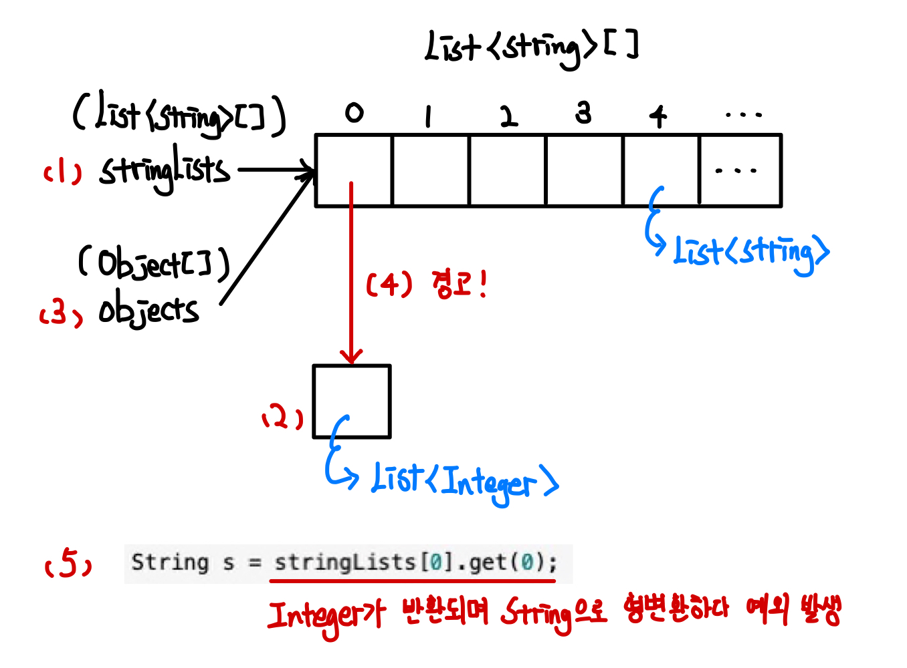

> 본 자료는 [Effective Java 3/E]()를 바탕으로 작성되었습니다.

# 아이템 28. 배열보다는 리스트를 사용하라

- [아이템 28. 배열보다는 리스트를 사용하라](#아이템-28-배열보다는-리스트를-사용하라)
  - [배열과 제네릭 타입의 차이점](#배열과-제네릭-타입의-차이점)
    - [공변 vs 불공변](#공변-vs-불공변)
    - [실체화 vs 타입 정보 소거](#실체화-vs-타입-정보-소거)
  - [배열과 제네릭은 친하지 않다](#배열과-제네릭은-친하지-않다)
    - [왜 제네릭 배열을 생성하지 못하게 막았을까?](#왜-제네릭-배열을-생성하지-못하게-막았을까)
  - [결론은 배열보다는 리스트를 사용하라는 것이다.](#결론은-배열보다는-리스트를-사용하라는-것이다)
    - [제네릭을 사용하기 전](#제네릭을-사용하기-전)
    - [제네릭 배열으로 수정](#제네릭-배열으로-수정)
    - [제네릭 리스트로 수정](#제네릭-리스트로-수정)

<br>

## 배열과 제네릭 타입의 차이점
배열과 제네릭 타입은 두 가지의 차이점을 가지고 있다.

<br>

### 공변 vs 불공변
> 공변이란 : 함께 변한다는 의미
> * 첫 번째 변수의 크기가 두 번째 변수의 크기에 따라 변하는 것.

<br>

A가 B의 하위 타입이면
* **배열 - `A[]`이 `B[]`의 하위타입이다. (공변)**
* **제네릭 타입 - `List<A>`과 `List<B>`는 아무 관계가 없다. (불공변)**

<br>

**예시**
```java
// 배열 - 런타임에 실패한다
Number[] objectArray = new Long[1];
objectArray[0] = "타입이 달라 넣을 수 없다"; // 런타임때 ArrayStoreException을 던진다.

// 제네릭 타입 - 컴파일타임때 실패한다
List<Number> ol = new ArrayList<Long>(); // 컴파일타임때 호환되지 않는 타입이다.
ol.add("타입이 달라 넣을 수 없다"); // 이 코드는 실행조차 안된다.
```
`Long`은 `Number`의 하위타입으로 볼 수 있는데, **배열은 런타임때 예외가 발생하고, 리스트는 컴파일타임때 예외가 발생한다.**

즉, **배열 쓰면 런타임때 오류가 던져질 것을 리스트 쓰면 컴파일때 알 수 있다.**

<br>

### 실체화 vs 타입 정보 소거
* **배열 - 실체화 (런타임에도 자신의 원소 타입을 인지하고 확인)**
  * 자신의 원소 타입이 아니라고 판단되면 `ArrayStoreException`을 던진다.
* **제네릭 타입 - 자신의 타입을 컴파일 타임에만 검사하고 소거한다. 런타임때는 알 수 없다.**
  * **컴파일때 입력값(`T`)에 따라 형변환을하고 타입 안정성을 보장하기 때문에 런타임때 다시 확인할 필요가 없다.**
  * 제네릭 타입은 컴파일되고 소거되어, 런타임때는 그저 형변환된 타입을 사용한다.
  * 실체화될 수 있는 타입은 비한정적 와일드카드 타입뿐

<br>

**제네릭 소거 예시**
```java
// 컴파일 타임
class Box<T extends Fruit> {
    void add(T t) {
        ...
    }
}

// 런타임 (제네릭 소거)
class Box {
    void add(Fruit t) {
        ...
    }
}
```
```java
// 컴파일 타임
T get(int i) {
    return list.get(i);
}

// 런타임 (제네릭 소거)
Fruit get(int i) {
    return (Fruit) list.get(i); // 자동 형변환을 해준다.
}
```
```java
// 컴파일 타임
static Juice makeJuice(FruitBox<? extends Fruit> box) {
    String tmp = "";
    for (Fruit f : box.getList()) tmp += f + " ";
    return new Juice(tmp);
}

// 런타임 (제네릭 소거)
static Juice makeJuice(FruitBox box) {
    String tmp = "";
    while (Iterator it = box.getList().iterator(); it.hasNext();) {
        tmp += (Fruit)it.next() + " "; // 자동 형변환을 해준다.
    }
    return new Juice(tmp);
}
```

<br>

> 더 쉽게 보면
> * **배열 - 런타임때만 타입 체크**
>   * 타입 안정성을 보장하기 힘들다. (늦었다 생각했을 때 이미 예외는 터진 후다!)
> * **제네릭 - 컴파일때 완벽히 타입 체크 -> 런타임땐 자동 형변환되어있음.**
>   * 컴파일때 타입 체크하고 소거하면서 자동 형변환 (자동 형변환을 했기 때문에 런타임때 타입 안정성을 보장)

<br>

## 배열과 제네릭은 친하지 않다
이처럼 배열과 제네릭은 친해지기 어려운 관계이다.

배열은 아래와 같이 제네릭 타입, 매개변수화 타입, 타입 매개변수로 사용할 수 없다.

```java
// 배열은 아래와 같이 사용하면 오류가 발생한다.
new List<E>[]; // 제네릭 타입
new List<String>[]; // 매개변수화 타입
new E[]; // 타입 매개변수
```

<br>

### 왜 제네릭 배열을 생성하지 못하게 막았을까?
타입 안정성이 보장되지 않기 때문이다.

**이를 허용한다면 컴파일러가 자동 생성한 형변환 코드에서 런타임에 `ClassCastException`이 발생할 수 있다.**

즉, 컴파일때 타입 안정성을 보장했는데, 런타임때 타입 예외가 발생할 수 있게 된다.

```java
List<String>[] stringLists = new List<String>[10]; // (1)
List<Integer> intList = List.of(45);               // (2)
Object[] objects = stringLists;                    // (3)
objects[0] = intList;                              // (4)
String s = stringLists[0].get(0);                  // (5)
```
<p align="center"><br>위 코드 도식화</p>

**위와 같이 제네릭과 배열을 같이 사용하면 형변환 과정에서 오류가 발생하게 된다.**

이 문제를 해결하는 가장 쉬운 방법은 **컴파일 오류를 내서 런타임 예외를 사전에 방지하는 것**이다.

> 실제로 가변인수 메서드(배열)에 제네릭 타입을 사용하면 경고 메시지를 받게 된다.

<br>

## 결론은 배열보다는 리스트를 사용하라는 것이다.

<br>

### 제네릭을 사용하기 전
```java
public class Chooser {
    private final Object[] choiceArray;

    public Chooser(Object[] choiceArray) {
        this.choiceArray = choiceArray;
    }
    public Object choose() {
        Random rnd = ThreadLocalRandom.current();
        return choiceArray[rnd.nextInt(choiceArray.length)];
    }
}
```
클라이언트측에서 계속해서 형변환을 해줘야하고, 타입 안정성을 보장할 수 없다.

<br>

### 제네릭 배열으로 수정
```java
public class Chooser<T> {
    private final T[] choiceArray;

    @SuppressWarnings("unchecked")
    public Chooser(Object[] choiceArray) {
        choiceArray = (T[])choiceArray;
    }
    
    public Object choose() {
        Random rnd = ThreadLocalRandom.current();
        return choiceArray[rnd.nextInt(choiceArray.length)];
    }
}
```
`T[]`으로 인해 런타임때 타입 안정성을 완전히 보장할 수 없다.

또한, 경고가 발생한다.

<br>

### 제네릭 리스트로 수정

```java
public class Chooser<T> {
    private final List<T> choiceList;
    
    public Chooser(Collection<T> choices) {
        choiceList = new ArrayList<>(choices);
    }

    public Object choose() {
        Random rnd = ThreadLocalRandom.current();
        return choiceList.get(rnd.nextInt(choiceList.size()));
    }
}
```
컴파일때 타입 안정성을 보장하므로, 가장 좋다.