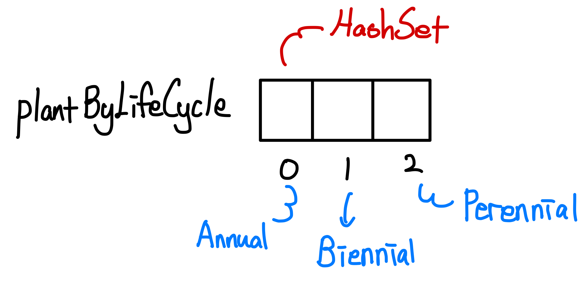

> 본 자료는 [Effective Java 3/E]()를 바탕으로 작성되었습니다.

# 아이템 37. ordinal 인덱싱 대신 EnumMap을 사용하라

ordinal(순서)를 사용해서 배열이나 리스트에서 인덱싱하는 경우가 있는데 이는 안좋은 예시라고 한다.

예시를 통해 알아보자.

<br>

- [아이템 37. ordinal 인덱싱 대신 EnumMap을 사용하라](#아이템-37-ordinal-인덱싱-대신-enummap을-사용하라)
  - [예시 1](#예시-1)
    - [1-1 안좋은 예시 - ordinal 인덱싱을 사용하는 예시](#1-1-안좋은-예시---ordinal-인덱싱을-사용하는-예시)
    - [1-2 해결책 - 기본적인 EnumMap](#1-2-해결책---기본적인-enummap)
    - [1-3 스트림 활용](#1-3-스트림-활용)
  - [예시 2](#예시-2)
    - [2-1 안좋은 예시](#2-1-안좋은-예시)
    - [2-2 해결책](#2-2-해결책)
  - [3 EnumMap 활용](#3-enummap-활용)
  - [핵심 정리](#핵심-정리)

<br>

## 예시 1

### 1-1 안좋은 예시 - ordinal 인덱싱을 사용하는 예시
다음 예시는 정원에 심은 식물들을 배열 하나로 관리하고, 이들을 생애주기(한해, 여러해, 두해)별로 묶어본다.

```java
class Plant {
    enum LifeCycle { ANNUAL, PERENNIAL, BIENNIAL }

    final String name;
    final LifeCycle lifeCycle;

    ... // 생성자
}
```
```java
// ordinal()을 배열 인덱스로 사용 - 따라 하지 말것!
// garden 생성
List<Plant> garden = Arrays.asList(
    new Plant("a1", LifeCycle.ANNUAL),
    new Plant("a2", LifeCycle.ANNUAL),
    new Plant("b1", LifeCycle.BIENNIAL),
    new Plant("c1", LifeCycle.PERENNIAL)
    );

// 생명주기 기준 식물 분류 Set배열 생성
Set<Plant>[] plantByLifeCycle = (Set<Plant>[]) new Set[LifeCycle.values().length];

// Set배열의 요소 HashSet으로 초기화
for (int i = 0; i < plantByLifeCycle.length; i++) {
    plantByLifeCycle[i] = new HashSet<>();
}

// 정원의 식물을 분류 (생명주기 enum의 ordinal로 인덱싱)
for (Plant p : garden) {
    plantByLifeCycle[p.lifeCycle.ordinal()].add(p);
}

// 결과 출력
for (int i = 0; i < plantByLifeCycle.length; i++) {
    System.out.printf("%s: %s%n",
        Plant.LifeCycle.values()[i], plantByLifeCycle[i]);
}

// 결과
ANNUAL: [a2, a1]
PERENNIAL: [c1]
BIENNIAL: [b1]
```

<p align="center"> </p>

* 결과는 잘 나오는 것 같지만, 문제가 있다.
* `ordinal`인덱싱의 문제점
  * 배열은 제네릭과 호환되지 않으니 비검사 형변환을 수행해줘야 한다. (타입 불안정)
  * 배열은 각 인덱스의 의미를 모른다. (LifeCycle의 0번째 인덱스는 무엇인가?? 한번에 모른다.)
  * 정확한 정숫값을 사용한다는 것을 개발자가 직접 보증해야 한다. (정수는 타입 안정하지 않다.)
    * 잘못하면 `ArrayIndexOutOfBounds`예외를 던진다.

<br> 

### 1-2 해결책 - 기본적인 EnumMap
위 예제에서 배열은 Enum 상수(ordinal)를 값으로 매핑하는 일을 한다.

그렇다면 `Map`을 사용할 수도 있을 것이다.

**바로 Enum타입을 Key로 사용하는 것이며, 이미 Enum을 Key로 구현된 Map이 있는데 바로 `EnumMap`이다.**

```java
// garden 생성
List<Plant> garden = Arrays.asList(
    new Plant("a1", LifeCycle.ANNUAL),
    new Plant("a2", LifeCycle.ANNUAL),
    new Plant("b1", LifeCycle.BIENNIAL),
    new Plant("c1", LifeCycle.PERENNIAL)
    );

// EnumMap 생성 ( Key : LifeCycle, Value : Set<Plant> )
EnumMap<Plant.LifeCycle, Set<Plant>> plantByLifeCycle =
    new EnumMap<>(Plant.LifeCycle.class);

// Value 초기화
for (Plant.LifeCycle lc : Plant.LifeCycle.values()) {
    plantByLifeCycle.put(lc, new HashSet<>());
}

// 정원의 식물을 분류 (LifeCycle을 Key로 활용하여 분류)
for (Plant p : garden) {
    plantByLifeCycle.get(p.lifeCycle).add(p);
}

// 결과 출력
System.out.println(plantByLifeCycle);

// 결과
{ANNUAL=[a2, a1], PERENNIAL=[c1], BIENNIAL=[b1]}
```
* `EnumMap`의 좋은 점
  * 더 짧고 명료하고 안전하며 성능도 좋다고 한다.
  * 안전하지 않은 형변환을 사용하지 않는다. (타입 안정)
  * 맵의 Key가 Enum이므로 분류 레이블의 의미를 바로 알 수 있다.
  * 정수를 인덱싱으로하면 발생하는 `OutOfBound`가 발생할 일도 없다.
* `EnumMap`의 성능이 좋은 이유
  * **내부에서 배열을 사용한다. (시간복잡도 O(1))**
  * **내부 구현 방식을 안으로 숨겨서 `Map`의 타입 안정성과 배열의 성능을 모두 얻어낸 것.**
* `EnumMap`의 생성자에 키 타입의 `Class` 객체를 받는 이유
  * **이 객체는 한정적 타입 토큰으로, 런타임 제네릭 타입 정보를 제공한다. (와일드카드 비슷?)**

<br>

### 1-3 스트림 활용
```java
// 스트림을 사용한 코드 1 - EnumMap을 사용하지 앟는다.
List<Plant> garden = Arrays.asList(
    new Plant("a1", LifeCycle.ANNUAL),
    new Plant("a2", LifeCycle.ANNUAL),
    new Plant("b1", LifeCycle.BIENNIAL),
    new Plant("c1", LifeCycle.PERENNIAL)
    );

System.out.println(
    garden
        .stream()
        .collect(Collectors.groupingBy(p -> p.lifeCycle)));

// 결과
{BIENNIAL=[b1], PERENNIAL=[c1], ANNUAL=[a1, a2]}
```
* 위 코드는 고유한 Map구현체를 이용하여 분류를 하게 된다.
* 그러므로 `EnumMap`의 이점 (공간과 성능)이 사라지는 문제가 있다.

<br>

```java
System.out.println(
    garden.stream().collect(Collectors.groupingBy(p -> p.lifeCycle,
        () -> new EnumMap<>(LifeCycle.class), Collectors.toSet())));
```
* 위 코드와 같이 `EnumMap`으로 명시적으로 변환하는 방법을 사용하면 `EnumMap`을 이점을 사용할 수 있다.
* 게다가 식물이 아무것도 없는 생애주기에는 Map을 만들지 않는 이점도 있다.

<br>

## 예시 2
두 가지 상태(Phase)를 전이(Transition)와 매핑하도록 구현한 예시.

<br>

### 2-1 안좋은 예시
```java
public enum Phase {
    SOLID, LIQUID, GAS;

    public enum Transition {
        MELT, FREEZE, BOIL, CONDENSE, SUBLIME, DEPOSIT;

        // 행은 from의 ordinal을, 열은 to의 ordinal을 인덱스로 쓴다.
        private static final Transition[][] TRANSITIONS = {
            { null, MELT, SUBLIME },
            { FREEZE, null, BOLT },
            { DEPOSIT, CONDENSE, null }
        };

        // 한 상태에서 다른 상태로의 전이를 반환한다.
        public static Transition from(Phase from, Phase to) {
            return TRANSITIONS[from.ordinal()][to.ordinal()];
        }
    }
}
```
* 2차원 배열을 이용한 전이 예시
* 문제점
  * 컴파일러가 ordinal과 배열 인덱스의 관계를 알 도리가 없다. (타입 안정성)
  * `Phase`나 `Transition`을 수정하면 `TRANSITIONS` 배열도 같이 수정해줘야한다.
  * 잘못하면 `OutOfBound`예외가 던져진다.

<br>

### 2-2 해결책
```java
public enum Phase {
    SOLID, LIQUID, GAS;

    public enum Transition {
        MELT(SOLID, LIQUID), FREEZE(LIQUID, SOLID),
        BOIL(LIQUID, GAS), CONDENSE(GAS,LIQUID),
        SUBLIME(SOLID, GAS), DEPOSIT(GAS, SOLID);

        private final Phase from;
        priavet final Phase to;

        Transition(Phase from, Phase to) {
            this.from = from;
            this.to = to;
        }

        // 상전이 맵을 초기화한다.
        private static final Map<Phase, Map<Phase, Transition>> m 
            = new Stream.of(values()).collect(groupingBy(t -> t.from, 
                () -> new EnumMap<>(Phase.class),
                toMap(t -> t.to, t -> t,
                (x, y) -> y, () -> new EnumMap<>(Phase.class))));

        public static Transition from(phase from, Phase to) {
            return m.get(from).get(to);
        }
    }
}
```
* 변경에 유연하고, 안전하며 유지보수하기에도 좋다.

<br>

## 3 EnumMap 활용
```java
public enum DayOfWeek {
  MONDAY, TUESDAY, WEDNESDAY, THURSDAY, FRIDAY, SATURDAY, SUNDAY
}

// enum을 키로 사용하는 EnumMap을 생성
Map<DayOfWeek, String> activityMap = new EnumMap<>(DayOfWeek.class);

// add elements
activityMap.put(DayOfWeek.MONDAY, "Running");
activityMap.put(DayOfWeek.WEDNESDAY, "Swimming");
activityMap.put(DayOfWeek.SATURDAY, "Cycling");

// check elements by key
System.out.println(activityMap.containsKey(DayOfWeek.MONDAY)); // true

// check elements by value
System.out.println(activityMap.containsValue("Cycling")); // true
```

<br>

## 핵심 정리
* 배열의 인덱스를 얻기 위해 `ordinal`을 쓰는 것은 일반적으로 좋지 않다. 대신 `EnumMap`을 사용하자.
* 다차원 관계는 `EnumMap<..., EnumMap<...>>` 표현을 사용하라.
