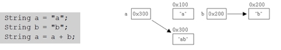

> 본 자료는 [Effective Java 3/E]()를 바탕으로 작성되었습니다.

# 아이템 63. 문자열 연결은 느리니 주의하라

<br>

- [아이템 63. 문자열 연결은 느리니 주의하라](#아이템-63-문자열-연결은-느리니-주의하라)
  - [문자열 연결 연산자("+")는 비싸다](#문자열-연결-연산자는-비싸다)
  - [문자열을 불변이다](#문자열을-불변이다)
  - [String 대신 StringBuilder를 사용하자](#string-대신-stringbuilder를-사용하자)
  - [핵심 정리](#핵심-정리)

<br>

## 문자열 연결 연산자("+")는 비싸다
```java
// 잘못 사용한 예 - 느리다
public String statement() {
    String result = "";
    for (int i = 0; i < numItems(); i++) {
        result += lineForItem(i); // 문자열 연결
    }
    return result;
}
```
* 문자열 n개를 잇는 시간은 n^2에 비례한다.

<br>

## 문자열을 불변이다
문자열은 기본적으로 불변이다. 그러므로 연결 연산자를 사용하면 다음과 같이 동작한다.

<p align="center"></p>

* **한번 생성된 String인스턴스가 갖고 있는 문자열은 읽어 올 수 만 있고, 변경할 수는 없다.**
  * 위 예제에서 `a+b`를 하면 `a`에 `b`를 합쳐야 하지만 `String`은 `ab`를 담는 새로운 인스턴스를 만든다.

<br>

## String 대신 StringBuilder를 사용하자
```java
public String statement2() {
    StringBuilder b = new StringBuilder(numItems() * LINE_WIDTH);
    for (int i = 0; i < numItems(); i++) {
        b.append(lineForItem(i));
    }
    return b.toString();
}
```
* 기본적으로 버퍼를 사용해서 문자열을 붙이기때문에 새로운 객체 생성 비용 자체가 없다. 
* 문자열 연결 연산자보다 5.5배 빠르다고 한다.

<br>

## 핵심 정리
* 성능에 신경 써야 한다면 많은 문자열을 연결할 때는 문자열 연결 연산자를 피하라.
  * 대신 `StringBuilder`의 `append`메서드를 사용하라
