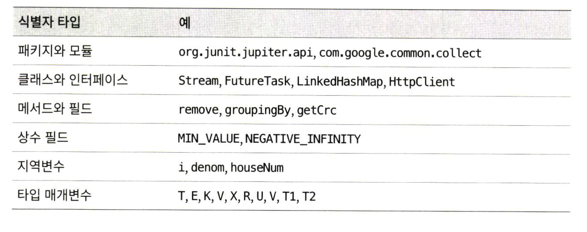

> 본 자료는 [Effective Java 3/E]()를 바탕으로 작성되었습니다.

# 아이템 68. 일반적으로 통용되는 명명 규칙을 따르라

 

- [아이템 68. 일반적으로 통용되는 명명 규칙을 따르라](#아이템-68-일반적으로-통용되는-명명-규칙을-따르라)
  - [패키지](#패키지)
  - [클래스와 인터페이스](#클래스와-인터페이스)
    - [클래스](#클래스)
    - [인터페이스](#인터페이스)
  - [메서드와 필드](#메서드와-필드)
  - [지역변수](#지역변수)
  - [타입 매개변수](#타입-매개변수)
  - [핵심정리](#핵심정리)

 

 출처 : 이펙티브 자바 p.383 

## 패키지
* 모듈과 이름은 **각 요소를 점(`.`)으로 구분하여 계층적으로 짓는다.**
  * 도메인 이름을 역순으로 사용한다.
  * 예외적으로 표준 라이브러리와 선택적 패키지들은 각각 `java`와 `javax`로 시작한다.
* **요소들은 모두 소문자 알파벳** 혹은 (드물게) 숫자로 이뤄진다.
  * 각 요소는 일반적으로 **8자 이하의 짧은 단어**로 한다. ex. `utilities`보다는 `util`
  * 약어로 사용해도 된다. ex. `awt`

 

## 클래스와 인터페이스

 

### 클래스
* 클래스와 인터페이스의 이름은 하나 이상의 단어로 이뤄지며, 각 단어는 대문자로 시작한다.
  * ex. `List`, `FutherTask`
* 단어를 줄여쓰지 않는다. ex. `HttpUrl`
  * 단, 여러 단어의 첫 글자만 딴 약자나 `max`, `min`처럼 널리 통용되는 줄임말은 허용된다.
* 객체를 생성할 수 있는 클래스의 이름은 보통 단수 명사나 명사구를 사용한다.
  * ex. `Thread`, `PriorityQueue`, `ChessPiece`
* 객체를 생성할 수 없는 클래스의 이름은 보통 복수형 명사로 짓는다.
  * ex. `Collectors`, `Collections`

 

### 인터페이스
* 인터페이스 이름은 클래스와 똑같이 짓거나 `able`혹은 `ible`로 끝나는 형용사로 짓는다.
  * `Collection`, `Comparator`, `Runnable`, `Accessible`

 

## 메서드와 필드
* 첫 글자를 소문자로 쓴다는 점만 빼면 클래스 명명 규칙과 같다.
  * ex. `remove`, `ensureCapacity`
* **상수 필드는 구성하는 단어를 모두 대문자로 써야하며 단어 사이는 밑줄로 구분한다.**
  * ex. `VALUES`, `NEGATIVE_INFINITY`
* 동작을 수행하는 메서드의 이름은 동사나 동사구로 짓는다.
  * ex. `append`, `drawImage`
* `boolean`을 반환하는 메서드라면 보통 `is` 드물게는 `has`로 시작하고 명나 명사구, 혹은 형용사로 짓는다.
  * ex. `isDigit`, `isEmpty`
* **해당 인스턴스의 속성을 반환하는 메서드의 이름을 보통 명사, 명사구, 혹은 `get`으로 시작하는 동사구로 짓는다.**
  * ex. `size`, `hashCode`, `getTime`
  * 세터와 같이 사용할 때는 `getAttribute`, `setAttribute` 형식으로 사용하자.
* 객체의 타입을 변환해서 반환하는 인스턴스 메서드의 이름은 보통 `toType`형태로 짓는다.
  * ex. `toString`, `toArray`
* 객체의 값을 기본 타입 값으로 반환하는 메서드의 이름은 보통 `typeValue` 형태로 짓는다.
  * ex. `intValue`
* 객체의 내용을 다른 뷰로 보여주는 메서드의 이름은 `asType`으로 짓는다.
  * ex. `asList`

 

## 지역변수
* 다른 멤버와 비슷한 명명 규칙이 적용된다.
  * 단, **약어를 써도 좋다.**

 

## 타입 매개변수
* 보통 한 문자로 표현한다.
* 대부분은 다음과 같이 사용한다.
  * `T`: 임의의 타입
  * `E`: 컬렉션 원소의 타입
  * `K`, `V`: 맵의 키와 값
  * `X`: 예외
  * `R`: 메서드의 반환 타입

 

## 핵심정리
* 표준 명명 규칙을 체화하여 자연스럽게 베어 나오도록 하자.

