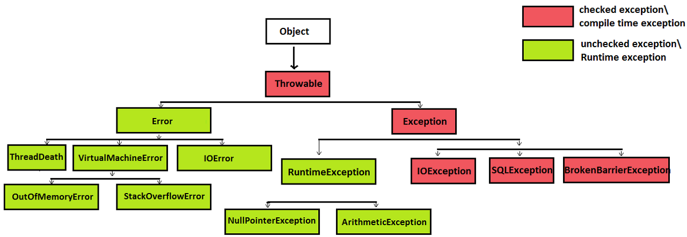

> 본 자료는 [Effective Java 3/E]()를 바탕으로 작성되었습니다.

# 아이템 70. 복구할 수 있는 상황에는 검사 예외를, 프로그래밍 오류에는 런타임 예외를 사용하라

 

- [아이템 70. 복구할 수 있는 상황에는 검사 예외를, 프로그래밍 오류에는 런타임 예외를 사용하라](#아이템-70-복구할-수-있는-상황에는-검사-예외를-프로그래밍-오류에는-런타임-예외를-사용하라)
  - [예외 종류](#예외-종류)
  - [Checked Exception과 Unchecked Exception 선택 방법](#checked-exception과-unchecked-exception-선택-방법)
  - [throwable은 사용하지 마라](#throwable은-사용하지-마라)
  - [예외도 객체다](#예외도-객체다)
  - [핵심 정리](#핵심-정리)

 

## 예외 종류

 출처 : https://www.javamadesoeasy.com/2015/05/exception-handling-exception-hierarchy.html

* 검사 예외
  * 컴파일 시점에 Exception을 catch하는지 확인한다. 컴파일 시점에 Exception에 대한 처리(try/catch)를 하지 않을 경우 컴파일 에러가 발생한다.
  * Exception이 발생하는 메소드에서 throws 예약어를 활용해 Exception을 호출 메소드에 전달해야 한다.
  * 과도하게 사용하면 성능에 영향이 끼친다.
* 비검사 예외
  * 컴파일 시점에 Exception을 catch하는지 확인하지 않는다. 컴파일 시점에 Exception이 발생할 것인지의 여부를 판단할 수 없다.
  * Exception이 발생하는 메소드에서 throws 예약어를 활용해 Exception을 처리할 필요가 없다. 하지만 처리해도 무방하다.

 

## Checked Exception과 Unchecked Exception 선택 방법
* 호출하는 메소드가 Exception을 활용해 무엇인가 의미 있는 작업을 할 수 있다면 Checked Exception을 사용하라.
* 만약 호출하는 메소드가 Exception을 catch해 예외 상황을 해결하거나 문제를 해결할 수 없다면 Unchecked Exception을 사용하라.
* 명확하지 않다면 Unchecked Exception을 사용하라.

 

> * Error : 애플리케이션이 정상적으로 동작하는데 심각한 문제가 있는 경우
> * Exception : 비즈니스 로직 상에서 에러가 발생하는 경우 사용한다. Exception을 사용하는 경우 컴파일 시점에 Exception을 확인할 수 있다. Checked Exception이라고도 한다.
> * RuntimeException : NumberFormatException과 같이 Runtime 시에 발생하는 에러를 처리하는데 사용한다. UnChecked Exception이라고도 한다.

 

## throwable은 사용하지 마라
* `throwable`은 언제 사용하면 좋을까?
  * 절대로 사용하지 마라!

 

## 예외도 객체다
* **예외도 객체이므로 메서드를 정의해서 예외를 일으킨 상황에 관한 정보를 코드 형태로 전달할 때 사용할 수 있다.**
  * 이런 메시지가 없다면 프로그래머들은 오류 메시지를 파싱해 정보를 빼내야 하는데, 대단히 나쁜 습관이다.
  * ex. 쇼핑몰에서 물건을 구입하려는 데 카드 잔고가 부족하여 검사 예외가 발생한다면, 잔고가 얼마나 부족한지를 알려주는 접근자 메서드를 제공해야 한다.

 

## 핵심 정리
* 복구할 수 있는 상황이면 검사 예외를, 프로그래밍 오류라면 비검사 예외를 던지자.
* 확실하지 않다면 비검사 예외를 던지자.
* 검사 예외도 아니고 런타임 예외도 아닌 throwable은 정의하지 말자
* 검사 예외라면 복구에 필요한 정보를 알려주는 메서드도 제공하자.
