[자바의 정석](http://www.yes24.com/Product/Goods/24259565?OzSrank=2)을 바탕으로 정리한 자료입니다.


# 목차

- [제네릭스(Generics)](#제네릭스generics)
  * [1. 제네릭스란?](#1-제네릭스란)
  * [2. 제네릭 클래스의 선언](#2-제네릭-클래스의-선언)
  * [3. 제네릭스의 용어](#3-제네릭스의-용어)
  * [4. 제네릭스의 제한](#4-제네릭스의-제한)
  * [5. 제네릭스 클래스의 객체 생성과 사용](#5-제네렉스-클래스의-객체-생성과-사용)
  * [6. 제네릭스 타입의 제한](#6-제네릭스-타입의-제한)
  * [7. 와일드 카드](#7-와일드-카드)
    + [7-1. 와일드 카드란?](#7-1-와일드-카드란)
    + [7-2. 와일드 카드를 사용해야 하는 이유](#7-2-와일드-카드를-사용해야-하는-이유)
  * [8. 제네릭스 메서드](#8-제네릭스-메서드)
    + [8-1. 제네릭스 메서드란?](#8-1-제네렉스-메서드란)
    + [8-2. 제네릭스 메서드 사용하는 이유](#8-2-제네릭스-메서드-사용하는-이유)


# 제네릭스(Generics)

제네릭스는 JDK1.5부터 도입된 기능하다.

**컴파일시 타입을 체크해 주는 기능이다.**


## 1. 제네릭스란?

* 제네릭스는 **컴파일시 타입을 체크해 주는 기능**이다.
* **객체의 타입 안정성을 높이고 형변환의 번거로움을 줄여준다.**
  * 하나의 컬력센에는 대부분 한 종류의 객체만 저장.

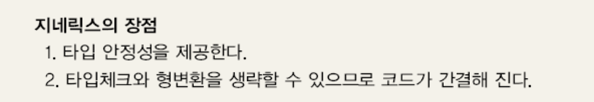


> **쉽게 말해서 타입 변수(type variable)라고 생각하면 된다.**


## 2. 제네릭 클래스의 선언

>  제네릭스를 사용하지 않은 예제

```java
class Box {
  Object item;
  
  void setItem(Object item){ this.item = item; }
  Object getItem() {return item;}
}
```

* 매번 **`Setter`와 `Getter`를 사용할 때 형변환을 해줘야 한다.**


> 제네릭스를 사용하는 예제

```java
class Box<T> {
  T item;
  
  void setItem(T item) { this.item = item; }
  T getItem() { return item; }
}
```

* **`Box<T>`에서 `T`를 타입 변수라고 하고, '임의의 참조형 타입'을 의미한다.**
* **제네릭스를 사용하면 매번 형변환을 해주지 않아도 된다.**

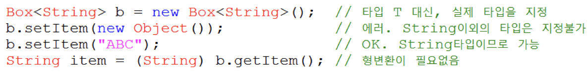


> 제네릭스가 도입되기 이전의 코드와 호환성을 유지하기 위해서 제네릭스가 필요한 클래스에 제네릭스를 사용하지 않은 코드를 사용해도 오류가 발생하진 않는다.
>
> 하지만 경고가 발생할 수 있다.
>
> **가능한 제네릭스가 구현된 클래스엔 제네릭스를 사용해야한다.**


## 3. 제네릭스의 용어

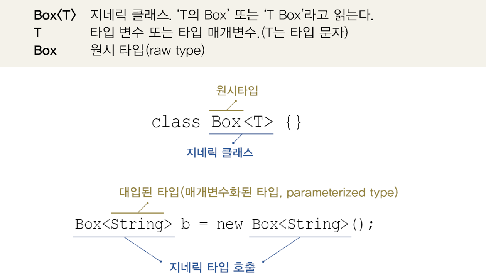

* **`T`는 지네릭 클래스 `Box<T>`의 타입 변수 또는 타입 매개변수라고 한다.**
  * 메서드의 매개변수와 유사한 면이 있다.
  * **`Box<String>`과 `Box<Integer>`는 메서드의 `add(1,3)`와 `add(2,4)`처럼 같은 기능을 하는 클래스이지만, 타입 매개변수가 다른 것 뿐이다.**


## 4. 제네릭스의 제한

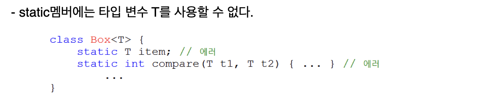

* **모든 객체에 대해 동일하게 동작해야하기 때문에 static멤버에는 타입 변수 T를 사용할 수 없다.**
  * **클래스를 인스턴스화할 때 제네릭스의 타입을 보내주는데 static은 인스턴스화 안하고 사용할 수 있기 때문이다.**
  * static멤버는 타입 변수에 지정된 타입에 관계없이 동일한 것이어야 하기 때문.


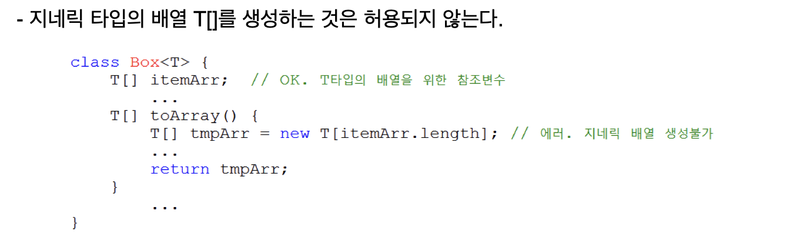

* **배열을 생성할 수 없는 이유는 new연산자 때문이다.**
  * `new`연산자는 컴파일 시점에 타입 `T`가 뭔지 정확히 알아야하기 때문이다. (배열이기도 하고)
  * **`Box<T>`클래스를 컴파일하는 시점에서는 `T`가 어떤 타입인지 모른다.**


> 제네릭스를 사용해서 배열을 만드는 방법은 리플렉션 API를 사용하는 것 뿐이다.


## 5. 제네릭스 클래스의 객체 생성과 사용

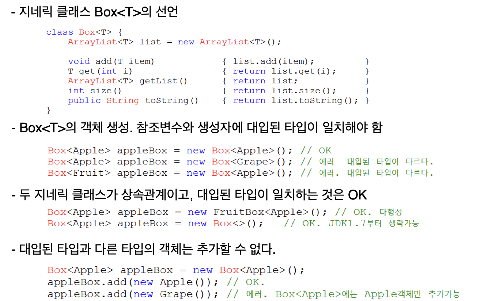


* JDK1.7부터는 추정이 가능한 경우 타입을 생략할 수 있게 되었다.

  * ```java
    Box<Apple> appleBox = new Box<Apple>();
    Box<Apple> appleBox = new Box<>(); // OK
    ```

    


## 6. 제네릭스 타입의 제한

**제네릭스는 타입 변수를 지정할 수 있는 매개변수와도 같은 존재이다.**

그렇다면 매개변수 T에 지정할 수 있는 타입의 종류를 제한할 수 있는 방법이 있다.

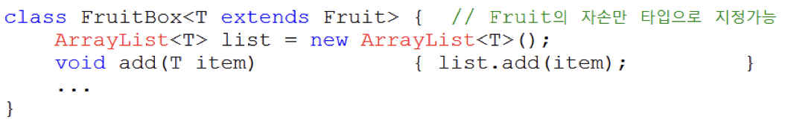

* **`extends` 를 사용하면, 특정 타입의 자식들만 대입할 수 있게 제한할 수 있다.**


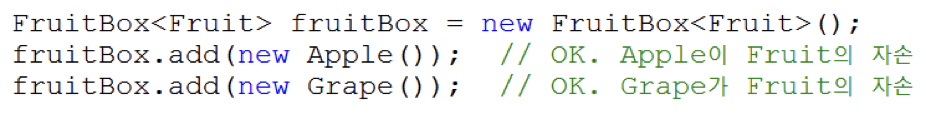

* `add()` 의 매개변수의 타입 `T`도 `Fruit`와 그 자식 타입이 될 수 있다.

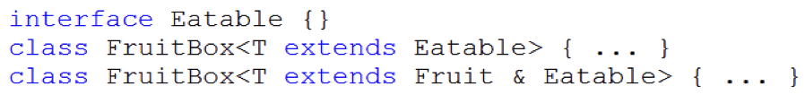

* **인터페이스의 경우도 `implements`가 아닌, `extends`를 사용한다.**

* **클래스 `Fruit`의 자식이면서 `Eatable`인터페이스도 구현해야한다면 `&`를 사용해서 연결한다.**


## 7. 와일드 카드


### 7-1. 와일드 카드란?

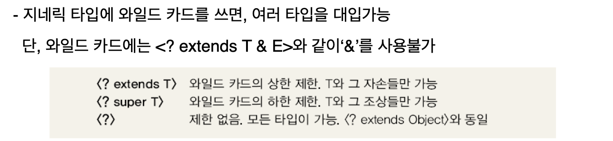


### 7-2. 와일드 카드를 사용해야 하는 이유

`Juicer`라는 클래스에 `FruitBox`를 매개변수로 넘겨주면 주스를 만들어 주는 예제이다.

```java
class Juicer {
  static Juice makeJuice(FruitBox<Fruit> box) { // <Fruit>으로 지정
    String tmp = "";
    for(Fruit f : box.getList()) tmp += f + " ";
    return new Juice(tmp);
  }
}

class Main {
  public static void main(String[] args) {
    FruitBox<Fruit> fruitBox = new FruitBox<Fruit>();
    FruitBox<Apple> appleBox = new FruitBox<Apple>();
    
    System.out.println(Juicer.makeJuice(fruitBox)); // OK
    System.out.println(Juicer.makeJuice(appleBox)); // 에러!!!
  }
}
```

* `makeJuice`의 매개변수로 `<Fruit>`을 담고 있는 `FruitBox`를 받는다.
  * `<Apple>`의 내용물을 가지고 있는 `FruitBox`는 매개변수로 넘겨주면 에러가 발생하게 된다.

```java
static Juice makeJuice(FruitBox<Fruit> box) { // <Fruit>으로 지정
    String tmp = "";
    for(Fruit f : box.getList()) tmp += f + " ";
    return new Juice(tmp);
}

static Juice makeJuice(FruitBox<Apple> box) { // <Apple>으로 지정
    String tmp = "";
    for(Fruit f : box.getList()) tmp += f + " ";
    return new Juice(tmp);
}
```

* **두 개의 메서드를 만들어 오버로딩하면 어떻게 될까?**
  * 오류가 발생한다.
  * **제네릭 타입이 다른 것만으로는 오버로딩이 성립하지 않기 때문이다.**


> **이때 사용해야하는 것이 바로 '와일드 카드'이다.**

```java
static Juice makeJuice(FruitBox<? extends Fruit> box) { 
    String tmp = "";
    for(Fruit f : box.getList()) tmp += f + " ";
    return new Juice(tmp);
}
```

* 이 메서드는 이제 매개변수로 `FruitBox<Fruit>`과 `FruitBox<Apple>` 모두 받을 수 있게 된다.
  * **`FruitBox<? extends Fruit>` : `Fruit`을 상속하는 자식 클래스들만 허용한다.**


## 8. 제네릭스 메서드


### 8-1. 제네릭스 메서드란?

메서드의 선언부에 제네릭 타입이 선언된 메서드를 제네릭 메서드라 한다.

대표적인 예제가 바로 `Collections.sort()`이다.

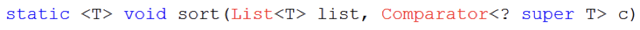

* **반환 타입 앞에 제네릭 타입을 선언해준다.**


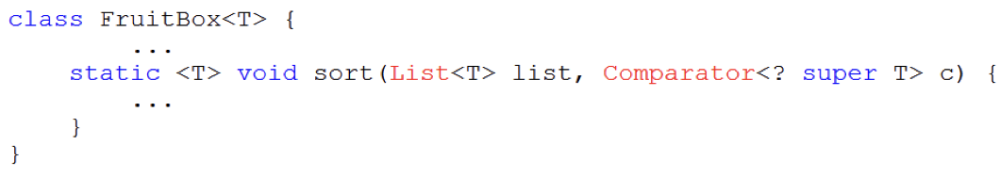

* **클래스의 타입 매개변수 `<T>`와 메서드의 타입 매개변수 `<T>`는 별개이다.**


> **제네릭스 메서드에 선언된 제네릭 타입은 "지역 변수"를 선언한 것과 같다고 생각하면 된다.**
>
> 이 타입 매개변수는 메서드 내에서만 지역적으로 사용될 것이므로 메서드가 static이건 아니건 상관이 없다.


### 8-2. 제네릭스 메서드 사용하는 이유

> 예제 1

```java
// 이전의 코드
static Juice makeJuice(FruitBox<? extends Fruit> box) { 
    String tmp = "";
    for(Fruit f : box.getList()) tmp += f + " ";
    return new Juice(tmp);
}

// 제네릭스 메서드를 사용하는 코드 (지역 변수를 사용하는 것과 같다.)
static <T extends Fruit> Juice makeJuice(FruitBox<T> box){
  	String tmp = "";
    for(Fruit f : box.getList()) tmp += f + " ";
    return new Juice(tmp);
}
```

* **그저 메서드의 선언부에 제네릭스 지역 변수를 사용하는 것과 같다.**


> 예제 2 ( 중요 )

```java
public static <T extends Comparable<? super T>> void sort (List<T> list) {
  
}

// 1. List<T>
// 2. <T extends Comparable<? super T>
```

1. 타입 `T`를 요소로 하는 `List`를 매개변수로 허용한다.
2. `T`는 아래와 같은 조건이 있다.
   * `Comparable`을 구현한 클래스이어야 한다. (`<T extends Comparable>`)
   * `T`또는 그 조상의 타입을 비교하는 `Comparable`이어야 한다. (`<Comparable<? super T>`)
   * 만약 `T`가 `Student`고, `Person`의 자손이라면, `<? super T>`는 `Student`, `Person`, `Object`가 모두 가능하다.


