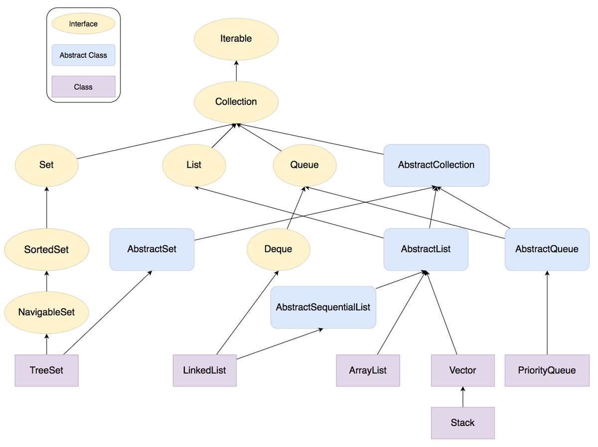
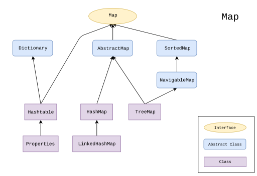
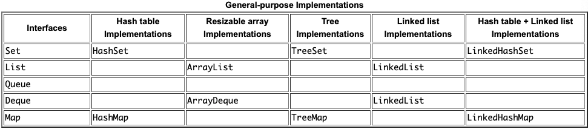

# 목차

<br>

- [목차](#목차)
- [JCF 계층구조](#jcf-계층구조)
  - [java.util.Collection](#javautilcollection)
  - [java.util.map](#javautilmap)
  - [구현체 종류](#구현체-종류)
  - [계층구조를 나눈 이유](#계층구조를-나눈-이유)
- [Collection Interface](#collection-interface)
- [Iterable Interface](#iterable-interface)
- [참고](#참고)

<br>

# JCF 계층구조
JCF의 계층구조는 크게 두 개로 나눌 수 있다.

* `java.util.Collection`
* `java.util.map`

<br>

## java.util.Collection

`Collection` 인터페이스는 JCF의 Root 인터페이스이다. JCF의 대부분 클래스는 모두 `Collection`을 구현한다.

JDK는 이 인터페이스의 직접적인 구현을 제공하지 않으며, `Set` ,`List`와 같은 보다 구체적인 하위 인터페이스의 구현을 제공한다.

<p align="center"><br>출처: https://www.educative.io/blog/what-are-java-collections#javacollections </p>

`Abstractxxx` 구현체들은 핵심 컬렉션 인터페이스의 기본 구현을 제공한다. (중복 제거)

<br>

## java.util.map
`Map` 인터페이스는 `Collection`인터페이스를 상속받지 않는 유일한 인터페이스이다. 그럼에도 JCF에 속해있는다.

> 실제로 `java.util` 패키지에 속해있다.

또한, `Map`을 상속받는 인터페이스들은 모두 `Collection`을 반환하는 메서드들을 가지고 있다. 이를 통해 `Collection`처럼 처리할 수 있다.

> ex. `Set<K> keySet()`, `Collection<V> values()` 등등

<br>

<p align="center"><br>출처: https://en.m.wikipedia.org/wiki/File:Java.util.Map_hierarchy.svg </p>

<br>

## 구현체 종류

<p align="center"><br>출처: https://docs.oracle.com/javase/tutorial/collections/implementations/index.html </p>

JCF 구현체의 종류는 다음과 같다.

* General-purpose implementations are the most commonly used implementations, designed for everyday use. They are summarized in the table titled General-purpose-implementations.
* Special-purpose implementations are designed for use in special situations and display nonstandard performance characteristics, usage restrictions, or behavior.
* Concurrent implementations are designed to support high concurrency, typically at the expense of single-threaded performance. These implementations are part of the java.util.concurrent package.
* Wrapper implementations are used in combination with other types of implementations, often the general-purpose ones, to provide added or restricted functionality.
* Convenience implementations are mini-implementations, typically made available via static factory methods, that provide convenient, efficient alternatives to general-purpose implementations for special collections (for example, singleton sets).
* Abstract implementations are skeletal implementations that facilitate the construction of custom implementations — described later in the Custom Collection Implementations section. An advanced topic, it's not particularly difficult, but relatively few people will need to do it.

> 자세한 내용은 [여기](https://docs.oracle.com/javase/tutorial/collections/implementations/index.html)를 참고

<br>

## 계층구조를 나눈 이유
필자는 JCF의 계층 구조를 보며 의문이 들었다. 왜 이렇게 복잡하게 계층구조를 나눴을까?

그 해답은 [공식 문서의 디자인 목표](https://docs.oracle.com/javase/8/docs/technotes/guides/collections/overview.html)파트에서 알 수 있었다.

* 가장 큰 이유는 **새로운 기능이 추가되도 변경을 최소화하기위해 크기가 작은 인터페이스(메서드 개수가 적은)들을 만들기 위함입니다.**
  * 이를 통해 새로운 기능(혹은 구현체)이 추가되도 기존 구현체는 변경을 하지 않고 새로운 기능만을 확장할 수 있다.
  * **쉽게 얘기해서 ISP를 지켜서 역할을 명확히 구분하기 위함이다.** -> 각 인터페이스가 "개념적"으로 하나만을 가지도록 한 것. -> **책임을 명확히 구분**
* 인터페이스의 크기가 작게 유지하기 위해서 각 인터페이스는 변경 가능성를 신경쓰지 않고, 특정 메서드는 선택 (Optional)로 구현했다고 한다.
  * **만약 지원하지않는 메서드를 호출하면 `UnsupportedOperationException`를 던진다.**

<br>

# Collection Interface
[JCF 계층구조 - java.util.Collection](#javautilcollection)에서 설명했듯이, `Collection` 인터페이스는 `size()`, `iterator()`, `add()`, `remove()`, `clear()`와 같이 컬렉션들이 모두 가져야 할 행위들을 정의하고있다.

> 더 자세한 내용은 [JDK 8 - Collection](https://docs.oracle.com/javase/8/docs/api/java/util/Collection.html)을 참고.

또한, **이 인터페이스는 일반적으로 컬렉션을 전달하고, 일반성이 필요한 곳에서 컬렉션을 조작하는 데 사용된다. (추상화)**

<br>

이외에도 [공식문서](https://docs.oracle.com/javase/8/docs/api/java/util/Collection.html)를 보면 아래와 같은 스펙을 정의하였다.

> 아래 스펙은 필수는 아니지만, Java에서 제공하는 JCF에는 아래와 같이 구현되어 있다고 한다.

* `Collection`을 구현한 구현체는 적어도 두 개의 생성자를 가져야 한다.
  * 기본 생성자 (no arguments) -> empty collection을 만들기 위함.
  * `Collection` 타입을 매개변수로 받는 생성자 -> 매개변수로 받은 컬렉션을 복사하여 원하는 타입의 동등한 컬렉션을 생성하기 위함.
* `Collection` 요소의 내용을 변경하는 메서드를 지원하지 않는 구현체의 경우 `UnsupportedOperationException`을 던진다.
* 일부 `Collection` 구현체는 포함할 수 있는 요소에 대한 제한이 존재한다.
  * `null` 요소를 추가할 수 없거나, 특정 타입을 추가할 수 없는 제한이 존재한다.
  * 만약 이 제한을 어길시 `NPE` 혹은 `ClassCastException`이 발생한다.
* **동기화 정책은 각각의 `Collection`이 결정한다.**
* **`Collection`을 구현한 많은 구현체는 각각의 요소를 `equals()`를 통해 비교한다.**
  * 보통은 `hashCode()`를 통해 두 요소를 비교하고, `equals()`를 통해 비교한다. (동등성) -> `equals()` 호출을 최적화하기 위해 먼저 호출한다고 한다.

<br>

# Iterable Interface
`Iterable` 인터페이스는 JCF의 기본 인터페이스이며, `Collection` 인터페이스가 `Iterable` 인터페이스를 확장한다.

이는 모든 컬렉션 구현체들이 `Iterable`을 구현하고있다고 볼 수 있다. (JDK 1.5부터 생긴 기능이다)

> Iterable.java
```java
public interface Iterable<T> {
    Iterator<T> iterator();
}
```

`Iterable`은 위와 같이 `Iterator` 인터페이스를 제공하며, 이는 컬렉션과 상관없이 동일하게 컬렉션을 순회하는 `for-each`에 사용된다.

> `for-each`를 사용하려면 `Iterable`을 구현해야한다.

[Iterator](https://docs.oracle.com/en/java/javase/11/docs/api/java.base/java/util/Iterator.html)는 컬렉션을 순회할 때 리모콘과 같은 역할을 하는 인터페이스이며, 컴파일 타임에 컬렉션에 상관없이 요소를 순회할 수 있도록 해준다.

<br>

# 참고
* [Oracle Java Document - Collections Framework](https://docs.oracle.com/javase/8/docs/technotes/guides/collections/overview.html)
* https://www.educative.io/blog/what-are-java-collections#javacollections
* https://www.geeksforgeeks.org/collections-in-java-2/


