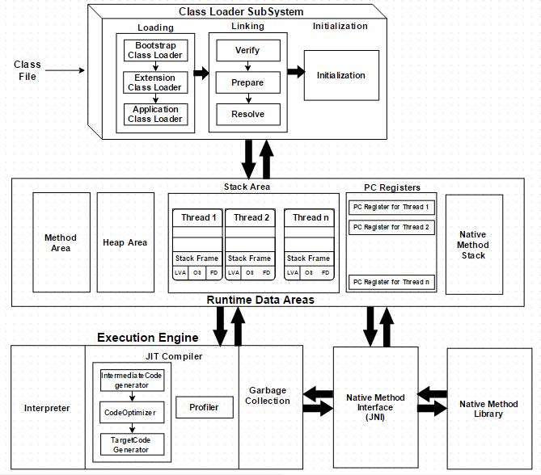

# 목차

<br>

- [목차](#목차)
- [개요](#개요)
- [클래스로더 개념](#클래스로더-개념)
- [클래스로더 실행 흐름](#클래스로더-실행-흐름)
- [로딩](#로딩)
  - [로딩이란?](#로딩이란)
  - [로딩 종류](#로딩-종류)
    - [Boostrap ClassLoader](#boostrap-classloader)
    - [Platform ClassLoader](#platform-classloader)
    - [Application ClassLoader](#application-classloader)
    - [로딩의 3가지 원칙](#로딩의-3가지-원칙)
- [링크](#링크)
- [초기화](#초기화)
- [java.lang.ClassLoader](#javalangclassloader)
- [참고](#참고)

<br>

# 개요
자바에서의 클래스 로더는 어떤 역할을 할까?

<p align="center"><br>출처: https://dzone.com/articles/jvm-architecture-explained</p>

전체 JVM 구조에서보면 가장 상단에 위치하며, 컴파일 된 `.class`에서 바이트 코드를 읽고 JVM(메모리)에 저장하는 역할을 담당한다.

간단히 보면 아래와 같은 단계를 거친다. 

* 로딩: 클래스를 읽어오는 과정
* 링크: 레퍼런스를 연결하는 과정
* 초기화: static 값들 초기화 및 변수에 할당

클래스 로더의 가장 큰 특징은 클래스들을 한번에 로딩하지 않고, 런타임에 동적으로 JVM으로 로딩한다는 것이다.

이로 인해, JVM은 클래스 로더 덕분에 Java 프로그램을 실행하기 위해 기본 파일이나 파일 시스템에 대해 알 필요가 없다.

<br>

# 클래스로더 개념

🤔 클래스로더란?
* 클래스로더는 자바 클래스를 JVM으로 동적 로드하는 자바 런타임 환경(JRE)의 일부이다.
* **클래스 로더는 라이브러리를 위치시키고 내용물을 읽으며 라이브러리들 안에 포함된 클래스들을 읽는 역할**을 한다.
* **JVM에서 동작하는 모든 Class들은 참조되는 순간 동적으로 Load 및 Link가 이뤄진다.**
  * ClassLoader는 런타임에 동적으로 자바 Class들을 로딩하는 일을 수행한다.
  * **한꺼번에 적재하는 것이 아니라 실행 시 필요한 부분만 적재된다는 의미.**

<br>

❗️ ClassLoader 특징
* Lazy 로딩
  * 로딩은 일반적으로 요청이 오면 이루어지는데, 이 말은 클래스가 프로그램에 의해 호출될 때까지 로드하지 않는다는 것을 뜻한다. 명명된 클래스는 주어진 클래스로더에 의해 한 번만 로드될 수 있다.

<br>

# 클래스로더 실행 흐름

`.class`를 로딩한다면, 클래스 로더는 로딩, 링크, 초기화 순으로 진행한다.

클래스 로더하는 과정에선 여러 개의 클래스 로더들이 부모, 자식 관계를 맺고 로딩을 한다.

링크 과정에선 세 단계로 나눠서 순차적으로 진행된다.

마지막으로 초기화가 진행된다.

<br>

# 로딩
> 운영체제에서의 로딩은 RAM에 프로그램을 적재하는 것을 의미한다.

<br>

## 로딩이란?

<br>

🤔  로딩의 역할
* 클래스 로더가 `.class` 파일을 읽고 그 내용에 따라 적절한 바이너리 데이터를 만들고 `Method영역`에 저장한다.

<br>

🤔 `Method 영역`에 저장되는 데이터
* FQCN (Fully-Qualified Class Name): 패키지 이름 + 클래스 이름
  * ex. `String`의 FQCN은 `java.lang.String`
* 클래스, 인터페이스, Enum (어떤 형태인지를 저장)
* 메서드와 변수

> 메서드 영역: 메모리 영역에는 클래스 수준의 정보 (클래스 이름, 부모 클래스 이름, 메서드, 변수)를 저장한다. 

<br>

❗️ **로딩이 끝나면 해당 클래스 타입의 Class 객체를 생성하여 `Heap 영역`에 저장한다. - 중요!!**
* 리플렉션에서 사용될 수 있다 ex. `Class<String>`, `String.class`, `new String().getClass()`

> 힙 영역은 다른 스레드끼리 공유된다.

<br>

## 로딩 종류
> 자바 코드에서의 ClassLoader를 의미하기도 한다.
클래스 로더의 로딩에선 3가지가 존재한다.

```java
@Test
void getClassLoader() {
    Class<Member> MemberClass = Member.class;
    ClassLoader classLoader = MemberClass.getClassLoader();
    System.out.println(classLoader); // jdk.internal.loader.ClassLoaders$AppClassLoader@4b85612c
    System.out.println(classLoader.getParent()); // jdk.internal.loader.ClassLoaders$PlatformClassLoader@71e4965d
    System.out.println(classLoader.getParent().getParent()); // null
}
```

<br>

### Boostrap ClassLoader
* 최상위 클래스로더이며, `jre/lib/rt.jar`(`JAVA_HOME/lib`)에 담긴 코어 JDK 클래스 파일(API)을 로딩한다.
* 최상위 클래스로더이며, 우선순위가 가장 높다.
* Native 코드로 구현되어 있으며, 자바 코드에서 `getClassLoader()`를 통해 가져오면 `null`을 반환한다.

<br>

### Platform ClassLoader
> 이전엔 Extension ClassLoader라고 불렸다.
* `jre/lib/ext`폴더와 `java.ext.dirs` 환경 변수로 지정된 폴더에 있는 클래스 파일을 로딩한다.
* 자바로 구현되어 있으며, `jdk.internal.loader`(JDK 11기준) 클래스 안에 static 클래스로 구현되어 있다.
  * `BuiltinClassLoader`를 상속하고 있다.

<br>

### Application ClassLoader
* 애플리케이션 클래스패스에서 클래스를 읽는다.
  * 애플리케이션 클래스패스: 애플리케이션 실행할 때 `-classpath`옵션 또는 `java.class.path` 환경 변수의 값에 해당하는 위치.
  * JAR파일 안에 Manifest 파일의 `Class-Path` 속성값으로 지정된 폴더에 있는 클래스
  * 개발자가 애플리케이션 구동을 위해 직접 작성한 대부분의 클래스는 이 클래스로더에 의해 로딩된다.
* 자바로 구현되어 있으며, `jdk.internal.loader`(JDK 11기준) 클래스 안에 static 클래스로 구현되어 있다.
  * `BuiltinClassLoader`를 상속하고 있다.

<br>

### 로딩의 3가지 원칙
> 자바 코드에서 ClassLoader의 동작 원리이기도 하다.
각각의 클래스 로더는 각자 맡은 부분의 클래스를 읽는다.

1. 위임 원칙: 클래스로딩 작업을 상위 클래스로더에 위임한다.
   * 클래스 로딩 요청이 오면, 애플리케이션 클래스로더는 스스로 직접 로딩하지 않고, 상위 클래스 로더에 위임한다. 최상위(부트스트랩)까지 위임한다.
   * 최상위부터 클래스를 탐색하여 애플리케이션 클래스로더까지도 없으면 `ClassNotFoundException`을 던진다.
2. 가시 범위 원칙: 하위 클래스로더는 상위 클래스로더가 로딩한 클래스를 볼 수 있지만, 상위 클래스로더는 하위 클래스 로더가 로딩한 클래스를 볼 수 없다.
   * 이 원칙때문에 위임원칙처럼 동작하게 되는 것.
3. 유일성 원칙: 하위 클래스로더는 상위 클래스로더가 로딩한 클래스를 다시 로딩하지 않게 해서 로딩된 클래스의 유일성을 보장한다.

<br>

# 링크
> 운영체제에서의 링크는 여러 개의 모듈을 연결하여 함께 실행될 수 있도록 하는 것을 의미한다.
> 
> 자바에서는 로딩 과정이 끝나면 실행된다.
> 
> 링크의 세 단계는 순차적으로 발생한다.

🤔 링크의 역할
* Verify: `.class` 파일 형식이 유효한지 체크한다. (검증)
  * `.class`파일을 임의로 조작하여 이상하게 되면 이 시점에 에러가 발생. (컴파일러가 컴파일 할 때 구문 체크하는 것과 비슷)
* Preparation: static 변수와 기본값에 필요한 메모리 (메모리 준비)
* Resolve: 심볼릭 메모리 레퍼런스를 메서드 영역에 있는 실제 레퍼런스로 교체.
  * ex. `Team team = new Team()`
    * `team` 변수는 실제 `new Team()`인스턴스를 가리키진 않는다.
    * 링크의 Resolve과정에서 `team`이 실제 힙에 저장된 `new Team()` 인스턴스를 가리키도록한다.
  * 이 과정은 발생할 수도 있고, 다른 과정에서 발생할 수도 있다. (Optional 과정)

<br>

# 초기화
* static 변수의 값을 할당한다. (static 블럭 포함)
* SuperClass 초기화를 진행한다.

<br>

# java.lang.ClassLoader

실제 자바에서 클래스로더를 컨트롤하려면 `java.lang.ClassLoader`를 사용한다.

이 클래스에 대해서 알아보고 클래스 로더에 대한 이해를 한층 높여보자.

<br>

https://www.baeldung.com/java-classloaders#understanding-javalangclassloader

<br>

# 참고
* https://www.baeldung.com/java-classloaders
* https://www.inflearn.com/course/the-java-code-manipulation/dashboard
* https://homoefficio.github.io/2018/10/13/Java-%ED%81%B4%EB%9E%98%EC%8A%A4%EB%A1%9C%EB%8D%94-%ED%9B%91%EC%96%B4%EB%B3%B4%EA%B8%B0/
* https://ko.wikipedia.org/wiki/%EC%9E%90%EB%B0%94_%ED%81%B4%EB%9E%98%EC%8A%A4%EB%A1%9C%EB%8D%94
