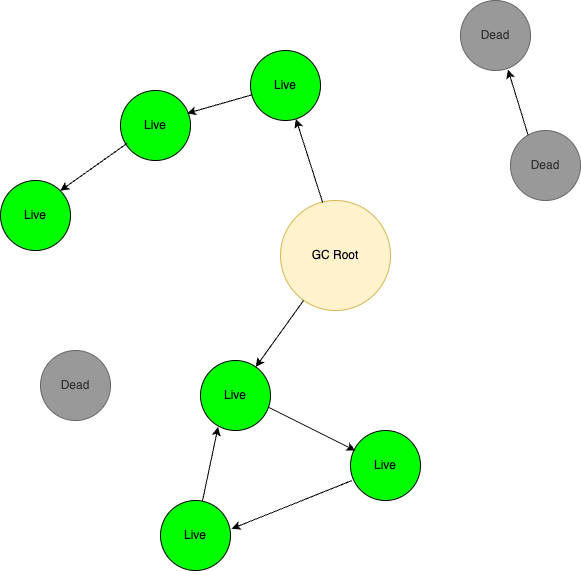
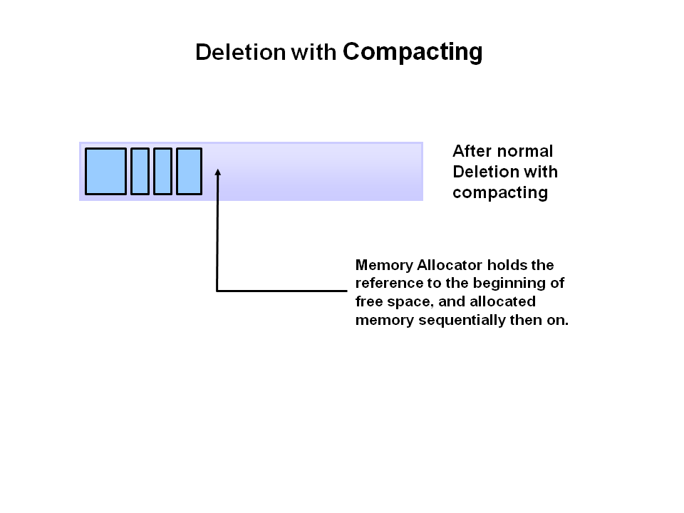
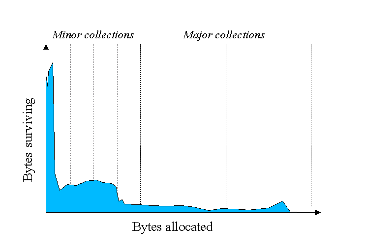
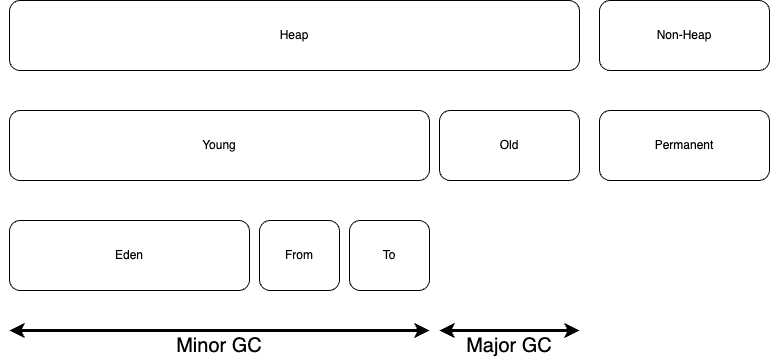

# 목차

 

- [목차](#목차)
- [가비지 컬렉션 이해하기 - 가비지 컬렉션이 무엇이고 어떻게 동작하는가?](#가비지-컬렉션-이해하기---가비지-컬렉션이-무엇이고-어떻게-동작하는가)
- [1 GC란 무엇인가](#1-gc란-무엇인가)
- [2 GC는 어떻게 동작하는가?](#2-gc는-어떻게-동작하는가)
  - [2-1 stop-the-world](#2-1-stop-the-world)
  - [2-2 Mark and Sweep](#2-2-mark-and-sweep)
    - [2-2-1 Mark](#2-2-1-mark)
    - [2-2-2 Sweep](#2-2-2-sweep)
    - [2-2-3 Compact](#2-2-3-compact)
  - [2-3 Heap 메모리 구조 - Generational Garbage Collection](#2-3-heap-메모리-구조---generational-garbage-collection)
    - [2-3-1 Generational Garbage Collection이란? (Young, Old Generation)](#2-3-1-generational-garbage-collection이란-young-old-generation)
    - [2-3-2 Generational Garbage Collection 동작 과정](#2-3-2-generational-garbage-collection-동작-과정)
    - [2-3-3 Write Barrier](#2-3-3-write-barrier)
- [참고](#참고)

 

# 가비지 컬렉션 이해하기 - 가비지 컬렉션이 무엇이고 어떻게 동작하는가?
자바로 구동중인 애플리케이션의 성능 개선을 진행하다보면 가비지 컬렉션 (Garbage Collection, 이하 GC)를 접하게된다.

이번 글은 오라클 공식 문서에 정의된 [JVM GC 표준](https://www.oracle.com/webfolder/technetwork/tutorials/obe/java/gc01/index.html)를 기반으로 GC가 무엇이고 어떻게 동작하는지 정리해본다.

> 이번 글의 모든 GC 내용은 G1GC전의 GC 구현체를 기반으로 작성되었습니다.
> 
> JDK 11부터는 디폴트로 G1GC를 사용하기때문에 이 내용들이 불필요하다고 생각하실 수 있지만, 여러 GC 구현체의 동작 과정을 이해하는데 필요한 핵심 개념은 여전히 유사하기때문에 GC의 기본 개념을 이해하는 것이 좋습니다.

 

# 1 GC란 무엇인가

 

💁‍♂️ **GC는 런타임에 사용되지 않는 객체를 제거하여 사용되지않는 메모리를 자동으로 회수하는 프로세스이다.**

C나 C++과 같이 Unmanged 언어에선 객체의 생성과 제거 (제거후 메모리 회수)를 모두 개발자가 고려해서 코드를 작성해줘야한다.

이로인해 때때로 개발자가 사용한 객체 파괴하는 것을 잊고 할당된 메모리를 해제하지않아 메모리 누수가 발생할 수 있다.

지속된 메모리 누수는 Out Of Memory를 발생시키므로 사실상 프로세스가 원치않게 종료될 수 있다.

 

C는 `free()`, C++은 `delete()`를 사용하여 개발자가 직접 메모리를 해제하는 반면, 자바와 같이 Managed 언어들은 GC를 이용하여 자동으로 객체의 생명주기를 관리한다.

즉, 사용되지않는 객체는 자동으로 제거하고 메모리를 해제한다. 이로인해 메모리 누수를 방지하고 OOM을 방지할 수 있으며, 개발자로 하여금 개발에만 집중할 수 있게한다.

> 물론 코드를 잘못 작성하면 GC가 객체를 제때 수거하지못해 메모리 누수가 발생할 수 있다.
> 
> 또한, C와 C++같은 Unmanaged 언어에비해 메모리를 더 많이 소비할 수 있다.

자바도 이러한 GC를 지원하며 자바 애플리케이션이 JVM에서 실행되는동안 Heap에 저장된 더이상 사용하지 않는 객체를 제거 및 메모리 해제한다.

 JVM 구조 출처: https://www.oracle.com/webfolder/technetwork/tutorials/obe/java/gc01/index.html 

 

💁‍♂️ **GC의 장단점**

* 장점
  * 자동으로 메모리 할당 및 해제해줌으로써 개발자는 비즈니스 로직에 더욱 집중할 수 있게한다.
  * 메모리 누수등의 문제를 방지해준다.
* 단점
  * GC가 계속해서 객체의 참조 생성과 삭제를 추적해야 하므로 애플리케이션이 보다 더 많은 CPU 성능을 필요로한다.
  * 개발자가 직접 더 이상 필요하지않는 객체해제를 제어할 수 없다.
  * 상황에 따라 다르지만 GC로 인해 오히려 비효율적인 애플리케이션이 될 수 있다.

 

# 2 GC는 어떻게 동작하는가?

 

## 2-1 stop-the-world
GC를 이해하는데 가장 먼저 알아야되는 용어는 'stop-the-world'이다.

 

🤔 **stop-the-world란?**

JVM Heap내의 사용되지 않는 객체를 선별하고 제거하려면 가장 먼저 stop-the-world가 발생한다.

stop-the-world는 이름 그대로 세상을 잠시 멈춘다는 의미이며, 이를 JVM에 대입하면 JVM 애플리케이션을 잠시 멈추는 것이다.

stop-the-world가 발생하면 GC를 실행하는 스레드를 제외한 나머지 스레드는 모두 작업을 멈추게된다.

GC 작업을 완료되어야지만 다른 스레드가 중단했던 작업을 다시 시작한다.

 

💁‍♂️ **stop-the-world의 시간을 줄이는 것이 GC 튜닝에도 중요하다.**

어떤 GC 알고리즘이든 stop-the-world는 발생한다.

> Minor GC, Majog GC 모두 stop-the-world가 항상 발생한다.

이는 어떤 GC 알고리즘이라도 JVM 애플리케이션의 실행을 잠시동안 멈추게한다는 의미이므로, stop-the-world의 시간을 줄이는 것만으로 GC 성능 튜닝에 큰 영향을 끼친다.

 

## 2-2 Mark and Sweep
stop-the-world 상태에서 GC는 아래 순서대로 더이상 사용되지 않는 객체를 수거한다.

1. Mark
2. Sweep
3. Compact

GC를 알아보다보면 자주 듣는 Mark And Sweep이다.

 

### 2-2-1 Mark
> mark objects as alive

 

💁‍♂️ **Heap에 저장되는 객체의 종류는 두 가지이다.**

* Live (Reachable, Referenced)
  * 다른 곳에서 사용되고 참조되고있는 객체를 의미한다.
* Dead (Unreachable, UnReferenced)
  * 더 이상 어디에서도 사용되거나 참조되지않는 객체를 의미한다.

 

💁‍♂️ **Mark 단계는 제거되야할 대상인 Unreferenced한 객체를 찾아 마킹하는 단계이다.**

GC의 가장 첫번째 단계인 Mark는 GC가 사용중인 객체와 더이상 사용되지않는 객체를 식별하는 단계이다.

 출처: https://www.oracle.com/webfolder/technetwork/tutorials/obe/java/gc01/index.html 

**위 그림은 메모리 공간을 묘사한 것이며, Mark 단계를 거치면 위와 같이 참조된 객체(파란색)와 더이상 참조되지않는 객체(주황색)를 식별할 수 있게된다.**

그리고 다음 단계인 Sweep에서 이렇게 식별된 객체중 더이상 참조되지않는 객체를 제거하게된다.

 

💁‍♂️ **GC는 어떤 방식으로 Live 객체와 Dead 객체를 식별할까?**

기존 메모리 공간에서 Live 객체 (참조된 객체)와 Dead 객체 (더이상 참조되지않는 객체)를 식별하려면 모든 객체를 스캔해야한다.

**모든 객체를 스캔하기위해 GC는 아래 몇 가지의 Root들로부터 시작하여 Root에서 다른 객체에 대한 참조를 따라 메모리 전체 객체 그래프를 순회한다.**

**그리고 Root에서 도달할 수 없는 객체는 모두 GC의 수집 대상이된다.**

 

GC에서의 Root는 다음과 같다.

* Classes loaded by system class loader (not custom class loaders)
* Live threads
* Local variables and parameters of the currently executing methods
* Local variables and parameters of JNI methods
* Global JNI reference
* Objects used as a monitor for synchronization
* Objects held from garbage collection by JVM for its purposes

이렇게 **Root부터 시작해서 모든 객체를 순회하며 Live와 Dead 객체를 식별하는 개념을 Garbage Collection Roots라고 부른다.**

 

### 2-2-2 Sweep
> Sweep dead objects

 

💁‍♂️ **Sweep 단계에선 Mark 단계에서 마킹해둔 Dead 객체의 메모리를 제거한다.**

 출처: https://www.oracle.com/webfolder/technetwork/tutorials/obe/java/gc01/index.html 

Mark 단계에서 마킹한 Dead 객체는 Sweep 단계에서 삭제되며, 삭제된후엔 새로운 객체를 할당할 수 있는 여유 공간이 생긴다.

 

### 2-2-3 Compact
> Compact remaining objects in memory

 

💁‍♂️ **Mark and Sweep 두 단계를 거치고나서, GC는 성능을 더욱 향상시키기위해 Dead 객체를 삭제하는 것 외에도 나머지 Live 객체를 압축한다.**

 출처: https://www.oracle.com/webfolder/technetwork/tutorials/obe/java/gc01/index.html 

위와 같이 남은 Live한 객체를 한 곳으로 압축함으로써 새로운 메모리 할당이 훨씬 쉽고 빨라지게한다.

> GC 구현체별로 Compact가 발생할 수도 발생하지 않을 수도 있다.

 

## 2-3 Heap 메모리 구조 - Generational Garbage Collection
모든 객체는 생성된 후 제거되기전까지 시간별로 분류되어 관리된다.

사람으로 비유하면 객체(사람)은 생성된 후 나이에 따라 분류되어 관리되는 것이며, 이러한 전략을 `Generational Garbage Collection`라고한다.

그리고 모든 GC는 이러한 `Generational Garbage Collection`를 구현한다.

> 이번 장을 통해 왜 Heap의 메모리 구조가 세대별로 분리되어있는지 이해할 수 있다.

 

### 2-3-1 Generational Garbage Collection이란? (Young, Old Generation)

 

💁‍♂️ **대부분의 객체 수명은 굉장히 짧다.**

앞서 GC는 Mark and Sweep과 Compact 단계를 거쳐 사용되지않는 객체를 제거한다고하였다.

문제는 매번 모든 객체를 순회하며 Mark하고 Sweep하는 것은 비효율적이다.

점점 더 많은 객체가 할당됨에 따라 객체 목록이 점점 더 늘어나 GC 시간이 점점 더 길어지는 문제가 생긴다.

 

그러나 다행히도 애플리케이션에 대한 경험적 분석에 따르면 아래와 같이 대부분의 객체는 수명이 짧다고한다.

 출처: https://www.oracle.com/webfolder/technetwork/tutorials/obe/java/gc01/index.html 

위 그림에서 알 수 있듯이, 시간이 지남에 따라 점점 더 적은 수의 객체가 메모리에 남게된다. 사실상 대부분의 객체는 
왼쪽에 모여있듯이 굉장히 수명이 짧다.

**이를 잘 활용한다면, 모든 객체를 세대 (age)별로 나누고, 탄생한지 얼마안된 객체 대상으로만 GC를 돌림으로써 GC의 성능을 높일 수 있다.**

순회해야하는 객체의 수가 줄어들고, 이는 stop-the-world의 시간을 단축함으로써 GC의 성능을 높일 수 있는 것이다.

 

💁‍♂️ **Weak Generation Hypothesis**

**대부분 객체 수명이 짧다는 특징을 활용하여 GC의 성능을 높이기위해 각 객체를 시간 (age)별로 나누어 처리하는 것이 Generational Garbage Collection의 핵심이다.**

**이러한 현상을 Weak Generation Hypothesis라고 부르기도한다.**

그래서 JVM은 각 객체를 세대별로 나누어 처리하기위해 Heap은 세대별로 나뉘게된다.

 출처: https://www.oracle.com/webfolder/technetwork/tutorials/obe/java/gc01/index.html 

* **Young 영역** (Young Generation)
  * 새롭게 생성된 객체 대부분이 이곳에 위치하게된다. 대부분의 객체가 금방 Dead 객체가 되기때문에 매우 많은 객체가 Young 영역에 생성되었다가 제거된다.
  * Young 영역이 꽉차면, Minor GC가 발생하며 이때 Dead 객체는 모두 제거된다.
* **Old 영역** (Old or Tenured Generation)
  * Young 영역에서 계속해서 Dead되지않고 Live 객체로 살아남은 객체가 이곳으로 이동된다. 
  * 이 영역은 Minor GC가 동작과는 전혀 무관하며 Major GC (Full GC)에 의해 관리된다. Major GC는 모든 객체를 순회하므로 Minor GC보다 비교적 시간이 오래걸린다. (stop-the-world 기간이 더 길다)
* **Permanent Generation**
  * 애플리케이션에서 사용되는 클래스 및 메서드의 메타 정보가 저장된다.
  * JVM 클래스 로더는 런타임에 Lazy하게 클래스 정보를 로딩하며, 로딩할때 이 곳에 클래스 정보를 저장한다. 물론 JAVA의 기본 라이브러리 클래스 및 메서드 메타정보도 여기에 저장할 수 있다.
  * 클래스 메타 정보가 더 이상 필요하지않을때 JVM의 Major GC에 의해 클래스 정보가 unload (삭제)될 수 있다.

 

위 내용을 그림으로 정리하면 아래와 같다.

 

 

### 2-3-2 Generational Garbage Collection 동작 과정
앞서 왜 Heap의 구조가 왜 세대별로 나뉘어져 설계되어있는지 살펴보았다.

이번엔 세대별로 나뉘어진 공간들이 어떻게 상호 작용하며 동작하는지 살펴본다.

 

**1. 모든 새로 생성된 객체는 Young 영역중 eden 공간에 할당된다.**

 출처: https://www.oracle.com/webfolder/technetwork/tutorials/obe/java/gc01/index.html 

 

**2. eden 공간이 모두 꽉차면, Minor GC가 트리거되어 실행된다.**

 출처: https://www.oracle.com/webfolder/technetwork/tutorials/obe/java/gc01/index.html 

 

**3. 참조되고있는 객체는 첫 번째 survivor 공간으로 이동한다. 더이상 참조되지 않는 객체는 eden 공간이 지워지면서 같이 삭제된다.**

 출처: https://www.oracle.com/webfolder/technetwork/tutorials/obe/java/gc01/index.html 

**survivor 공간 (S0)으로 이동된 객체들은 모두 1이라는 나이 (age)가 생긴 것을 볼 수 있다.**

 

**4. 다음 Minor GC때 위 과정이 반복된다.**

 출처: https://www.oracle.com/webfolder/technetwork/tutorials/obe/java/gc01/index.html 

동일하게 더이상 참조되지 않는 객체는 삭제되고 참조되고있는 객체는 age를 올리고 다음 survivor 공간 (S1)으로 이동된다.

다음 survivor 공간 (S1)으로 이동된 객체를 제외한 eden과 S0의 객체는 모두 제거된다.

> 이때 survivor 공간 (S1)에 서로 다른 오래된 객체가 존재하는 것에 주목하자!

 

**5. 다음 Minor GC에도 위 과정이 반복되지만, survivor 공간은 계속해서 스위치된다.**

 출처: https://www.oracle.com/webfolder/technetwork/tutorials/obe/java/gc01/index.html 

**이번엔 계속 참조되고있는 객체는 기존 age에 1을 더해 S0으로 이동한다.**

그리고 eden과 S1에 위치한 더이상 참조되지않는 객체는 모두 제거된다.

 

**6. Minor GC를 통해 몇몇 객체가 지정된 age만큼 도달하면 해당 객체들은 Young 영역에서 Old 영역으로 이동된다.**

 출처: https://www.oracle.com/webfolder/technetwork/tutorials/obe/java/gc01/index.html 

 

**7. 여러번의 Minor GC가 발생하면서 몇몇 객체들이 계속해서 Old 영역으로 이동한다.**

 출처: https://www.oracle.com/webfolder/technetwork/tutorials/obe/java/gc01/index.html 

 

8. 이 과정을 통해 Young 영역의 객체만 대상으로 GC가 동작하기에 성능을 높일 수 있다. 그리고 Major GC를 통해 Old 영역의 메모리도 주기적으로 관리된다.

 출처: https://www.oracle.com/webfolder/technetwork/tutorials/obe/java/gc01/index.html 

 

### 2-3-3 Write Barrier

💁‍♂️ **GC는 Generational하게 객체별 세대를 지정하여 관리한다고하였는데, 그렇다면 Old 영역에 있는 객체가 Young 영역의 객체를 참조하는 경우는 어떻게 처리될까?**

Minor GC 실행시 Young 영역의 객체가 Old 영역 객체에의해 참조되고있는 것을 확인하려면, 사실상 Minor GC 실행시 Old 영역을 모두 순회하여 조회해야한다.

이 경우 사실상 Major GC와 차이가없으며 비교적 오랜 시간이 소요된다.

그래서 **대부분의 GC는 Old 영역에 512 바이트의 카드 테이블이 존재하는데, 이 곳에 Old 영역에있는 객체가 Young 영역 객체를 참조할 때마다 정보가 표시된다.**

즉, **Young 영역의 GC를 실행할 때 매번 Old 영역에 있는 모든 객체의 참조를 확인하지 않고, 이 카드 테이블만 조회해서 GC 대상인지 식별한다.**

> [openjdk쪽 글](https://bugs.openjdk.org/browse/JDK-8275142)을 살펴보면 Serial, Parallel, G1 GC의 경우 이러한 Card Table을 사용한다고한다. 
> 
> 다른 GC들은 조금 더 확인이 필요함.

 

💁‍♂️ **이 카드 테이블은 Write Barrier에 의해 관리된다.**

카드 테이블은 쉽게 생각하면 Old 영역의 약도와 같은 것이며, 만약 Young 영역으로 향하는 참조가 생기면 그 영역의 Card가 뒤집어 진다.

그래서 Minor GC가 발생할 때 뒤집어진 Card에 해당하는 Old 영역만 탐색하면 되도록 되는 것이다.

**Write Barrier가 바로 이러한 자바 코드를 해석하는 부분에 포함된 가벼운 연산으로 Old 영역에서 Young으로 향하는 참조가 생기면 Card를 뒤집도록하는 작업을 수행한다.**

 

# 참고
* https://www.oracle.com/webfolder/technetwork/tutorials/obe/java/gc01/index.html
* https://www.freecodecamp.org/news/garbage-collection-in-java-what-is-gc-and-how-it-works-in-the-jvm/amp/
* https://d2.naver.com/helloworld/1329

