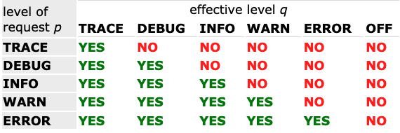

# 목차

<br>

- [목차](#목차)
- [Logback 이해하기](#logback-이해하기)
- [1 Logback 모듈 구조](#1-logback-모듈-구조)
- [2 Logback 설정](#2-logback-설정)
  - [2-1 Logger](#2-1-logger)
  - [2-2 Appender](#2-2-appender)
  - [2-3 Encoder (Layout)](#2-3-encoder-layout)
- [3 Logback 설정파일 구조](#3-logback-설정파일-구조)
  - [3-1 Logback 설정파일 참조 순서](#3-1-logback-설정파일-참조-순서)
  - [3-2 설정파일 구조](#3-2-설정파일-구조)
  - [3-3 여러가지 설정 예시](#3-3-여러가지-설정-예시)
- [4 Spring Boot 기반 Logback 설정 및 전략](#4-spring-boot-기반-logback-설정-및-전략)
- [출처](#출처)

<br>

# Logback 이해하기
[자바 로깅 프레임워크 히스토리](../history_of_java_logging/history_of_java_logging.md)와 [sl4fj 이해하기](../slf4j/slf4j.md)에 이어 이번 글은 slf4j의 binding module중 하나인 Logback을 정리해보고자한다.

ceki Gulcü가 자바 로깅 프레임워크의 표준 인터페이스 스펙인 slf4j를 개발하면서, 자신이 개발한 log4j의 여러가지 단점을 극복하기위해 slf4j 구현체인 Logback도 같이 개발하였다고한다.

이번 글은 Logback의 구조를 간단히 살펴보고, 간단한 학습 테스트와 함께 설정을 어떻게 하는지 살펴본다.

<br>

# 1 Logback 모듈 구조
Logback은 log4j의 후속 프로젝트로 log4j가 떠나는 위치를 이어받기 위해 탄생하였다.

그러므로 Logback 아키텍처는 많은 환경에서 적용 가능할 정도로 일반적이고 유연하다.

일반적이고 유연한 구조를 위해 Logback은 세 가지 모듈로 구성되어있다.

1. `logback-core`
   * 다른 두 모듈의 토대를 마련한다. (기반이 되는 모듈)
   * `Appender`, `Layout`등 Logback을 사용하는데 꼭 필요한 기반 모듈이다.
2. `logback-classic`
   * `logback-core`모듈을 확장한 모듈로서, [slf4j api module](http://www.slf4j.org/)를 구현한 모듈이기도하다. 
   * 쉽게 얘기해 `logback-core`와 `slfj4 api` 두 모듈을 포함하고있다고 보면 된다.
     * 참고로 `slf4j api`가 `Logger`에 대한 인터페이스를 포함하고있다.
3. `logback-access`
   * Tomcat이나 Jetty와 같은 서블릿 컨테이너와 통합돼 HTTP-Access 로그 기능을 제공한다.

<br>

# 2 Logback 설정
Logback은 slf4j의 binding module로써 slf4j를 구현한 라이브러리이므로, 당연히 `slf4j`와 같이 사용하게된다.

그리고 Logback은 세 가지 주요 클래스를 기반으로 동작하게된다.

* `Logger` (`logback-classic` 모듈의 일부)
  * 실제 로깅을 수행하는 클래스.
  * `LoggerFactory`로부터 `Logger` 객체를 불러와 로그를 찍는 코드를 작성한다.
* `Appender` (`logback-core` 모듈의 일부)
  * 로그를 기록 (write)하는 작업을 수행하는 클래스.
  * 로그 메시지를 출력할 대상을 결정 및 설정한다.
* `Layout` (`logback-core` 모듈의 일부)
  * 로그를 지정한 형식으로 변환하는 작업을 수행하는 클래스. 현재는 `Encoder`를 많이 사용한다.
  * 로그를 바이트 배열로 변환하고, 바이트 배열을 OutputStream에 쓰기하는 작업을 수행하는데 이때 원하는 포맷으로 변환할 수 있다.

이 세 가지 컴포넌트가 함께 동작함으로써 메시지 타입이나 레벨에 따라 이를 기록할 수 있고, 메시지의 포맷과 리포팅 위치를 제어할 수 있다.

<br>

## 2-1 Logger
`Logger`는 `logback-classic` 모듈에 위치하고있는데, 정확히는 `slf4j-api` 모듈에 위치한다.

> Logger.java

```java
package org.slf4j; 
public interface Logger {

  // Printing methods: 
  public void trace(String message);
  public void debug(String message);
  public void info(String message); 
  public void warn(String message); 
  public void error(String message); 
}
```

다섯 가지의 레벨을 정의하고있으며 아래와 같이 코드에서 로그를 찍고싶은 부분에 사용할 수 있다.

> Slf4jApiModuleHelloWorld.java
```java
Logger logger = LoggerFactory.getLogger(Slf4jApiModuleHelloWorld.class);
logger.trace("Trace Hello World");
logger.debug("Debug Hello World");
logger.info("Info Hello World");
logger.warn("Warn Hello World");
logger.error("Error Hello World");
```

<br>

💁‍♂️ **모든 단일 `Logger`는 `LoggerContext`에 연결되며, `LoggerContext`는 `Logger` 계층 구조로 이들을 생성 및 정렬하고 관리한다.**

`LoggerContext`에 모든 `Logger`들이 연결되며, `Logger`의 생성과 계층 구조를 설정할 수 있다.

이때 `Logger`는 계층적 명명 규칙을 따른다.

**`Logger`의 이름이 `.(dot)`에 의해 하위 `Logger` 이름의 접두어가 될 경우 이는 다른 `Logger`의 조상이되는 구조다. ->  계층구조**

* `com.foo`의 Logger는 `com.foo.Bar`인 Logger의 부모이다.
* `java`의 Logger는 `java.util`의 부모이자, `java.util.Vector`의 조상이된다.

이러한 특징을 이용하여 개발자가 설정한 분류 기준에 따라 계층구조별 특정 레벨의 로그를 활성화/비활성화할 수 있다.

<br>

쉽게 얘기하면, 모든 로그는 레벨을 설정할 수 있으며, 레벨을 상속된다.

> 모든 `Logger`는 `Level`을 지정할 수 있으며, 모든 레벨은 `ch.qos.logger.classic.level` 클래스에 정의되어있다.

**만약 주어진 `Logger`의 레벨이 지정되지 않는다면 지정된 레벨을 가진 가장 가까운 조상에서 레벨을 상속받는다.**

**즉, 주어진 `Logger A`의 유효 레벨은 `A`로부터 `root`를 향해 계층 구조를 거슬러 올라가면서 만나는 첫 번째 `null`이 아닌 레벨과 같다.**

<br>

💁‍♂️ **루트 Logger**

루트 Logger의 경우 Logger 계층 맨 위에 위치한다.

그리고 루트 Logger는 아래와 같이 가져올 수 있다.

`Logger rootLogger = LoggerFactory.getLogger(org.slf4j.Logger.ROOT_LOGGER_NAME);`

기타 Logger도 위와 같은 코드와 동일하게 가져올 수 있다. (매개변수만 바꿔주면 된다.)

<br>

💁‍♂️ **레벨 순서**

어떻게 정의하느냐에 따라서, 호출되는 출력 메서드가 로깅 요청 수준을 결정한다.

예를 들어, `log.info(...)`는 `INFO` 레벨의 로깅 코드를 작성한 것이다.

<br>

이때 만약 로깅 요청 레벨이 해당 `Logger`의 유효 레벨 이상인 경우에만 해당 로그가 동작하며, 그렇지않으면 요청은 비활성화된다.

즉, 유효 레벨 `q`를 갖는 `Logger`에서 호출된 레벨 `p`의 로그 요청은 `p >= q`인 경우에만 활성화(로그가 찍힌다)된다.

이를 간단히 표로 정리하면 아래와 같다.

<p align="center"><br>출처: http://logback.qos.ch/manual/architecture.html#basic_selection </p>

**간단히 말해 로깅 레벨은 다음과 같은 순서로 되어있다: `TRACE < DEBUG < INFO <  WARN < ERROR`**

> 예시

```java
import ch.qos.logback.classic.Level;
import org.slf4j.Logger;
import org.slf4j.LoggerFactory;
....

// get a logger instance named "com.foo". Let us further assume that the
// logger is of type  ch.qos.logback.classic.Logger so that we can
// set its level
ch.qos.logback.​classic.Logger logger = 
        (ch.qos.logback.​classic.Logger) LoggerFactory.​getLogger("com.foo");
//set its Level to INFO. The setLevel() method requires a logback logger
logger.setLevel(Level. INFO);

Logger barlogger = LoggerFactory.​getLogger(​"com.foo.Bar");

// This request is enabled, because WARN >= INFO
logger.warn("Low fuel level.");

// This request is disabled, because DEBUG < INFO. 
logger.debug("Starting search for nearest gas station.");

// The logger instance barlogger, named "com.foo.Bar", 
// will inherit its level from the logger named 
// "com.foo" Thus, the following request is enabled 
// because INFO >= INFO. 
barlogger.info("Located nearest gas station.");

// This request is disabled, because DEBUG < INFO. 
barlogger.debug("Exiting gas station search");
```

<br>

💁‍♂️ **`LoggerContext`의 `Logger`는 싱글톤으로 동작한다.**

```java
// 아래 Logger는 같은 주소를 가진다.
Logger x = LoggerFactory.getLogger("wombat"); 
Logger y = LoggerFactory.getLogger("wombat");
```
위 예시와 같이 `LoggerFactory.getLogger` 메서드는 같은 이름을 매개변수로 넘기면 항상 같은 인스턴스를 반환한다. (싱글톤)

<br>

## 2-2 Appender

Logback은 다양한 목적지로 로깅 내용을 보내고 출력할 수 있다. 

그리고 Logback에선 이와 같이 로그 출력 목적지에 기록하는역할을  `Appender`가 담당한다.

> 로그 메시지를 출력, 저장, 전송될 대상을 결정하는 역할.

모든 `Appender`는 `ch.qos.logback.core.Appender`를 구현한다.

```java
public interface Appender<E> extends LifeCycle, ContextAware, FilterAttachable {

  public String getName();
  public void setName(String name);
  void doAppend(E event);
}
```

`doAppend`가 핵심 메서드이며, 로깅 이벤트를 적절한 형식으로 적절한 출력 장치에 출력하는 역할을 수행한다.

> 관련된 더 자세한 내용은 [공식 문서](https://logback.qos.ch/manual/appenders.html)를 참고.

<br>

💁‍♂️ `OutputStreamAppender`의 하위 클래스들이 자주 사용된다.

<p align="center"><br>출처: https://logback.qos.ch/manual/appenders.html </p>

`OutputStreamAppender`는 자주 사용되는 아래 `Appender`들의 상위 클래스이다.

* `UnsynchronizedAppenderBase`
  * 기본적으로 사용되는 추상 클래스인 `AppenderBase`는 `doAppend()`가 `synchronized`를 사용한다.
  * 반면에, `UnsynchronizedAppenderBase`는 동기로 동작하길원치않을때 사용된다.
* `OutputStreamAppender`
  * `OutputStream`에 로그 이벤트 append하는 역할을한다.

<br>

💁‍♂️ `ConsoleAppender`

로그를 OuputStream에 write하여, 최종적으로 콘솔에 출력되도록한다.

```xml
<configuration>

  <appender name="STDOUT" class="ch.qos.logback.core.ConsoleAppender">
    <!-- encoders are assigned the type
         ch.qos.logback.classic.encoder.PatternLayoutEncoder by default -->
    <encoder>
      <pattern>%-4relative [%thread] %-5level %logger{35} -%kvp- %msg %n</pattern>
    </encoder>
  </appender>

  <root level="DEBUG">
    <appender-ref ref="STDOUT" />
  </root>
  </configuration>
```

<br>

💁‍♂️ `FileAppender`

로그의 내용을 지정된 File에 저장한다.

매 로그마다 유니크한 이름의 새로운 로그 파일에 기록하기위해서 `timestamp`를 이용하여 타깃 파일을 동적으로 설정해줄 수 있다.

```xml
<configuration>

  <!-- Insert the current time formatted as "yyyyMMdd'T'HHmmss" under
       the key "bySecond" into the logger context. This value will be
       available to all subsequent configuration elements. -->
  <timestamp key="bySecond" datePattern="yyyyMMdd'T'HHmmss"/>

  <appender name="FILE" class="ch.qos.logback.core.FileAppender">
    <!-- use the previously created timestamp to create a uniquely
         named log file -->
    <file>log-${bySecond}.txt</file>
    <encoder>
      <pattern>%logger{35} -%kvp- %msg%n</pattern>
    </encoder>
  </appender>

  <root level="DEBUG">
    <appender-ref ref="FILE" />
  </root>
</configuration>
```

<br>

💁‍♂️ `RollingFileAppender`

`FileAppender`를 상속받은 Appender로, 날짜, 최대 용량등을 설정하여 지정한 파일명 패턴에 따라 로그가 다른 파일에 기록되는 기능을 제공한다. 

예를 들어, 특정 파일 이름으로 로그를 append하다 특정 조건 (시간, 용량)에 다다르면, 이전 파일을 저장하고, 다른 로그 타겟파일을 만들어 저장하는 형식이다.

서버 애플리케이션에서 가장 자주 사용되는 Appender로 대량 로그 기록에 효과적이다.

2가지의 Rolling 정책이 존재하며, 공통적으로 아래 properties를 가진다.

* file: 타깃파일의 이름.
* append: append 정책.
  * true - 이어쓰기
  * false - 덮어쓰기
* encoder: 로그 이벤트가 OutputStreamAppender에 기록되는 방식.
  * ex. LogstashEncoder
* rollingPolicy: rollover 발생시 RollingFileAppender의 행동을 정의.
* triggerPolicy: rollover 활성화 시점 정의.
* predent: prudent mode 여부.

<br>

**TimeBasedRollingPolicy**

시간에 기반하여 Rolling 정책을 정의할 수 있으며, 보통 일 또는 월 단위로 설정한다.

```xml
<configuration>
  <appender name="FILE" class="ch.qos.logback.core.rolling.RollingFileAppender">
    <file>logFile.log</file>
    <rollingPolicy class="ch.qos.logback.core.rolling.TimeBasedRollingPolicy">
      <!-- daily rollover -->
      <fileNamePattern>logFile.%d{yyyy-MM-dd}.log</fileNamePattern>

      <!-- keep 30 days' worth of history capped at 3GB total size -->
      <maxHistory>30</maxHistory>
      <totalSizeCap>3GB</totalSizeCap>

    </rollingPolicy>

    <encoder>
      <pattern>%-4relative [%thread] %-5level %logger{35} -%kvp- %msg%n</pattern>
    </encoder>
  </appender> 

  <root level="DEBUG">
    <appender-ref ref="FILE" />
  </root>
</configuration>
```
위 로그 설정을 해석하면 Application이 동작할 때 활성화된 `logFile.log`에 로그가 쌓지만, 매일 자정이 지나면 `logFile.2023-03-17.log`와 같은 이름으로 아카이브된다.

아카이브 되는 파일의 개수는 최대 30개이며, 아카이브 된 파일의 크기는 총 3GB를 넘을 수 없다.

이 조건을 만족하지 못할 경우 아카이브된 로그 파일 중 가장 오래된 파일을 삭제한다.

설정별 자세한 설명은 아래를 참고.

* fileNamePattern (필수)
  * 저장될 로그 파일의 패턴을 정의. 
  * `%d`를 이용해 파일의 적절한 부분을 datetime 패턴으로 정의한다. (ex. `%d{yyyy-MM-dd}`)
* maxHistory
  * 저장되는 로그 파일의 최대 개수를 지정.
  * ex. rollover을 하루 마다 된다고 가정할 때, maxHistory를 30으로 지정하면 저장되는 파일의 개수는 최대 30일(30개)이다.
* totalSizeCap
  * 로그 파일을 저장하는 저장소(디렉토리)의 최대크기를 지정.
  * totalSizeCap을 초과하면 가장 오래된 파일이 삭제되는 구조.
  * maxHistory와 같이 사용될 경우, 1순위로 maxHistory에 대하여 처리된 후 totalSizeCap이 적용됨.
* cleanHistoryOnStart
  * 애플리케이션이 시작될 때 로그 파일을 모두 지운다. (디폴트는 true)

> fileNamePattern에 따라 rollover되는 주기가 달라진다.
> * `.%d`: default %d는 yyyy-MM-dd. 매일 자정에 새로운 로그 파일로 rollover된다.
> * `.%d{yyyy-MM-dd_HH-mm}`:매 분 새로운 로그 파일로 rollover된다.
> * `/%d{yyyy/MM}/foo.txt`: 매월 새로운 디렉토리를 만들어 하위에 foo.txt 파일로 rollover한다.
> * `.%d.gz`: 매일 새로운 로그 파일로 rollover하고, 이전 로그파일은 GZIP으로 압축된다.

<br>

**SizeAndTimeBasedRollingPolicy**

`TimeBasedRollingPolicy`에 더해 각각의 로그 파일의 크기에 제한을주는 RollingPolicy이다.

`TimeBasedRollingPolicy`와 다르게 `fileNamePattern`에 `%i`와 `%d`가 필수이며, 각각의 로그 파일이 가질 수 있는 최대 크기를 제한하는 `maxFileSize` 설정이 추가되었다.

`%i` 토큰이 index 역할을하여 다음 로그 파일의 이름을 결정한다.

```xml
<configuration>
  <appender name="ROLLING" class="ch.qos.logback.core.rolling.RollingFileAppender">
    <file>mylog.txt</file>
    <rollingPolicy class="ch.qos.logback.core.rolling.SizeAndTimeBasedRollingPolicy">
      <!-- rollover daily -->
      <fileNamePattern>mylog-%d{yyyy-MM-dd}.%i.txt</fileNamePattern>
       <!-- each file should be at most 100MB, keep 60 days worth of history, but at most 20GB -->
       <maxFileSize>100MB</maxFileSize>    
       <maxHistory>60</maxHistory>
       <totalSizeCap>20GB</totalSizeCap>
    </rollingPolicy>
    <encoder>
      <pattern>%msg%n</pattern>
    </encoder>
  </appender>

  <root level="DEBUG">
    <appender-ref ref="ROLLING" />
  </root>
</configuration>
```

<br>

> 이외의 다양한 Appender는 [공식 문서](https://logback.qos.ch/manual/appenders.html)를 참고.

<br>

## 2-3 Encoder (Layout)
Encoder는 로그를 바이트 배열로 변환하고, 바이트 배열을 OutputStream에 쓰기하는 작업을 수행한다.

이때 로그를 각 상황별 원하는 포맷으로 변환할 수 있다.

> logback 0.9.19부터는 layout는 Deprecated되었으며, Encoder 사용을 지향한다. [참고](https://logback.qos.ch/codes.html#layoutInsteadOfEncoder)

<br>

> Encoder.java

```java
package ch.qos.logback.core.encoder;

public interface Encoder<E> extends ContextAware, LifeCycle {

   /**
   * This method is called when the owning appender starts or whenever output
   * needs to be directed to a new OutputStream, for instance as a result of a
   * rollover.
   */
  void init(OutputStream os) throws IOException;

  /**
   * Encode and write an event to the appropriate {@link OutputStream}.
   * Implementations are free to defer writing out of the encoded event and
   * instead write in batches.
   */
  void doEncode(E event) throws IOException;


  /**
   * This method is called prior to the closing of the underling
   * {@link OutputStream}. Implementations MUST not close the underlying
   * {@link OutputStream} which is the responsibility of the owning appender.
   */
  void close() throws IOException;
}
```
Encoder 인터페이스는 위와 같으며, 입력으로 들어오는 로그 Event를 바이트 배열로 변환하고 결과 바이트 배열을 적절한 OutputStream에 기록한다.

이때 Appender가 관리하는 OutputStream에 바이트 배열을 언제 무엇을 쓰기할지 제어할 수 있다.

<br>

💁‍♂️ `PatternLayoutEncoder`

보통 로깅용으로 Logback을 사용할 때 `PatternLayoutEncoder`가 일반적으로 사용된다.

> 기존의 `PatternLayout`도 래핑한 클래스인 `LayoutWrappingEncoder`로 호환되게만들었다고한다.

`PatternLayoutEncoder`의 사용법은 아래와 같다.

```xml
<appender name="FILE" class="ch.qos.logback.core.FileAppender">
  <file>testFile.log</file>
  ...
  <encoder class="ch.qos.logback.classic.encoder.PatternLayoutEncoder">
    <pattern>%msg%n</pattern>
  </encoder>
</appender>
```

pattern은 다양하게 설정가능하며 관련된 내용은 [공식 문서](https://logback.qos.ch/manual/layouts.html#conversionWord)를 참고하자.

<br>

# 3 Logback 설정파일 구조
지금까지 Logback의 설정은 어떤 요소로 구성되었는지 알아보았으니, 이번엔 어떤 구조로 설정되는지 살펴본다.

<br>

## 3-1 Logback 설정파일 참조 순서 
일반적인 Java 애플리케이션에 Logback 의존성을 추가하여 사용할 때, Logback은 `ContextInitializer.configureByResource` 의 구현에따라 설정을 로드한다.

> 확인결과 매 버전마다 조금씩 다른 듯하다. 
> 
> 사용하는 버전을 확인하여 해당 클래스를 찾아 어떤 순서인지 확인하는 것이 좋을 듯 하다.
>
> 필자의경우 보통 classpath의 `logback.xml`만을 통해 설정한다.

<br>

## 3-2 설정파일 구조
<p align="center"><br>출처: http://logback.qos.ch/manual/configuration.html </p>

* Configuration
* Appender
  * 0개 혹은 그 이상
* Logger
  * 0개 혹은 그 이상
* Root
  * 최대 1개

<br>

💁‍♂️ **Appender 설정**

<p align="center"><br>출처: http://logback.qos.ch/manual/configuration.html#configuringAppenders </p>

* `<appender>`를 이용해서 Appender (로깅 목적지)를 설정할 수 있다.
* `<appender>`의 매개변수
  * `name`: appender의 이름을 설정한다.
  * `class`: appender의 클래스를 FQCN으로 설정한다.
    * `ConsoleAppender`: 로그를 OuputStream에 write하여, 최종적으로 콘솔에 출력되도록 한다.
    * `FileAppender`: 로그의 내용을 지정된 File에 저장한다.
    * `RollingFileAppender`: `FileAppender`를 상속받은 appender로, 날짜, 최대 용량등을 설정하여 지정한 파일명 패턴에 따라 로그가 다른 파일에 기록되는 기능을 제공한다. -> 대량 로그 기록에 효과적.
    * 이외에도 다양한 appender를 제공한다. (DBAppender, SMTPAppender등등)
* `<appender>`의 요소
  * `<layout>`, `<encoder>`, `<filter>`

<br>

💁‍♂️ **Logger 설정**

* `<logger>`를 이용해서 Logger를 설정할 수 있다.
  * 즉, 실제 로그 기능을 수행하는 객체인 Logger마다 이름을 부여하고 레벨등을 설정할 수 있다.
  * **해당 로거가 사용될 패키지와 로그 레벨을 설정.**
* `<logger>`의 매개변수
  * `name`: 계층적 Logger 설정에 유용하게 사용된다. (하나)
  * `level`: 로거의 레벨을 설정한다. (optional)
  * `additivity`: appender를 상속하도록 할 것인지 설정한다. (optional)
* `<logger>`의 요소
  * `<appender-ref>`: appender를 설정할 때 사용된다. 각 소스로부터 입력받은 로깅 메시지는 로그 레벨에 따라 Appender로 전달된다.
* 주의 사항
  * 기본적으로 최상위 로거인 Root Logger를 설정해주어야 한다.

<br>

💁‍♂️ **Root 설정**

* `<root>`를 이용해서 Root Logger를 설정한다.
* `<root>`의 매개변수
  * `level`: 레벨을 설정한다.
* `<root>`의 요소
  * `<appender-ref>`: appender를 설정할 수 있다. (`<logger>`의 `appender-ref`와 동일)
* 주의 사항
  * Root Logger의 name은 `ROOT`이며, 다른 설정을 제공하지 않는다.

<br>

## 3-3 여러가지 설정 예시

<br>

<details>
  <summary>콘솔에 출력하는 설정 예시</summary>
  
  ---
  
  ```xml
  <configuration>

    <appender name="STDOUT" class="ch.qos.logback.core.ConsoleAppender">
      <!-- encoders are assigned the type
          ch.qos.logback.classic.encoder.PatternLayoutEncoder by default -->
      <encoder>
        <pattern>%d{HH:mm:ss.SSS} [%thread] %-5level %logger{36} - %msg%n</pattern>
      </encoder>
    </appender>

    <logger name="chapters.configuration" level="INFO" />
    <logger name="chapters.configuration.Foo" level="DEBUG" />
    <logger name="{Logger 이름 => 클래스 이름}" level="INFO"/>

    <!-- Strictly speaking, the level attribute is not necessary since -->
    <!-- the level of the root level is set to DEBUG by default.       -->
    <root level="DEBUG">          
      <appender-ref ref="STDOUT" />
    </root>  
    
  </configuration>
  ```
  
  ---
</details>

<br>

<details>
  <summary>파일에 출력하는 설정 예시</summary>
  
  ---
  
  ```xml
  <configuration>

    <appender name="FILE" class="ch.qos.logback.core.FileAppender">
      <file>{파일 위치}.log</file>

      <encoder>
        <pattern>%date %level [%thread] %logger{10} [%file:%line] %msg%n</pattern>
      </encoder>
    </appender>

    <appender name="STDOUT" class="ch.qos.logback.core.ConsoleAppender">
      <encoder>
        <pattern>%msg%n</pattern>
      </encoder>
    </appender>

    <root level="debug">
      <appender-ref ref="FILE" />
      <appender-ref ref="STDOUT" />
    </root>
  </configuration>
  ```
  
  ---
</details>

<br>

<details>
  <summary>RollingFileAppender 설정 예시</summary>
  
  ---
  
  ```xml
  <?xml version="1.0" encoding="UTF-8"?>
  <configuration>
      <!-- config 파일에서 사용될 속성 -->
      <property name="LOGS_ABSOLUTE_PATH" value="/Users/binghe819/Desktop" />

      <!-- 외부 설정 가져오는 코드 -->
      <include resource="org/springframework/boot/logging/logback/base.xml"/>

      <appender name="STDOUT" class="ch.qos.logback.core.ConsoleAppender">
          <layout class="ch.qos.logback.classic.PatternLayout">
              <Pattern>[%d{yyyy-MM-dd HH:mm:ss}:%-3relative][%thread] %-5level %logger{36} - %msg%n</Pattern>
          </layout>
      </appender>

      <appender name="FILE" class="ch.qos.logback.core.rolling.RollingFileAppender">
          <file>${LOGS_ABSOLUTE_PATH}/logback.log</file>
          <encoder>
              <pattern>[%d{yyyy-MM-dd HH:mm:ss}:%-3relative][%thread] %-5level %logger{35} - %msg%n</pattern>
          </encoder>
          <rollingPolicy class="ch.qos.logback.core.rolling.TimeBasedRollingPolicy">
              <fileNamePattern>${LOGS_ABSOLUTE_PATH}/logback.%d{yyyy-MM-dd}.%i.log.gz</fileNamePattern>
              <timeBasedFileNamingAndTriggeringPolicy class="ch.qos.logback.core.rolling.SizeAndTimeBasedFNATP">
                  <maxFileSize>5MB</maxFileSize>
              </timeBasedFileNamingAndTriggeringPolicy>
              <maxHistory>30</maxHistory>
          </rollingPolicy>
      </appender>

      <logger name="org.springframework.web" level="DEBUG">
          <appender-ref ref="STDOUT" />
          <appender-ref ref="FILE" />
      </logger>

      <root level="INFO">
          <appender-ref ref="STDOUT" />
      </root>
  </configuration>
  ```
  
  ---
</details>

<br>

<details>
  <summary>include를 이용하여 설정 분리한 예시</summary>
  
  ---
  
  ```xml
  <?xml version="1.0" encoding="UTF-8"?>
  <configuration>
      <property name="LOGS_ABSOLUTE_PATH" value="/Users/binghe819/Desktop" />
      <include resource="org/springframework/boot/logging/logback/base.xml"/>

      <!-- include를 통한 설정 -->
      <include resource="logback/stdout-appender.xml"/>
      <include resource="logback/file-appender.xml"/>

      <root level="INFO">
          <appender-ref ref="STDOUT" />
      </root>

      <logger name="org.springframework.web" level="DEBUG">
          <appender-ref ref="STDOUT" />
          <appender-ref ref="FILE" />
      </logger>
  </configuration>
  ```
  ```xml
  <!-- logback/file-appender.xml -->
  <included>
    <appender name="FILE" class="ch.qos.logback.core.rolling.RollingFileAppender">
      <file>${LOGS_ABSOLUTE_PATH}/logback.log</file>
      <encoder>
        <pattern>[%d{yyyy-MM-dd HH:mm:ss}:%-3relative][%thread] %-5level %logger{35} - %msg%n</pattern>
      </encoder>
      <rollingPolicy class="ch.qos.logback.core.rolling.TimeBasedRollingPolicy">
        <fileNamePattern>${LOGS_ABSOLUTE_PATH}/logback.%d{yyyy-MM-dd}.%i.log.gz</fileNamePattern>
        <timeBasedFileNamingAndTriggeringPolicy class="ch.qos.logback.core.rolling.SizeAndTimeBasedFNATP">
          <maxFileSize>15MB</maxFileSize>
        </timeBasedFileNamingAndTriggeringPolicy>
        <maxHistory>30</maxHistory>
      </rollingPolicy>
    </appender>
  </included>
  ```
  ```xml
  <!-- logback/stdout-appender.xml -->
  <included>
    <appender name="STDOUT" class="ch.qos.logback.core.ConsoleAppender">
      <layout class="ch.qos.logback.classic.PatternLayout">
        <Pattern>[%d{yyyy-MM-dd HH:mm:ss}:%-3relative][%thread] %-5level %logger{36} - %msg%n</Pattern>
      </layout>
    </appender>
  </included>
  ```
  
  ---
</details>


<br>

# 4 Spring Boot 기반 Logback 설정 및 전략
아마 대부분의 slf4j + Logback을 사용하는 애플리케이션은 Spring일 것이다.

Spring에선 어떻게 Logback을 설정하고 전략은 어떻게 가져가는지 알고싶다면 [다음 글](../../../Spring/Logging/logback/logback.md)을 참고바람.

<br>

# 출처
* https://logback.qos.ch/manual/index.html

