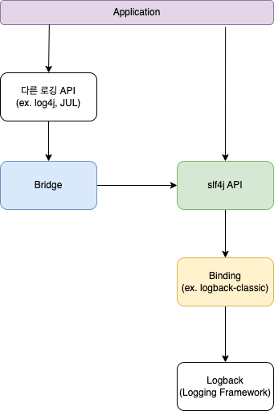
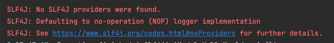
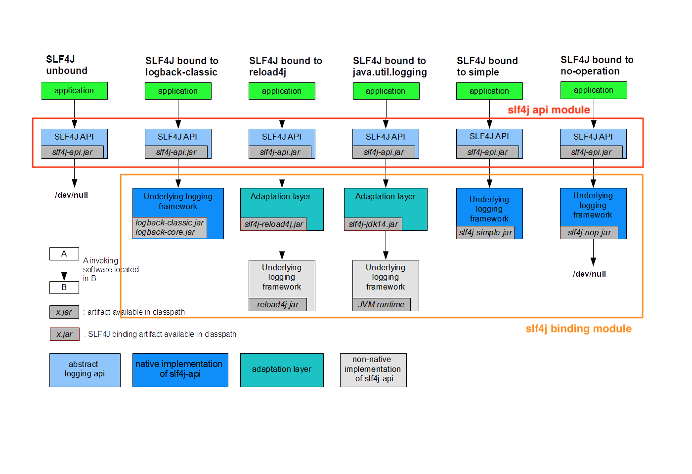
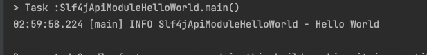
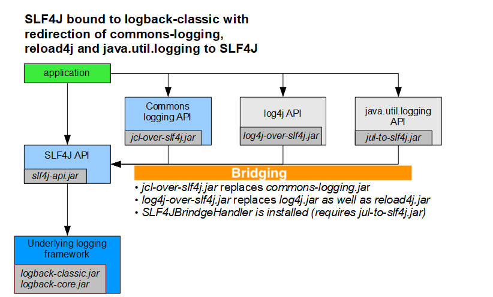

# 목차

<br>

- [목차](#목차)
- [slf4j 이해하기](#slf4j-이해하기)
- [1 slf4j의 세 가지 모듈](#1-slf4j의-세-가지-모듈)
- [2 학습테스트를 통해 이해하는 slf4j의 세 가지 모듈](#2-학습테스트를-통해-이해하는-slf4j의-세-가지-모듈)
  - [2-1 slf4j API 모듈](#2-1-slf4j-api-모듈)
  - [2-2 slf4j binding 모듈](#2-2-slf4j-binding-모듈)
  - [3-3 slf4j bridging 모듈](#3-3-slf4j-bridging-모듈)
- [참고](#참고)

<br>

# slf4j 이해하기

slf4j (Simple Logging Facade for Java)는 자바 로깅 프레임워크의 Facade 역할을 수행한다.

즉, 자바의 다양한 로깅 프레임워크 (JUL, Logback, log4j등등)에 대한 추상화 (인터페이스) 역할을 수행한다.

객체지향으로 생각한다면 OCP와 DIP를 적용하여 로깅이 필요한 개발자는 특정 로깅 프레임워크 구현체에 의존하지않고, slf4j에만 의존하도록함으로써 의존성을 로깅 구현체로부터 분리시킨 것이다.

이로써 개발자는 slf4j만 의존하여 로깅을 구현하면, 이후에 로깅 프레임워크 구현체를 변경한다해도 소스코드의 변경을 최소화할 수 있다.

이번 글은 이러한 여러 자바 로깅 프레임워크의 인터페이스 역할을 수행하는 slf4j를 이해해보는 글이다.

우선 slf4j의 구성과 동작방식을 알아보고, 마지막으로 학습테스트를 통해 slf4j가 어떻게 동작하는지 간단히 살펴본다.

<br>

# 1 slf4j의 세 가지 모듈

slf4j를 이해하기위해선 아래 세 가지 모듈을 이해하면 된다.

<p align="center"><br>slf4j 세 가지 모듈의 관계</p>

* API Module
  * slf4j를 사용하기 위한 인터페이스를 제공한다.
* Binding Module
  * slf4j 인터페이스를 로깅 구현체와 연결하는 어댑터 역할을 수행하는 라이브러리다.
  * 사용하길 원하는 로깅 프레임워크에 대한 slf4j 바인딩을 추가해주면 된다. (동시에 반드시 한 개만 사용가능하다)
* Bridge Module
  * ceki Gulcü는 최대한 모든 로깅 시스템에 대한 호환성을 보장하기위해 다양한 bridge SDK도 개발해두었다.
    * ex. `log4j-over-slf4j`, `jcl-over-slf4j`
  * 다른 로깅 API로의 Logger 호출을 slf4j 인터페이스로 연결 (redirect)하여 slf4j API가 대신 처리할 수 있도록해주는 일종의 어댑터 역할을 수행하는 라이브러리다.
  * 다른 로깅 API -> Bridge(redirect) -> slf4j API

세 가지 모듈을 각각 이해하고 서로간의 관계를 이해하기위해 학습 테스트를 진행해본다.

<br>

# 2 학습테스트를 통해 이해하는 slf4j의 세 가지 모듈
학습테스트를 진행하기위해 간단한 자바 프로젝트를 생성해준다.

이 글에선 gradle 기반의 자바 프로젝트를 통해 설명하지만, maven 기반의 프로젝트를 이용해도 무방하다.

> 전체 학습테스트 코드는 [여기](https://github.com/binghe819/learning-sandbox/tree/master/java-slf4j-logback)를 참고.

<br>

## 2-1 slf4j API 모듈

가장 먼저 살펴볼 부분은 slf4j가 탄생하게된 가장 큰 이유이기도한 모든 로깅 프레임워크의 인터페이스 역할을하는 API 모듈이다.

<br>

**1. 먼저 slf4j API 모듈의 의존성을 추가해준다.**

> build.gradle
```groovy
dependencies {
    implementation 'org.slf4j:slf4j-api:2.0.6'
}
```

<br>

**2. 간단한 HelloWorld 클래스를 작성하고 실행한다.**

> Sfl4jApiModuleHelloWorld.java
```java
public class Slf4jApiModuleHelloWorld {

    public static void main(String[] args) {
        Logger logger = LoggerFactory.getLogger(Slf4jApiModuleHelloWorld.class);
        logger.info("Hello World");
    }
}
```

그리고 실행해보면 아래와 같이 나타나는 것을 볼 수 있다.

<p align="center"> </p>

이 경고는 클래스 패스에서 slf4j 구현체를 찾을 수 없기 때문에 출력되는 것이다.

즉, **클래스 패스에 사용하길 원하는 로깅 프레임워크의 구현체를 slf4j에 바인딩(binding)해주어야한다.**

이때 주의할 점은 하나 이상의 slf4j 바인딩은 동시에 사용할 수 없다. 반드시 하나만 설정해야한다.

<br>

💁‍♂️ **slf4j 바인딩을 이용하면 쉽게 로깅 프레임워크를 전환할 수 있다.**

slf4j는 클래스 패스에 존재하는 slf4j 바인딩만 변경해주면 자동으로 전환된다.

예를 들어, JUL에서 log4j로 전환한다고하면 gradle의 의존성을 `slf4j-jdk14-2.0.6.jar`에서 `slf4j-log4j12-2.0.6.jar`로 변경해주면 끝이다.

<br>

🤔 **slf4j는 언제 어떻게 slf4j의 구현체를 바인딩할까?**

slf4j는 특별한 클래스 로더에 의존하지않는다. 실제로 각 slf4j 바인딩은 컴파일 타임에 단 하나의 특정 로깅 프레임워크만 사용되도록 컴파일된다.

즉, `slf4j-log4j12-2.0.6.jar`를 의존성에 추가해두면 바인딩은 log4j를 사용하기위해 컴파일 타임에 바인딩한다. (런타임이 아니다.)

<br>

## 2-2 slf4j binding 모듈
> binding slf4j api with a logging framework

slf4j binding 모듈은 slf4j API 모듈의 인터페이스와 로깅 프레임워크 구현체와 연결하는 어댑터 역할을하는 모듈이다.

각각의 slf4j binding (로깅 프레임워크의 구현체)는 컴파일 타임에 오직 하나의 로깅 프레임워크를 사용하도록 바인딩된다.

이러한 구조를 그림으로 보면 아래와 같다.

<p align="center"><br>출처: https://www.slf4j.org/manual.html </p>

<br>

다시 코드로 돌아와서 간단한 binding 모듈을 추가하여 로그를 찍어본다.

**1. slf4j binding 모듈 구현체 추가**

> build.gradle

```groovy
dependencies {
    implementation 'org.slf4j:slf4j-api:2.0.6'
    implementation ('ch.qos.logback:logback-classic:1.4.5') {
        exclude group: 'org.slf4j', module: 'slf4j-api'
    }
}
```
slf4j의 가장 대표적인 구현체인 Logback을 추가한 예시이다.

`logback-classic`은 `logback-core`와 `slf4j-api`를 의존하여 자동으로 불러오는데, 이미 `slf4j-api`는 의존성으로 있기때문에 제외시켜준다.

<br>

**2. HelloWorld를 다시 실행해본다.**

> Sfl4jApiModuleHelloWorld.java
```java
public class Slf4jApiModuleHelloWorld {

    public static void main(String[] args) {
        Logger logger = LoggerFactory.getLogger(Slf4jApiModuleHelloWorld.class);
        logger.info("Hello World");
    }
}
```

이전에 작성한 HelloWorld 클래스를 다시 실행해본다.

<p align="center"> </p>

이제 제대로 로그가 찍히는 것을 볼 수 있다. **코드는 slf4j로 작성되었지만, 실제 로그를 출력하는 행위는 Logback이 하게된다.**

<br>

💁‍♂️ **Logback이외에도 다양한 binding 구현체를 제공한다.**

* `slf4j-log4j12-2.0.6.jar` - [log4j 버전 1.2](http://logging.apache.org/log4j/1.2/index.html)에 대한 바인딩.
* `slf4j-reload4j-2.0.6.jar` - [reload4k](http://reload4j.qos.ch/)에 대한 바인딩.
* `slf4j-jdk14-2.0.6.jar` - JUL에 대한 바인딩.
* `slf4j-nop-2.0.6.jar` - [NOP](http://www.slf4j.org/api/org/slf4j/helpers/NOPLogger.html)에 대한 바인딩.
* `slf4j-simple-2.0.6.jar` - [Simple](http://www.slf4j.org/apidocs/org/slf4j/impl/SimpleLogger.html)에 대한 바인딩.
* `slf4j-jcl-2.0.6.jar` - [Jakarta Commons Logging](http://commons.apache.org/logging/)에 대한 바인딩.
* `logback-classic-1.4.5` - [Logback](https://logback.qos.ch/documentation.html)에 대한 바인딩.

> 버전은 slf4j 버전에 호환되는 버전을 골라서 사용하면 된다.

<br>

## 3-3 slf4j bridging 모듈
> bridging legacy logging api's

하나의 프레임워크엔 다양한 라이브러리가 사용된다. 그리고 각 라이브러리는 사용하는 로깅 프레임워크가 다를 수 있다.

실제로 spring-context 모듈 코드를 살펴보면 JCL (Jakarta Commons Logging)을 사용한다.

이렇게 여러 다른 로깅 API를 사용하는 라이브러리들 사이에서 다리 역할을 수행하는 모듈이 slf4j brigdging 모듈이다.

**slf4j bridging 모듈은 다른 로깅 API로의 Logger 호출을 slf4j 인터페이스로 리다이렉션하여 slf4j API가 대신 처리할 수 있도록 도와주는 어댑터 역할을 수행한다.**

<p align="center"><br>출처: https://www.slf4j.org/legacy.html </p>

개발자는 다른 로깅 API를 사용하지만, 내부에서는 `다른 로깅 API -> Bridge Module -> slf4j API`와 같이 slf4j API를 호출하도록하는 일종의 어댑터 역할을 수행한다.

이를 통해 여러 로깅 API를 하나의 채널 (slf4j)로 Logging을 통합한다.

<br>

💁‍♂️ **다양한 Bridge를 제공한다.**

* `jcl-over-slf4j` - JCL API 호출을 jcl-over-slf4j를 이용하여 slf4j API를 호출하도록한다.
* `log4j-over-slf4j` - log4j 호출을 slf4j API로 리다이렉션.
* `jul-to-slf4j` - JUL 호출을 slf4j API로 리다이렉션.

<br>

💁‍♂️ **주의할 점은 brige 모듈과 binding 모듈을 같은 로깅 프레임워크 사용시 무한 루프에 빠질 수 있다.**

아래 나열된 bridge 모듈과 binding 모듈은 서로 같이 사용할 경우 무한 루프에 빠질 수 있다.

* `jcl-over-slf4j` brige 모듈 && `slf4j-jcl-{version}` binding 모듈
* `log4j-over-slf4j` brige 모듈 && `slf4j-log4j12-{version}` binding 모듈
* `log4j-over-slf4j` brige 모듈 && `slf4j-reload4j` binding 모듈
* `jul-to-slf4j` brige 모듈 && `slf4j-jdk14-{version}` binding 모듈

<br>

💁‍♂️ **추천하는 구조는 binding으로 Logback을 사용하고, bridge는 알아서 선택해서 사용하는 것이다.**

가장 추천하는 구조는 bridge 모듈과 binding 모듈이 전혀 겹칠 확률이없는 Logback을 binding 모듈로 사용하는 것이다.

<br>

# 참고
* https://www.slf4j.org/manual.html
* https://www.slf4j.org/legacy.html

