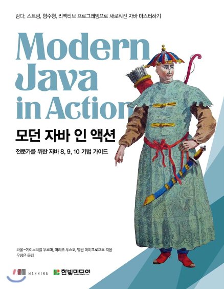

 

# 모던 자바 인 액션 정리

 

# 목차
* [챕터 2 - 동작 파라미터화 코드 전달하기](https://github.com/binghe819/TIL/blob/master/JAVA/Modern%20Java%20In%20Action/ch%2002%20-%20%EB%8F%99%EC%9E%91%20%ED%8C%8C%EB%9D%BC%EB%AF%B8%ED%84%B0%ED%99%94%20%EC%BD%94%EB%93%9C%20%EC%A0%84%EB%8B%AC%ED%95%98%EA%B8%B0.md)
* [챕터 3 - 람다 표현식]()
