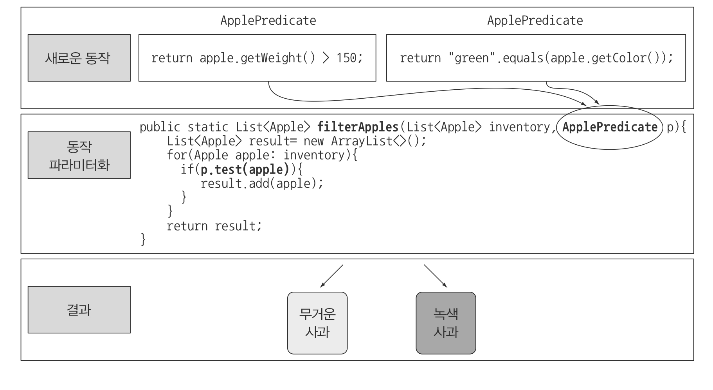

> 본 자료는 [Modern Java In Action](https://www.amazon.com/Modern-Java-Action-functional-programming/dp/1617293563)를 바탕으로 작성되었습니다.

# Ch 02 - 동작 파라미터화 코드 전달하기
시시각각 변하는 사용자의 요구사항을 동작 파라미터화을 이용하면 효과적으로 대응할 수 있다.

<br>

- [Ch 02 - 동작 파라미터화 코드 전달하기](#ch-02---동작-파라미터화-코드-전달하기)
  - [동작 파라미터란](#동작-파라미터란)
  - [변화하는 요구사항에 대응하기 - 동작 파라미터화 前](#변화하는-요구사항에-대응하기---동작-파라미터화-前)
  - [변화하는 요구사항에 대응하기 - 동작 파라미터화 後](#변화하는-요구사항에-대응하기---동작-파라미터화-後)
  - [익명 클래스 사용](#익명-클래스-사용)
  - [람다 표현식 사용](#람다-표현식-사용)

<br>

## 동작 파라미터란
* 동작파라미터화
  * 아직은 어떻게 실행할 것인지 결정하지 않은 코드 블럭을 의미. 이 코드 블럭은 나중에 프로그램에서 호출한다.
  * **다형성(OCP, DIP)을 이용하여 런타임에 핵심 전략을 주입하여 실행하는 기법.**
* 즉, 코드 블럭에 따라 메서드의 동작이 파라미터화된다.

<br>

## 변화하는 요구사항에 대응하기 - 동작 파라미터화 前
농장 재고목록에서 특정 조건에 따라 필터링하는 기능을 추가하는 예시를 가지고 이해해보자.

<br>

**1 - 녹색 사과 필터링**
```java
public static List<Apple> filterGreenApples(List<Apple> inventory) {
    List<Apple> result = new ArrayList<>();
    for (Apple apple : inventory) {
        if (GREEN.equals(apple.getColor())) { // 핵심 로직
            result.add(apple);
        }
    }
    return result;
}
```
* 문제점
  * 더 다양한 색(빨간, 파란등등)의 필터링 변화에 적절하게 대응할 수 없다.

<br>

**2 - 색을 파라미터화**
```java
public static List<Apple> filterApplesByColor(List<Apple> inventory, Color color) {
    List<Apple> result = new ArrayList<>();
    for (Apple apple : inventory) {
        if (apple.getColor().equals(color)) { // 핵심 로직
            result.add(apple);
        }
    }
    return result;
}

// 사용
List<Apple> greenApples = filterApplesByColor(inventory, GREEN);
List<Apple> redApples = filterApplesByColor(inventory, RED);
```
* 문제점
  * 만약 색깔이 아닌 무게를 기준으로 필터링하고 싶다면 핵심 로직 부분을 빼고 중복으로 코드를 작성해줘야한다.

<br>

**3 - 가능한 모든 속성으로 필터링**
```java
public static List<Apple> filterApples(List<Apple> inventory, Color color, int weight, boolean flag) {
    List<Apple> result = new ArrayList<>();
    for (Apple apple : inventory) {
        // 핵심 로직
        if ((flag && apple.getColor().equals(color)) || (!flag && apple.getWeight() > weight)) {
            result.add(apple);
        }
    }
    return result;
}

// 사용
List<Apple> greenApples = filterApples(inventory, GREEN, 0, true);
List<Apple> heavyApples = filterApples(inventory, null, 150, false);
```
* 문제점
  * 딱 봐도 코드가 더럽다.. boolean은 무슨 의미일까?..

<br>

## 변화하는 요구사항에 대응하기 - 동작 파라미터화 後
필터링에서 가장 중요한 것은 어떤 속성에 기초해서 필터하느냐이다. (yes or no)

참 또는 거짓을 반환하는 함수인 `Predicate`를 통해 구현할 수 있다.

```java
public interface ApplePredicate {
    boolean test(Apple apple);
}
```
```java
// 무게를 기준으로 필터링
public class AppleHeavyWeightPredicate implements ApplePredicate {
    public boolean test(Apple apple) {
        return apple.getWeight() > 150;
    }
}
// 색깔을 기준으로 필터링
public class AppleGreenColorPredicate implements ApplePredicate {
    public boolean test(Apple apple) {
        return GREEN.equals(apple.getColor());
    }
}
```
* 이제 핵심 전략(`test`메서드 내용)을 통해 런타임에 의존성 주입을 통해 필터링 기준을 정할 수 있다.

<br>

**4 - 추상적 조건으로 필터링**
> 그럼 농장 재고목록에서 특정 조건에 따라 필터링하는 예시를 계속 리팩토링해나가보자!
```java
public static List<Apple> filterApples(List<Apple> inventory, ApplePredicate p) {
    List<Apple> result = new ArrayList<>();
    for (Apple apple : inventory) {
        if (p.test(apple)) {
            result.add(apple);
        }
    }
    return result;
}
```
<p align="center"><br>출처 : 모던 자바 인 액션 p.75</p> 

* 이제 파라미터로 동작(함수)를 넘길 수 있게 되었다! (`ApplePredicate`)

<br>

## 익명 클래스 사용
동작을 파리미터화를 했지만, 매번 새로운 여러 클래스를 정의한 다음에 사용되기 때문에 번잡하다.

**이를 개선한 방법이 클래스의 선언과 인스턴스화를 동시에 수행할 수 있도록 한 익명 클래스다.**

**5 - 익명 클래스 사용**
```java
List<Apple> redApples = filterApples(inventory, new ApplePredicate() {
    public boolean test(Apple apple) {
        return RED.equals(apple.getColor()); // 핵심로직
    }
})
```
* 익명 클래스도 문제가 있다.
  * **바로, 핵심 로직외에도 여전히 많은 코드가 존재한다는 것!**

<br>

## 람다 표현식 사용
람다 표현식에 대한 자세한 내용은 [여기](https://github.com/binghe819/TIL/blob/master/JAVA/%EC%9E%90%EB%B0%94%EC%9D%98%20%EC%A0%95%EC%84%9D/Lambda.md)에서 확인해주세요 :)

<br>

**6 - 람다 표현식 사용**
```java
List<Apple> result = 
    filterApples(inventory, (Apple apple) -> RED.equals(apple.getColor()));
```

<br>

**7 - 리스트 형식으로 추상화**
```java
public interface Predicate<T> {
    boolean test(T t);
}

public static <T> List<T> filter(List<T> list, Predicate<T> p) {
    List<T> result = new ArrayList<>();
    for (T e : list) {
        if (p.test(e)) {
            result.add(e);
        }
    }
    return result;
}

// 사용
filter(numbers, (Integer i) -> i % 2 == 0);
```
* 유연성과 간결함이라는 두 마리 토끼를 모두 잡을 수 있다.
