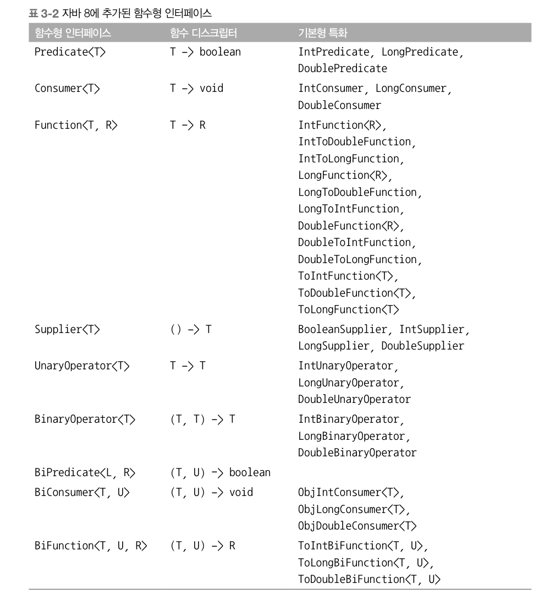

> 본 자료는 [Modern Java In Action](https://www.amazon.com/Modern-Java-Action-functional-programming/dp/1617293563)를 바탕으로 작성되었습니다.

# Ch03 - 람다 표현식

<br>

- [Ch03 - 람다 표현식](#ch03---람다-표현식)
  - [1 람다란 무엇인가](#1-람다란-무엇인가)
    - [1-1 람다란?](#1-1-람다란)
    - [1-2 함수형 인터페이스](#1-2-함수형-인터페이스)
    - [1-3 함수 디스크립터](#1-3-함수-디스크립터)
  - [2 람다 활용 : 실행 어라운드 패턴](#2-람다-활용--실행-어라운드-패턴)
    - [2-1 람다 활용 전](#2-1-람다-활용-전)
    - [2-2 람다 활용 후](#2-2-람다-활용-후)
  - [3 함수형 인터페이스 사용](#3-함수형-인터페이스-사용)
  - [4 형식 검사, 형식 추론](#4-형식-검사-형식-추론)
    - [4-1 형식 검사](#4-1-형식-검사)
    - [4-2 형식 추론](#4-2-형식-추론)
  - [5 지역 변수](#5-지역-변수)
    - [5-1 지역 변수 사용](#5-1-지역-변수-사용)
    - [5-2 지역 변수 제약](#5-2-지역-변수-제약)
  - [6 메서드 참조](#6-메서드-참조)
    - [6-1 메서드 참조](#6-1-메서드-참조)
    - [6-2 메서드 참조 만드는 방법](#6-2-메서드-참조-만드는-방법)
  - [7 람다 표현식을 조합할 수 있는 유용한 메서드](#7-람다-표현식을-조합할-수-있는-유용한-메서드)
  - [람다와 익명클래스](#람다와-익명클래스)

<br>

## 1 람다란 무엇인가

<br>

### 1-1 람다란?
* 람다 표현식이란
  * **메서드로 전달할 수 있는 익명 함수를 단순화 한 것.**
* 람다의 특징
  * 익명 : 이름이 없다
  * 함수 : 메서드처럼 특정 클래스에 종속되지 않으므로 함수라 한다
  * 전달 : 메서드 인수로 전달하거나 변수로 저장할 수 있다
  * 간결성 : 익명 클래스처럼 자질구레한 코드를 구현할 필요 없다
* **람다 표현식의 기본 문법**
  * `(parameters) -> expression`
  * `(parameters) -> { statements; }`

<br>

### 1-2 함수형 인터페이스
* 함수형 인터페이스
  * 하나의 추상 메서드를 지정하는 인터페이스
* 함수형 인터페이스 사용처
  * 람다 표현식으로 함수형 인터페이스의 추상 메서드 구현을 직접 전달할 수 있으므로 **전체 표현식을 함수형 인터페이스의 인스턴스 취급한다.**
* 특징
  * **디폴트 메서드가 있더라도 추상 메서드가 오직 하나면 함수형 인터페이스다**
  * `@FunctionalInterface`는 컴파일 타임에 메서드 하나만 가지는 함수형 인터페이스인지 검사하는 역할을 한다

<br>

### 1-3 함수 디스크립터
* 함수 디스크립터 (function descriptor)
  * 함수형 인터페이스의 추상 메서드 시그니처는 람다 표현식의 시그니처를 가리킨다. 그리고 이 메서드를 함수 디스크립터라 한다.
  * 함수형 인터페이스의 추상 메서드 시그니처

> 왜 함수형 인터페이스를 인수로 받는 메서드에만 람다 표현식을 사용할 수 있을까?
> * 함수 형식을 추가하는 방법도 고려했다. 언어를 더 복잡하게 만들지 않는 현재 방법을 선택했다고 한다.
> * 또한 이미 하나의 추상 메서드를 갖는 인터페이스에 이미 익숙하다는 점도 고려했다. (ex. 이벤트 처리 인터페이스)

<br>

## 2 람다 활용 : 실행 어라운드 패턴
람다와 동작 파라미터화로 유연하고 간결하면서 핵심 로직만을 담아서 코드를 작성할 수 있게 되엇다.

**그리고 대표적인 활용 예시가 바로 실행 어라운드 패턴이다.**

**어떻게 보면 전략패턴과 유사하다**. 전략(핵심 로직)과 컨텍스트(부가 로직)으로 나뉜다.
* 컨텍스트(부가 로직) : 초기화/준비 코드, 정리/마무리 코드
* 전략 (핵심 로직) : 주요 작업

<br>

### 2-1 람다 활용 전

```java
// 람다 활용 전
public String processFile() throws IOException {
    try {BufferedReader br = new BufferedReader(new FileReader("data.txt"))} { // 부가 로직
        return br.readLine(); // 핵심 로직
    }
}
```
* 문제점
  * 만약 파일의 한 줄이 아닌 여러 줄을 읽고 싶을 경우 새로운 메서드를 만들어줘야하는 문제가 있다.
  * 즉, **핵심 로직과 부가 로직이 분리되어 있지 않다.**

<br>

### 2-2 람다 활용 후
```java
@FunctionalInterface
public interface BufferedReaderProcessor {
    String process(BufferedReader b) throws IOException;
}

public String processFile(BufferedReaderProcessor p) throws IOException {
    try (BufferedReader br = new BufferedReader(new FileReader("data.txt"))) {
        return p.process(br); // 핵심 로직 (BufferedRead 객체 처리)
    }
}

// 사용 
String oneLine = processFile((BufferedReader br) -> br.readLine());

String twoLines = processFile((BufferedReader br) -> br.readLine() + br.readLine());
```
* **이제 핵심 로직을 외부에서 람다를 통해 의존성을 주입해주므로, 재사용성과 유지보수성을 모두 높일 수 있다.**

<br>

## 3 함수형 인터페이스 사용
자바에서는 공통의 함수 디스크립터를 이미 정의해놓고 있다.

<p align="center"><br>출처 : 모던 자바 인 액션 p.105</p>

<br>

> 기본 타입형 특화 함수형 인터페이스는 왜 만들어 놓은 것일까??
> * 재사용성과 오토박싱으로 인한 성능 저하를 막기 위함이다.
> ```java
> List<Integer> list = new ArrayList<>();
> for (int i = 300; i < 400; i++) {
>     list.add(i); // 오토박싱
> }
> ```
> 위 코드는 반복문을 돌며 `int`를 `Integer`로 오토박싱하여 저장하게 된다. 이는 조금의 성능적 부하를 줄 수 있다.
> 
> 그래서 **기본 타입형 함수형 인터페이스는 래퍼 클래스가 아닌 기본형 타입을 받는다.**

<br>

## 4 형식 검사, 형식 추론
컴파일러는 람다를 어떻게 함수형 인터페이스로 매핑할 수 있을까??

<br>

### 4-1 형식 검사
```java
List<Apple> heavierThan150g = filter(inventory, (Apple apple) -> apple.getWeight() > 150);
// 위 코드의 대상 형식은 filter(List<Apple> inventory, Predicate<Apple> p)
```
* 컨텍스트를 이용한 검사
  * **람다가 사용되는 콘텍스트를 이용해서 람다의 형식을 추론할 수 있다.**
  * 어떤 콘텍스트에서 기대되는 람다 표현식의 형식을 **대상 형식**이라고 부른다.

<br>

### 4-2 형식 추론
```java
Comparator<Apple> c = (Apple a1, Apple a2) -> a1.getWeight().compareTo(a2.getWeight()); // 형식 추론하지 않음
Comparator<Apple> c = (a1, a2) -> a1.getWeight().compareTo(a2.getWeight()); // 형식을 추론함
```
* **컴파일러는 람다 표현식이 사용된 컨텍스트(대상 형식)를 이용해서 람다 표현식과 관련된 함수형 인터페이스를 추론한다.**

<br>

## 5 지역 변수

<br>

### 5-1 지역 변수 사용
* 람다 캡처링
  * **람다 표현식에서는 익명 함수가 하는 것처럼 자유 변수(파라미터 말고 외부에 정의된 변수)를 활용할 수 있다.**
  * 이와 같은 동작을 **람다 캡처링**이라고 부른다.
  * **쉽게 보면 내부 함수가 외부 함수 인스턴스에 접근하는 것과 같다.**
* 지역 변수의 제약
  * 지역 변수는 명시적으로 `final`로 불변임을 보장해줘야한다.
```java
int portNumber = 1337; // final로 선언해줘야한다.
Runnable r = () -> System.out.println(portNumber); // 컴파일 에러!
portNumber = 31337;
```

> 참조변수는 final로 해도 내부의 값을 변경할 수 있다. (setter를 사용한다든지..)
> 
> 그렇다면 **람다 안에서도 부수 효과를 발생시킬 수 있기 때문에 좋지 않다고 생각든다..**
> 
> **람다는 기본적으로 부수효과를 발생시키지 않고 일정한 처리만 해야한다고 생각든다.**

<br>

### 5-2 지역 변수 제약
왜 람다에서 지역 변수를 사용하고자 한다면 `final`로 선언해줘야할까??
* 스레드 환경에서 지역 변수를 할당한 스레드가 사라져도 다른 스레드의 람다에서 사용할 수 있도록 원래 변수를 자유 지역 변수의 복사본으로 제공한다.
* 즉, 원래 변수를 복사하므로, 초기의 값이 바뀌지 않아야한다. 그래서 이러한 제약이 생겼다고 한다.

<br>

## 6 메서드 참조
> 더 자세한 내용은 [여기](https://github.com/binghe819/TIL/blob/master/JAVA/Effective%20Java/item43.md)를 참고!

<br>

### 6-1 메서드 참조
* 메서드 참조는 특정 메서드만을 호출하는 람다의 축약형이라고 생각할 수 있다. (가독성을 높인다.)

<br>

### 6-2 메서드 참조 만드는 방법
1. 정적 메서드 참조
   * 람다 : `(args) -> ClassName.staticMethod(args)`
   * 메서드 참조 : `ClassName::staticMethod`
2. 다양한 형식의 인스턴스 메서드 참조
   * 람다 : `(arg0 rest) -> arg0.instanceMethod(rest)`
   * 메서드 참조 : `ClassName::instanceMethod`
3. 기존 객체의 인스턴스 메서드 참조
   * 람다 : `(args) -> expr.instanceMethod(args)`
   * 메서드 참조 : `expr::instanceMethod`

<br>

## 7 람다 표현식을 조합할 수 있는 유용한 메서드
여러 개의 람다 표현식을 조합해서 복잡한 람다 표현식을 만들 수 있다.

> 함수형 인터페이스는 하나의 메서드만을 가지고 있어야 한다고 하지 않았는가?!?!
> 디폴트 메서드의 등장으로 가능해졌다고 한다.
> * **디폴트 메서드를 이용해서 체이닝 방식을 구현하였다.**

<br>

**Comparator조합**
```java
inventory.sort(comparing(Apple::getWeight).reversed());
inventory.sort(comparing(Apple::getWeight)
         .reversed()
         .thenComparing(Apple::getCountry)); // 두 사과의 무게가 같으면 국가별로 정렬 
```
**`comparing`, `reversed`, `thenComparing`등등 모두 디폴트 메서드며, `Comparator`를 반환한다.**

그러므로 위와 같이 체이닝 방식으로 구현이 가능하다.

<br>

**Predicate 조합**
```java
Predicate<Apple> redAndHeavyAppleOrGreen = 
    redApple.and(apple -> apple.getWeight() > 150)
            .or(apple -> GREEN.equals(a.getColor()));
```

<br>

**Function 조합**
```java
// andThen
Function<Integer, Integer> f = x -> x + 1;
Function<Integer, Integer> g = x -> x * 2;
Function<Integer, Integer> h = f.andThen(g); // g(f(x))
int result = h.apply(1); // 4를 반환
```
* 람다대수의 개념중 하나인 커링을 구현할 수 있다.

```java
// compose
Function<Integer, Integer> f = x -> x + 1;
Function<Integer, Integer> g = x -> x * 2;
Function<Integer, Integer> h = f.compose(g); // f(g(x))
int result = h.apple(1); // 3을 반환
```

<br>

**파이프라인 활용**
```java
// andThen 활용
public class Letter {
    public static String addHeader(String text) {
        return "From Raoul, Mario and Alan : " + text;
    }

    public static String addFooter(String text) {
        return text + "Kind regards";
    }

    public static String checkSpelling(String text) {
        return text.replaceAll("labda", "lambda");
    }
}

// 사용
Function<String, String> addHeader = Letter::addHeader;
Function<String, String> transformationPipeline = 
    addHeader.andThen(Letter::checkSpelling)
             .andThen(Letter::addFooter);
System.out.println(transformationPipeline.apply("모던 자바 인 액션 좋군요!"));
// From Raoul, Mario and Alan : 모던 자바 인 액션 좋군요!Kind regards
```

## 람다와 익명클래스
> 참고
> * [람다의 내부동작 1](https://tourspace.tistory.com/11)
> * [람다의 내부동작 2](https://tourspace.tistory.com/12)