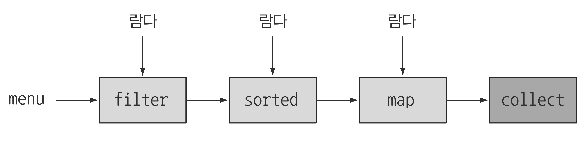
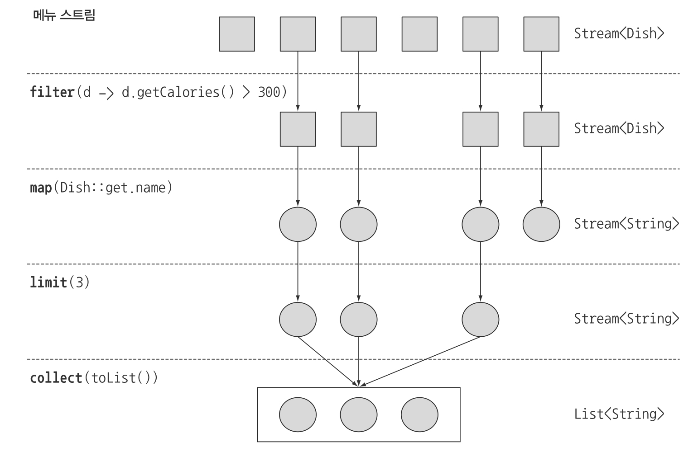

> 본 자료는 [Modern Java In Action](https://www.amazon.com/Modern-Java-Action-functional-programming/dp/1617293563)를 바탕으로 작성되었습니다.

# Ch04 - 스트림 소개

<br>

- [Ch04 - 스트림 소개](#ch04---스트림-소개)
  - [1 스트림이란?](#1-스트림이란)
    - [1-1 스트림을 왜 사용하는가?](#1-1-스트림을-왜-사용하는가)
    - [1-2 스트림이란 무엇인가?](#1-2-스트림이란-무엇인가)
    - [1-3 스트림 예시](#1-3-스트림-예시)
  - [2 스트림과 컬렉션의 차이](#2-스트림과-컬렉션의-차이)
    - [2-1 언제 계산하느냐](#2-1-언제-계산하느냐)
    - [2-2 딱 한 번만 탐색할 수 있다](#2-2-딱-한-번만-탐색할-수-있다)
    - [2-3 철학적 접근](#2-3-철학적-접근)
    - [2-4 외부 반복과 내부 반복](#2-4-외부-반복과-내부-반복)
  - [3 스트림 연산](#3-스트림-연산)

<br>

## 1 스트림이란?

<br>

### 1-1 스트림을 왜 사용하는가?
* 컬렉션을 많이 사용하지만 완벽한 컬렉션 관련 연산을 지원하지 않는다.
* 대부분의 DB에서는 선언형으로 연산을 표현할 수 있다. `SELECT name FROM dishes WHERE calorie < 400`
* 즉, **반복자, 누적자를 사용하지 않고 질의(핵심 로직)만을 작성하여 원하는 연산을 하게 해준다.**

<br>

### 1-2 스트림이란 무엇인가?
* 선언형
  * 스트림은 선언형으로 컬렉션 데이터를 처리할 수 있다.
  * 데이터 컬렉션 반복을 멋지게 처리하는 기능.

<p align="center"><br>출처 : 모던 자바 인 액션 p.138</p>

* 데이터 처리 파이프라인
  * `filter`, `sorted`, `map`, `collect`같은 연산을 조합하여 복잡한 데이터 처리 파이프라인을 만들 수 있다.
* 연속된 요소
  * 컬렉션과 마찬가지로 스트림은 특정 요소 형식으로 이루어진 연속된 값 집합의 인터페이스를 제공한다.
  * 컬렉션의 주제는 데이터고, 스트림의 주제는 계산이다.
* 소스
  * 스트림은 컬렉션, 배열, I/O 자원 등의 데이터 제공 소스로부터 데이터를 소비한다. 리스트로 스트림을 만들면 스트림의 요소는 리스트의 요소와 같은 순서를 유지한다.
* 스트림의 특징
  * 선언형 : 더 간결하고 가독성이 좋아진다
  * 조립할 수 있음 : 유연성이 좋아진다
  * 병렬화 : 성능이 좋아진다
  * 파이프라이닝 : 대부분의 스트림 연산은 스트림 연산끼리 연결해서 커다란 파이프라인을 구성할 수 있도록 스트림 자신을 반환한다. 덕분에 게으름, 쇼트서킷같은 최적화도 얻을 수 있다.
  * 내부 반복 : 반복자를 이용해서 명시적으로 반복하는 컬렉션과 달리 스트림은 내부 반복을 지원한다.

<br>

<br>

### 1-3 스트림 예시
```java
List<String> threeHighCaloricDishNames = 
    menu.stream()
        .filter(dish -> dish.getCalories() > 300)
        .map(Dish::getName)
        .limit(3)
        .collect(toList());
```
<p align="center"><br>출처 : 모던 자바 인 액션 p.143</p>

<br>

## 2 스트림과 컬렉션의 차이

<br>

### 2-1 언제 계산하느냐
* 컬렉션 - DVD를 사서 영화를 보는 것
  * 컬렉션은 현재 자료구조가 포함하는 모든 값을 메모리에 저장하는 자료구조. 
  * 즉, 컬렉션에 추가하기 전에 요소가 계산되어야한다.
* 스트림 - 인터넷 스트리밍으로 영화를 보는 것
  * 스트림은 요청할 때만 요소를 계산하는 고정된 자료구조. (스트림에 요소를 추가하거나 스트림에서 요소를 제거할 수 없다)
  * 즉, 사용자가 요청하는 값만 스트림을 통해 계산된다.
  * 생성자와 소비자의 관계를 형성된다.
* 스트림의 또 다른 예시 - 인터넷 검색
  * 검색어를 입력하면 모든 검색 결과를 내려받을 때까지 기다리지 않아도 가장 비슷한 10개 또는 20개의 결과 요소를 포함하는 스트림을 얻을 수 있다.

<br>

### 2-2 딱 한 번만 탐색할 수 있다
* 스트림은 딱 한 번만 탐색할 수 있다. 탐색된 스트림의 요소는 소비된다.
  * 다시 탐색하려면 초기 데이터 소스에서 새로운 스트림을 만들어야 한다.

<br>

### 2-3 철학적 접근
* 스트림 - 시간적으로 흩어진 값의 집합으로 간주
* 컬렉션 - 특정 시간에 모든 것이 존재하는 공간에 흩어진 값으로 간주

<br>

### 2-4 외부 반복과 내부 반복
```java
// 외부 반복
List<String> names = new ArrayList<>();
for (Dish dish : menu) {       // 메뉴 리스트를 명시적으로 순차 반복한다.
    names.add(dish.getName()); // 이름을 추출해서 리스트에 추가한다.
}
```
* 외부 반복 - 컬렉션
  * 사용자가 직접 요소를 반복해야 한다. (for문)
  * 명시적으로 컬렉션에서 요소를 하나씩 가져와서 처리해야한다.

<br>

```java
List<String> names = menu.stream()
                    .map(Dish::getName)
                    .collect(toList());
```
* 내부 반복 - 스트림
  * 어떤 작업을 수행할지만 지정하면 모든 것이 알아서 처리된다.
  * 반복 과정을 신경쓰지 않아도 된다.
* 내부 반복의 좋은 점
  * 병렬성
  * 더 최적화된 다양한 순서로 처리가능

<br>

## 3 스트림 연산
스트림의 연산과 사용법에 대해선 [다른 곳](https://github.com/binghe819/TIL/blob/master/JAVA/%EB%AA%A8%EB%8D%98%20%EC%9E%90%EB%B0%94/Stream.md)에 잘 정리해두었다.