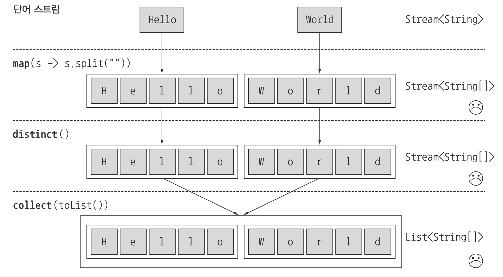
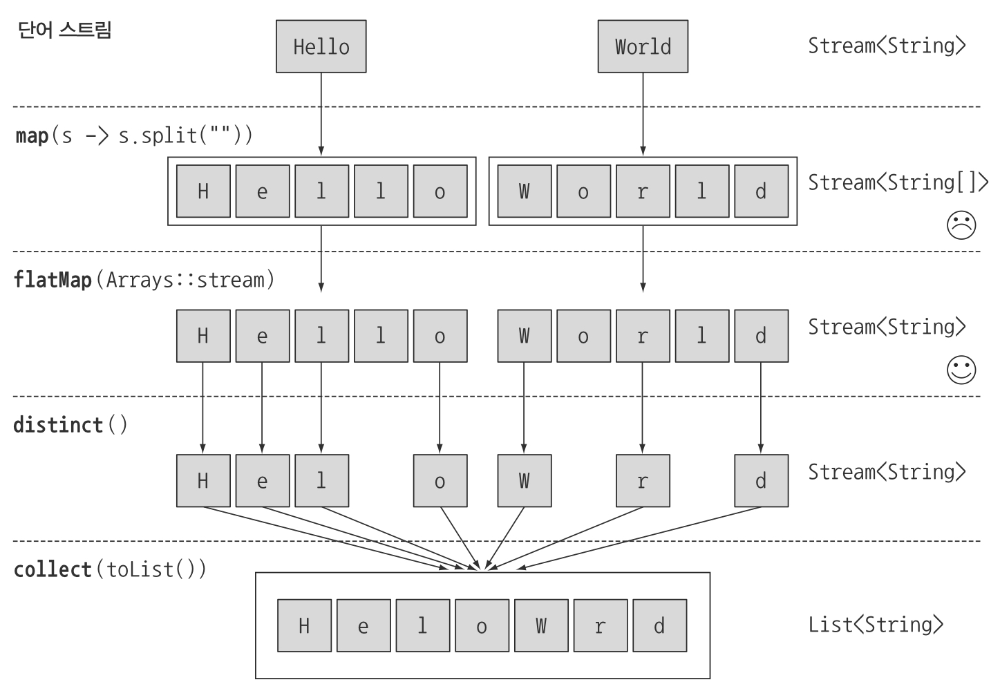
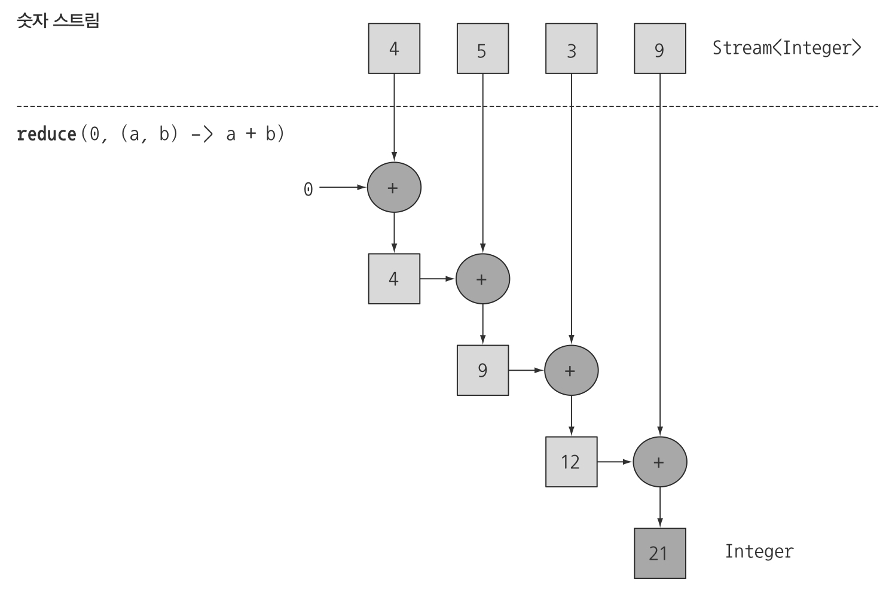
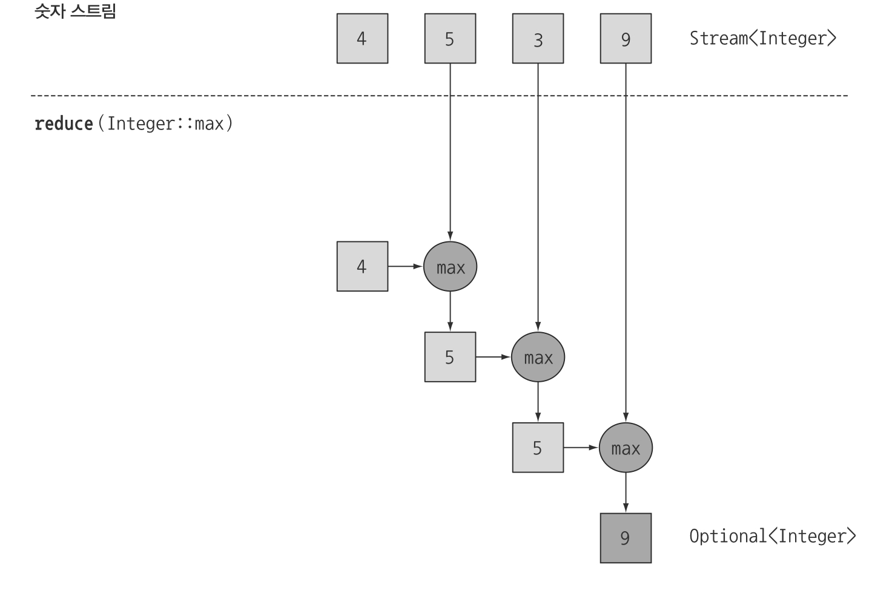

> 본 자료는 [Modern Java In Action](https://www.amazon.com/Modern-Java-Action-functional-programming/dp/1617293563)를 바탕으로 작성되었습니다.

# Ch05 - 스트림 활용

이번 챕터에서는 스트림 API가 지원하는 다양한 연산에 대해서 살펴본다.

<br>

- [Ch05 - 스트림 활용](#ch05---스트림-활용)
  - [1 필터링](#1-필터링)
    - [1-1 filter()](#1-1-filter)
    - [1-2 distinct()](#1-2-distinct)
  - [2 스트림 슬라이싱](#2-스트림-슬라이싱)
    - [2-1 Predicate를 이용한 슬라이싱](#2-1-predicate를-이용한-슬라이싱)
      - [takeWhile()](#takewhile)
      - [dropWhile()](#dropwhile)
    - [2-2 스트림 축소](#2-2-스트림-축소)
    - [2-3 요소 건너뛰기](#2-3-요소-건너뛰기)
  - [3 매핑](#3-매핑)
    - [3-1 스트림의 각 요소에 함수 적용하기](#3-1-스트림의-각-요소에-함수-적용하기)
    - [3-2 스트림 평면화](#3-2-스트림-평면화)
      - [map과 flatMap의 차이](#map과-flatmap의-차이)
      - [flatMap 연습 문제](#flatmap-연습-문제)
  - [4 검색과 매칭](#4-검색과-매칭)
    - [4-1 Predicate를 이용한 검사](#4-1-predicate를-이용한-검사)
      - [anyMatch()](#anymatch)
      - [allMatch()](#allmatch)
      - [noneMatch()](#nonematch)
    - [4-2 요소 검색](#4-2-요소-검색)
  - [5 리듀싱](#5-리듀싱)
    - [5-1 reduce()](#5-1-reduce)
    - [5-2 최댓값과 최소값](#5-2-최댓값과-최소값)
    - [5-3 reduce의 장점과 병렬화](#5-3-reduce의-장점과-병렬화)
    - [5-4 상태 없음과 상태 있음](#5-4-상태-없음과-상태-있음)
  - [6 숫자형 스트림](#6-숫자형-스트림)
    - [6-1 기본형 특화 스트림](#6-1-기본형-특화-스트림)
      - [숫자 스트림으로 매핑](#숫자-스트림으로-매핑)
      - [객체 스트림으로 복원하기](#객체-스트림으로-복원하기)
    - [6-2 숫자 범위](#6-2-숫자-범위)
  - [7 스트림 만들기](#7-스트림-만들기)
    - [7-1 값으로 스트림 만들기](#7-1-값으로-스트림-만들기)
    - [7-2 null이 될 수 있는 객체로 스트림 만들기](#7-2-null이-될-수-있는-객체로-스트림-만들기)
    - [7-3 배열로 스트림 만들기](#7-3-배열로-스트림-만들기)
    - [7-4 파일로 스트림 만들기](#7-4-파일로-스트림-만들기)
    - [7-5 함수로 무한 스트림 만들기](#7-5-함수로-무한-스트림-만들기)
      - [iterate](#iterate)
      - [generate](#generate)

<br>

## 1 필터링

<br>

### 1-1 filter()
`Stream<T> filter(Predicate<? super T> predicate);`
* `Predicate`를 받아서 일치하는 모든 요소를 포함하는 스트림을 반환한다.

```java
List<Dish> vegetarianMenu = menu.stream()
                                .filter(Dish::isVegetarian)
                                .collect(toList());
```

<br>

### 1-2 distinct()
`Stream<T> distinct();`
* 고유 요소로 이루어진 스트림을 반환한다. (중복을 제거할 수 있다)

```java
List<Integer> numbers = Arrays.asList(1, 2, 1, 3, 3, 2, 4);
numbers.stream()
       .filter(i -> i % 2 == 0)
       .distinct()
       .forEach(System.out::println);
```

<br>

## 2 스트림 슬라이싱
스트림의 요소를 선택하거나 스킵하는 방법들

<br> 

### 2-1 Predicate를 이용한 슬라이싱

<br>

#### takeWhile()
`default Stream<T> takeWhile(Predicate<? super T> predicate) {}`
* Predicate의 결과가 true인 요소에 대한 필터링. 
* **Predicate이 처음으로 거짓이 되는 지점에 연산을 멈춘다.**

<br>

#### dropWhile()
`default Stream<T> dropWhile(Predicate<? super T> predicate) {}`
* Predicate의 결과가 false인 요소에 대한 필터링. 
* **Predicate이 처음으로 거짓이 되는 지점까지 발견된 요소를 버린다.**

<br>

### 2-2 스트림 축소
`Stream<T> limit(long maxSize);`
* 주어진 값 이하의 크기를 갖는 새로운 스트림을 반환한다.

<br>

### 2-3 요소 건너뛰기
`Stream<T> skip(long n);`
* 처음 n개 요소를 제외한 스트림을 반환한다.

<br>

## 3 매핑
스트림 API의 `map`과 `flatMap`메서드는 특정 데이터를 선택하는 기능을 제공한다.

<br>

### 3-1 스트림의 각 요소에 함수 적용하기
`<R> Stream<R> map(Function<? super T, ? extends R> mapper);`
* **인수로 제공된 함수(Function)는 각 요소에 적용되며 함수를 적용한 결과가 새로운 요소로 매팽된다.**
* 매핑이란 이름
  * **기존의 값을 '고친다'라는 개념보다는 '새로운 버전을 만든다'라는 개념에 가까우므로 '변환'에 가까운 '매핑'이라는 단어를 사용한다.**

<br>

### 3-2 스트림 평면화
`<R> Stream<R> flatMap(Function<? super T, ? extends Stream<? extends R>> mapper);`
* 제공된 함수를 각 요소에 적용하여 새로운 하나의 스트림으로 매핑한다. 
* **결과적으로 하나의 평면화된 스트림을 반환한다.**

<br>

#### map과 flatMap의 차이
<p align="center"><br>출처 : https://javaconceptoftheday.com/differences-between-java-8-map-and-flatmap/ </p>

<br>

**서로 다른 문자열의 문자를 합쳐서 고유 문자의 개수를 세는 예제.**
```java
// 실패 사례 - map
words.stream()
     .map(word -> word.split("")) // Stream<String[]>
     .distinct()                  // Stream<String[]>
     .collect(toList());          // List<String[]>
```
<p align="center"><br>출처 : 모던자바 인 액션 p.163</p>

* 스트림의 결과가 두 개 `List<String[]>`가 된다.

```java
// 성공 사례 - flatMap
words.stream()
     .map(word -> word.split("")) // Stream<String[]>
     .flatMap(Arrays::stream)     // Stream<String>
     .distinct()                  // Stream<String>
     .forEach(System.out::println);
```
<p align="center"><br>출처 : 모던자바 인 액션 p.165</p>

<br>

#### flatMap 연습 문제
> [1, 2, 3], [3, 4] -> [(1, 3), (1, 4), (2, 3), (2, 4), (3, 3), (3, 4)]
```java
List<Integer> number1 = Arrays.asList(1, 2, 3);
List<Integer> number2 = Arrays.asList(3, 4);

number1.stream()
       .flatMap(n1 -> number2.stream().map(n2 -> new int[]{n1, n2})) // Stream<int[]>
       .collect(Collectors.toList()); // List<int[]>
```

<br>

## 4 검색과 매칭

<br>

### 4-1 Predicate를 이용한 검사
* Predicate를 사용하여 검사하는 아래 메서드들은 쇼트서킷 기법을 사용한다.
  * 쇼트서킷이란 자바의 `&&`, `||`와 같은 연산을 한다고 보면 된다.
  * 즉,전체 스트림을 처리하지 않았더라도 결과를 반환할 수 있다.

<br>

#### anyMatch()
`boolean anyMatch(Predicate<? super T> predicate);`
* 적어도 한 요소와 일치하는지 확인할 때 사용된다.
```java
if (menu.stream.anyMatch(Dish::isVegetarian)) {
    System.out.println("The menu is (somewhat) vegetarian friendly!!");
}
```

<br>

#### allMatch()
`boolean allMatch(Predicate<? super T> predicate);`
* 모든 요소가 주어진 Predicate와 일치하는지 검사한다
```java
boolean isHealthy = menu.stream()
                        .allMatch(dish -> dish.getCalories() < 1000);
```

<br>

#### noneMatch()
`boolean noneMatch(Predicate<? super T> predicate);`
* 주어진 Predicate와 일치하는 요소가 없는지 확인한다.

<br>

### 4-2 요소 검색
요소 검색에 사용되는 모든 메서드는 `Optional`을 반환한다.

Optional에 대한 자세한 내용은 [여기](https://github.com/binghe819/TIL/blob/master/JAVA/%EB%AA%A8%EB%8D%98%20%EC%9E%90%EB%B0%94/Optional.md)를 참고하자.
* findFirst()
  * 첫 번째 요소를 찾아 반환한다. 순서가 정해져 있을 때 사용한다.
* findAny()
  * 요소를 찾으면 반환한다. 요소의 반환순서가 상관없을 때 findFirst대신 사용된다.
  * 보통 병렬처리할 땐 순서가 어떻게 될 지 모르기 때문에 findAny를 사용한다.

<br>

## 5 리듀싱
* reduce란?
  * 모든 스트림 요소를 처리해서 값을 도출하는 방법을 리듀싱이라 한다.
  * **보통 작은 조각이 될 때까지 반복해서 접는 것과 비슷하다는 의미로 폴드라고 부른다.**

<br>

### 5-1 reduce()

**요소의 합**

`T reduce(T identity, BinaryOperator<T> accumulator);`
* 초기값을 정하고, BinaryOperator`로 처리해서 값을 도출한다.
```java
// 반복문
int sum = 0;
for (int x : numbers) {
    sum += x;
}

// 스트림
int sum = numbers.stream().reduce(0, (a, b) -> a + b);
```
<p align="center"><br>출처 : 모던자바 인 액션 p.171 </p>

* reduce는 누적값(accumulated value)를 계속해서 더하는 방식으로 동작한다.

<br>

**초깃값 없음**

`Optional<T> reduce(BinaryOperator<T> accumulator);`
* 초기값이 없으므로 아무 요소가 없을 때를 위해 Optional을 반환한다.

<br>

### 5-2 최댓값과 최소값
```java
// 무식한 방법
Optional<Integer> max = numbers.stream()
        .reduce((a, b) -> a < b ? b : a); // 최댓값
    

Optional<Integer> max = numbers.stream()
       .reduce(Integer::max); // 최댓값
```
<p align="center"><br>출처 : 모던자바 인 액션 p.173 </p>

* 요소에서 최댓값과 최솟값을 반환한다.
* 빈 스트림일 수 있기에 Optional을 반환한다.

<br>

### 5-3 reduce의 장점과 병렬화
* 기존의 단계적 반복으로 합계를 구하는 것보다 reduce를 이용하면 내부 반복이 추상화되면서 내부 구현에서 병렬로 reduce를 실행할 수 있게 된다. 
* 반복적인 합계에서는 sum 변수를 공유해야 하므로 쉽게 병렬화하기 어렵다. 
* 스트림은 내부적으로 포크/조인 프레임워크(fork/join framework)를 통해 이를 처리한다.

> 맵 리듀스 (map reduce)
> * map과 reduce를 연결하는 기법을 맵 리듀스 패턴 이라고 한다. 쉽게 병렬화하는 특징 덕분에 구글이 웹 검색에 적용하면서 유명해졌다.
> ```java
> int count = menu.stream()
>                 .map(d -> 1)
>                 .reduce(0, (a,b) -> a + b);
> ```

<br>

### 5-4 상태 없음과 상태 있음
* 각각의 스트림 연산은 상태를 갖는 연산과 상태를 갖지 않는 연산으로 나뉘어져있다.
  * map, filter : 입력 스트림에서 각 요소를 받아 0 또는 결과를 출력 스트림으로 보낸다. **(내부 상태를 갖지 않는 연산)**
  * reduce, sum, max : 결과를 누적할 내부 상태가 필요하다. **스트림에서 처리하는 요소 수와 관계없이 내부 상태의 크기는 한정되어 있다.**
* 반면 **sorted나 distinct 같은 연산은 스트림의 요소를 정렬하거나 중복을 제거하기 위해 과거의 이력을 알고 있어야 한다.**
  * 예를 들어 어떤 요소를 출력 스트림으로 추가하려면 모든 요소가 버퍼에 추가되어 있어야한다. (그래야 비교를 통해 결과를 내보낼 수 있으니!)
  * 이러한 연산을 내부 상태를 갖는 연산이라 한다.

<br>

## 6 숫자형 스트림
```java
// reduce를 이용한 요소의 합 구하기
int calories = menu.stream()
                   .map(Dish::getCalories)
                   .reduce(0, Integer::sum);
```
* 위 과정에서는 내부적으로 합계를 계산하기 위해서 Integer가 int형으로 **언박싱** 된다. 따라서 **박싱 비용이 소모된다.**

<br>

### 6-1 기본형 특화 스트림
스트림 API는 박싱 비용을 피할 수 있도록 3가지의 기본형 특화 스트림을 제공한다.
* IntStream, DoubleStream, LongStream

<br>

#### 숫자 스트림으로 매핑
```java
int calories = menu.stream() // Stream<Dish>
                   .mapToInt(Dish::getCalories) // IntStream
                   .sum();
```
* **스트림을 특화 스트림으로 변환할 때는 `mapToInt`, `mapToDouble`, `mapToLong` 세가지 메서드를 가장 많이 사용한다.**
* 스트림이 비어있으면 sum은 기본값 0을 반환한다.

<br>

#### 객체 스트림으로 복원하기
```java
IntStream intStream = menu.stream().mapToInt(Dish::getCalories); // 스트림을 숫자 스트림으로 반환
Stream<Integer> stream = intStream.boxed(); // 숫자 스트림을 스트림으로 변환
```
* **`boxed` 메서드를 이용해서 특화 스트림을 일반 스트림으로 변환할 수 있다.**

<br>

### 6-2 숫자 범위
```java
IntStream evenNumbers = IntStream.rangeClosed(1, 100) // [1, 100]
                                 .filter(n -> n % 2 == 0); // 1부터 100까지의 짝수 스트림
System.out.println(evenNumbers.count()); // 개수
```
* **자바 8의 IntStream과 LongSteam에서는 `range`와 `rangeClosed`라는 두 가지 정적 메서드를 제공한다.**

<br>

## 7 스트림 만들기

<br>

### 7-1 값으로 스트림 만들기
```java
Stream<String> stream = Stream.of("Modern", "Java", "In", "Action");
stream.map(String::toUpperCase).forEach(System.out::println);
```
* 임의의 수를 인수로 받는 정적 메서드 `Stream.of`를 통해서 스트림을 만들 수 있다.

<br>

### 7-2 null이 될 수 있는 객체로 스트림 만들기
```java
// null이 될 수 있는 객체를 스트림으로 만들기
String homeValue = System.getProperty("home");
Stream<String> homeValueStream = homeValue == null ? Stream.emtpy() : Stream.of(value);

// ofNullable 사용
Stream<String> homeValueStream = Stream.ofNullable(System.getProperty("home"));
```
* `ofNullable`을 사용하면 null이 될 수 있는 스트림을 쉽게 만들 수 있다.
  * 만약 null인 값을 넣으면 `Stream.empty()`가 반환된다.

<br>

### 7-3 배열로 스트림 만들기
```java
int[] numbers = {2, 3, 5 ,7, 11, 13};
int num = Arrays.stream(numbers).sum(); // IntStream이 반환되어 sum을 사용할 수 있다.
```

<br>

### 7-4 파일로 스트림 만들기
```java
long uniqueWords = 0;
try (Stream<String> lines = Files.lines(Paths.get("data.txt"), CharSet.defaultCharset())) {
  uniqueWords = lines.flatMap(line -> Arrays.stream(line.split(" ")))
                     .distinct()
                     .count();
} catch(IOException e) {
  ...
}
```
* `Files.lines`로 파일의 각 행 요소를 반환하는 스트림을 얻을 수 있다.

<br>

### 7-5 함수로 무한 스트림 만들기
스트림 API는 함수에서 스트림을 만들 수 있는 두 정적 메서드 Stream.iterate와 Stream.generate를 제공한다. 

두 연산을 이용해서 무한 스트림(infinite stream) 즉, 언바운드 스트림(unbounded stream)을 만들 수 있다.

<br>

#### iterate
```java
Stream.iterate(0, n -> n + 2)
      .limit(10)
      .forEach(System.out::println);
```
* **iterate는 초기값과 람다를 인수로 받아서 새로운 값을 끊임없이 생산할 수 있다.**

```java
// 피보나치 수열
Stream.iterate(new int[]{0, 1}, t -> new int[]{t[1], t[0] + t[1]})
      .limit(20)
      .forEach(t -> System.out.println("(" + t[0] + "," + t[1] + ")"));
```

<br>

#### generate
```java
Stream.generate(Math::random)
      .limit(5)
      .forEach(System.out::println);
```
* generate는 iterate와 달리 생상된 각 값을 연속적으로 계산하지 않는다.
  * `Supplier<T>`를 인수로 받아서 새로운 값을 생상한다.
* **iterate는 시드 값과 `IntUnaryOperator`를 통해, 이전 값을 바탕으로 각 요소를 생성한다. 하지만 generate는 아무런 값이 주어지지 않는 상태에서 값을 생성한다.**
