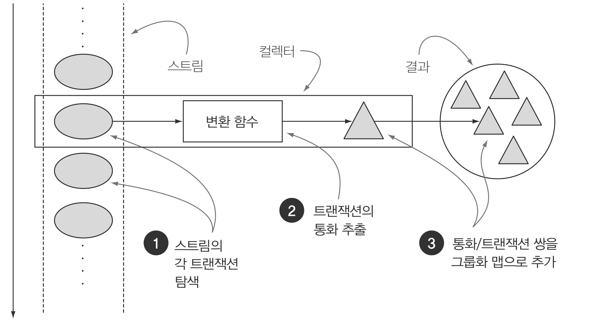
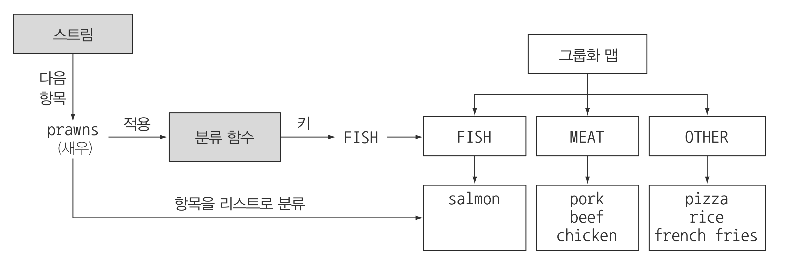
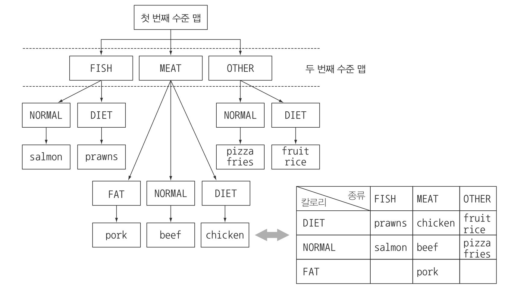

> 본 자료는 [Modern Java In Action](https://www.amazon.com/Modern-Java-Action-functional-programming/dp/1617293563)를 바탕으로 작성되었습니다.

# Ch06 - 스트림으로 데이터 수집
이 챕터에서는 `reduce`가 그랬던 것처럼 `collect` 역시 다양한 요소 누적 방식을 인수로 받아서 스트림을 최종 결과로 도출하는 리듀싱 연산을 수행할 수 있음을 설명한다.

<br>

- [Ch06 - 스트림으로 데이터 수집](#ch06---스트림으로-데이터-수집)
  - [collect와 collector로 구현할 수 있는 예시](#collect와-collector로-구현할-수-있는-예시)
  - [1 컬렉터](#1-컬렉터)
    - [1-1 고급 리듀싱 기능을 수행하는 컬렉터](#1-1-고급-리듀싱-기능을-수행하는-컬렉터)
    - [1-2 미리 정의된 컬렉터](#1-2-미리-정의된-컬렉터)
  - [2 리듀싱과 요약](#2-리듀싱과-요약)
    - [2-1 counting()](#2-1-counting)
    - [2-2 max, min](#2-2-max-min)
    - [2-3 요약 연산](#2-3-요약-연산)
    - [2-4 문자열 연결](#2-4-문자열-연결)
    - [2-5 범용 리듀싱 요약 연산 - 중요](#2-5-범용-리듀싱-요약-연산---중요)
  - [3 그룹화](#3-그룹화)
    - [3-1 그룹화된 요소 조작](#3-1-그룹화된-요소-조작)
      - [filtering](#filtering)
      - [mapping](#mapping)
    - [3-2 다수준 그룹화](#3-2-다수준-그룹화)
    - [3-3 서브그룹으로 데이터 수집](#3-3-서브그룹으로-데이터-수집)

<br>

## collect와 collector로 구현할 수 있는 예시
**통화별로 트랜잭션을 그룹화한 다음에 해당 통화로 일어난 모든 트랜잭션 합계를 계산하시오**
```java
// 명령형 버전
Map<Currentcy, List<Transaction>> transactionByCurrencies = new HashMap<>();

for (Transaction transaction : transactions) {
    Currency currency = transaction.getCurrency();
    List<Transaction> transactionForCurrency = transactionsByCurrencies.get(currency);
    if (transactionsForCurrency == null) {
        transactionForCurrency = new ArrayList<>();
        transactionForCurrencies.put(currency, transactionsForCurrency);
    }
    transactionsForCurrency.add(transaction);
}
```
```java
// collect와 collector 버전
Map<Currency, List<Transaction>> transactionsByCurrencies = 
    transactions.stream().collect(groupingBy(Transaction::getCurrency));
```
* 간단한 작업임에도 명령형 코드는 너무 길다.
* 스트림을 이용하면 '통화별로 트랜잭션 리스트를 그룹화하시오'라고 간단히 표현할 수 있다.

<br>

## 1 컬렉터
`collect`메서드로 `Collector` 인터페이스 구현을 전달한다. 

**`Collector` 인터페이스 구현은 스트림의 요소를 어떤 식으로 도출할지 지정한다.**

<br>

### 1-1 고급 리듀싱 기능을 수행하는 컬렉터
<p align="center"><br>출처 : 모던 자바 인 액션 p.200</p>

* **스트림에 `collect`를 호출하면 스트림의 요소에 (컬렉터로 파라미터화된) 리듀싱 연산이 수행된다.**
  * 즉, 내부 반복을 통해 자료구조에 값을 누적한다.
* **`Collector` 인터페이스의 메서드를 어떻게 구현하느냐에 따라 스트림에 어떤 리듀싱 연산을 수행할지 결정된다.**

<br>

### 1-2 미리 정의된 컬렉터
* `Collectors`에서 제공하는 메서드의 기능
  * 스트림 요소를 하나의 값으로 리듀스하고 요약 
  * 요소 그룹화
  * 요소 분할

<br>

## 2 리듀싱과 요약
**컬렉터 (`Stream.collect`)로 스트림의 항목을 컬렉션으로 재구성할 수 있다.**

<br>

### 2-1 counting()
```java
long howManyDishes = menu.stream().collect(Collectors.counting());

long howManyDishes = menu.stream().count();
```

<br>

### 2-2 max, min
```java
Comparator<Dish> dishCaloriesComparator = Comparator.comparingInt(Dish::getCalories);
Optional<Dish> mostCalorieDish = menu.stream().collect(maxBy(dishCaloriesComparator));
```
* `Collectors.maxBy`, `Collectors.minBy`는 스트림의 요소를 비교하는 데 사용할 `Comparator`를 인수로 받는다.

<br>

### 2-3 요약 연산
```java
// sum
int totalCalories = menu.stream().collect(summingInt(Dish::getCalories));

// average
double avgCalories = menu.stream().collect(averaingInt(Dish::getCalories));

// 모든 요소 (개수, 총합, 최소, 최대, 평균)
IntSummaryStatistics menuStatistics = 
    menu.stream().collect(summarizingInt(Dish::getCalories));
```
* 모든 연산은 `Long`과 `Double`도 지원한다.

<br>

### 2-4 문자열 연결
```java
String shortMenu = menu.stream().map(Dish::getName).collect(joining(", "));
```
* 내부적으로 `StringBuilder`를 이용해서 문자열을 하나로 만든다.

<br>

### 2-5 범용 리듀싱 요약 연산 - 중요
**모든 컬렉터는 `reducing` 팩토리 메서드로도 정의할 수 있다.**
```java
// sum
int totalCalories = menu.stream().collect(reducing(0, // 초깃값
                            Dish::getCalories,        // 합계 함수
                            (i, j) -> i + j));        // 변환 함수 (Integer::sum)

// max 
Optional<Dish> mostCalorieDish = 
    menu.stream().collect(reducing(
        (d1, d2) -> d1.getCalories() > d2.getCalories() ? d1 : d2));
```
* `reducing`
  * 첫 번째 인수 : 리듀싱 연산의 시작값이거나 스트림에 인수가 없을 때의 반환값이다.
  * 두 번째 인수 : 변환 함수 (map과 유사)
  * 세 번째 인수 : 같은 종류의 두 항목을 하나의 값으로 더하는 `BinaryOperator`

<br>

> collect와 reduce의 차이
> ```java
> // reduce로 collect를 구현할 수 있다. (잘못된 예시)
> Stream<Integer> stream = Arrays.asList(1, 2, 3, 4, 5, 6).stream();
> List<Integer> numbers = stream.reduce(
>                                new ArrayList<Integer>(), 
>                                (List<Integer> l, Integer e) -> { l.add(e); return l; },
>                                (List<Integer> l1, List<Integer> l2) -> { l1.addAll(l2); return l1; });
> ```
> * 위 코드의 첫 번째 문제
>   * **collect 메서드는 도출하려는 결과를 누적하는 컨테이너**를 바꾸도록 설계된 메서드다.
>   * 반면에 **reduce는 두 값을 하나로 도출하는 불변형 연산**이라는 점에서 의미론적인 문제가 일어난다.
> * 위 코드의 두 번째 문제
>   * reduce 메서드는 여러 스레드가 동시에 같은 데이터 구조체를 고치면 리스트 자체가 망가져서 병렬로 수행할 수 없다.

<br>

## 3 그룹화
```java
Map<Dish.Type, List<Dish>> dishesByType = 
    menu.stream().collect(groupingBy(Dish::getType));
```

<p align="center"><br>출처 : 모던 자바 인 액션 p.211 </p>

* 스트림의 각 요소를 분류 함수에 따라 그룹화하며, 이를 분류 함수라고 부른다.

```java
// 칼로리 기준으로 분류
Map<CaloricLevel, List<Dish>> dishesByCaloricLevel = menu.stream().collect(
    groupingBy(dish -> {
        if (dish.getCalories() <= 400) return CaloricLevel.DIET;
        else if (dish.getCalories() <= 700) return CaloricLevel.NORMAL;
        else return CaloricLvel.FAT;
    }));
```
* 위와 같이 특정 분류 함수를 직접 구현해줄 수도 있다.

> **분류 함수 한 개의 인수를 갖는 `groupingBy(f)`는 사실 `groupingBy(f, toList())`의 축약형이다.**

<br>

### 3-1 그룹화된 요소 조작
**groupingBy를 쉽게 이해하는 방법은 첫 번째 인수는 Key, 그 다음 인수부터는 Value를 정의한다고 생각하면 쉽다.**

<br>

#### filtering
**요소를 그룹화 한 다음에는 각 결과 그룹의 요소를 조작하는 연산이 필요하다고 가정해보자.**
```java
Map<Dish.Type, List<Dish>> caloricDishesByType = 
    menu.stream().filter(dish -> dish.getCalories() > 500)
                 .collect(groupingBy(Dish::getType));

// 결과
{OTHER = [french fries, pizza], MEAT = [pork, beef]}
```
* 위 코드는 각 결과 그룹을 분리하기 전에, 필터를 하고, 분리하는 과정인데 이렇게 하면 결과 맵에서 보여줘야하는 키 자체가 사라지게 된다.

```java
Map<Dish.Type, List<Dish>> caloricDishesByType = 
    menu.stream()
        .collect(groupingBy(Dish::getType,
                 filtering(dish -> dish.getCalories() > 500, toList())));

// 결과
{OTHER = [french fries, pizza], MEAT = [pork, beef], FISH = []}
```
* 반면에 위와 같이 그룹핑을하고 필터링을 하면 결과맵에 모든 키가 존재하는 것을 볼 수 있다.

<br>

#### mapping
**그룹화된 항목을 매핑 함수를 이용해 요소를 변환할 수도 있다.**
```java
Map<Dish.Type, List<String>> dishNamesByType = 
    menu.stream()
        .collect(groupingBy(Dish::getType, mapping(Dish::getName, toList())));
```
* 위 코드처럼 그룹의 각 요리를 관련 이름 목록으로 변환할 수 있다.

<br>

### 3-2 다수준 그룹화
두 인수를 받는 팩토리 메서드 `Collectors.groupingBy`를 이용해서 항목을 다수준으로 그룹화 할 수 있다.
```java
Map<Dish.Type, Map<CaloricLevel, List<Dish>>> dishesByTypeCaloricLevel = 
    menu.stream().collect(
        groupingBy(Dish::getType, // 첫 번째 수준의 분류 함수
            groupingBy(dish -> {  // 두 번째 수준의 분류 함수
                if (dish.getCalories() <= 400) return CaloricLevel.DIET;
                else if (dish.getCalories() <= 700) return CaloricLevel.NORMAL;
                else return CaloricLevel.FAT;
            })
        )
    );

// 결과 ( 두 수준의 맵이 만들어진다 )
{MEAT={DIET=[chicken], NORMAL=[beef], FAT=[pork]}, FISH={DIET=[prawn], NORMAL=[salmon]},
OTHER={DIET=[rice, seasonal fruit], NORMAL=[french fries, pizza]}}
```

<p align="center"><br>출처 : 모던 자바 인 액션 p.215 </p>

* `groupingBy`를 버킷(물건을 담을 수 있는 양동이)개념으로 생각하면 쉽다.
  * 첫 번째 `groupingBy`는 각 키의 버킷을 만든다. 그리고 준비된 각각의 버킷을 서브스트림 컬렉터로 채워가기를 반복하면서 n수준 그룹화를 달성한다.

<br>

### 3-3 서브그룹으로 데이터 수집
```java
// 메뉴에서 요리의 수를 종류별로 계싼
Map<Dish.Type, Long> typesCount = menu.stream().collect(
    groupingBy(Dish::getType, counting());
)
// 결과
{MEAT=3, FISH=2, OTHER=4}
```
* 두 번째 인수로 원하는 데이터를 수집할 수 있다.
  * 첫 번째 인수 : key, 두 번째 인수 : value


