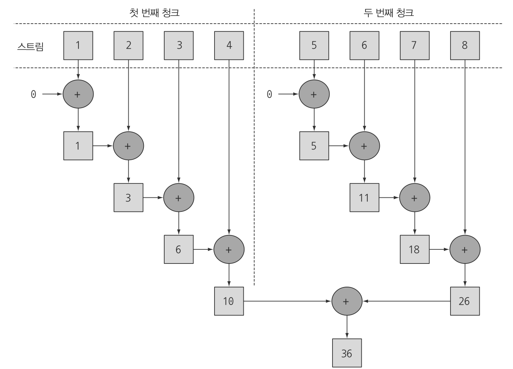
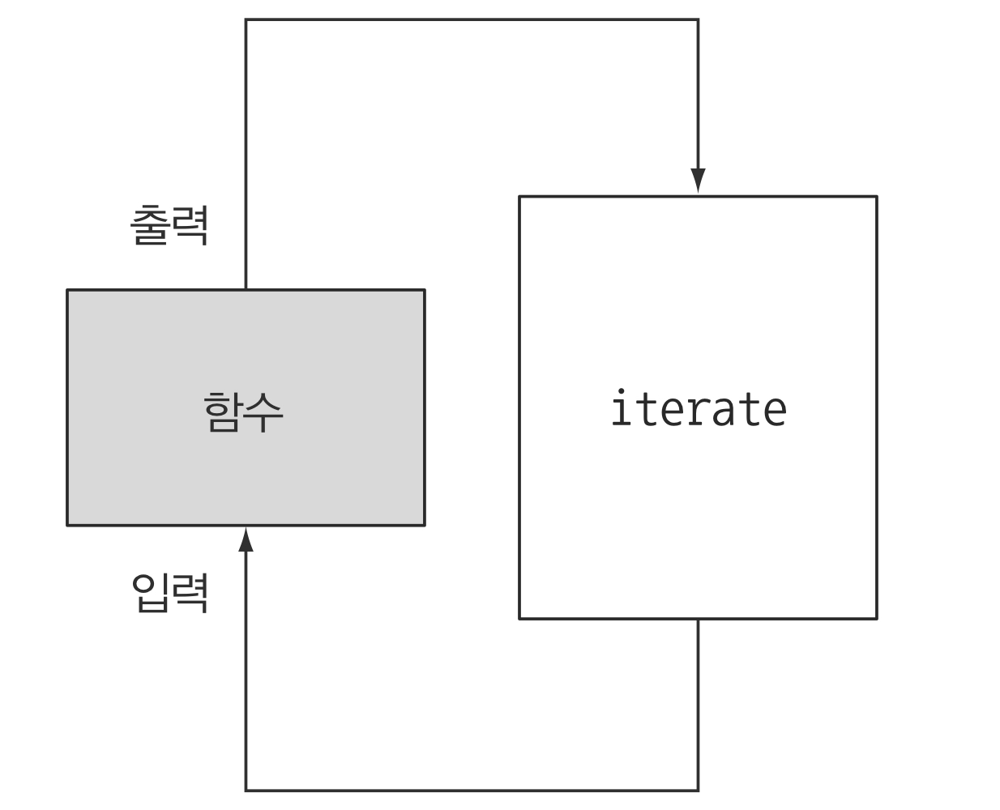
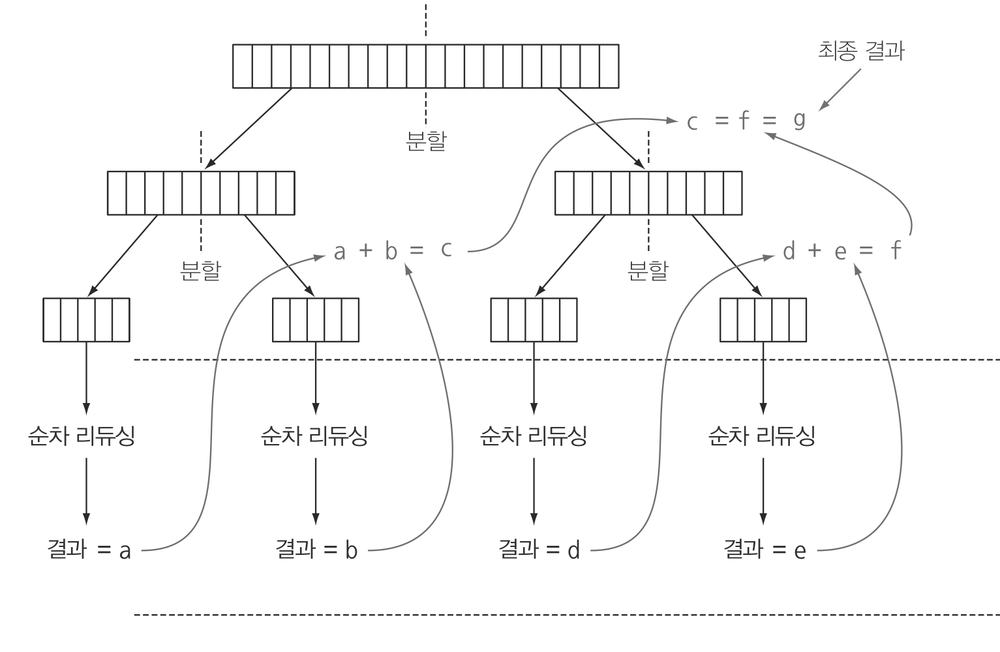
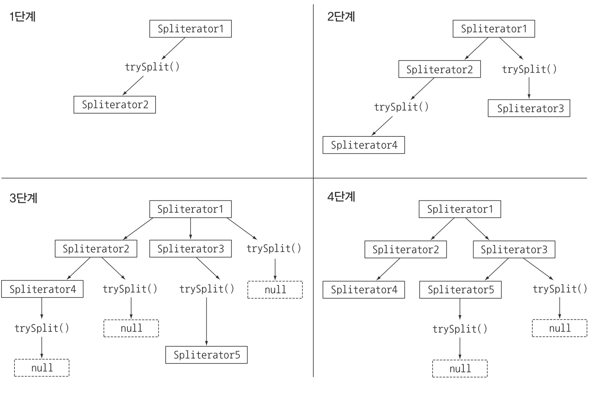

> 본 자료는 [Modern Java In Action](https://www.amazon.com/Modern-Java-Action-functional-programming/dp/1617293563)를 바탕으로 작성되었습니다.

# Ch07 - 병렬 데이터 처리와 성능
이번 챕터의 목적
* 스트림으로 얼마나 쉽게 병렬 처리를 할 수 있는지 확인
* 어떻게 순차 스트림을 쉽게 병렬 스트림으로 바꿀 수 있는지
* 자바 7에 추가된 포크/조인 프레임워크와 내부적인 병렬 스트림 처리는 어떤 관계가 있는지 살펴본다
* 병렬 스트림을 제대로 사용하기 위해 내부적으로 어떻게 처리되는지 알아본다.

<br>

- [Ch07 - 병렬 데이터 처리와 성능](#ch07---병렬-데이터-처리와-성능)
- [병렬 스트림](#병렬-스트림)
  - [병렬 스트림의 연산](#병렬-스트림의-연산)
  - [스트림 성능 측정](#스트림-성능-측정)
    - [박싱 언박싱](#박싱-언박싱)
    - [분할이 어려운 경우](#분할이-어려운-경우)
    - [특화된 메서드를 사용해보자](#특화된-메서드를-사용해보자)
    - [성능 측정 결론](#성능-측정-결론)
  - [병렬 스트림의 잘못된 사용법 - 가변 상태](#병렬-스트림의-잘못된-사용법---가변-상태)
  - [병렬 스트림 효과적으로 사용하기 - 중요](#병렬-스트림-효과적으로-사용하기---중요)
- [포크/조인 프레임워크](#포크조인-프레임워크)
  - [RecursiveTask 활용](#recursivetask-활용)
  - [제대로 사용하는 방법](#제대로-사용하는-방법)
  - [작업 훔치기](#작업-훔치기)
- [Spliterator 인터페이스](#spliterator-인터페이스)
  - [Spliterator란](#spliterator란)
  - [Spliterator 분할 과정](#spliterator-분할-과정)
  - [커스텀 Spliterator 예시](#커스텀-spliterator-예시)

<br>

# 병렬 스트림

<br>

## 병렬 스트림의 연산
```java
// 1부터 n까지의 모든 숫자의 합계
public long parallelSum(long n) {
    return Stream.iterate(1L, i -> i + 1) // 무한 스트림 생성
                 .limit(n)    // n개 이하로 제한
                 .parallel()  // 스트림을 병렬 스트림으로 변환
                 .reduce(0L, Long::sum); // 모든 숫자를 더하는 스트림 리듀싱 연산
}
```
* **순차 스트림에 `parallel` 메서드를 호출하면 기존의 함수형 리듀싱 연산(숫자 합계 계산)이 병렬로 처리된다.**

<br>

<p align="center"><br>출처 : 모던 자바 인 액션 p.243 </p>

1. 스트림을 여러 청크로 분할
2. 각 청크를 병렬로 리듀싱 연산을 수행한다
3. 다시 리듀싱 연산으로 합쳐서 전체 스트림의 리듀싱 결과를 도출한다.

> sequential()를 사용하면 병렬 스트림에서 다시 순차 스트림으로 변환된다.
> 
> **최종적으로 호출된 메서드가 전체 파이프라인에 영향을 미친다.**

<br>

## 스트림 성능 측정
병렬화를 사용하면 무조건 성능이 좋다고 생각하지만 결과는 '아니다'

**성능에 영향을 주는 것은 무엇이 있을까??**

<br>

### 박싱 언박싱
```java
// 박싱
public long sequentialSum() {
    return Stream.iterate(1L, i -> i + 1)
                 .limit(N)
                 .reduce(0L, Long::sum);
}

// 박싱이 필요없는 연산
public long iterativeSum() {
    long result = 0;
    for (long i = 1L; i <= N; i++) {
        result += i;
    }
    return result;
}
```
* 실행 결과 박싱이 필요없는 for 루프가 더 빠르다. (4배)

<br>

### 분할이 어려운 경우
```java
// 병렬화 박싱
public long parallelSum() {
    return Stream.iterate(1L, i -> i + 1)
                 .limit(N)
                 .parallel()
                 .reduce(0L, Long::sum);
}
```
* 순차(sequential)보다 5배정도 느리다.
* 이유는 다음과 같다.
  * 언박싱
  * 분할이 어렵다
    * 리듀싱 과정을 시작하는 시점에 **전체 숫자 리스트가 준비되지 않았으므로 분할할 수 없다.**
    * 병렬로 처리하라고 요청했지만, 각각의 합계가 다른 스레드에서 수행되었지만 결국 **순차처리 방식과 크게 다른 점이 없으므로 스레드를 할당하는 오버헤드만 증가하게 된다.**

<p align="center"><br>출처 : 모던 자바 인 액션 p.249</p>

* iterate는 본질적으로 순차적이다

<br>

**가장 이상적인 병렬처리**
<p align="center"><br>출처 : https://www.todaysoftmag.com/article/1358/hadoop-mapreduce-deep-diving-and-tuning</p>


<br>

### 특화된 메서드를 사용해보자
스트림에서는 박싱 관련된 **오버헤드를 제거하기 위해 `LongStream.rangeClosed`를 지원한다.**
```java
public long rangedSum() {
    return LongStream.rangeClosed(1, N)
                     .reduce(0L, Long::sum);
}
```
* 처리 결과가 기존의 `iterate`보다 훨씬 빠르게 나온다.

<br>

또한, **`LongStream.rangeClosed`는 쉽게 청크로 분할할 수 있는 숫자 범위를 생성한다.**
```java
public long rangedSum() {
    return LongStream.rangeClosed(1, N)
                     .parallel()
                     .reduce(0L, Long::sum);
}
```
* **위 코드를 돌려보면 순차 실행한 것보다 빠른 성능을 갖는 병렬 리듀싱 계산을 한다.**

> 교훈 : 어떤 알고리즘을 병렬화하는 것보다 적절한 자료구조를 선택하는 것이 더 중요할 때도 있다.

<br>

### 성능 측정 결론
* 병렬처리를 한다고 무조건 빠른 것은 아니다.
  * 박싱, 언박싱 이슈
  * 분할 이슈
* 병렬화는 은근 비싸다.
  * 스트림을 재귀적으로 분할해야 하고, 각 서브스트림을 서로 다른 스레드의 리듀싱 연산으로 할당하고, 이들 결과를 하나의 값으로 합쳐야 한다.
* 멀티코어 간의 데이터 이동은 우리 생각보다 비싸다.
  * 따라서 코어 간에 데이터 전송 시간보다 훨씬 오래 걸리는 작업만 병렬로 다른 코어에서 수행하는 것이 바람직하다.
  * 한마디로 적은 양의 데이터로 병렬화를 하면 오히려 성능 저하가 발생할 수도 있다.

<br>

## 병렬 스트림의 잘못된 사용법 - 가변 상태
```java
// 잘못된 사용법 (공유 변수 사용)
public long sideEffectSum(long n) {
    Accumulator accumulator = new Accumulator();
    LongStream.rangeClosed(1, n).forEach(accumulator::add);
    return accumulator.total;
}

public class Accumulator {
    public long total = 0; // 공유 변수
    public void add(long value) { total += value; }
}
```
* **병렬 스트림의 잘못된 사용법**
  * 공유된 상태를 바꾸는 알고리즘을 사용 (부수효과)
* 위 코드를 병렬로 실행하면 참사가 일어난다.
  * **`total`을 접근할 때마다 다수의 스레드가 동시에 접근하므로 데이터 레이스 문제가 일어난다.**
  * **자칫 잘못된 결과가 나올 수도 있다.**

<br>

## 병렬 스트림 효과적으로 사용하기 - 중요
* 확신이 서지 않으면 직접 측정하라
* 박싱을 주의하라
* 순차 스트림보다 병렬 스트림에서 성능이 떨어지는 연산이 있다
  * 특히 순서에 의존하는 연산을 병렬 스트림에서 수행하려면 비싼 비용을 치러야 한다
* 스트림에서 수행하는 전체 파이프라인 연산 비용을 고려하라
* 소량의 데이터에서는 병렬 스트림이 도움 되지 않는다
* 스트림을 구성하는 자료구조가 적절한지 확인하라
  * ex. ArrayList보다 LinkedList가 효율적으로 분할된다
* 스트림의 특성과 파이프라인의 중간 연산이 스트림의 특성을 어떻게 바꾸는지에 따라 분해 과정의 성능이 달라질 수 있다.
* 최종 연산의 병합 과정 비용을 살펴보라

<br>

# 포크/조인 프레임워크
포크/조인 프레임워크는 병렬화할 수 있는 작업을 재귀적으로 작은 작업으로 분할한 다음에 서브태스크 각각의 결과를 합쳐서 전체 결과를 만들도록 설계되었다.

`ExecutorService` 인터페이스 구현을 통해 스레드 풀의 작업 스레드들에게 서브 작업들을 분해하도록 된다.

분할 정복을 사용한다고 볼 수 있다.

<br>

## RecursiveTask 활용
```java
public class ForkJoinSumCalculator extends RecursiveTask<Long> {

    private final long[] numbers;
    private final int start;
    private final int end;
    public static final long THRESHOLD = 10_000;

    public ForkJoinSumCalculator(long[] numbers) {
        this(numbers, 0, numbers.length);
    }

    private ForkJoinSumCalculator(long[] numbers, int start, int end) {
        this.numbers = numbers;
        this.start = start;
        this.end = end;
    }

    @Override
    protected Long compute() {
        int length = end - start; // 이 태스크에서 더할 배열의 길이
        if (length <= THRESHOLD) { // 순차적으로 계산할 조건
            return computeSequentially();
        }
        // 병렬로 계산
        ForkJoinSumCalculator leftTask = new ForkJoinSumCalculator(numbers, start, start + length / 2); // 서브태스크 생성
        leftTask.fork(); // 스레드에 비동기로 실행
        ForkJoinSumCalculator rightTask = new ForkJoinSumCalculator(numbers, start + length / 2, end); // 서브태스크 생성
        Long rightResult = rightTask.compute(); // 두 번째 서브태스크 비동기 실행
        Long leftResult = leftTask.join(); // 첫번째 서브 태스크 결과를 읽거나 기다림
        return leftResult + rightResult; // 두 서브태스크 결과를 조합한 값
    }

    private long computeSequentially() {
        long sum = 0;
        for (int i = start; i < end; i++) {
            sum += numbers[i];
        }
        return sum;
    }
}
```
* `RecursiveTask`를 구현할 때 타입 매개변수 R은 태스크 결과 형식 또는 결과가 없을 때 RecursiveAction형식이다.
* `compute` 메서드는 로직을 분할 할 수 없을 때와 분할 할 수 있을 때의 개별 서브태스크의 알고리즘을 정의한다.

<br>

```java
// 포크/조인 프레임워크를 이용해서 병렬 합계 수행
public static long forkJoinSum(long n) {
    long[] numbers = LongStream.rangeClosed(1, n).toArray();
    ForkJoinTask<Long> task = new ForkJoinSumCalculator(numbers);
    return new ForkJoinPool.invoke(task); // poll에게 전달
}
```
* ForkJoinTask를 생성하고 ForkJoinPoll에 넘겨주면 결과를 반환한다.
* 스레드 풀에 요청하는 참조 변수인 `ForkJoinPool`은 하나만 있으면 되므로 보통 정적 싱글턴으로 저장한다고 한다.
  * `Runtime.availableProcessors`를 사용해서 스레드의 개수를 설정할 수 있다.

<br>

<p align="center"><br>출처 : 자바 인 액션 p.259 </p>

위와 같이 동작한다. (분할 정복)

<br>

## 제대로 사용하는 방법
* join 메소드를 호출하면 task의 결과가 준비될까지 블록된다. 두 subtask가 모두 시작한 다음 join을 호출해야한다. 그렇지 않으면 각 subtask가 다른 task가 끝나길 기다리는 일이 발생한다.

* RecursiveTask 내에서는 invoke를 사용하지 말아야한다. 대신 compute나 fork 메서드를 직접 호출할 수는 있다. 순차 코드 내에서 병렬 계산을 시작할 때만 invoke를 쓴다.

* subtask에 fork 를 호출해서 ForkJoinPool의 일정을 조절할 수 있다. 위에서 보면 left, right에 모두 fork 하는게 자연스러울 것 같지만 한쪽에는 compute를 하는게 효율적이다. 그러면 하나의 스레드를 재사용할 수 있기때문이다.

* 포크-조인을 이용한 병렬계산은 디버깅하기가 어렵다. stacktrace를 해도, fork 하는 순간 다른 스레드에서 compute를 호출하므로 스택트레이스가 도움되지 않는다.

* 병렬 스트림과 마찬가지로 무조건 빠르지는 않다. 여러 독립적인 subtask로 분할이 가능하다는 조건, 그리고 실행시간이 fork 하는 시간보다 길어서 이득을 볼 수 있다는 조건 등을 만족해야한다. 더욱 효율적으로 나누기 위해서 다음과 같은 분할 기준을 따라보자.


<br>

## 작업 훔치기
위 예제는 숫자가 만 개 이상이면 서브태스크로 분할한다. 천만개를 넣었기 때문에 천 개가 넘는 서브태스크가 포크된다. 

대부분 기기에는 코어가 4개뿐이므로 천개 이상의 서브태스크는 자원만 낭비하는 것 같아 보일 수 있다.

**하지만 실제로는 코어의 갯수와 관계없이 적절한 크기로 분할된 많은 태스크를 포킹하는 것이 좋다.**

하지만 여러가지 복잡한 현실적 이유로인해 서브태스크마다 처리시간이 상이하다고 한다.

이러한 문제를 작업 훔치기라는 기법으로 해결할 수 있다.

<br>

* 작업 훔치기
  * **작업을 다 끝낸 스레드가 유휴 상태에 돌입하는 대신 다른 스레드의 작업을 가지고 와서 처리해주는 알고리즘**
* 각 스레드는 자신에 할당된 태스크를 포함하는 이중 연결 리스트를 참조하면서 큐의 head에서 다른 태스크를 가져와서 처리한다. 이때 태스크의 크기를 작게 나누어야 worker 스레드 간의 작업부하를 비슷한 수준으로 유지할 수 있다.
  * 즉, 할당된 작업을 전부 수행해 큐가 비워진 스레드는 다른 스레드의 작업 큐의 꼬리에서 작업을 훔쳐온다.
  * 모든 서브 작업들이 완료될 때 까지 이 과정이 반복된다.

<br>

# Spliterator 인터페이스
병렬 스트림을 이용할 때 분할로직을 개발하지 않고도 스트림을 자동 분할해준다. 이는 자바 8에서 추가된 Spliterator가 해결해준다.

<br>

## Spliterator란
Spliterator는 '분할할 수 있는 반복자'라는 의미이며, 컬렉션 프레임워크에 포함된 모든 자료구조에서 사용이 가능하며, 구현을 제공한다.

```java
// Spliterator 인터페이스
public interface Spliterator<T> {
    boolean tryAdvance(Consumer<? super T> action);
    Spliterator<T> trySplit();
    long estimateSize();
    int characteristics();
}
```
* T는 Spliterator가 탐색하는 요소의 타입
* tryAdvance: Spliterator의 요소를 순차적으로 소비하면서, 탐색할 요소가 남았으면 `true`를 반환. (`Iterator`과 동작이 같다.)
* trySplit: Spliterator의 일부를 분할해서 두번째 Spliterator를 생성한다.
* estimateSize: 탐색할 요소의 size를 의미
* charaterisitic: 분리 작업에 영향을 주는 메서드
  * ORDERD, DISTINCT, SORTED, SIZED, NON-NULL, IMMUTABLE, CONCURRENT

<br>

## Spliterator 분할 과정
<p align="center"><br>출처 : 모던 자바 인 액션 p.264 </p>

스트림을 분할하는 과정은 재귀적으로 일어난다.

**모든 trySplit의 결과가 null일 때까지 재귀 분할이 일어난다.**

<br>

## 커스텀 Spliterator 예시
**단어 수를 계산하는 예시**

```java
private static class WordCounter {
  private final int counter;
  private final boolean lastSpace;

  public WordCounter(int counter, boolean lastSpace) {
      this.counter = counter;
      this.lastSpace = lastSpace;
  }

  public WordCounter accumulate(Character c) {
      if (Character.isWhitespace(c)) {
          return lastSpace ? this : new WordCounter(counter, true);
      } else {
          return lastSpace ? new WordCounter(counter+1, false) : this;
      }
  }

  public WordCounter combine(WordCounter wordCounter) {
      return new WordCounter(counter + wordCounter.counter, wordCounter.lastSpace);
  }

  public int getCounter() {
      return counter;
  }
}
```
```java
private int countWords(Stream<Character> stream) {
    WordCounter wordCounter = stream.reduce(new WordCounter(0, true), WordCounter::accumulate, WordCounter::combine);
    return wordCounter.getCounter();
}
```
* 위 코드를 병렬로 실행해보면 원하는 결과 나오지 않는다.
  * 이유는 분할이 제대로 되지 않기 때문이다.
  * 예상치 못하게 하나의 단어를 둘로 계산하는 상황이 발생할 수 있기 때문.

<br>

```java
private static class WordCounterSpliterator implements Spliterator<Character> {

  private final String string;
  private int currentChar = 0;

  private WordCounterSpliterator(String string) {
      this.string = string;
  }

  @Override
  public boolean tryAdvance(Consumer<? super Character> action) {
      action.accept(string.charAt(currentChar++));
      return currentChar < string.length();
  }

  @Override
  public Spliterator<Character> trySplit() {
      int currentSize = string.length() - currentChar;
      if (currentSize < 10) {
          return null;
      }
      for (int splitPos = currentSize / 2 + currentChar; splitPos < string.length(); splitPos++) {
          if (Character.isWhitespace(string.charAt(splitPos))) {
              Spliterator<Character> spliterator = new WordCounterSpliterator(string.substring(currentChar, splitPos));
              currentChar = splitPos;
              return spliterator;
          }
      }
      return null;
  }

  @Override
  public long estimateSize() {
      return string.length() - currentChar;
  }

  @Override
  public int characteristics() {
      return ORDERED + SIZED + SUBSIZED + NONNULL + IMMUTABLE;
  }
}
```
위와 같이 Spliterator를 구현하여 사용하면 병렬상황에서도 제대로 동작한다.

```java
Spliterator<Character> spliterator = new WordCounterSpliterator(SENTENCE);
Stream<Character> stream = StreamSupport.stream(spliterator, true);
System.out.println("Found ") + coundWrods(stream) + " words");
```

> 하.. 어려워.. 추후에 병렬 프로그래밍 배우리라!
