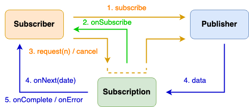
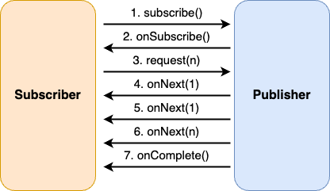

# 목차

<br>

- [목차](#목차)
- [Reactive Streams 이해하기](#reactive-streams-이해하기)
- [1 Iterable과 옵저버 패턴으로 이해하는 Reactive Streams](#1-iterable과-옵저버-패턴으로-이해하는-reactive-streams)
  - [1-1 Duality - Iterable vs Observable](#1-1-duality---iterable-vs-observable)
    - [Iterable](#iterable)
    - [옵저버 패턴](#옵저버-패턴)
    - [비교](#비교)
  - [1-2 옵저버 패턴의 한계](#1-2-옵저버-패턴의-한계)
- [2 Reactive Streams](#2-reactive-streams)
  - [2-1 Reactive Streams 표준 - 4개 인터페이스](#2-1-reactive-streams-표준---4개-인터페이스)
  - [2-2 Reactive Streams 표준 - 동작 흐름](#2-2-reactive-streams-표준---동작-흐름)
  - [2-3 Reactive Streams 구현해보기 - Hello World](#2-3-reactive-streams-구현해보기---hello-world)
  - [2-4 Reactive Streams를 직접 구현하는 것은 쉽지않으므로, 검증된 구현체를 사용하는 것이 좋다.](#2-4-reactive-streams를-직접-구현하는-것은-쉽지않으므로-검증된-구현체를-사용하는-것이-좋다)
- [정리](#정리)
- [참고](#참고)

<br>

# Reactive Streams 이해하기
작은 수의 스레드로 고성능을 내기위해 비동기 논블로킹 방식을 서치하다보면 자연스레 Reactor, RxJava등 Reactive Programming 관련된 내용을 접하게 된다.

이러한 Reactive Programming 방식의 가장 기초가되는 개념이 바로 Reactive Streams이다.

본격적으로 Spring Webflux과 같은 웹 애플리케이션에서 사용되는 Reactive 방식을 다루기전에 가장 기초가 되는 개념인 Reactive Streams를 이해하는 것이 좋다.

이번 글은 이러한 Reactive Streams의 이해를 돕기위해 작성하였다.

<br>

# 1 Iterable과 옵저버 패턴으로 이해하는 Reactive Streams
바로 Reactive란 어떤 것이며 어떻게 동작하는지를 설명하기보다는, Iterable과 옵저버 패턴의 비교를 통해 왜 Reactive가 만들어졌는가를 고민해본다.

<br>

## 1-1 Duality - Iterable vs Observable

Reactive Streams의 처리 방식 아이디어를 이야기할 때 에릭마이어는 항상 Duality에 대해서 말한다.

쌍대성을 의미하는 Duality는 수학과 물리학에서 자주 등장하는 표현으로, 하나의 문제를 서로 반대되는 두 가지 관점에서 볼 수 있다는 원칙이다.

이를 프로그래밍적으로 말하면, 궁극적인 기능은 같으나 서로 반대되는 방향으로 구현을 표현하는 것을 말한다.

아마 개념으로만 들으면 이해하기 쉽지않다. (필자는 그랬다..) 

마침 [토비님이 유튜브](https://www.youtube.com/watch?v=8fenTR3KOJo&list=PLv-xDnFD-nnmof-yoZQN8Fs2kVljIuFyC&index=10)에서 간단한 예시를 통해 알려주셔서, 해당 내용을 정리해보았다.

예를 들면, 아래와같이 5개의 요소를 가진 배열이있다고 가정해본다.

```java
List<Integer> list = Arrays.asList(1, 2, 3, 4, 5);
```

5개의 요소를 모두 하나하나 출력하는 기능을 구현한다고 가정하면 크게 두 가지의 쌍대되는 방식으로 처리할 수 있다.

* Iterable (for-each)
* 옵저버 패턴

<br>

### Iterable
아마 5개의 요소를 처리해야한다고 할 때 먼저 떠오르는 방법은 for-each일 것이다.

```java
for (int data : list) {
    System.out.println(data); // data 사용
}
```

그렇다면 어떻게 `List`는 for-each를 돌면서 요소를 가져와서 사용할 수 있는 것일까?

바로 `List`가 `Iterable` 인터페이스를 구현하고 있는 덕분이다.

```java
public interface Iterable<T> {
    Iterator<T> iterator();
}
```

`Iterable`이 반환하는 `Iterator`를 이용하여 for-each를 구현할 수 있다.

```java
Iterable<Integer> list = Arrays.asList(1, 2, 3, 4, 5);

for (Iterator<Integer> it = list.iterator(); it.hasNext(); ) {
    Integer data = it.next();
    System.out.println(data);
}
```
이 방식은 가장 흔히 사용되는 방식이며, `Iterable`의 구현체가 반환하는 `Iterator`의 `hasNext()`, `next()` 메서드를 통해 데이터에 하나하나 접근할 수 있다.

<br>

💁‍♂️ **여기서 중요한건 `Iterable`의 동작 방식이 `Pull` (끌어온다)이라는 것이다.**

**데이터를 사용하는 클라이언트 입장에선 `Iterator`의 `next()` 메서드를 통해 데이터를 Pull해서 데이터를 처리한다.**

<br>

### 옵저버 패턴
Iterable이 Pull 방식이라면 5개의 요소를 가진 리스트를 다른 관점에서 사용하는 쌍대성 방식은 무엇일까?

**바로 Push 방식이다.**

**그리고 이 Push 방식의 가장 대표적인 패턴이 옵저버 패턴이다.**

Pull은 데이터가 필요한 쪽에서 직접 데이터를 가져와서 사용하는 반면에, Push는 데이터를 가진쪽에서 데이터가 필요한 대상에게 밀어넣어주는 방식이다.

<br>

옵저버 패턴을 간단히 아래와 같이 구현해 볼 수 있다.

```java
/**
 * Observable: source, producer, publisher. 이벤트를 공급하는 역할.
 * Observer: target, consumer, subscriber. 이벤트를 소비하는 역할.
 */
@SuppressWarnings("deprecation")
public class ObservableTestMain {

    public static void main(String[] args) {
        // Observer (subscriber)
        Observer ob = new Observer() {
            @Override
            public void update(Observable o, Object arg) {
                System.out.println(Thread.currentThread().getName() + " " + arg);
            }
        };

        // Observable (Publisher)
        IntObservable io = new IntObservable();
        io.addObserver(ob);

        ExecutorService es = Executors.newSingleThreadExecutor();

        es.execute(io);

        System.out.println(Thread.currentThread().getName() + " EXIT");
        es.shutdown();
    }

    static class IntObservable extends Observable implements Runnable {
        @Override
        public void run() {
            for (int i = 1; i <= 5; i++) {
                setChanged(); // 변경된 것을 알려줌
                // push
                notifyObservers(i); // Observer에게 이벤트 알림. (데이터 전송)
            }
        }
    }
}

// 실행결과
main EXIT
pool-1-thread-1 1
pool-1-thread-1 2
pool-1-thread-1 3
pool-1-thread-1 4
pool-1-thread-1 5
```
위 코드를 실행하면 for-each과 동일하게 리스트를 순회하며 출력한다.

for-each과 다른점은 `Observable`에 등록된 `Observer`들에게 `notifyObservers()`를 통해 데이터를 Push (전송)했다는 것이다.

> Observable -> Event/Data -> Observer

<br>

### 비교
**Iterable와 Observable 모두 동일한 기능을 수행하지만 서로 다른 관점에서 구현하였다. 이를 쌍대성 관계라고 이야기한다.**

처리 과정을 정리하면 아래와 같은 차이가 존재한다.

| event | Iterable (pull) | Observable (push) |
| --- | --- | --- |
| retrieve data | T next(void) | void notifyObservers(T) |
| complete check | hasNext() | setChanged() |

**가장 주목할 점은 Pull 방식인 `next()`는 직접적으로 데이터(T)를 반환 받지만, Push 방식인 `notifyObservers()`는 반환 값이 없으며 데이터(T)를 전송한다.**

<br>

🤔 **그렇다면 Pull 방식보다 Push 방식이 더 좋은 점은 무엇일까?**

Push 방식을 이용하면 별개의 스레드에게 작업을 손쉽게 할당할 수 있다.

에를 들어, Iterable은 아이템을 수신할 대상이 한 순간에 한 개의 핸들러에서만 다뤄야한다면, Observable은 미리 여러 개의 Observer를 등록하여 아이템을 여러 개의 핸들러에 보낼 수 있다. (1 : N 관계)

동기, 비동기 관점에서 바라봐도, Push 방식은 리턴 값이 없으므로 호출한 쪽에서 리턴 값을 신경쓸 필요가 없어 Non-Blocking을 구현하기 쉽다.

그리고 메모리 방면에서도 Push는 받는 측에서 수신한 데이터를 메모리에 잘게잘게 올려 처리하고 없앨 수 있기때문에 더 효율적으로 처리할 수 있다.

또한, 데이터가 변경될 때마다 Observable에 등록된 Observer는 해당 변화를 쉽게 감지할 수도 있다.

<br>

## 1-2 옵저버 패턴의 한계

Push 방식의 옵저버 패턴은 Pull 방식보다 여러 장점이 있지만, 여전히 2가지의 문제점을 가진다.

1. 데이터의 끝이라는게 없다. 받는 쪽에서 끝을 알 수가 없다.
2. Error, Exception이 발생하면 재시도, 콜백을 실행하는 로직이 없다.

**이 문제를 개선한 옵저버 패턴이 발전해 Reactive Streams의 기초가 되었다고한다.**

<br>

# 2 Reactive Streams
옵저버 패턴의 한계를 해결해주고, Reactive 시스템을 만들기위해 Reactive Streams라는 표준 API가 만들어졌다.

이러한 표준 API를 정의하기위해 넷플릭스, 피보탈, 레드헷, 오라클, 트위터 등등 많은 회사들이 참여했다고한다.

더 자세한 내용은 [reactive-streams](http://www.reactive-streams.org/)에서 확인할 수 있으며, 

여기서 명시한 API를 통해 [ReactiveX](https://reactivex.io/)와 [Project Reactor](https://projectreactor.io/) 그룹들이 구현체를 만들어 제공하고있다.

> Webflux는 Project Reactor 기반으로 구현되었다. (물론 Webflux 사용시 내부적으로 ReactiveX를 사용하도록 할 수도 있다고한다.)

<br>

## 2-1 Reactive Streams 표준 - 4개 인터페이스
Reactive Streams는 4가지의 인터페이스로 정의되어있다.

> 여기선 JDK 9에서 정의한 Flow를 기반으로 살펴본다.

```java
public interface Publisher<T> {
   public void subscribe(Subscriber<? super T> s);
}
 
public interface Subscriber<T> {
   public void onSubscribe(Subscription s);
   public void onNext(T t);
   public void onError(Throwable t);
   public void onComplete();
}
 
public interface Subscription {
   public void request(long n);
   public void cancel();
}

public interface Processor<T,R> extends Subscriber<T>, Publisher<R> {
}
```

* Publisher
  * 옵저버 패턴의 Observable과 같은 역할이며, Subscriber의 구독을 받기 위한 `subscribe` API 하나만 가지고있다. ex. Database Driver
  * API
    * subscribe (구독하다) - Publisher에 Subscriber를 등록할 때 사용되는 메서드.
* Subscriber
  * 옵저버 패턴의 Observer과 같은 역할이며, Observer보다 더 많은 기능을 제공함과 동시에 핵심적인 역할을 수행한다.
  * `onSubscribe onNext* (onError | onComplete)?`
    * onSubscribe 한번, onNext 여러번, onError or onComplet 한번
  * API
    * onSubscribe - 최초 호출시 무조건 호출되는 API이며, 이를 통해 매개변수로 Subscription (구독 정보)를 주고 받는다.
    * onNext - Publisher로부터 데이터를 받아 처리할 때 사용된다. (여러 번 호출될 수 있다.)
    * onError - 에러가 난다면 처리하는 API. (스펙상 onError가 호출되면 더이상 Publisher가 데이터를 보내지 않는다.)
    * onComplete - 작업 완료시 사용되는 API. (스펙상 onComplete가 호출되면 더이상 Publisher가 데이터를 보내지 않는다.)
* Subscription
  * 옵저버 패턴에는 없는 개념으로, Reactive Streams에서 Publisher와 Subscriber 사이의 데이터 흐름을 제어하는 용도로 사용된다. 
  * 구독 정보를 가진 객체라고 보면 되며, Subscriber가 Publisher에게 Back Pressure 방식으로 흐름을 제어할 때 사용된다.
  * API
    * request - Subscriber가 Publisher에게 n개의 데이터를 요청할 때 사용되는 API.
      * 만약 데이터가 3개가 필요하면 n에 3을 던져주면, Subscription은 3개를 던져주게 된다.
      * 만약 데이터가 총 10개라면, 3개 → 3개 → 3개 → 1개순서로 보내게된다. 그리고 이때 request는 subscribe의 onNext 메서드를 통해 3개의 데이터를 전달한다.
    * cancel - 메서드 명 그대로 구독을 취소할 때 사용되는 API이다.

<br>

## 2-2 Reactive Streams 표준 - 동작 흐름
이번엔 위 인터페이스들이 어떻게 동작하며 Reactive 시스템을 구성하는지 살펴본다.

<p align="center"> </p>

1. Subscriber가 Publisher에게 `subsribe(Subscriber)`를 통해 이벤트 구독을 요청한다.
2. Publisher는 `onSubscribe(Subscription)`를 통해 Subsriber에게 Subscription (구독 정보)를 전달한다.
   * Subscription을 통해서 Subscriber는 Publisher에게 직접적으로 통신하지않고도 데이터 흐름을 제어할 수 있다.
3. Subscription을 받은 Subscriber는 Publisher에게 직접적으로 데이터 요청을 하지않고, Subscription의 `request(n)` 함수를 통해 Publisher에게 원하는 개수의 데이터를 전달한다.
   * Subscription이 Subscriber와 Publisher 간 통신의 매개체가 된 것.
   * Back Pressure (역압) 특징을 Subscription을 통해 구현한다.
     * Back Pressure는 발행-구독 프로토콜에서 이벤트 스트림의 구독자가 발행자의 이벤트 제공 속도보다 느린 속도로 이벤트를 소비하면서 문제가 발생하지 않도록 보장하는 장치이다.
     * 이를 통해 부하가 발생한 컴포넌트가 완전 불능이 되거나 예기치 않는 방식으로 이벤트를 잃어버리는 등의 문제가 발생하는 것을 예방할 수 있다. 부하가 발생한 컴포넌트는 이벤트 발생 속도를 늦추라고 알리거나, 얼마나 많은 이벤트를 수신할 수 있는지 알리거나, 다른 데이터를 받기 전에 기존의 데이터를 처리하는 데 얼마나 시간이 걸리는지를 업스트림 발행자에게 알린다. 이때 사용되는 것이 Subscription.
4. Publisher는 Subscriber로부터 호출받은 Subscription의 `request(n)`을 통해 Subscriber의 `onNext(T t)`에 데이터를 전달하며, 작업이 완료되면 `onComplete`, 에러가 발생하면 `onError` 시그널을 전달한다.
5. Subscriber와 Publisher 그리고 Subscription이 서로 유기적으로 연결되어 통신을 주고받으면서 `subscribe`로부터 `onComplete`까지 연결되고, 이를 통해 Back Pressure가 완성된다.

<br>

조금 다른 그림을 통해 보면 아래와 같이 이해할 수도 있다.

<p align="center"> </p>

> onNext()마다 request(n)를 보낼 수도 있다.

<br>

## 2-3 Reactive Streams 구현해보기 - Hello World
이번엔 이전에 Iterable과 옵저버 패턴때 사용되었던 동일한 예시를 통해 Reactive Streams를 간단히 구현해본다.

```java
public class PubSub {

    public static void main(String[] args) {
        List<Integer> itr = Arrays.asList(1, 2, 3, 4, 5);

        Publisher p = new Publisher() {
            @Override
            public void subscribe(Subscriber subscriber) {
                // 데이터 (DB에서 조회해오는 데이터라고 생각해도 된다.)
                Iterator<Integer> it = itr.iterator();

                // 최초 호출되는 메서드이며, Subscriber를 사용할 때에 무조건 처음에 호출된다.
                // Subscription을 넘기며,
                subscriber.onSubscribe(new Subscription() {
                    @Override
                    public void request(long n) {
                        try {
                            while(n-- > 0) {
                                if (it.hasNext()) {
                                    subscriber.onNext(it.next());
                                } else {
                                    subscriber.onComplete();
                                    break;
                                }
                            }
                        } catch (RuntimeException e) {
                            subscriber.onError(e);
                        }
                    }

                    @Override
                    public void cancel() {

                    }
                });

            }
        };

        Subscriber<Integer> s = new Subscriber<Integer>() {
            private static final int N = 1;

            private Subscription subscription;

            @Override
            public void onSubscribe(Subscription subscription) {
                System.out.println("onSubscribe");
                this.subscription = subscription;
                this.subscription.request(N); // 2개씩만 받고싶다고 할 때 설정.
            }

            @Override
            public void onNext(Integer item) {
                System.out.println("onNext : " + item);
                // Publisher에게 다음 데이터를 보내라고 요청. (보통 버퍼를 고려해서 호출한다.)
                this.subscription.request(N);
            }

            @Override
            public void onError(Throwable throwable) {
                System.out.println("onError");
            }

            @Override
            public void onComplete() {
                System.out.println("onComplete");
            }
        };

        // Publiser에 Subscriber 등록 (구독)
        p.subscribe(s);
    }
}

// 결과
onSubscribe
request: 1
onNext : 1
request: 1
onNext : 2
request: 1
onNext : 3
request: 1
onNext : 4
request: 1
onNext : 5
request: 1
onComplete
```
위 예시는 `request(1)`로 요청하여 매 `onNext()`마다 `request(1)`를 날리도록 한 예시이다.

n을 조금 높게하고 버퍼를둬서 request의 횟수를 줄일 수도 있긴하다.

<br>

## 2-4 Reactive Streams를 직접 구현하는 것은 쉽지않으므로, 검증된 구현체를 사용하는 것이 좋다.

💁‍♂️ **직접 구현하는 것은 쉽지 않다.**

Reactive Streams가 대략 어떻게 동작하는지는 알았는데, 이를 실제로 구현하는 것은 굉장히 까다롭다고한다.

실제로 [Github](https://github.com/reactive-streams/reactive-streams-jvm#specification)에 가보면 각 인터페이스가 지켜야할 Rule 들이 명시되어있다.

토이 프로젝트로 공부겸 만들어보는 것은 좋지만, 실제 운영에서 사용할 경우엔 이미 잘 만들어진 검증된 구현체를 사용하는 것이 좋다.

검증된 구현체는 비교적 많다. [참고](https://en.wikipedia.org/wiki/Reactive_Streams#Adoption)

* 순수 스트림 연산 처리 - RxJava, Reactor, Akka Streams 등등
* 저장소 데이터 Reactive Streams 방식으로 조회시 - ReactiveMongo, R2DBC, mongodb-driver-reactivestreams 등등
* Reactive Streams 기반의 웹 애플리케이션 처리 - Spring Webflux, Armeria, Vert.x, Play Framework 등등

<br>

# 정리
이번 글은 Reactive Streams를 이해하기위해 Iterable과 옵저버 패턴을 비교하고, Reactive Streams의 기본적인 동작 흐름에 대해서 알아보았다.

Reactive Streams의 공식 홈페이지에선 아래와 같이 정의하고있다.

```text
Reactive Streams is an initiative to provide a standard for asynchronous stream processing with non-blocking back pressure
```

키워드로 빼보면 Reactive Streams는 논블로킹 백프레셔를 이용한 비동기 데이터 스트림 처리 표준이라고 볼 수 있다.

이번 글에선 스트림 처리와 백프레셔에 대해서 살펴보았으나, 논블로킹 관련해서는 자세히 알아보지 않았다.

이후 다른 글에서 더 자세하게 Reactive Streams의 스레드 모델에 대해서 정리할 예정이다.

<br>

# 참고
* https://www.youtube.com/watch?v=8fenTR3KOJo&list=PLv-xDnFD-nnmof-yoZQN8Fs2kVljIuFyC&index=13
* https://en.wikipedia.org/wiki/Reactive_Streams#Adoption
* http://www.reactive-streams.org/
* https://engineering.linecorp.com/ko/blog/reactive-streams-with-armeria-1/
* https://github.com/reactive-streams/reactive-streams-jvm

