# 목차

<br>

- [목차](#목차)
- [들어가며](#들어가며)
- [스레드의 구현과 실행](#스레드의-구현과-실행)
  - [새로운 스레드 구현 및 실행](#새로운-스레드-구현-및-실행)
  - [java.lang.Thread](#javalangthread)
  - [java.lang.Runnable](#javalangrunnable)
  - [start()와 run()](#start와-run)
- [스레드 실행제어](#스레드-실행제어)
  - [스레드 우선순위](#스레드-우선순위)
  - [스레드 생명주기](#스레드-생명주기)
  - [스레드 실행제어 명령](#스레드-실행제어-명령)
    - [sleep()](#sleep)
    - [interrupt()와 interrupted()](#interrupt와-interrupted)
    - [yield()](#yield)
    - [join()](#join)
- [스레드 그룹](#스레드-그룹)
- [데몬 스레드](#데몬-스레드)
- [마치며](#마치며)
- [참고](#참고)

<br>

# 들어가며
이 글은 이전 글들을 의존하고 있다.

이전 글에서 Thread에 대한 기본적인 개념에 대해서 다뤘다면, 이번 글은 Java에서의 Thread는 어떻게 동작하고 사용하는지에 대해서 정리하였다.

> 글에서 등장하는 모든 예시의 전체 코드는 [여기](https://github.com/binghe819/learning-sandbox/tree/master/java-thread-and-thread-pool)서 확인할 수 있다.

<br>

# 스레드의 구현과 실행
JVM은 멀티스레드를 지원한다. 쉽게 얘기해 하나의 애플리케이션에 여러 스레드를 동시적으로 실행할 수 있다.

이번 챕터에선 자바에선 어떻게 스레드를 구현하고 실행하는지에 대해서 정리하였다.

<br>

## 새로운 스레드 구현 및 실행

💁‍♂️ **자바에서 Thread를 구현하는 방법은 2가지 있다.**

1. `Thread` 클래스를 상속받는 방법
2. `Runnable` 인터페이스를 구현하는 방법

<br>

```java
@DisplayName("스레드의 구현 및 실행 테스트")
public class CreateThreadTest {

    @Test
    void Thread_생성_및_실행_테스트() {
        // given, then
        Thread thread1 = new ThreadByExtends(); // 1
        Thread thread2 = new Thread(new ThreadByRunnable()); // 2

        // then
        thread1.start();
        thread2.start();
    }

    // 1. Thread 클래스를 상속받는 방법
    static class ThreadByExtends extends Thread {
        @Override
        public void run() {
            for (int i = 0; i < 100; i++) {
                System.out.println(getName()); // 부모인 Thread의 getName() 호출
            }
        }
    }

    // 2. Runnable 인터페이스를 구현하는 방법
    static class ThreadByRunnable implements Runnable {
        @Override
        public void run() {
            for (int i = 0; i < 100; i++) {
                System.out.println(Thread.currentThread().getName());
            }
        }
    }
}
```
테스트 코드를 실행하면 아래와 같이 스레드가 병행적으로 동작하는 것을 볼 수 있다.

<p align="center">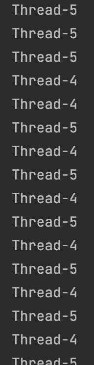<br>4, 5번 스레드가 번갈아가면서 빠르게 실행된다.</p>

<br>

## java.lang.Thread
자바에서 Thread를 사용하려면 피할 수 없는 클래스가 바로 `java.lang.Thread`이다.

<details>
  <summary>Thread 클래스 코드</summary>
  
  ---
  
  ```java
// JAVA API Thread Class
public class Thread implement Runnable {
    private volatile String name;
    private int            priority;
    private Thread         threadQ;
    private long           eetop;

    /* Whether or not to single_step this thread. */
    private boolean     single_step;

    /* Whether or not the thread is a daemon thread. */
    private boolean     daemon = false;

    /* JVM state */
    private boolean     stillborn = false;

    /* What will be run. */
    private Runnable target;

    /* The group of this thread */
    private ThreadGroup group;

    /* The context ClassLoader for this thread */
    private ClassLoader contextClassLoader;

    /* The inherited AccessControlContext of this thread */
    private AccessControlContext inheritedAccessControlContext;

    /* For autonumbering anonymous threads. */
    private static int threadInitNumber;
    private static synchronized int nextThreadNum() {
        return threadInitNumber++;
    }

    /* ThreadLocal values pertaining to this thread. This map is maintained
     * by the ThreadLocal class. */
    ThreadLocal.ThreadLocalMap threadLocals = null;

    /*
     * InheritableThreadLocal values pertaining to this thread. This map is
     * maintained by the InheritableThreadLocal class.
     */
    ThreadLocal.ThreadLocalMap inheritableThreadLocals = null;

    /*
     * The requested stack size for this thread, or 0 if the creator did
     * not specify a stack size.  It is up to the VM to do whatever it
     * likes with this number; some VMs will ignore it.
     */
    private long stackSize;

    /*
     * JVM-private state that persists after native thread termination.
     */
    private long nativeParkEventPointer;

    /*
     * Thread ID
     */
    private long tid;

    /* For generating thread ID */
    private static long threadSeqNumber;

    /* Java thread status for tools,
     * initialized to indicate thread 'not yet started'
     */

    private volatile int threadStatus = 0;


    private static synchronized long nextThreadID() {
        return ++threadSeqNumber;
    }

    /**
     * The argument supplied to the current call to
     * java.util.concurrent.locks.LockSupport.park.
     * Set by (private) java.util.concurrent.locks.LockSupport.setBlocker
     * Accessed using java.util.concurrent.locks.LockSupport.getBlocker
     */
    volatile Object parkBlocker;

    /* The object in which this thread is blocked in an interruptible I/O
     * operation, if any.  The blocker's interrupt method should be invoked
     * after setting this thread's interrupt status.
     */
    private volatile Interruptible blocker;
    private final Object blockerLock = new Object();
  
    /* 생성자 */
    // 기본 생성자
    Thread(){
        // ThreadGroup, Runnable, name, stacksize
        this(null, null, "Thread-" + nextThreadNum(), 0);
    }
    
    // Runnable 매개변수로 받는 생성자
    Thread(Runnable target) {
        this(null, target, "Thread-" + nextThreadNum(), 0);
    }
    
    // name 매개변수로 받는 생성자
    Thread(String name) {
        this(null, null, name, 0);
    }
    
    // 진짜 생성자 (모두 이 생성자를 호출한다)
    Thread(ThreadGroup g, Runnable target, String name, long stackSize){
        // Thread name 초기화
        if(name == null)
        throw new NullPointerException("name cannot be null");
        this.name = name;
        
        // ThreadGroup 초기화
        ...
        
        // Runnable 초기화
        this.target = target;
    }
    
    
    /* start */
    public synchronized void start() {
        
        // ThreadGroup에 add
        group.add(this);
        
        boolean started = false;
        try {
        start0(); // native 메서드
        started = true;
        } finally {
        try {
            if(!started){
            group.threadStartFaild(this);
            }
        } catch (Throwable ignore){
            // do nothing
        }
        }
    }
    
    private native void start0(); // C언어로 된 코드
    
    /* run */
    public void run() {
        if(target != null){
        target.run(); // 중요! 개발자가 구현한 Runnable 인터페이스의 run()을 실행하는 것.
        }
    }
    
    /* 주요 메서드 */
    public static native Thread currentThread(); // Thread 반환
    
    public final String getName(){
        return name;
    }
    
    ...
}
```
  
  ---
</details>
스레드를 컨트롤하는데 필요한 메서드와 상태값들이 모두 위와 같이 `Thread` 클래스안에 존재한다.

<br>

<br>

## java.lang.Runnable
<p align="center">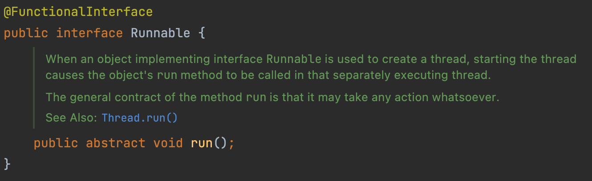 </p>

* `Runnable`을 사용하면 다중상속이 제한된 자바에서 Thread이외의 상속을 가능케한다.
  * 만약 `Thread`의 메서드를 사용하지 않는 스레드라면 `Runnable`을 구현하여 사용하는 것이 좋다.

<br>

## start()와 run()
`Thread`를 보면 `start()`와 `run()`이라는 메서드가 존재한다. 둘의 차이점은 무엇일까?

<p align="center">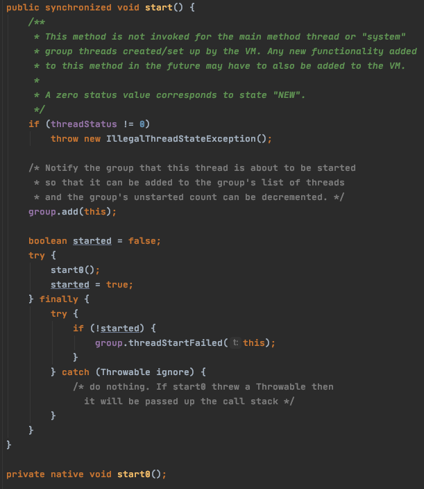 </p>

* 이 메서드를 실행하면 JVM은 새로운 콜스택을 만들어 동시성을 보장한다.
* 한번 실행된 스레드는 다시 실행할 수 없다.
  * 즉, 한번 `start()`된 Thread는 다시 `start()`될 수 없다.
  * 다시 실행하고 싶으면 새로운 Thread를 만들어 실행해야한다.

<br>

<p align="center">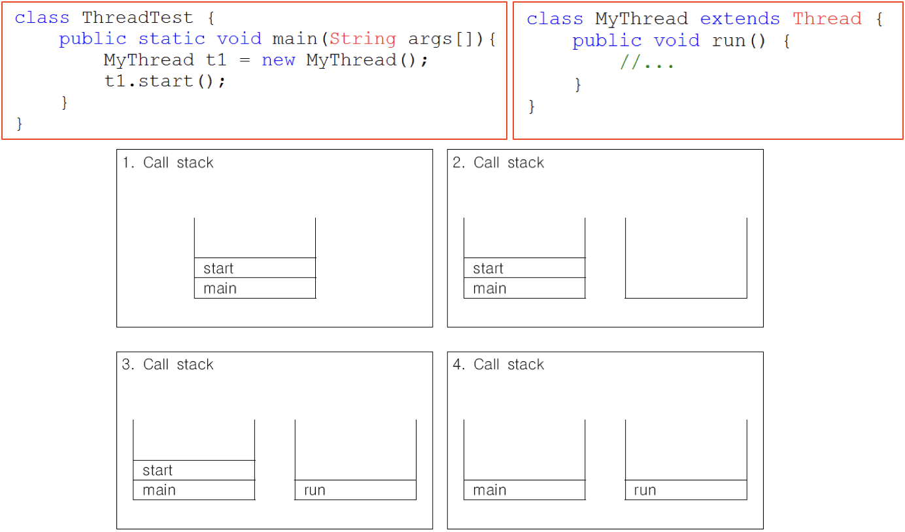<br>출처: 자바의 정석 </p>

* `run()`
  * 그저 특정 로직을 실행하는 하나의 메서드이다.
* `start()`
  * `start()`는 새로운 스레드가 작업을 실행하는데 필요한 호출스택(call stack)을 생성한 다음에 `run()`을 호출한다.
  * 생성된 호출스택(call stack)에 `run()`이 첫 번째로 올라가게 된다.
* 모든 스레드는 독립적인 작업을 수행하기 위해 자신만의 Call Stack을 필요로 하기 때문에, 새로운 스레드를 생성하고 실행시킬 때마다 새로운 Call Stack이 생성되고 스레드가 종료된 작업에 사용된 Call Stack은 소멸된다.
  * 실행 중인 사용자 스레드가 하나도 없을 때 프로그램은 종료된다.

<br>

# 스레드 실행제어
멀티스레드 프로그래밍은 흔히 어렵다고 많이 이야기한다.

물론 동시성 문제도 있지만, 또 다른 대표적인 이유는 의도대로 여러 스레드를 동작시키기 어렵기 때문이다.

이번 챕터에선 스레드의 실행 제어는 어떻게 하는지에 대해서 정리하였다.

<br>

## 스레드 우선순위

OS가 여러 프로세스를 스케줄링하여 동시성을 보장하듯이 (기본적으론 시분할 방식), 자바에서도 스레드마다 우선순위를 두고 스레드를 스케줄링한다.

자바에선 스레드마다 1부터 10까지의 우선순위를 설정할 수 있으며, 숫자가 높을수록 우선순위가 더 높다.

MIN(1), NORMAL(5), MAX(10)값을 `Thread`클래스안에 상수로 제공하며, 디폴트로는 NORMAL이 할당된다.

또한, JVM마다 다를수도 있지만, 기본적으로 `fixed-priority pre-emptive scheduling`방식을 이용해 스레드를 스케줄링한다고 한다.

* 만약 같은 우선순위를 가진 스레드가 경쟁한다면?
  * FIFO방식을 이용한다.
* 높은 우선순위만 실행되면 기아현상이 발생하지 않나?
  * 만약 높은 우선순위의 스레드가 실행 불가능한 상태면 더 작은 우선순위의 스레드가 실행된다. (`yield`, `sleep`, ...등을 통해 스레드의 상태를 변경할 수 있다)
  * 또한, JVM은 기아현상을 방지하기 위해 중간중간 낲은 우선순위의 스레드도 실행한다고 한다.

> Thread 스케줄링 알고리즘에 대한 참고 자료는 [여기](https://www.iitk.ac.in/esc101/05Aug/tutorial/essential/threads/priority.html)와 [여기](https://www.baeldung.com/java-thread-priority#overview-of-thread-execution)이다.

<br>

## 스레드 생명주기
실행제어를 이해하기 위해선 우선 스레드 생명주기에 대한 이해가 필요하다.

효율적으로 자원과 시간을 멀티 스레드 환경에서 사용하기 위해서는 "동기화"와 "스케줄링"이 필수적이다.

스레드는 효율적인 "동기화"와 "스케줄링"을 위해 생명주기를 갖는다.

<p align="center">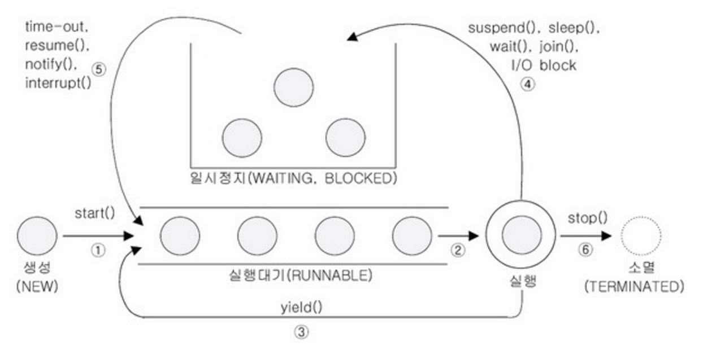<br>출처: 자바의 정석 </p>

<p align="center"><br>출처: https://www.baeldung.com/java-thread-lifecycle </p>

스레드의 생명주기 상태는 크게 아래와 같이 나뉘어져있다.

* `NEW`: 새롭게 생성된 스레드. 아직 실행되기 전 상태를 의미한다.
* `RUNNABLE`: 실행할 준비가 되어 있으며, 리소스 할당을 기다리는 상태를 의미한다.
  * 쓰레드를 생성하고 `start()`를 호출하면 바로 실행되는 것이 아니라 실행대기열(Runnable)에 저장되어 자신의 차례가 될 때까지 기다려야 한다.
* `RUNNING`: CPU를 점유하여 실행하고 있는 상태를 의미한다.
  * RUNNABLE 상태의 스레드중 차례가 되면 JVM이 자동으로 `run()` 메서드를 호출하여 스레드가 `RUNNING` 상태가 된다
* `BLOCKED`: 사용하고자 하는 객체의 락이 풀릴 때까지 기다리는 상태를 의미한다.
  * 스케줄러의 선택을 받을 수 없는 상태를 의미한다. 다시 실행되려면 Blocked 상태에 놓이게 된 원인이 제거되어 `RUNNABLE` 상태로 돌아가야한다.
  * 모니터 락을 기다리거나 다른 스레드에 의해 잠긴 코드 섹션 (동기화된 로직)에 접근하려고 할 때 이 상태가 된다.
* `WAITING`: 스레드가 다른 스레드의 특정 작업을 수행하기를 기다리는 상태를 의미한다.
  * [Java Docs](https://docs.oracle.com/javase/9/docs/api/java/lang/Thread.State.html#WAITING)에 의하면 `wait()`, `join()`, `LockSupport.park()`를 호출할 때 `WAITING` 상태가 된다.
* `TIME_WAITING`: 스레드는 다른 스레드가 규정된 시간 내에 특정 작업을 수행하기를 기다릴 때 이 상태가 된다.
  * [Java Docs](https://docs.oracle.com/javase/9/docs/api/java/lang/Thread.State.html#TIMED_WAITING)에 의하면 `sleep`, `wait(int timeout)`, `join(long millis)`를 호출할 때 `TIME_WAITING` 상태가 된다.
* `TERMINATED`: `RUNNING` 상태에서 스레드가 모두 실행되어 완료된 후 소멸되는 상태를 의미한다.

> 위 상태는 [Thread.State](https://docs.oracle.com/javase/8/docs/api/java/lang/Thread.State.html) Enum 값을 기준으로 작성되었다.

<br>

마지막으로 스레드 생명주기의 전체적인 플로우는 다음과 같다.

<p align="center">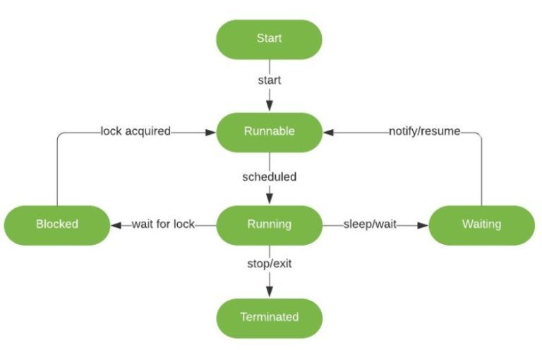<br>출처: https://baeldung-cn.com/java-interrupted-exception </p>

<br>

## 스레드 실행제어 명령
자바에선 스레드의 실행제어를 위한 명령어를 제공한다.

<p align="center">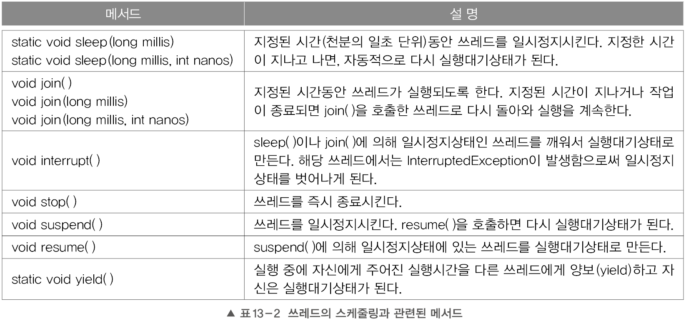<br>출처: 자바의 정석 </p>

이번 챕터에선 위 명령어들에 대해서 간단한 테스트 코드와 함께 사용법에 대해서 다룬다.

> `resume()`, `stop()`, `suspend()`는 스레드를 교착상태(Dead-Lock)로 만들기 쉽기 때문에 deprecated 되었다.
> 
> 이와 관련된 더 자세한 내용은 [Why are Thread.stop, Thread.suspend and Thread.resume Deprecated?](https://docs.oracle.com/javase/8/docs/api/java/lang/Thread.State.html)를 참고하면 된다.

<br>

### sleep()
`Thread` 클래스안에 static 메서드로 `sleep()`이 존재한다.

`sleep()` 메서드는 일정시간동안 스레드를 멈추게하는 메서드이다.

<p align="center">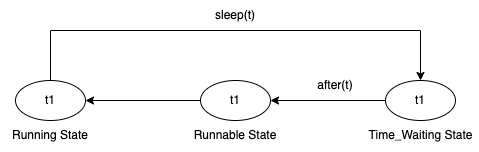</p>

생명주기 관점에서보면 `RUNNABLE`한 상태의 스레드를 `TIME_WAITING`으로 만들어 일정시간동안 `RUNNABLE`하지 못하도록한다.

> 간단한 sleep 예시
```java
// Sleep 테스트 - sleep은 일정시간동안 스레드를 멈추게 한다. (Custom Thread에 Sleep 발생시키는 예시)
public class CustomThread {

    public static void main(String[] args) {
        Thread customThread = new Thread(new SleepRunnable());

        customThread.start();
        for (int i = 0; i < 5; i++) {
            System.out.println(Thread.currentThread().getName() + " " + i);
        }
    }

    static class SleepRunnable implements Runnable {
        @Override
        public void run() {
            try {
                String threadName = Thread.currentThread().getName() + "(sleep)";
                for (int i = 0; i < 5; i++) {
                    System.out.println(threadName + " " + i);
                    Thread.sleep(100);
                }
            } catch (InterruptedException e) {}
        }
    }
}
```
<p align="center">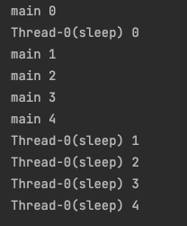 </p>

Main과 Custom 스레드 모두 1부터 5까지 카운트하는 스레드이지만, Custom 스레드는 매 카운트마다 0.1초씩 `sleep()`하기 때문에 Main 스레드가 모두 실행되고나서 Custom 스레드가 실행되는 것을 볼 수 있다.

<br>

💁‍♂️ **`sleep()`의 특징은 다음과 같다.**

* `Thread.sleep()`을 호출하는 스레드가 일정시간동안 스레드를 멈추게된다.
* 매개변수로 음수를 입력하면 `IllegalArgumentException`이 발생한다.
* sleep으로 인해 `TIME_WAITING`상태인 스레드에 다른 스레드가 interrupt를 걸면 `InterruptedException`이 던져지면서 Sleep 상태가 멈추게 된다.

<br>

### interrupt()와 interrupted()
```java
void interrupt()                 // 스레드의 interrupted 상태를 false에서 true로 변경한다.
boolean isInterrupted()          // 스레드의 interrupted 상태를 반환한다.
static boolean interrupted();    // 현재 스레드의 interrupted 상태를 알려주고, false로 추기화한다.
```
* `void interrupt()`
  * 스레드에 인터럽트를 발생시키는 메서드.
  * `interrupted` 상태를 바꾸는 경우 `실행상태 -> 일시정지`, `일시정시 -> 실행상태`를 번갈아가며 요청할 수 있다. (flag를 통한 interrupted)
  * 스레드가 `wait()`, `join()`, `sleep()`에 의해 일시정지상태(`WAITING`)에 있을 때, **해당 스레드에 대해 `interrupt()`를 호출하면 `slee()`, `wait()`, `join()`에서 InterruptedException`이 발생하고 스레드가 실행대기상태(`RUNNABLE`)로 바뀐다.**
* `boolean isInterrupted()`
  * 스레드의 interrupted 상태를 반환한다. (스레드가 interrupted되었는지 확인하는 메서드)
* `static boolean interrupted()`
  * 현재 스레드가 interrupted 되었는지 확인하는 메서드.

<br>

기본적인 스레드 인터럽트를 이해하기 위해 두 개의 예시를 작성했다.

> 첫번째 예시. flag를 통한 interrupt 예시 (interrupt를 호출하면 스레드의 interrupted 상태가 반대 boolean 값으로 변경된다.)

```java
public class FlagInterrupt {
    static class CountThread extends Thread {
        @Override
        public void run() {
            int i = 10;

            while (!isInterrupted()) {
                System.out.println(getName() + " " + i--);
                for(long x = 0; x < 2500000000L; x++); // 시간 지연
            }
            System.out.println("카운트가 종료되었습니다.");
        }
    }

    public static void main(String[] args) throws InterruptedException {
        Thread countTh = new CountThread();
        countTh.start();

        System.out.println("interrupt 전 - isInterrupted() : " + countTh.isInterrupted());

        Thread.sleep(2_000); // 2초간 main 스레드 sleep

        countTh.interrupt();
        System.out.println("interrupt 후 - isInterrupted() : " + countTh.isInterrupted());
    }
}
// 결과
interrupt 전 - isInterrupted() : false
Thread-0 10
Thread-0 9
Thread-0 8
interrupt 후 - isInterrupted() : true
카운트가 종료되었습니다.
```
* Main 스레드가 `countTh.interrupt()`를 호출하자 `countTh`가 종료되며 모든 스레드가 종료되는 것을 볼 수 있다.
  * 이는 `countTh`의 `interrupt`의 상태를 true로 변경했기 때문에 더이상 while문일 동작하지 않아 종료된 것이다.

<br>

> 두번째 예시. Sleep 상태의 스레드 interrupte 예시 (interrupt를 호출하면 스레드 run메서드에 InterruptedException이 던져진다.)

```java
public class WaitingStateInterrupt {

    static class CountThread extends Thread {
        @Override
        public void run() {
            int i = 10;

            while (i != 0 && !isInterrupted()) {
                System.out.println(getName() + " " + i--);
                try {
                    Thread.sleep(1_000);
                } catch (InterruptedException e) {
                    // interrupt()가 발생되면 실행되는 로직
                    System.out.println("InterruptedException 발생");
                    break; // break이 없다면 while문은 계속 돌게된다.
                }
            }
            System.out.println("카운트가 종료되었습니다.");
        }
    }

    public static void main(String[] args) throws InterruptedException {
        Thread countTh = new CountThread();
        countTh.start();

        System.out.println("interrupt 전 - isInterrupted() : " + countTh.isInterrupted());

        Thread.sleep(2_000); // 2초간 main 스레드 sleep

        countTh.interrupt();
        System.out.println("interrupt 후 - isInterrupted() : " + countTh.isInterrupted());
    }
}
// 결과
interrupt 전 - isInterrupted() : false
Thread-0 10
Thread-0 9
interrupt 후 - isInterrupted() : false
InterruptedException 발생
카운트가 종료되었습니다.
```
* Main 스레드가 `countTh.interrupt()`를 호출하자 `countTh` 스레드의 `sleep`부분에서 `InterruptedException`이 발생하는 예시.
* `sleep()`에 의해 스레드가 잠시 멈춰있을 때, `interrupt()`가 호출되면 `InterruptedException`이 발생되고 스레드의 `interrupted()`상태도 변경된다.

<br>

### yield()

<p align="center">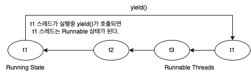 </p>

* `yield()`는 스레드 자신에게 주어진 실행시간을 다음 차례의 스레드에게 양보(yield)하는 명령어이다.
  * 예를 들어 스케줄러에 의해 1초의 실행시간을 할당받은 스레드가 0.5초의 시간동안 작업한 상태에서 `yield()`가 호출되면, 나머지 0.5초는 포기하고 다시 실행대기상태가 된다.

<br>

> 두 스레드가 yield를 번갈아가며 호출하여 한번씩 자신의 이름을 출력하는 예시

```java
public class YieldThread {

    static class PrintAndYield implements Runnable {
        @Override
        public void run() {
            // 한번 스레드 이름을 출력하고 yield하고 또 다시 출력하는 로직.

            System.out.println(Thread.currentThread().getName());

            Thread.yield();

            System.out.println(Thread.currentThread().getName());
        }
    }

    public static void main(String[] args) {
        Thread th1 = new Thread(new PrintAndYield(), "Thread 1");
        Thread th2 = new Thread(new PrintAndYield(), "Thread 2");

        th1.start();
        th2.start();
    }
}
// 결과
Thread 1
Thread 2
Thread 1
Thread 2
```
* 두 개의 스레드가 동작하는 과정에서 `yield()`가 호출되면 바로 다음 스레드로 스케줄링되는 것을 볼 수 있다.

<br>

### join()
```java
void join()                       // 작업이 모두 끝날 때까지
void join(long millis)            // 천분의 일초 동안
void join(long millis, int nanos) // 첫분의 일초 + 나노초동안
```

<p align="center">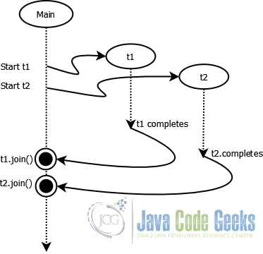<br>출처: https://examples.javacodegeeks.com/core-java/threads/java-thread-join-example/ </p>

* `join()`은 지정된 시간동안 혹은 특정 스레드가 모든 작업이 완료될 때까지 기다리는 메서드이다.
  * 더 정확히는 `AnotherThread.join()`를 호출한 스레드가 `WAITING` 상태가 되었다가 지정된 시간 혹은 `AnotherThread`의 작업이 모두 완료되면 다시 `RUNNABLE` 상태가 되는 것.
  * 스레드 자신이 하던 작업을 잠시 멈추고 다른 스레드가 지정된 시간동안 작업을 수행하도록 할 때 `join()`을 사용한다.
  * 작업 중에 다른 스레드의 작업이 먼저 수행되어야할 필요가 있을 때 `join()`을 사용한다.

<p align="center">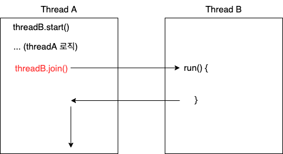 </p>

<br>

> 두 스레드가 자신의 이름을 50번씩 반복하며 출력하는 예시

```java
public class JoinThread {

    static class PrintName implements Runnable {
        @Override
        public void run() {
            for (int i = 0; i < 50; i++) {
                System.out.print(Thread.currentThread().getName());
            }
        }
    }

    public static void main(String[] args) {
        Thread th1 = new Thread(new PrintName(), "-");
        Thread th2 = new Thread(new PrintName(), "|");

        long startTime = System.currentTimeMillis();

        th1.start();
        th2.start();

        try {
            th1.join(); // Main 스레드가 th1 스레드의 작업이 끝날 때까지 기다린다.
            th2.join(); // Main 스레드가 th2 스레드의 작업이 끝날 때까지 기다린다.
        } catch (InterruptedException e) {
            e.printStackTrace();
        }

        long executionTime = System.currentTimeMillis() - startTime;
        System.out.print("소요시간: " + executionTime);
    }
}
```

<p align="center"><br>join을 사용한 경우 결과 </p>

<p align="center"><br>join을 사용하지 않을 경우 결과 </p>

* 위 결과를보면 `join`을 사용한 경우와 사용하지 않은 경우의 결과가 다른 것을 볼 수 있다.
  * `join`을 사용한 경우, Main스레드가 `th1`과 `th2` 스레드의 작업이 끝날 때까지 기다리고, 모두 끝나면 자신의 로직을 이어간다.
  * `join`을 사용하지 않는 경우, Main스레드는 `th1`과 `th2`의 작업 완료 여부와 상관없이 경쟁하며 CPU의 점유권을 얻는다.

<br>

# 스레드 그룹

> java.lang.ThreadGroup.java

```java
public class ThreadGroup implements Thread.UncaughtExceptionHandler {
    private final ThreadGroup parent;
    String name;
    int maxPriority;
    boolean destroyed;
    boolean daemon;
    boolean vmAllowSuspension;

    int nUnstartedThreads = 0;
    int nthreads;
    Thread threads[];

    int ngroups;
    ThreadGroup groups[];

    ...
}
```
생성자와 메서드와 관련된 내용은 [JavaDocs - ThreadGroup](https://docs.oracle.com/javase/8/docs/api/java/lang/ThreadGroup.html)에서 확인 가능.

<br>

🤔 스레드 그룹이란?

* 자바에서 제공하는 여러 개의 스레드들을 하나로 묶어서 관리하게 해주는 객체이다.
* 하나의 메서드 콜로 여러 개의 스레드를 컨트롤할 수 있다. (시작하거나, 멈추거나하는 액션등등)
* 스레드 그룹은 여러 개의 스레드를 묶어서 표현하며, 다른 스레드 그룹을 가질 수도 있다.

<br>

🤔 **왜 스레드 그룹이 필요한가?**

* 여러 개의 스레드를 묶어서 관리하기 위함
  * 실제로 폴더시스템과 유사하다. 폴더 안에 폴더 생성 등.. 스레드가 파일과 유사하다고 보면 된다.
  * 평소에는 잘 사용하지 않지만, 대용량 프로그램의 경우 사용하면 유용하게 스레드를 컨트롤할 수 있다.
* 보안상의 이유도 있다.
  * 자신이 속한 스레드 그룹이나 하위 스레드 그룹은 변경할 수 있지만, 다른 스레드 그룹의 스레드를 변경할 수 없다.

<br>

> **모든 스레드는 반드시 스레드 그룹에 포함되어야한다.** 스레드 그룹을 지정하지 않고 생성한 스레드는 `main 스레드 그룹`에 속한다.
> 
> 또한, **자신을 생성한 스레드 (부모 스레드)의 그룹과 우선순위를 상속받는다.**

<br>

💁‍♂️ **스레드 그룹 계층구조**

<p align="center">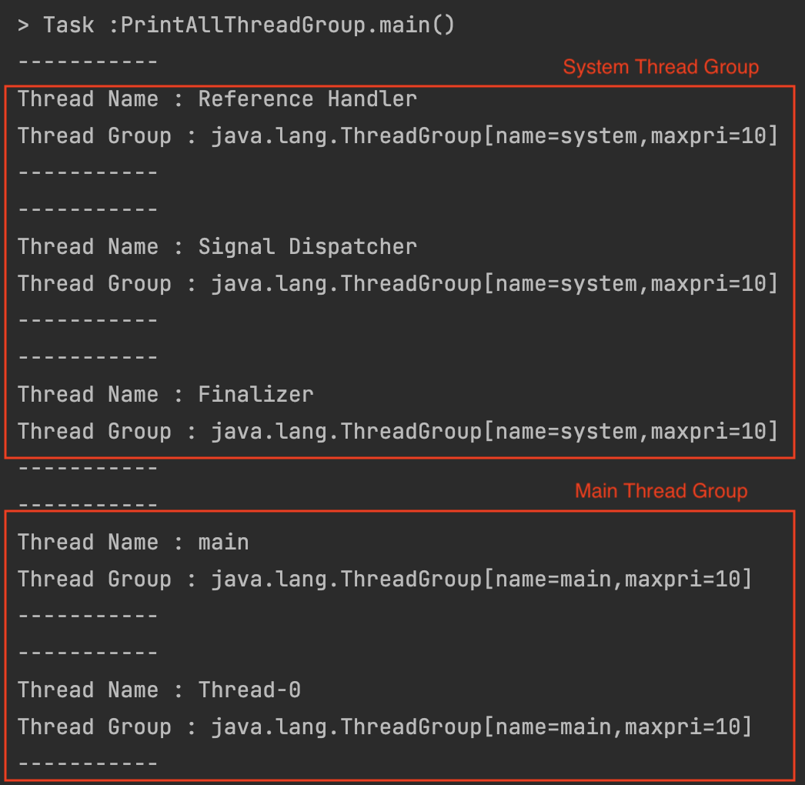<br>전체 스레드 출력 결과 (JDK 1.8) </p>

위 출력 결과는 사용자 스레드 하나를 실행하고나서 현재 실행중인 모든 스레드를 출력하는 결과이다.

도식화하면 아래와 같다.

<p align="center">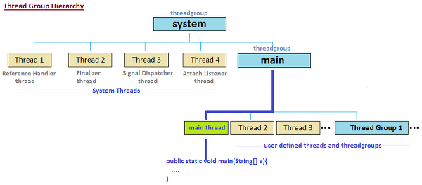<br>출처: https://12bme.tistory.com/6 </p>

* JVM은 자바 프로그램을 실행하면 `main`과 `system`이라는 스레드 그룹을 만들고 JVM운영에 필요한 스레드들을 생성해서 이 스레드 그룹에 포함시킨다.
* 개발자가 생성하는 모든 스레드는 자동적으로 `main` 스레드 그룹에 속하게 된다.

<br>

# 데몬 스레드

<br>

🤔 **데몬 스레드의 사전적 의미**

* 도깨비나 유령을 뜻하는 데몬(daemon)이란 이름은 MIT의 MAC 프로젝트 프로그래머들이 만들었다.
  * 보이지 않는 곳에서 분자들을 골라주는 일을 하고 있는 유령에서 영감을 얻었다고한다.
  * 그리스 신화에서도 신들이 관여하지 않는 일들을 처리하는 데몬이 등장한다.
* **데몬이란 이름이 나오고 유닉스 시스템이 이 용어를 받아들여 사용함으로써 데몬은 사용자가 직접 신경쓰지 않도록 하면서 백그라운드에서 일을 처리해주는 것을 의미하게 되었다.**
  * sshd, httpd의 d는 daemon의 약자이다.

<br>

💁‍♂️ **스레드의 종류**

* 일반 스레드: 데몬 스레드가 아닌 스레드.
* 데몬 스레드: 일반 스레드의 작업을 돕는 보조적인 역할을 수행하는 스레드.
  * 일반 스레드가 모두 종료되면 데몬 스레드는 강제적으로 자동 종료된다.
  * 예시: GC, 워드프로세서의 자동저장등등

> 일반 스레드가 생성한 스레드는 일반 스레드, 데몬 스레드가 생성한 스레드는 데몬 스레드이다.

<br>

💁‍♂️ 자바 메인 스레드와 데몬 스레드

<p align="center"><br>출처: https://www.learntek.org/blog/multithreading-in-java/</p>

* JVM은 프로그램이 실행되면 Main을 실행함과 동시에 다른 데몬 스레드도 실행한다.
  * JVM이 프로그램을 실행하는데 필요한 스레드들이 데몬으로 실행된다고 보면 된다.
* Main 스레드가 종료되면 데몬 스레드들도 같이 종료된다.
* 개발자가 작성한 모든 코드는 메인 스레드에 존재하기때문에 설정해주지 않는 한 일반 스레드이다.

<br>

💁‍♂️ 데몬 스레드 예시

```java
public class DaemonThreadDemo implements Runnable{

    static boolean autoSave = false;

    public static void main(String[] args){
        Thread th = new Thread(new DaemonThreadDemo());
        th.setDaemon(true); // 데몬스레드 설정. ( 이 부분이 없으면 종료되지 않는다. )
        th.start();

        for(int i = 1; i <= 10; i++){
            try {
                Thread.sleep(1000);
            } catch (InterruptedException e) { e.printStackTrace(); }
            System.out.println(i);

            if(i == 5)
                autoSave = true;
        }

        System.out.println("프로그램을 종료합니다.");
    }

    @Override
    public void run() {
        while (true) {
            try {
                Thread.sleep(3*1000); // 3초마다
            } catch (InterruptedException e) { e.printStackTrace(); }

            if (autoSave){
                autoSave();
            }
        }
    }

    public void autoSave() {
        System.out.println("작업파일이 자동저장되었습니다.");
    }
}
```
* 메인 스레드
  * 1초마다 숫자 출력
  * 5초가 되면 `autoSave = true`
* 데몬 스레드
  * 3초마다 `autoSave`의 값을 확인 후, `true`면 `autoSave()` 호출
* `th`의 부모 스레드는 `main`스레드.
  * `th.setDaemon`을 통해 데몬 스레드로 만들었기 때문에, `main`스레드가 종료되면 `th` 스레드도 종료된다.
  * **데몬 스레드는 부모 스레드가 죽으면 자기도 죽는다. (효도를 잘한다)**

<br>

# 마치며
Java에서는 어떻게 Thread를 다루는지 간단히 알아보았다.

기초적인 지식이지만, Java의 Concurrency를 이해하기 위한 밑거름이 될 것이라 생각든다.

다음 글은 Thread를 이해하는데 가장 중요한 지식중 하나인 동기화에 대해서 다룰 예정이다.

그럼 이만~

<br>

# 참고
* 자바의 정석
* https://docs.oracle.com/javase/8/docs/api/java/lang/Thread.html
* https://en.wikipedia.org/wiki/Thread_(computing)
* https://www.baeldung.com/java-thread-lifecycle
* https://www.javatpoint.com/threadgroup-in-java

