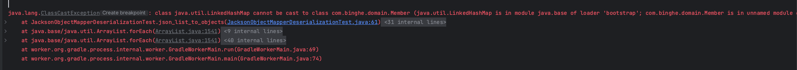

# 목차

<br>

- [목차](#목차)
- [Jackson 이해하기 - 사용 방법과 동작 방식](#jackson-이해하기---사용-방법과-동작-방식)
- [Jackson 의존성](#jackson-의존성)
- [1 ObjectMapper를 이용한 직렬화, 역직렬화](#1-objectmapper를-이용한-직렬화-역직렬화)
  - [1-1 Serialization. 객체 to JSON](#1-1-serialization-객체-to-json)
    - [Default Serializer](#default-serializer)
    - [Custom Serializer](#custom-serializer)
  - [1-2 Deserialization. JSON to 객체](#1-2-deserialization-json-to-객체)
    - [Jackson ObjectMapper가 JSON 필드와 Java 필드를 일치시키는 방법](#jackson-objectmapper가-json-필드와-java-필드를-일치시키는-방법)
    - [JSON to 자바 배열](#json-to-자바-배열)
    - [JSON to 리스트](#json-to-리스트)
      - [TypeRefenrece 사용 이유](#typerefenrece-사용-이유)
    - [JSON to Map](#json-to-map)
    - [알 수 없는 JSON 필드 무시](#알-수-없는-json-필드-무시)
    - [Primitive 타입 null인 경우 예외 발생시키도록 설정](#primitive-타입-null인-경우-예외-발생시키도록-설정)
- [JsonNode를 이용한 직렬화, 역직렬화](#jsonnode를-이용한-직렬화-역직렬화)
- [Jackson 직렬화 역직렬화 동작 방식 - JsonParser, JsonGenerator](#jackson-직렬화-역직렬화-동작-방식---jsonparser-jsongenerator)
- [참고](#참고)

<br>

# Jackson 이해하기 - 사용 방법과 동작 방식

API 애플리케이션 서버를 만들 때 빠질 수 없는 부분이 객체와 JSON간의 변환이다.

이를 보통 직렬화 (객체 -> JSON), 역직렬화 (JSON -> 객체)라고 부른다.

이번 글은 Java내 보편적으로 많이 사용되는 JSON 라이브러리 Jackson의 동작 방식과 사용 방법에 대해서 알아본다.

> 사용 방법말고 동작 방식을 알고 싶으신 독자라면 바로 []()부분부터 보는 것을 추천한다.

<br>

```text
Jackson has been known as "the Java JSON library" or "the best JSON parser for Java". Or simply as "JSON for Java".
```

[Jackson 공식 저장소](https://github.com/FasterXML/jackson)에 적혀있는 문구로 Jackson의 이름은 간단히 "JSON for Java"의 의미라고한다.

<br>

# Jackson 의존성

Jackson을 사용하고자하면 jackson의 databind 의존성을 추가해주면된다.

```gradle
implementation 'com.fasterxml.jackson.core:jackson-databind:2.15.3'
```

databind 의존성을 추가하면 자동으로 다음 라이브러리도 전의적으로 추가된다.

* jackson-annotations
* jackson-core

최신 databind 의존성은 [Maven Repository](https://mvnrepository.com/artifact/com.fasterxml.jackson.core/jackson-databind)를 참고하면 된다.

<br>

# 1 ObjectMapper를 이용한 직렬화, 역직렬화

`ObjectMapper` Jackson Databind 모듈에 위치한 객체로서, POJO 또는 JSON 트리 모델 (`JsonNode`)를 JSON로 읽고 쓰고 변환하는 기능을 제공한다.

또한, 사용자가 직접 직렬화, 역직렬화에 대한 커스텀을 할 수 있게 도와준다.

`ObjectMapper`의 사용 방법을 이해하기위해 아래와 같이 간단한 POJO를 생성해준다.

```java
@Builder
@NoArgsConstructor
@AllArgsConstructor
@Setter
@Getter
public class Member {

    private String id;
    private String name;
    private int age;
}
```

<br>

## 1-1 Serialization. 객체 to JSON

가장 먼저 ObjectMapper를 이용한 직렬화에 대해서 살펴본다.

<br>

### Default Serializer

ObjectMapper를 활용한 객체에서 JSON으로 직렬화하는 메서드는 3가지 존재한다.

* writeValue()
* writeValueAsString()
* writeValueAsBytes()

<br>

> writeValue() 예시
```java
@Test
void object_to_json() throws IOException {
    // given
    ObjectMapper objectMapper = new ObjectMapper();

    // when, then
    Member member = Member.builder()
            .id("123")
            .name("binghe")
            .age(28)
            .build();
    
    objectMapper.writeValue(new FileOutputStream("data/member.json"), member);
}
```
위와 같이 writeValue를 활용해 File, OutputStream, Writer등 다양한 방식으로 직렬화 할 수 있다.

보통 API 서버에선 `writeValueAsString()`을 가장 많이 사용한다.

> writeValueAsString() 예시
```java
@Test
void object_to_json_String() throws JsonProcessingException {
    // given
    ObjectMapper objectMapper = new ObjectMapper();

    // when
    Member member = Member.builder()
            .id("123")
            .name("binghe")
            .age(28)
            .build();
    String json = objectMapper.writeValueAsString(member);

    // then
    assertThat(json).isEqualTo("{\"id\":\"123\",\"name\":\"binghe\",\"age\":28}");
}
```

<br>

### Custom Serializer

때때로 Jackson에서 제공하는 디폴트 Serializer 말고, 상황에 따라 커스텀하게 객체를 JSON으로 직렬화해야하는 경우가 있다.

예를 들어 JSON에서 Java 객체와 다른 필드 이름을 사용하거나 특정 필드를 완전히 생략해야하는 경우가 있다.

아래 에시는 객체내 필드 이름을 JSON으로 직렬화시 변경해주는 커스텀 Serializer를 적용한 예시이다.
```java
@Test
void object_to_json_custom_serializer() throws JsonProcessingException {
    // given
    ObjectMapper objectMapper = new ObjectMapper();
    MemberCustomSerializer memberCustomSerializer = new MemberCustomSerializer();

    SimpleModule module = new SimpleModule("MemberCustomSerializer");
    module.addSerializer(Member.class, memberCustomSerializer);

    objectMapper.registerModule(module);

    // when
    Member mem = Member.builder()
            .id("123")
            .name("binghe")
            .age(28)
            .build();
    String json = objectMapper.writeValueAsString(mem);

    // then
    assertThat(json).isEqualTo("{\"memberId\":\"123\",\"nickName\":\"binghe\",\"age\":28}");
}

private static class MemberCustomSerializer extends JsonSerializer<Member> {

    @Override
    public void serialize(Member value, JsonGenerator gen, SerializerProvider serializers) throws IOException {

        gen.writeStartObject(); // {

        gen.writeStringField("memberId", value.getId());
        gen.writeStringField("nickName", value.getName());
        gen.writeNumberField("age", value.getAge());

        gen.writeEndObject(); // }
    }
}
```

<br>

**Module**

커스텀 Serializer를 Module에 넣고, Module을 `ObjectMapper`에 등록해줌으로써 커스텀 Serializer를 적용할 수 있었다.

이렇게 ObjectMapper에 Module를 등록함으로써 다양한 방식으로 커스텀 할 수 있으며, `ObjectMapper`는 여러 개의 `module`을 가질 수 있다.

> * ObjectMapper 1 : N Module. (정확히는 Module을 다양한 ObjectMapper에 등록할 수 있어 N : N 관계라고 할 수 있다.)
> * Module 1 : N Serializer (동일하게 정확히는 N : N 관계라도 봐도 무방하다.)

<br>

**Jackson은 다양한 애노테이션을 제공한다.**

위와 같이 커스텀 Serializer를 만들어서 사용해도 되지만, 사실 Jackson에선 다양한 애노테이션을 제공한다.

가능한 이러한 애노테이션을 활용하는 것이 추후 유지보수나 확장면에서 용이하므로 필자는 애노테이션을 활용을 지향한다.

<br>

## 1-2 Deserialization. JSON to 객체

이제 ObjectMapper를 이용한 역직렬화에 대해서 살펴본다.

역직렬화엔 `readValue()` 메서드를 사용하면 된다.

```java
@Test
void json_to_object() throws JsonProcessingException {
    // given
    ObjectMapper objectMapper = new ObjectMapper();

    String json = "{\"id\":\"123\",\"name\":\"binghe\",\"age\":28}";

    // when
    Member member = objectMapper.readValue(json, Member.class);

    // then
    assertThat(member.getId()).isEqualTo("123");
    assertThat(member.getName()).isEqualTo("binghe");
    assertThat(member.getAge()).isEqualTo(28);
}
```

`readValue()`의 첫 번째 매개변수론 JSON (문자열, 또는 스트림, 파일)의 소스를 넣고, 두 번째 매개변수로 역직렬화할 객체의 클래스를 넣어주면 된다.

<br>

### Jackson ObjectMapper가 JSON 필드와 Java 필드를 일치시키는 방법

문자열인 JSON를 객체로 변환 (역직렬화)하기 위해선 JSON 필드와 POJO의 필드를 매핑시켜야한다. 

즉, JSON내 `name`필드와 `Member` 객체내 `name` 필드를 매핑시켜야한다.

**Jackson은 기본적으로 객체의 getter, setter 메서드 이름을 통해 JSON 필드와 POJO 필드를 매핑시킨다.**

**Jackson은 getter 및 setter 메서드 이름의 "get" 및 "set" 부분을 제거하고 나머지 이름의 첫 번째 문자를 소문자로 변환한 이름과 JSON 필드를 매핑시켜 역직렬화한다.**

예를 들어, `name`이라는 JSON 필드는 POJO내 `getName()` 혹은 `setName()`메서드를 찾아 "get", "set" 부분을 제거하고 `Name`을 `name`으로 변환하여 JSON 필드와 매핑시킨다.

만약 다른 방식으로 매핑시키고싶다면, 커스텀 Deserializer를 구현하여 ObjectMapper에 추가해주면되며, 다양한 Jackson 애노테이션을 통해서도 커스텀할 수 있다.

<br>

### JSON to 자바 배열
`ObjectMapper`는 JSON 배열 문자열에서 객체 배열로 역직렬화할 수도 있다.

다음은 JSON 배열 문자열에서 객체 배열을 읽는 예시다.

```java
@Test
void json_array_to_objects() throws JsonProcessingException {
    // given
    ObjectMapper objectMapper = new ObjectMapper();

    String json = "[{\"id\":\"123\",\"name\":\"binghe\",\"age\":28},{\"id\":\"456\",\"name\":\"binghe2\",\"age\":29}]";

    // when
    Member[] members = objectMapper.readValue(json, Member[].class);

    // then
    assertThat(members.length).isEqualTo(2);
    assertThat(members[0].getId()).isEqualTo("123");
    assertThat(members[0].getName()).isEqualTo("binghe");
    assertThat(members[0].getAge()).isEqualTo(28);
    assertThat(members[1].getId()).isEqualTo("456");
    assertThat(members[1].getName()).isEqualTo("binghe2");
    assertThat(members[1].getAge()).isEqualTo(29);
}
```

<br>

### JSON to 리스트

배열과 동일하게 리스트타입도 역직렬화할 수 있다.

```java
@Test
void json_list_to_objects() throws JsonProcessingException {
    // given
    ObjectMapper objectMapper = new ObjectMapper();

    String json = "[{\"id\":\"123\",\"name\":\"binghe\",\"age\":28},{\"id\":\"456\",\"name\":\"binghe2\",\"age\":29}]";

    // when
    List<Member> members = objectMapper.readValue(json, new TypeReference<List<Member>>() {});

    // then
    assertThat(members.size()).isEqualTo(2);
    assertThat(members.get(0).getId()).isEqualTo("123");
    assertThat(members.get(0).getName()).isEqualTo("binghe");
    assertThat(members.get(0).getAge()).isEqualTo(28);
    assertThat(members.get(1).getId()).isEqualTo("456");
    assertThat(members.get(1).getName()).isEqualTo("binghe2");
    assertThat(members.get(1).getAge()).isEqualTo(29);
}
```

#### TypeRefenrece 사용 이유

위 예시에서 중요한 점은 `readValue()`의 두 번째 매개변수로 `TypeReference`를 넘겨준다는 점이다.

이때 `TypeReference`를 사용하지않고 `List<Member>.class`를 넘겨주면 아래와 같은 에러가 발생한다.

<p align="center"> </p>

위와 같은 에러가 발생하는 이유를 이해하기위해선 자바의 제네릭을 먼저 이해해야한다.

자바는 기본적으로 제네릭으로 넘겨진 객체 타입은 런타임엔 사라진다. 그러므로 `List.class` 혹은 `List<Member>.class`를 넘긴다고해도 자바 런타임엔 `List.class`로 타입이 소멸된다.

문제는 Jackson이 JSON을 `Member` 객체로 변환하고자할 때, 어떤 객체 타입으로 변환해야하는지 모르기때문에 Jackson은 기본적으로 `LinkedHashMap`으로 역직렬화하고 역직렬화된 객체에 액세스하려고하면 `ClassCastException`이 발생하게되는 것이다.

이를 해결하는 방법은 런타임에도 자바 JVM이 어떤 자바 타입으로 변환할지 알 수 있도록 타입을 소멸하지 않고 보존해야하며, `TypeReference`가 바로 이러한 역할을 수행해준다.

> [참고](https://stackoverflow.com/questions/67866342/what-is-typereference-in-java-which-is-used-while-converting-a-json-script-to-ma)

<br>

### JSON to Map

`ObjectMapper`는 JSON 문자열에서 자바 Map 타입으로도 역직렬화할 수 있다.

Map으로 변환하는 것은 정확한 JSON 구조를 미리 모르는 경우 유용할 수 있다. JSON의 각 필드는 자바 Map의 key, value 쌍으로 변환된다.

```java
@Test
void json_to_map() throws JsonProcessingException {
    // given
    ObjectMapper objectMapper = new ObjectMapper();

    String json = "{\"id\":\"123\",\"name\":\"binghe\",\"age\":28}";

    // when
    Map<String, Object> jsonMap = objectMapper.readValue(json, new TypeReference<Map<String, Object>>(){});

    // then
    assertThat(jsonMap.get("id")).isEqualTo("123");
    assertThat(jsonMap.get("name")).isEqualTo("binghe");
    assertThat(jsonMap.get("age")).isEqualTo(28);
}
```

뒤에서 다룰 `JsonNode`와 비슷한 역할을 수행하도록 자바 Map을 사용할 수 있는 것이다.

<br>

### 알 수 없는 JSON 필드 무시

JSON내엔 존재하는 필드가 자바 객체안엔 해당 필드가 없는 경우가있다.

Jackson은 디폴트로 이런경우 예외가 발생하는데, 자바 객체보다 JSON에 더 많은 필드가 존재해도 예외가 발생하지 않도록 하려면 아래와 같이 설정하면된다.

```java
objectMapper.configure(DeserializationFeature.FAIL_ON_UNKNOWN_PROPERTIES, false);
```

<br>

### Primitive 타입 null인 경우 예외 발생시키도록 설정

자바 객체내 Primitive Type으로 된 상태값이 JSON내 필드가 null인 경우 Jackson은 Primitive Type의 디폴트로 변환한다.

만약 JSON내 필드가 null인 상태를 Primitive Type으로 변환하고자할 때 예외를 발생시키고싶으면 아래와 같이 설정해주면 된다.

```java
ObjectMapper objectMapper = new ObjectMapper();

objectMapper.configure(DeserializationFeature.FAIL_ON_NULL_FOR_PRIMITIVES, true);
```


<br>

# JsonNode를 이용한 직렬화, 역직렬화

<br>

# Jackson 직렬화 역직렬화 동작 방식 - JsonParser, JsonGenerator

`ObjectMapper` 객체내 설명을 보면 아래와 같이 명시되어있다.

```text
Mapper (and ObjectReaders, ObjectWriters it constructs) will use instances of JsonParser and JsonGenerator for implementing actual reading/writing of JSON.
```

<br>

# 참고
* https://jenkov.com/tutorials/java-json/jackson-objectmapper.html
* https://www.baeldung.com/jackson-object-mapper-tutorial
* https://www.twilio.com/blog/java-json-with-jackson

